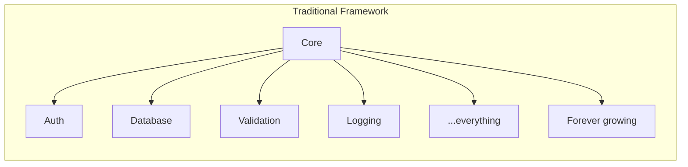
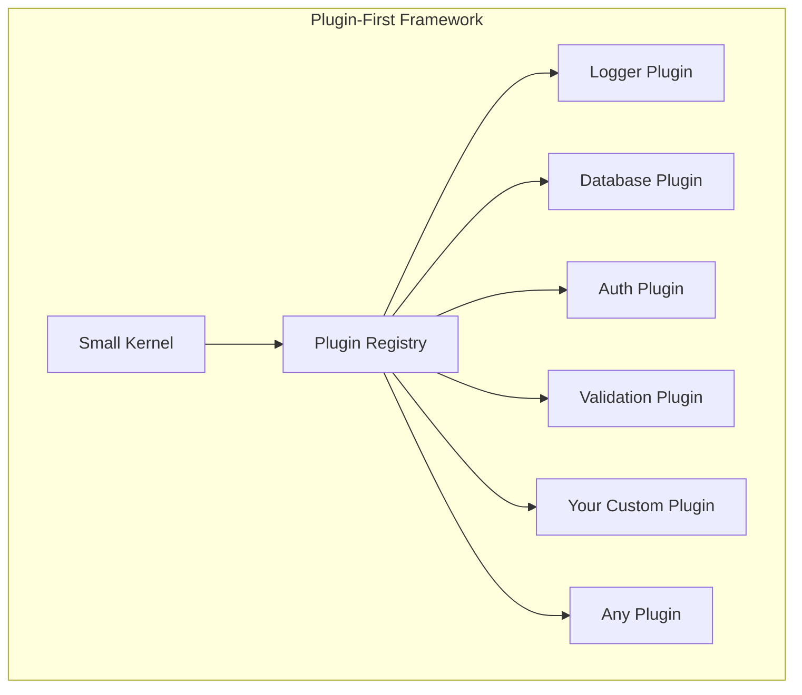

# Hono Enterprise

<div align="center">

**Plugin-first enterprise backend framework built on Hono.**

Enterprise architecture without the weight. Runtime freedom without the chaos.

[](LICENSE)
[](https://www.typescriptlang.org/)
[](https://nodejs.org/)
[](https://deno.land/)
[](https://bun.sh/)
[](https://workers.cloudflare.com/)
[](#contributing)

</div>

---

> [!IMPORTANT]
> **Status: `v0.1.0-alpha.3` is published — all 38 packages are live on JSR.**
>
> The kernel, the runtime layer, 31 plugins, the test utilities, the client SDK, and the `honoe` CLI
> are implemented, tested, and documented.
>
> **Every specifier must be version-pinned.** JSR does not tag a prerelease as `latest`, so a bare
> `deno add jsr:@hono-enterprise/kernel` fails with _"has only pre-release versions available"_.
>
> This is an alpha: the public API is not frozen and may break in any prerelease. See
> [CHANGELOG.md](CHANGELOG.md) for known limitations.

---

## Why This Exists

Building enterprise backends today forces a difficult choice:

| Option      | Problem                                                                                                                   |
| ----------- | ------------------------------------------------------------------------------------------------------------------------- |
| **Hono**    | Extremely fast and runtime-portable, but intentionally minimal — no DI, no modules, no enterprise patterns.               |
| **NestJS**  | Rich enterprise features, but tightly coupled to Node.js, requires decorators and DI, and carries a steep learning curve. |
| **Fastify** | Fast and plugin-oriented, but lacks enterprise abstractions like repository patterns, CQRS, and multi-tenancy.            |
| **Express** | Ubiquitous but aging, callback-based, and Node.js-only.                                                                   |

Every existing solution forces a compromise: **power vs. portability, features vs. simplicity,
opinion vs. flexibility.**

**Hono Enterprise resolves this compromise.** It combines:

- ⚡ **Hono's performance** — One of the fastest TypeScript routers available.
- 🌍 **Runtime independence** — Write once, run on Node.js, Deno, Bun, and Cloudflare Workers.
- 🧩 **Plugin-first architecture** — Every capability is a plugin. Start minimal, add what you need,
  replace what you do not like.
- 🏢 **Enterprise capabilities** — Authentication, RBAC, CQRS, event sourcing, multi-tenancy, audit
  logging, secrets management, and more.

Without becoming heavyweight. Without forcing opinions. Without locking you in.

---

## Core Principles

| Principle               | What It Means                                                                                                        |
| ----------------------- | -------------------------------------------------------------------------------------------------------------------- |
| **Plugin-first**        | Every capability — logging, database, auth, validation — is a plugin. The kernel ships with zero features.           |
| **Runtime independent** | No package except the runtime plugin uses runtime-specific APIs. Business logic never touches `process.env` or `fs`. |
| **Optional DI**         | Dependency injection is a plugin, not a requirement. Use it if you want it; skip it if you do not.                   |
| **Optional decorators** | Decorators are a plugin, not a requirement. Every feature has a complete programmatic API.                           |
| **Explicit APIs**       | No magic. No hidden globals. No reflection required. Everything is explicit and inspectable.                         |
| **Type safety**         | Strict TypeScript throughout. No `any` in public APIs. Full type inference for services, config, and routes.         |
| **Tree-shakeable**      | Every package uses ES modules, `sideEffects: false`, and subpath exports. You ship only what you use.                |
| **Production ready**    | Built for scale: graceful shutdown, distributed locking, circuit breakers, audit trails, and observability.          |
| **Enterprise focused**  | Patterns that large organizations need: multi-tenancy, feature flags, secrets management, CQRS, event sourcing.      |

---

## Features

> **Status legend:** ✅ Implemented — shipped, tested, and documented · 📋 Designed — specified in
> the roadmap, not yet built · 🚧 Planned — future design work.

Every ✅ row is a package in this repository with 90%+ test coverage on branch, function, and line.

### Core

| Feature             | Status | Package              | Description                                            |
| ------------------- | ------ | -------------------- | ------------------------------------------------------ |
| Plugin system       | ✅     | `kernel`             | Capability-token-based plugin architecture             |
| Middleware pipeline | ✅     | `kernel`             | ASP.NET Core-style ordered middleware                  |
| Routing             | ✅     | `kernel`             | Hono `LinearRouter` under the framework's own pipeline |
| Runtime abstraction | ✅     | `runtime`            | Node.js, Deno, Bun, Cloudflare Workers with detection  |
| Streaming responses | ✅     | `kernel` + `runtime` | `IResponse.stream()` with request `AbortSignal`        |
| Exceptions          | ✅     | `exceptions`         | Error hierarchy, RFC 7807 Problem Details, handler     |
| Testing             | ✅     | `testing`            | Test app factory, mock plugins, request injection      |

### Request path

| Feature        | Status | Package                | Description                                                                      |
| -------------- | ------ | ---------------------- | -------------------------------------------------------------------------------- |
| Logging        | ✅     | `logger-plugin`        | Console, pino, noop; request/response middleware                                 |
| Configuration  | ✅     | `config-plugin`        | Env loading, variable expansion, schema validation                               |
| Validation     | ✅     | `validation-plugin`    | Zod-based, with RFC 7807 / NestJS / default error shapes                         |
| HTTP security  | ✅     | `http-security-plugin` | CORS, security headers, CSRF, request size, IP rules                             |
| Authentication | ✅     | `auth-plugin`          | JWT (HS256/RS256 via Web Crypto), API keys, local, refresh tokens, rate limiting |
| Authorization  | ✅     | `auth-plugin`          | RBAC with transitive role hierarchy and permission guards                        |

### Data

| Feature       | Status | Package                | Description                                                            |
| ------------- | ------ | ---------------------- | ---------------------------------------------------------------------- |
| Database      | ✅     | `database-plugin`      | Prisma, Drizzle, memory — repository pattern and Unit of Work          |
| Caching       | ✅     | `cache-plugin`         | Memory (LRU), Redis, noop; transparent response caching                |
| Storage       | ✅     | `storage-plugin`       | S3, B2, GCS, Azure Blob, local, memory; upload middleware              |
| Multi-tenancy | ✅     | `multi-tenancy-plugin` | Subdomain/header/path/JWT resolution; schema/database/column isolation |

### Messaging and background work

| Feature     | Status | Package              | Description                                                    |
| ----------- | ------ | -------------------- | -------------------------------------------------------------- |
| Events      | ✅     | `events-plugin`      | In-process domain event bus                                    |
| CQRS        | ✅     | `cqrs-plugin`        | Command and query buses with pipeline behaviors                |
| Messaging   | ✅     | `messaging-plugin`   | In-memory, Redis Streams, RabbitMQ, NATS, Kafka; request-reply |
| Queue       | ✅     | `queue-plugin`       | Background jobs over memory, Redis, RabbitMQ; retries, cron    |
| Scheduler   | ✅     | `scheduler-plugin`   | Cron, interval, delayed jobs with distributed locking          |
| Worker pool | ✅     | `worker-pool-plugin` | CPU-bound work on real worker threads, off the event loop      |

### Real-time and rendering

| Feature               | Status | Package                     | Description                                                   |
| --------------------- | ------ | --------------------------- | ------------------------------------------------------------- |
| Server-Sent Events    | ✅     | `sse-plugin`                | One-way streaming, named channels, heartbeat, `Last-Event-ID` |
| WebSocket             | ✅     | `websocket-plugin`          | Full-duplex on all four runtimes; rooms, heartbeat, limits    |
| Cross-replica fan-out | ✅     | `realtime-backplane-plugin` | Rooms and channels reach clients on other replicas            |
| React SSR             | ✅     | `react-router-plugin`       | React Router v7 framework mode with file-based routing        |

### Operations

| Feature       | Status | Package             | Description                                                  |
| ------------- | ------ | ------------------- | ------------------------------------------------------------ |
| Health checks | ✅     | `health-plugin`     | `/health`, `/live`, `/ready` with pluggable indicators       |
| Metrics       | ✅     | `metrics-plugin`    | Prometheus counters, gauges, histograms, summaries           |
| Telemetry     | ✅     | `telemetry-plugin`  | OpenTelemetry tracing, W3C propagation, auto-instrumentation |
| OpenAPI       | ✅     | `openapi-plugin`    | OpenAPI 3.1 from routes, Zod transform, Swagger UI           |
| Audit logging | ✅     | `audit-plugin`      | Immutable trail over memory, log, database, or file          |
| Resilience    | ✅     | `resilience-plugin` | Circuit breaker, retry, timeout, bulkhead                    |
| Secrets       | ✅     | `secrets-plugin`    | Env, AWS KMS, GCP Secret Manager, Azure Key Vault, Vault     |

### Delivery and ergonomics

| Feature              | Status | Package                | Description                                                     |
| -------------------- | ------ | ---------------------- | --------------------------------------------------------------- |
| Mail                 | ✅     | `mail-plugin`          | Log, SMTP, SES, SendGrid with a template engine                 |
| Notifications        | ✅     | `notification-plugin`  | Email, SMS, push, Slack over one HTTP seam                      |
| Feature flags        | ✅     | `feature-flags-plugin` | Percentage rollout, user targeting, pluggable providers         |
| Dependency injection | ✅     | `di-plugin`            | **Optional.** Singleton/scoped/transient, constructor injection |
| Decorators           | ✅     | `decorator-plugin`     | **Optional.** NestJS-style, no `reflect-metadata`               |

### Tooling

| Feature         | Status | Package                                                      | Description                                                                                                        |
| --------------- | ------ | ------------------------------------------------------------ | ------------------------------------------------------------------------------------------------------------------ |
| CLI             | ✅     | `cli`                                                        | `honoe` — project scaffolding and plugin-aware code generation                                                     |
| Client SDK      | ✅     | `sdk`                                                        | HTTP client with retry, circuit breaker, OpenAPI codegen                                                           |
| Test utilities  | ✅     | `testing`                                                    | `createTestApp`, mock plugins/registry, fixtures, stream reads                                                     |
| Starter bundles | ✅     | `rest-starter`, `microservice-starter`, `full-stack-starter` | `createRestApp`, `createMicroserviceApp`, `createFullStackApp` — pre-wired plugin sets with per-plugin option arms |

### Not yet built

| Feature | Status     | Description                                              |
| ------- | ---------- | -------------------------------------------------------- |
| GraphQL | 🚧 Planned | Schema-first and code-first GraphQL plugin               |
| gRPC    | ✅     | `grpc-plugin` — Co-serve gRPC, Connect, and gRPC-Web on the same port |

---

## Installation

```bash
# Deno
deno add jsr:@hono-enterprise/kernel@^0.1.0-alpha.3 jsr:@hono-enterprise/runtime@^0.1.0-alpha.3

# Node
npx jsr add @hono-enterprise/kernel@^0.1.0-alpha.3 @hono-enterprise/runtime@^0.1.0-alpha.3

# Bun
bunx jsr add @hono-enterprise/kernel@^0.1.0-alpha.3 @hono-enterprise/runtime@^0.1.0-alpha.3
```

**The `@^0.1.0-alpha.3` is required, not decorative.** JSR does not point `latest` at a prerelease,
so omitting the version fails outright:

```
error: jsr:@hono-enterprise/kernel has only pre-release versions available.
Try specifying a version: deno add jsr:@hono-enterprise/kernel@^0.1.0-alpha.3
```

If you install within 24 hours of a release, Deno's supply-chain policy also refuses versions
younger than a day. Pass `--min-dep-age 0` to override it, or wait it out.

### The CLI

```bash
deno install -g -A -n honoe jsr:@hono-enterprise/cli@^0.1.0-alpha.3/main

honoe new my-app
cd my-app && honoe generate service billing
```

The `-n honoe` is required: Deno would otherwise name the binary after the package (`cli`).

All 36 packages are published: the core (`common`, `kernel`, `runtime`, `exceptions`, `testing`),
every plugin in the tables above, and the `cli`.

Every plugin is a separate package — add only what you use. Heavy dependencies (Prisma, ioredis,
nodemailer, the OpenTelemetry SDK, …) are never hard dependencies: each is injected through plugin
options or imported lazily, so an application pays only for the capabilities it configures.

---

## Quick Example

The smallest possible application — just the kernel and a runtime:

```typescript
import { createApplication } from '@hono-enterprise/kernel';
import { RuntimePlugin } from '@hono-enterprise/runtime';
import { LoggerPlugin } from '@hono-enterprise/logger-plugin';

const app = createApplication({
  plugins: [
    RuntimePlugin(),
    LoggerPlugin({ level: 'info' }),
  ],
});

app.router.get('/', (ctx) => {
  return ctx.response.json({ message: 'Hello, World!' });
});

await app.start({ port: 3000 });
```

No decorators. No DI. No modules. Just a router, a runtime, and a logger.

Add capabilities as you need them:

```typescript
import { ConfigPlugin } from '@hono-enterprise/config-plugin';
import { ValidationPlugin } from '@hono-enterprise/validation-plugin';
import { DatabasePlugin } from '@hono-enterprise/database-plugin';
import { AuthPlugin } from '@hono-enterprise/auth-plugin';
import { OpenApiPlugin } from '@hono-enterprise/openapi-plugin';

app.register(ConfigPlugin({ validationSchema: AppConfigSchema }));
app.register(ValidationPlugin());
app.register(DatabasePlugin({ type: 'prisma' }));
// Secrets come from the config capability — never process.env (runtime independence)
app.register(AuthPlugin({ jwt: { secret: config.get('JWT_SECRET') } }));
app.register(OpenApiPlugin({ title: 'My API', version: '1.0.0' }));
```

---

## Why Plugin-First?

Traditional frameworks grow forever. Every feature is baked into the core, and the core becomes a
monolith.



Plugin-first frameworks stay small. The kernel only orchestrates plugins. Capabilities are
composable and replaceable.



| Traditional                         | Plugin-First                              |
| ----------------------------------- | ----------------------------------------- |
| Core grows with every feature       | Kernel stays small and stable             |
| All features are bundled            | Include only what you use                 |
| Swapping a feature requires forking | Replace any plugin via capability tokens  |
| Heavy startup cost                  | Lazy initialization, pay for what you use |
| Hard to test in isolation           | Each plugin is independently testable     |

---

## Repository Structure

A Deno 2 workspace. Every package is published independently to JSR.

```
hono-enterprise/
├── packages/              # 41 workspace members — 38 published, 3 stubs
│   ├── common/            # Shared contracts, capability tokens (no dependencies)
│   ├── kernel/            # Plugin kernel, middleware pipeline, router
│   ├── runtime/           # Runtime services and HTTP adapters (Node, Deno, Bun, Workers)
│   ├── exceptions/        # Exception factories and error-handler middleware
│   ├── testing/           # Test utilities
│   ├── *-plugin/          # 30 capability plugins
│   ├── cli/               # CLI tool — `honoe`, project scaffolding and code generation
│   ├── sdk/               # Client SDK — HTTP client, interceptors, resilience, OpenAPI codegen
│   └── starters/          # Plugin bundles — REST, microservice, full-stack starters (M36)
├── scripts/               # Coverage, plan linting, JSR release tooling
├── docs/                  # Operator guides (releasing, telemetry fan-out, …)
├── docker/                # Docker and OpenTelemetry Collector configurations
├── kubernetes/            # Kubernetes manifests
├── plans/                 # One plan per milestone, archived on completion
├── apps/                  # Example applications — empty, Milestone 37
├── examples/              # Additional examples — empty, Milestone 37
├── ARCHITECTURE.md        # Technical architecture guide
├── PUBLIC_API.md          # Public API contract
├── AI_GUIDELINES.md       # Engineering guidelines
├── ROADMAP.md             # 46-milestone implementation roadmap
├── CHANGELOG.md           # Release notes
└── README.md              # This file
```

**Dependency rule:** no plugin imports another plugin. Plugins communicate only through capability
tokens resolved from the service registry (`ctx.services.get<T>(CAPABILITIES.X)`), so any plugin can
be replaced without touching the others.

---

## Documentation

| Document                                                                         | Audience                | Purpose                                                                  |
| -------------------------------------------------------------------------------- | ----------------------- | ------------------------------------------------------------------------ |
| [**ARCHITECTURE.md**](ARCHITECTURE.md)                                           | Framework contributors  | How the framework works internally and why it was designed this way      |
| [**PUBLIC_API.md**](PUBLIC_API.md)                                               | Application developers  | How to use the framework — complete examples for every plugin            |
| [**AI_GUIDELINES.md**](AI_GUIDELINES.md)                                         | All contributors        | Permanent engineering rules — TypeScript, testing, security, performance |
| [**ROADMAP.md**](ROADMAP.md)                                                     | Implementation tracking | Milestone-by-milestone implementation roadmap with package details       |
| [**CHANGELOG.md**](CHANGELOG.md)                                                 | Everyone                | What each release contains, and its known limitations                    |
| [**docs/releasing.md**](docs/releasing.md)                                       | Maintainers             | JSR release runbook — setup, quotas, and the per-release sequence        |
| [**plans/archive/architecture-review.md**](plans/archive/architecture-review.md) | Architects              | Critical analysis of the original design with recommendations (archived) |

Each package also carries its own README with options, semantics, and a worked example.

**Start here:**

- New to the framework? Read **PUBLIC_API.md** for usage examples.
- Want to contribute? Read **ARCHITECTURE.md** then **AI_GUIDELINES.md**.
- Want to understand the plan? Read **ROADMAP.md**.

---

## Roadmap

**46 of 53 milestones are complete** (numbered 0–46, some with lettered follow-ups such as 14b and
24c). The framework itself is built; what remains is tooling, examples, and release engineering.

| Phase               | Milestones | Status | Focus                                                            |
| ------------------- | ---------- | ------ | ---------------------------------------------------------------- |
| Foundation          | 0–2        | ✅     | Monorepo, common contracts, plugin kernel                        |
| Core plugins        | 3–9        | ✅     | Runtime, logger, config, validation, exceptions, DI, decorators  |
| Data plugins        | 10–15      | ✅     | Database, cache, events, CQRS, messaging, queue                  |
| Security            | 16–17      | ✅     | Authentication, authorization, HTTP security                     |
| Scheduling          | 18         | ✅     | Scheduler with distributed locking                               |
| Observability       | 19–21, 24  | ✅     | Metrics, health, OpenAPI, telemetry                              |
| Hono migration      | 22–23      | ✅     | Kernel routing and serving on Hono; Cloudflare Workers           |
| Enterprise          | 25–27      | ✅     | Secrets, audit, resilience                                       |
| Features            | 28–32      | ✅     | Storage, mail, notifications, feature flags, multi-tenancy       |
| Real-time & SSR     | 41–46      | ✅     | HTTP adapters, streaming, SSE, React SSR, worker pool, WebSocket |
| Testing             | 33         | ✅     | Test utilities                                                   |
| Tooling             | 34–36      | ✅     | CLI, SDK, starter bundles                                        |
| Release engineering | 37–40      | ⬜     | Examples, documentation, Docker/K8s, final release               |

Detailed milestones, file structures, and interface definitions are documented in
[`ROADMAP.md`](ROADMAP.md).

---

## Contributing

Contributions are welcome. The foundation is complete, so the most useful contributions right now
are the remaining milestones (starters, examples), bug reports against the alpha, and plugins built
on the capability model.

### Before You Write Code

1. **Read [ARCHITECTURE.md](ARCHITECTURE.md)** — Understand how the framework works internally.
2. **Read [AI_GUIDELINES.md](AI_GUIDELINES.md)** — Understand the engineering rules.
3. **Read [PUBLIC_API.md](PUBLIC_API.md)** — Understand the public API contract.
4. **Check [ROADMAP.md](ROADMAP.md)** — See what is planned and what is in progress.

### Key Rules

- Every package must compile with strict TypeScript — no `any`.
- Every package must maintain 90%+ test coverage.
- Every public API must have JSDoc.
- No runtime-specific APIs outside the `runtime` package.
- No circular dependencies between packages.
- No breaking changes without a major version bump.
- Prefer composition over inheritance.
- Prefer adapters over implementations.
- Prefer interfaces over concrete types.
- Everything must have a programmatic API.

### Process

The monorepo is built with the **Deno toolchain** (Deno 2 workspaces). Packages are published to
**JSR** under `@hono-enterprise` and are consumable from Node and Bun via JSR's npm compatibility
layer.

1. Open an issue to discuss the change.
2. Fork the repository and create a feature branch.
3. Implement with tests and documentation.
4. Ensure `deno task check`, `deno task test`, `deno task lint`, and `deno task fmt:check` all pass.
5. Submit a pull request with a clear description.

---

## Long-Term Vision

The goal is straightforward:

**Become the most practical enterprise backend framework for TypeScript.**

Practical means:

- **Runtime freedom** — Applications written today on Node.js should run on Deno or Bun tomorrow
  without code changes. Node, Deno, Bun, and Cloudflare Workers are all supported today. Deno
  applications can be shipped as standalone binaries via `deno compile`.
- **Enterprise scale** — The framework should support large-scale production systems with
  multi-tenancy, distributed tracing, audit trails, and resilience patterns.
- **Plugin ecosystem** — The framework should foster an ecosystem where the community can build and
  share plugins. Any capability should be replaceable by a community plugin.
- **Gradual adoption** — Developers should be able to start with just a router and add capabilities
  incrementally. No steep learning curve. No all-or-nothing commitment.
- **Maintainability over cleverness** — The codebase should be readable, testable, and maintainable
  for years. No magic. No hidden globals. No clever tricks that sacrifice clarity.

This is a framework designed to be adopted incrementally, extended safely, and trusted in
production.

---

## License

[MIT](LICENSE) © Hono Enterprise Contributors

---

<div align="center">

**[Architecture](ARCHITECTURE.md)** · **[Public API](PUBLIC_API.md)** ·
**[Guidelines](AI_GUIDELINES.md)** · **[Roadmap](ROADMAP.md)**

</div>
