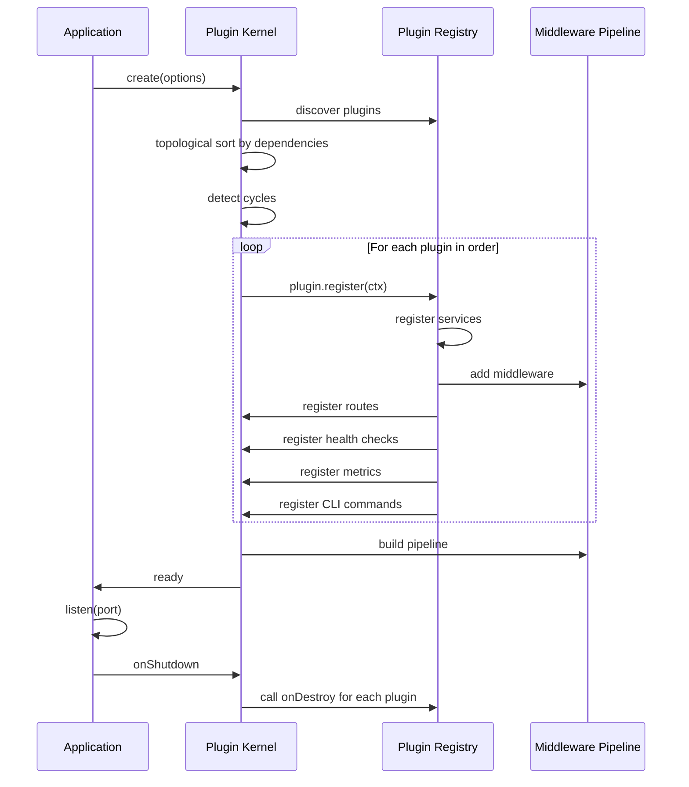

# Hono Enterprise Framework — Plugin-First Architecture Roadmap

## Design Philosophy

**NOT a NestJS clone.** This is a Fastify-inspired, Spring Boot-organized, ASP.NET Core-pipelined,
Hono-performant framework where **everything is a plugin**.

### Core Tenets

| Principle                         | Meaning                                                                                     |
| --------------------------------- | ------------------------------------------------------------------------------------------- |
| Everything is a plugin            | Every capability (DI, logging, validation, database, auth, etc.) is implemented as a plugin |
| Decorators are optional           | Full programmatic API exists; decorators are a thin layer on top                            |
| DI is optional                    | Plugins can use DI, manual wiring, or factory functions                                     |
| Reflection is optional            | Metadata is stored in plain objects; reflection is one way to populate them                 |
| Everything has a programmatic API | No capability requires decorators or reflection                                             |
| Everything is replaceable         | Any plugin can be swapped without touching application code                                 |
| Everything is runtime independent | No Node.js APIs in core; runtime adapters provided by RuntimePlugin                         |
| Every capability is a plugin      | Framework ships zero hardcoded features                                                     |

### Architectural Inspirations

| Source       | What We Take                                                          |
| ------------ | --------------------------------------------------------------------- |
| Hono         | Performance, runtime portability, routing engine                      |
| Spring Boot  | Plugin auto-configuration, starter packages, conditional registration |
| ASP.NET Core | Middleware pipeline, request/response abstractions                    |
| Fastify      | Plugin encapsulation, decoration pattern, lifecycle hooks             |

---

## Architecture Overview

```mermaid
graph TB
    subgraph Application
        App[Application Instance]
    end

    subgraph Core Kernel
        Kernel[Plugin Kernel]
        Registry[Plugin Registry]
        Pipeline[Middleware Pipeline]
        Router[Router]
        Container[Optional DI Container]
    end

    subgraph Plugins
        Runtime[RuntimePlugin]
        Logger[LoggerPlugin]
        Config[ConfigPlugin]
        Validation[ValidationPlugin]
        Database[DatabasePlugin]
        Auth[AuthPlugin]
        Messaging[MessagingPlugin]
        OpenApi[OpenApiPlugin]
        Scheduler[SchedulerPlugin]
        Metrics[MetricsPlugin]
        Health[HealthPlugin]
        FeatureFlags[FeatureFlagsPlugin]
        Storage[StoragePlugin]
        Mail[MailPlugin]
        Notification[NotificationPlugin]
        Secrets[SecretsPlugin]
        Audit[AuditPlugin]
        Resilience[ResiliencePlugin]
        Cache[CachePlugin]
        Events[EventsPlugin]
        Cqrs[CqrsPlugin]
        Telemetry[TelemetryPlugin]
        MultiTenancy[MultiTenancyPlugin]
        Queue[QueuePlugin]
    end

    App --> Kernel
    Kernel --> Registry
    Kernel --> Pipeline
    Kernel --> Router
    Kernel --> Container

    Registry --> Runtime
    Registry --> Logger
    Registry --> Config
    Registry --> Validation
    Registry --> Database
    Registry --> Auth
    Registry --> Messaging
    Registry --> OpenApi
    Registry --> Scheduler
    Registry --> Metrics
    Registry --> Health
    Registry --> FeatureFlags
    Registry --> Storage
    Registry --> Mail
    Registry --> Notification
    Registry --> Secrets
    Registry --> Audit
    Registry --> Resilience
    Registry --> Cache
    Registry --> Events
    Registry --> Cqrs
    Registry --> Telemetry
    Registry --> MultiTenancy
    Registry --> Queue
```



---

## Plugin Contract

Every plugin implements this contract. `IPlugin` and `IPluginContext` are defined in
`@hono-enterprise/common` (following the `IXxx` interface naming rule) — the kernel consumes them,
it does not define them.

```typescript
interface IPlugin {
  name: string;
  version: string;
  dependencies?: string[];
  optionalDependencies?: string[];
  provides?: string[]; // Capability tokens this plugin provides
  consumes?: string[]; // Capability tokens this plugin needs
  priority?: number; // Lower = earlier registration
  register(ctx: IPluginContext): void | Promise<void>;
}

interface IPluginContext {
  // Service registry — plugins register services by capability token
  services: ServiceRegistry;
  // Middleware pipeline — plugins add middleware
  middleware: MiddlewareApi;
  // Router — plugins register routes
  router: RouterApi;
  // Configuration — plugins read/validate config
  config: ConfigApi;
  // Environment — plugins validate env vars
  environment: EnvironmentApi;
  // Health — plugins register health checks
  health: HealthApi;
  // Metrics — plugins register metrics
  metrics: MetricsApi;
  // OpenAPI — plugins contribute to OpenAPI spec
  openapi: OpenApiApi;
  // Decorators — plugins register decorator handlers
  decorators: DecoratorApi;
  // CLI — plugins register CLI commands
  cli: CliApi;
  // Lifecycle — plugins register lifecycle hooks
  lifecycle: LifecycleApi;
  // Logger (from LoggerPlugin, if registered)
  logger?: ILogger;
  // Runtime services (from RuntimePlugin)
  runtime: IRuntimeServices;
  // Decorator metadata store (from DecoratorPlugin, if registered)
  metadata?: MetadataStore;
  // DI container (from DiPlugin, if registered)
  container?: IContainer;
  // Plugin-specific options
  options: Record<string, unknown>;
  // Application instance
  app: Application;
}
```

> **Runtime bootstrap rule:** `ctx.runtime` is non-optional because a runtime provider is
> **mandatory**. `createApplication()` fails fast at startup if no registered plugin provides the
> `runtime` capability, and the kernel always registers the runtime-providing plugin first,
> regardless of declared priority. Every other plugin can therefore rely on `ctx.runtime` being
> present.

### Service Registry

```typescript
interface ServiceRegistry {
  // Register a service by capability token
  register<T>(token: string, service: T, options?: RegisterOptions): void;
  // Get a service by capability token
  get<T>(token: string): T;
  // Check if a capability is available
  has(token: string): boolean;
  // Get all services for a capability (multi-provider)
  getAll<T>(token: string): T[];
  // Unregister a service
  unregister(token: string): void;
  // Register a factory (lazy)
  registerFactory<T>(token: string, factory: () => T): void;
}

interface RegisterOptions {
  override?: boolean; // Replace existing
  multi?: boolean; // Allow multiple providers
  lazy?: boolean; // Instantiate on first get
}
```

### Capability Tokens

Plugins communicate via **capability tokens** (strings), not concrete types:

```typescript
// Standard capability tokens
const CAPABILITIES = {
  LOGGER: 'logger',
  CONFIG: 'config',
  VALIDATION: 'validation',
  DATABASE: 'database',
  CACHE: 'cache',
  EVENTS: 'events',
  MESSAGING: 'messaging',
  AUTH: 'authentication',
  AUTHORIZATION: 'authorization',
  SCHEDULER: 'scheduler',
  METRICS: 'metrics',
  HEALTH: 'health',
  OPENAPI: 'openapi',
  TELEMETRY: 'telemetry',
  SECRETS: 'secrets',
  AUDIT: 'audit',
  RESILIENCE: 'resilience',
  STORAGE: 'storage',
  MAIL: 'mail',
  NOTIFICATION: 'notification',
  FEATURE_FLAGS: 'feature-flags',
  QUEUE: 'queue',
  CQRS: 'cqrs',
  MULTI_TENANCY: 'multi-tenancy',
  RUNTIME: 'runtime',
  JWT: 'jwt',
  COMMAND_BUS: 'command-bus',
  QUERY_BUS: 'query-bus',
  DI_CONTAINER: 'di-container',
} as const;
```

This constant is the **single source of truth** for capability tokens. Every token used anywhere in
the framework, examples, or documentation must appear here — no ad-hoc token strings (see
AI_GUIDELINES §11.2, No Magic Strings).

---

## Plugin Lifecycle



### Lifecycle Hooks

```typescript
interface LifecycleApi {
  onRegister(fn: () => void | Promise<void>): void;
  onInit(fn: () => void | Promise<void>): void;
  onBootstrap(fn: () => void | Promise<void>): void;
  onRequest(fn: (ctx: RequestContext) => void | Promise<void>): void;
  onResponse(fn: (ctx: RequestContext) => void | Promise<void>): void;
  onError(fn: (err: Error, ctx: RequestContext) => void | Promise<void>): void;
  onShutdown(fn: () => void | Promise<void>): void;
  onClose(fn: () => void | Promise<void>): void;
}
```

---

## Monorepo Structure

```
hono-enterprise/
├── apps/
│   ├── minimal/                 # Minimal app (no plugins)
│   ├── rest-api/                # REST API with common plugins
│   ├── microservices/           # Microservices example
│   ├── cqrs/                     # CQRS example
│   ├── multi-tenant/            # Multi-tenancy example
│   ├── plugin-development/      # How to build a custom plugin
│   ├── compiled-binary/         # Standalone `deno compile` binary
│   ├── graphql-demo/            # GraphQL interop demo
│   ├── grpc/                    # gRPC/Connect co-serving example
│   ├── cloudflare/              # Cloudflare Workers bindings example
│   └── realtime/                # Cross-replica realtime backplane example
├── packages/
│   ├── kernel/                   # Plugin kernel, pipeline, router, service registry
│   ├── common/                   # Shared types, interfaces, capability tokens
│   ├── runtime/                  # RuntimePlugin + runtime adapters
│   ├── di-plugin/                # Optional DI plugin
│   ├── decorator-plugin/         # Optional decorator/reflect plugin
│   ├── logger-plugin/            # LoggerPlugin (Pino, Console)
│   ├── config-plugin/            # ConfigPlugin
│   ├── validation-plugin/        # ValidationPlugin (Zod)
│   ├── exceptions/               # Exception factories + error handler middleware (plain package)
│   ├── database-plugin/          # DatabasePlugin (Prisma, Drizzle adapters)
│   ├── cache-plugin/             # CachePlugin (Memory, Redis)
│   ├── events-plugin/            # EventsPlugin (in-memory event bus)
│   ├── cqrs-plugin/              # CqrsPlugin (commands, queries, buses)
│   ├── messaging-plugin/         # MessagingPlugin (Memory, Redis Streams; RabbitMQ/NATS/Kafka in M14b)
│   ├── queue-plugin/             # QueuePlugin (Redis, RabbitMQ, Memory)
│   ├── auth-plugin/              # AuthPlugin (JWT, API Key, RBAC; refresh + rate limiting in M16b)
│   ├── http-security-plugin/     # HttpSecurityPlugin (CORS, headers, CSRF)
│   ├── scheduler-plugin/         # SchedulerPlugin (cron, delayed, recurring)
│   ├── metrics-plugin/           # MetricsPlugin (Prometheus)
│   ├── health-plugin/            # HealthPlugin
│   ├── openapi-plugin/           # OpenApiPlugin
│   ├── telemetry-plugin/         # TelemetryPlugin (OpenTelemetry)
│   ├── secrets-plugin/           # SecretsPlugin (KMS, Vault, env)
│   ├── audit-plugin/             # AuditPlugin
│   ├── resilience-plugin/       # ResiliencePlugin (circuit breaker, retry, timeout)
│   ├── storage-plugin/           # StoragePlugin (S3, GCS, local)
│   ├── mail-plugin/              # MailPlugin (SMTP, SES, SendGrid)
│   ├── notification-plugin/      # NotificationPlugin (multi-channel)
│   ├── feature-flags-plugin/    # FeatureFlagsPlugin
│   ├── multi-tenancy-plugin/     # MultiTenancyPlugin
│   ├── testing/                  # Test utilities, mock plugin, test app factory
│   ├── cli/                      # CLI tool with plugin-aware generators
│   ├── sdk/                      # SDK for external consumers
│   └── starters/                 # Starter bundles (opinionated plugin sets)
│       ├── rest-starter/
│       ├── microservice-starter/
│       └── full-stack-starter/
├── docs/
├── docker/
├── kubernetes/
├── scripts/
├── deno.json                     # Root workspace config: members, tasks, strict compilerOptions, lint/fmt
└── deno.lock
```

> **Toolchain:** The monorepo is built with the **Deno toolchain** (Deno 2 workspaces,
> `deno test`/`lint`/`fmt`/`check`). Packages are published to **JSR** under the `@hono-enterprise`
> scope and are consumable from Node/Bun via JSR's npm compatibility layer. There is no build step —
> JSR publishes TypeScript sources directly. Applications built on the framework can be shipped as
> standalone binaries with `deno compile`.

---

## Package Dependencies

```
kernel ────► common
runtime ───► common, kernel
di-plugin ─► common, kernel
decorator-plugin ─► common, kernel
logger-plugin ─► common, kernel, runtime
config-plugin ─► common, kernel, runtime
validation-plugin ─► common, kernel
exceptions ─► common
database-plugin ─► common, kernel, runtime
cache-plugin ─► common, kernel
events-plugin ─► common, kernel
cqrs-plugin ─► common, kernel
messaging-plugin ─► common, kernel, runtime
queue-plugin ─► common, kernel, runtime
auth-plugin ─► common, kernel
http-security-plugin ─► common, kernel
scheduler-plugin ─► common, kernel, runtime
metrics-plugin ─► common, kernel, runtime
health-plugin ─► common, kernel
openapi-plugin ─► common, kernel
telemetry-plugin ─► common, kernel, runtime
secrets-plugin ─► common, kernel, runtime
audit-plugin ─► common, kernel
resilience-plugin ─► common, kernel
storage-plugin ─► common, kernel, runtime
mail-plugin ─► common, kernel
notification-plugin ─► common, kernel
feature-flags-plugin ─► common, kernel
multi-tenancy-plugin ─► common, kernel
testing ─► common, kernel
cli ─► common, runtime
sdk ─► common
```

**Key rule:** No plugin depends on another plugin — not even at build time. All shared interfaces
(`ILogger`, `IEventBus`, etc.) live in `@hono-enterprise/common`, so a plugin never needs another
plugin's package for type definitions. Plugins communicate exclusively via capability tokens
resolved through the ServiceRegistry: `ctx.services.get<T>(CAPABILITIES.X)`.

---

## Milestones

---

## Milestone 0: Monorepo Foundation

**Objective:** Establish the Deno-based monorepo, task pipeline, and base configurations.

### Tasks

1. **Initialize Monorepo**
   - Initialize the git repository (`git init`, initial commit of design docs)
   - Replace the scaffold `deno.json`/`main.ts`/`main_test.ts` with a root workspace `deno.json`
   - Configure workspace members (`packages/*`; applications stay standalone under `apps/`)
   - Define root tasks: `check`, `test`, `test:coverage`, `lint`, `fmt`, `fmt:check`
   - Set strict TypeScript `compilerOptions` in the root `deno.json`
   - Configure `deno lint` rules and `deno fmt` options
   - Create `.gitignore`, `.editorconfig`

2. **Create Directory Structure**
   - Create `apps/`, `packages/`, `docs/`, `docker/`, `kubernetes/`, `scripts/`
   - Create stub `deno.json` for each package with `@hono-enterprise/[name]` JSR naming, version,
     and exports

3. **Configure Tooling**
   - Workspace-wide task orchestration via root `deno task`
   - Import maps for cross-package resolution during development
   - `deno doc --lint` for JSDoc enforcement on exports

4. **CI/CD Foundation**
   - GitHub Actions workflow
   - `deno fmt --check`, `deno lint`, `deno check`, `deno test --coverage` pipeline
   - Node and Bun compatibility jobs (consume packages via JSR npm compatibility; run the compat
     test suite)
   - Dependency vulnerability scanning via `deno audit`

### Deliverables

- [x] Git repository initialized
- [x] Working Deno workspace monorepo
- [x] Root task pipeline (`check`, `test`, `lint`, `fmt`)
- [x] Strict TypeScript via root `deno.json`
- [x] All package stubs created with JSR metadata
- [x] CI passing on Deno, with Node/Bun compat jobs stubbed (verified green on PR #1)

---

## Milestone 1: Common Package — Types and Capability Tokens

**Objective:** Define all shared types, interfaces, and capability tokens.

### Package: `@hono-enterprise/common`

**Contents:**

1. **Capability Tokens**
   - All standard capability token constants
   - Token registry for custom tokens

2. **Core Interfaces**
   - `ILogger` — Logger interface (no implementation)
   - `IRuntimeServices` — Runtime abstraction (uuid, timers, crypto, fs)
   - `IContainer` — DI container interface (optional)
   - `IServiceRegistry` — Service registry interface
   - `IPlugin` — Plugin contract
   - `IPluginContext` — Plugin registration context
   - `IMiddleware` — Middleware interface
   - `IRequestContext` — Request context interface
   - `IRequest` — HTTP request abstraction
   - `IResponse` — HTTP response abstraction
   - `IConfig` — Configuration interface
   - `IValidationService` — Validation interface
   - `IHealthIndicator` — Health check interface
   - `IMetric` — Metric interface
   - `IOrmAdapter` — ORM adapter interface
   - `ICacheStore` — Cache store interface
   - `IEventBus` — Event bus interface
   - `IMessageBroker` — Message broker interface
   - `IQueue` — Queue interface
   - `IJwtService` — JWT interface
   - `ISecretManager` — Secret manager interface
   - `IAuditLogger` — Audit logger interface
   - `ICircuitBreaker` — Circuit breaker interface
   - `IStorage` — Storage interface
   - `IMailer` — Mail interface
   - `INotifier` — Notification interface
   - `IFeatureFlags` — Feature flags interface
   - `ITenantResolver` — Tenant resolver interface

3. **Shared Types**
   - `HttpMethod` — HTTP method union
   - `RuntimePlatform` — Runtime identifier
   - `PluginPriority` — Priority constants
   - `LifecyclePhase` — Lifecycle phase enum
   - `HealthStatus` — Health status union
   - `MetricType` — Metric type union

4. **Utilities**
   - `CapabilityToken` — Token creation helper
   - `Result<T, E>` — Result type for error handling
   - `Option<T>` — Optional type

### Deliverables

- [x] All shared interfaces defined
- [x] Capability token constants
- [x] Zero runtime dependencies
- [x] JSDoc on all exports
- [x] Full type tests

---

## Milestone 2: Kernel — Plugin Kernel and Service Registry

**Objective:** Build the plugin kernel that orchestrates plugin registration and execution.

### Package: `@hono-enterprise/kernel`

**Core Components:**

1. **Plugin Registry**
   - Plugin registration with dependency resolution
   - Topological sort by dependencies
   - Circular dependency detection
   - Priority-based ordering
   - Optional dependency handling

2. **Service Registry**
   - Capability token-based service registration
   - Single and multi-provider support
   - Lazy factory registration
   - Override support
   - Service lookup by token

3. **Middleware Pipeline**
   - ASP.NET Core-style middleware pipeline
   - Ordered middleware execution
   - Context propagation
   - Error propagation
   - Early termination

4. **Router**
   - Route registration (programmatic API)
   - Route matching (path + method)
   - Parameter extraction
   - Route groups
   - Route middleware

5. **Application**
   - Application creation and configuration
   - Plugin loading
   - Lifecycle orchestration
   - Graceful shutdown
   - HTTP server management (delegated to RuntimePlugin)

6. **Request Context**
   - Per-request context object
   - Service access
   - State management
   - Request/response access

**Programmatic API (no decorators required):**

```typescript
import { createApplication } from '@hono-enterprise/kernel';

const app = createApplication({
  plugins: [
    RuntimePlugin(),
    LoggerPlugin({ level: 'info' }),
    ConfigPlugin({ envFilePath: '.env' }),
    ValidationPlugin(),
    DatabasePlugin({ type: 'prisma' }),
    AuthPlugin({ jwt: { secret: '...' } }),
  ],
});

// Programmatic route registration
app.router.get('/users', async (ctx) => {
  const db = ctx.services.get<IDatabaseService>('database');
  const users = await db.findAll('users');
  return ctx.response.json(users);
});

app.router.post('/users', {
  handler: async (ctx) => {/* ... */},
  middleware: [validateBody(UserSchema)],
  schema: { body: UserSchema }, // For OpenAPI
});

await app.start({ port: 3000 });
```

**Plugin Registration:**

```typescript
const app = createApplication();

// Register plugins programmatically
app.register(RuntimePlugin());
app.register(LoggerPlugin({ level: 'debug' }));
app.register(ConfigPlugin());

// Register a custom plugin inline
app.register({
  name: 'my-plugin',
  version: '1.0.0',
  dependencies: ['logger'],
  register(ctx) {
    ctx.services.register('my-service', new MyService());
    ctx.middleware.add(myMiddleware);
    ctx.router.get('/health-custom', (ctx) => ctx.response.json({ ok: true }));
    ctx.lifecycle.onShutdown(() => console.log('cleanup'));
  },
});

await app.start();
```

**Implementation Files:**

- `src/application/application.ts`
- `src/application/app-builder.ts`
- `src/registry/plugin-registry.ts`
- `src/registry/plugin-resolver.ts` — Topological sort, cycle detection
- `src/registry/service-registry.ts`
- `src/pipeline/middleware-pipeline.ts`
- `src/pipeline/middleware-context.ts`
- `src/router/router.ts`
- `src/router/route-matcher.ts`
- `src/router/route-group.ts`
- `src/context/request-context.ts`
- `src/context/request.ts`
- `src/context/response.ts`
- `src/lifecycle/lifecycle-manager.ts`
- `src/lifecycle/lifecycle-hooks.ts`
- `src/shutdown/graceful-shutdown.ts`
- `src/index.ts`

### Tests

- Plugin registration and resolution
- Dependency topological sort
- Circular dependency detection
- Service registry operations
- Middleware pipeline execution
- Route registration and matching
- Application lifecycle
- Graceful shutdown
- Programmatic API (no decorators)

### Deliverables

- [x] Plugin kernel
- [x] Service registry
- [x] Middleware pipeline
- [x] Router with programmatic API
- [x] Application lifecycle
- [x] Full test coverage

---

## Milestone 3: Runtime Plugin — Runtime Independence

**Objective:** Provide runtime-agnostic services (UUID, timers, crypto, fs, env).

> **Scope change (historical):** HTTP server adapters were deferred from M3 to Milestone 41 (see
> "HTTP Server Adapters"). M3 shipped runtime services + detection + plugin only. The deferral was
> originally because `IResponse` had no read surface; that was resolved in M11 by the
> `IResponse.snapshot()` read seam, which M41's adapters now use to serialize responses without
> reaching into kernel internals. The framework already ran via `app.inject()` with no server, so
> nothing was blocked.

### Package: `@hono-enterprise/runtime`

**Runtime Services Interface:**

```typescript
interface IRuntimeServices {
  // Identity
  platform(): RuntimePlatform;
  version(): string;

  // Time
  now(): number;
  hrtime(): [number, number];
  setTimeout(fn: () => void, ms: number): TimerHandle;
  clearTimeout(handle: TimerHandle): void;
  setInterval(fn: () => void, ms: number): TimerHandle;
  clearInterval(handle: TimerHandle): void;

  // Crypto
  uuid(): string;
  randomBytes(length: number): Uint8Array;
  getRandomValues(buffer: Uint8Array): Uint8Array;
  subtle: SubtleCrypto;

  // Environment
  env: Record<string, string | undefined>;
  exit(code?: number): never;

  // File System (optional, not on edge)
  fs?: IFileSystem;

  // Network
  hostname(): string;
}

interface IFileSystem {
  readFile(path: string): Promise<Uint8Array>;
  writeFile(path: string, data: Uint8Array): Promise<void>;
  stat(path: string): Promise<StatResult>;
  readdir(path: string): Promise<string[]>;
  mkdir(path: string, options?: any): Promise<void>;
  rm(path: string, options?: any): Promise<void>;
}
```

**Runtime Adapters:**

- `NodeRuntimeServices` — Node.js implementation
- `DenoRuntimeServices` — Deno implementation
- `BunRuntimeServices` — Bun implementation
- `CloudflareRuntimeServices` — Cloudflare Workers (future)

**Auto-detection:**

```typescript
function detectRuntime(): RuntimePlatform {
  // Check for Deno
  if (typeof Deno !== 'undefined') return 'deno';
  // Check for Bun
  if (typeof Bun !== 'undefined') return 'bun';
  // Check for Cloudflare Workers
  if (
    typeof caches !== 'undefined' && typeof navigator !== 'undefined' &&
    navigator.userAgent?.includes('cloudflare')
  ) return 'cloudflare-workers';
  // Default to Node
  return 'node';
}
```

**HTTP Adapter:** The RuntimePlugin also provides HTTP server adapters:

- `NodeHttpAdapter` — Node.js `http` module
- `DenoHttpAdapter` — Deno `serve` API
- `BunHttpAdapter` — Bun.serve

**Plugin Registration:**

```typescript
const app = createApplication({
  plugins: [RuntimePlugin({ httpAdapter: 'auto' })],
});
```

**Implementation Files:**

- `src/plugin/runtime-plugin.ts`
- `src/services/runtime-services.interface.ts`
- `src/adapters/node/node-runtime.ts`
- `src/adapters/node/node-http-adapter.ts`
- `src/adapters/deno/deno-runtime.ts`
- `src/adapters/deno/deno-http-adapter.ts`
- `src/adapters/bun/bun-runtime.ts`
- `src/adapters/bun/bun-http-adapter.ts`
- `src/adapters/cloudflare/cf-runtime.ts` (stub for future)
- `src/adapters/cloudflare/cf-http-adapter.ts` (stub for future)
- `src/detector/runtime-detector.ts`
- `src/index.ts`

### Tests

- Runtime detection
- UUID generation across runtimes
- Timer operations
- Crypto operations
- Environment variable access
- HTTP adapter request/response
- File system operations (Node, Deno, Bun)

### Deliverables

- [x] Runtime services interface
- [x] Node, Deno, Bun adapters
- [ ] HTTP server adapters (deferred — see "HTTP Server Adapters" milestone)
- [x] Runtime auto-detection
- [x] Full test coverage

---

## Milestone 4: Logger Plugin — Structured Logging

**Objective:** Provide logging capability via plugin.

### Package: `@hono-enterprise/logger-plugin`

**Plugin Registration:**

```typescript
app.register(LoggerPlugin({
  level: 'info',
  transport: 'pino', // or 'console'
  redact: ['password', 'token'],
  pretty: config.get('NODE_ENV') === 'development', // via ConfigPlugin, never process.env
}));
```

**Programmatic API:**

```typescript
// In a plugin or route handler
const logger = ctx.services.get<ILogger>('logger');
logger.info('User created', { userId: '123' });

// Child logger with bindings
const childLogger = logger.child({ requestId: ctx.request.id });
childLogger.debug('Processing request');
```

**Implementations:**

- `PinoLogger` — Pino-based (Node.js optimized)
- `ConsoleLogger` — Runtime-independent console
- `NoopLogger` — For testing

**Automatic Request Logging:** The plugin registers middleware that logs:

- Incoming requests (method, path, requestId)
- Outgoing responses (status, duration)
- Slow requests (configurable threshold)
- Unhandled errors

**Implementation Files:**

- `src/plugin/logger-plugin.ts`
- `src/loggers/pino-logger.ts`
- `src/loggers/console-logger.ts`
- `src/loggers/noop-logger.ts`
- `src/middleware/request-logger.ts`
- `src/middleware/slow-request-logger.ts`
- `src/index.ts`

### Tests

- Log level filtering
- Structured output
- Child logger
- Request logging middleware
- Slow request detection
- Redaction
- All logger implementations

### Deliverables

- [ ] LoggerPlugin
- [ ] Pino, Console, Noop implementations
- [ ] Request logging middleware
- [ ] Full test coverage

---

## Milestone 5: Config Plugin — Configuration Management

**Objective:** Provide configuration capability with env validation.

### Package: `@hono-enterprise/config-plugin`

**Plugin Registration:**

```typescript
app.register(ConfigPlugin({
  envFilePath: ['.env.local', '.env'],
  validationSchema: AppConfigSchema,
  expandVariables: true,
}));
```

**Programmatic API:**

```typescript
const config = ctx.services.get<IConfig>(CAPABILITIES.CONFIG);
const port = config.get<number>('PORT', { default: 3000 });
const dbUrl = config.getOrThrow<string>('DATABASE_URL');
```

**Features:**

- Environment variable loading via `IRuntimeServices.env`
- `.env` file parsing via `IRuntimeServices.fs`
- Zod-compatible schema validation at startup (structural schema interface)
- Type-safe access (`get`, `getOrThrow`, `has`)
- Variable expansion (`${NAME}`) with cycle detection
- Immutable application-startup snapshot (caching without mutable cache API)
- Hot reload deferred (runtime contract has no file-watching abstraction)

> **Deferred — configuration hot reload:** ConfigPlugin currently reads environment variables and
> `.env` files once during application startup. Changes made while the application is running take
> effect only after a restart. Cross-runtime hot reload requires a file-watching abstraction (for
> example, `IFileSystem.watch`) to be designed and added to `IRuntimeServices`; implementing it
> directly with Node, Deno, or Bun APIs inside ConfigPlugin would violate runtime independence.
> Revisit this feature when the runtime filesystem contract is extended.

**Environment Validation:**

```typescript
const AppConfigSchema = z.object({
  PORT: z.coerce.number().default(3000),
  DATABASE_URL: z.string().url(),
  JWT_SECRET: z.string().min(32),
  LOG_LEVEL: z.enum(['debug', 'info', 'warn', 'error']).default('info'),
});

app.register(ConfigPlugin({ validationSchema: AppConfigSchema }));
```

**Implementation Files:**

- `src/plugin/config-plugin.ts`
- `src/services/config-service.ts`
- `src/services/env-loader.ts`
- `src/validators/config-validator.ts`
- `src/parsers/env-parser.ts`
- `src/index.ts`

### Tests

- Env file loading (unit, integration, e2e)
- Zod validation (real Zod schema in e2e)
- Type-safe access (unit)
- Default values (unit)
- Variable expansion with cycles and missing references (unit)
- Missing required vars throw (unit)
- Runtime-specific loading (integration)
- Precedence: runtime.env > earlier files > later files (integration)
- Edge runtime: missing fs throws (integration, e2e)

### Deliverables

- [x] ConfigPlugin
- [x] Env file parsing
- [x] Zod validation
- [x] Full test coverage (>90% branches, functions, lines for all src files)

---

## Milestone 6: Validation Plugin — Zod-Based Validation

**Objective:** Provide validation capability with standardized errors.

### Package: `@hono-enterprise/validation-plugin`

**Plugin Registration:**

```typescript
app.register(ValidationPlugin({
  errorFormat: 'rfc7807', // or 'default', 'nestjs', custom
  whitelist: true,
  forbidNonWhitelisted: false,
}));
```

**Programmatic API:**

```typescript
const validation = ctx.services.get<IValidationService>('validation');

// Validate data
const result = validation.validate(UserSchema, requestBody);
if (result.success) {
  const user = result.data;
} else {
  const errors = result.error;
}

// Validate as middleware
app.router.post('/users', {
  middleware: [validation.middleware(UserSchema, 'body')],
  handler: async (ctx) => {/* ... */},
});
```

**Middleware Helper:**

```typescript
function validateBody(schema: ZodSchema): MiddlewareFunction;
function validateQuery(schema: ZodSchema): MiddlewareFunction;
function validateParams(schema: ZodSchema): MiddlewareFunction;
function validateHeaders(schema: ZodSchema): MiddlewareFunction;
function validateCookies(schema: ZodSchema): MiddlewareFunction;
```

**Error Formats:**

- `default` — Framework standard
- `rfc7807` — RFC 7807 Problem Details
- `nestjs` — NestJS-compatible
- Custom formatter function

**Input Sanitization:**

```typescript
interface SanitizationRules {
  htmlEncode?: boolean;
  stripTags?: boolean;
  allowedTags?: string[];
  maxLength?: number;
  pattern?: RegExp;
  trim?: boolean;
  toLowerCase?: boolean;
  toUpperCase?: boolean;
}

const sanitizers = validation.createSanitizer({
  htmlEncode: true,
  stripTags: true,
  maxLength: 1000,
});
```

**Implementation Files:**

- `src/plugin/validation-plugin.ts`
- `src/services/validation-service.ts`
- `src/middleware/validation-middleware.ts`
- `src/sanitizers/sanitizer.ts`
- `src/formatters/error-formatter.ts`
- `src/formatters/rfc7807-formatter.ts`
- `src/formatters/default-formatter.ts`
- `src/index.ts`

### Tests

- Body, query, params, headers, cookies validation
- Sanitization
- Error formatting (all formats)
- Whitelisting
- Middleware integration

### Deliverables

- [ ] ValidationPlugin
- [ ] Validation middleware
- [ ] Sanitization
- [ ] Multiple error formats
- [ ] Full test coverage

---

## Milestone 7: Exceptions Package — Exception Hierarchy

**Objective:** Provide exception types and global error handling.

### Package: `@hono-enterprise/exceptions`

This is a **plain package** (not a plugin) containing exception types and an error handling
middleware factory.

**Exception Types:**

```typescript
// Base
class HttpError extends Error {
  constructor(
    public statusCode: number,
    message: string,
    public details?: Record<string, unknown>,
    public cause?: Error,
  ) {}
}

// Factory functions (composition over inheritance)
function badRequest(message: string, details?: unknown): HttpError;
function unauthorized(message: string): HttpError;
function forbidden(message: string): HttpError;
function notFound(message: string): HttpError;
function conflict(message: string): HttpError;
function validationError(errors: ValidationError[]): HttpError;
function internalServerError(message: string, cause?: Error): HttpError;
// ... etc
```

**Error Handling Middleware:**

```typescript
import { errorHandler } from '@hono-enterprise/exceptions';

app.middleware.add(errorHandler({
  format: 'rfc7807', // or 'default', custom
  includeStackTrace: config.get('NODE_ENV') === 'development', // via ConfigPlugin, never process.env
  logErrors: true,
}));
```

**Implementation Files:**

- `src/errors/http-error.ts`
- `src/errors/exceptions.ts` — Factory functions
- `src/middleware/error-handler.ts`
- `src/formatters/error-formatter.ts`
- `src/formatters/rfc7807-formatter.ts`
- `src/index.ts`

### Tests

- All exception types
- Error handler middleware
- Error formatting
- Stack trace handling
- Cause chaining

### Deliverables

- [x] Exception types (composition-based)
- [x] Error handler middleware
- [x] RFC 7807 support
- [x] Full test coverage

---

## Milestone 8: DI Plugin — Optional Dependency Injection

**Objective:** Provide optional DI container for those who want it.

### Package: `@hono-enterprise/di-plugin`

**Plugin Registration:**

```typescript
app.register(DiPlugin({
  defaultScope: 'singleton',
  autoRegister: true, // Auto-register services from plugins
}));
```

**Programmatic API:**

```typescript
// Access container
const container = ctx.services.get<IContainer>('di-container');

// Register
container.register<UserService>('UserService', { useClass: UserServiceImpl });
container.register<DatabaseService>('DatabaseService', {
  useFactory: () => new DatabaseService(config.get('DATABASE_URL')),
});

// Resolve
const userService = container.resolve<UserService>('UserService');
```

**Features:**

- Singleton, scoped, transient lifecycles
- Constructor injection
- Factory providers
- Value providers
- Circular dependency detection
- Hierarchical containers
- Custom tokens
- **Optional** — not required by any other plugin

**Implementation Files:**

- `src/plugin/di-plugin.ts`
- `src/container/container.ts`
- `src/container/container-builder.ts`
- `src/container/provider-registry.ts`
- `src/container/scope-manager.ts`
- `src/container/circular-detector.ts`
- `src/index.ts`

### Tests

- All DI scenarios
- Lifecycle management
- Circular detection
- Hierarchical containers

### Deliverables

- [x] DiPlugin (optional)
- [x] Full DI container
- [x] Full test coverage

---

## Milestone 9: Decorator Plugin — Optional Decorators and Reflection

**Objective:** Provide optional decorator system for those who prefer NestJS-style DX.

### Package: `@hono-enterprise/decorator-plugin`

**Plugin Registration:**

```typescript
app.register(DecoratorPlugin({
  autoDiscover: true, // Auto-scan for decorated classes
  controllersPath: './src/controllers',
}));
```

**Decorators Provided:**

```typescript
// Controller decorators
@Controller('/users')
class UserController {
  @Get('/')
  async list() {/* ... */}

  @Post('/')
  @UseGuards(JwtGuard)
  async create(@Body() body: CreateUserDto) {/* ... */}
}

// Injectable (requires DiPlugin)
@Injectable()
class UserService {
  @Inject('database')
  private db: IDatabaseService;
}
```

**How It Works:**

1. Decorators store metadata in a `MetadataStore` (plain object, not WeakMap)
2. DecoratorPlugin reads metadata and registers routes/services with kernel
3. No reflection required — metadata is stored explicitly
4. Decorators are **syntactic sugar** over the programmatic API

**Metadata Store:**

```typescript
interface MetadataStore {
  controllers: Map<string, ControllerMetadata>;
  services: Map<string, ServiceMetadata>;
  routes: Map<string, RouteMetadata[]>;
}

interface ControllerMetadata {
  path: string;
  version?: string;
  middleware: string[];
  guards: string[];
  routes: RouteMetadata[];
}

interface RouteMetadata {
  path: string;
  method: HttpMethod;
  handler: string;
  params: ParameterMetadata[];
  middleware: string[];
  guards: string[];
  schema?: {
    body?: ZodSchema;
    query?: ZodSchema;
    params?: ZodSchema;
  };
}
```

**Decorator Files:**

- `src/decorators/controller.ts` — @Controller, @Get, @Post, etc.
- `src/decorators/injection.ts` — @Injectable, @Inject
- `src/decorators/request.ts` — @Body, @Query, @Param, @Header, @Cookie
- `src/decorators/security.ts` — @Roles, @Permissions, @CurrentUser, @Public
- `src/decorators/pipeline.ts` — @UseGuards, @UseInterceptors, @UseFilters
- `src/decorators/validation.ts` — @ValidateBody, @ValidateQuery
- `src/decorators/openapi.ts` — @ApiTags, @ApiOperation, @ApiResponse

**Plugin Implementation:**

- `src/plugin/decorator-plugin.ts` — Reads metadata, registers with kernel
- `src/metadata/metadata-store.ts` — Plain object metadata storage
- `src/discovery/controller-discovery.ts` — Auto-discovery of decorated classes
- `src/resolvers/parameter-resolver.ts` — Resolves @Body, @Query, etc.

### Tests

- Metadata registration
- Controller discovery
- Route registration from decorators
- Parameter resolution
- Guard/interceptor/filter application
- Works with and without DiPlugin

### Deliverables

- [ ] DecoratorPlugin (optional)
- [ ] All decorators
- [ ] Metadata store
- [ ] Controller discovery
- [ ] Full test coverage

---

## Milestone 10: Database Plugin — Repository and Unit of Work

**Objective:** Provide database capability with ORM adapters.

### Package: `@hono-enterprise/database-plugin`

**Plugin Registration:**

```typescript
app.register(DatabasePlugin({
  type: 'prisma',
  options: {
    url: config.get('DATABASE_URL'),
    logQueries: true,
  },
}));
```

**Programmatic API:**

```typescript
const db = ctx.services.get<IDatabaseService>('database');

// Repository pattern
const userRepo = db.getRepository<User>('User');
const users = await userRepo.findAll({ where: { active: true } });
const user = await userRepo.findById('123');
const created = await userRepo.create({ name: 'John' });

// Unit of Work
await db.transaction(async (uow) => {
  const orderRepo = uow.getRepository<Order>('Order');
  const inventoryRepo = uow.getRepository<Inventory>('Inventory');
  await orderRepo.create(orderData);
  await inventoryRepo.decrement(itemId, quantity);
});
```

**Repository Interface:**

```typescript
interface IRepository<Entity, Id = string> {
  findById(id: Id): Promise<Entity | null>;
  findAll(options?: FindOptions): Promise<Entity[]>;
  create(data: Partial<Entity>): Promise<Entity>;
  update(id: Id, data: Partial<Entity>): Promise<Entity>;
  delete(id: Id): Promise<boolean>;
  exists(id: Id): Promise<boolean>;
  count(options?: CountOptions): Promise<number>;
}
```

**ORM Adapters:**

- `PrismaAdapter` — Prisma client wrapper
- `DrizzleAdapter` — Drizzle client wrapper
- `MemoryAdapter` — In-memory for testing

**Implementation Files:**

- `src/plugin/database-plugin.ts`
- `src/services/database-service.ts`
- `src/repositories/base-repository.ts`
- `src/unitOfWork/unit-of-work.ts`
- `src/adapters/prisma/prisma-adapter.ts`
- `src/adapters/prisma/prisma-repository.ts`
- `src/adapters/drizzle/drizzle-adapter.ts`
- `src/adapters/drizzle/drizzle-repository.ts`
- `src/adapters/memory/memory-adapter.ts`
- `src/query/find-options.ts`
- `src/query/query-builder.ts`
- `src/index.ts`

### Tests

- Repository CRUD
- Unit of Work transactions
- Prisma adapter
- Drizzle adapter
- Memory adapter
- Query building

### Deliverables

- [x] DatabasePlugin
- [x] Repository pattern
- [x] Unit of Work
- [x] Prisma, Drizzle, Memory adapters
- [x] Full test coverage

---

## Milestone 11: Cache Plugin — Caching Abstraction

**Objective:** Provide cache capability with multiple stores.

### Package: `@hono-enterprise/cache-plugin`

**Plugin Registration:**

```typescript
app.register(CachePlugin({
  store: 'redis',
  options: {
    url: config.get('REDIS_URL'),
    prefix: 'myapp:',
    defaultTTL: 3600,
  },
}));
```

**Programmatic API:**

```typescript
import { CAPABILITIES } from '@hono-enterprise/common';
import type { ICacheStore } from '@hono-enterprise/common';

const cache = ctx.services.get<ICacheStore>(CAPABILITIES.CACHE);
await cache.set('user:123', userData, 3600);
const user = await cache.get<User>('user:123');
await cache.delete('user:123');
```

**Cache Middleware:**

```typescript
import { cacheMiddleware } from '@hono-enterprise/cache-plugin';

app.router.get('/users/:id', {
  middleware: [cacheMiddleware({ ttlSeconds: 3600, key: (ctx) => `user:${ctx.params.id}` })],
  handler: async (ctx) => {/* ... */},
});
```

**Stores:**

- `MemoryStore` — LRU cache with TTL
- `RedisStore` — Redis-backed
- `NoopStore` — For testing

**Implementation Files:**

- `src/plugin/cache-plugin.ts`
- `src/services/cache-service.ts`
- `src/stores/memory-store.ts`
- `src/stores/redis-store.ts`
- `src/stores/noop-store.ts`
- `src/middleware/cache-middleware.ts`
- `src/index.ts`

### Tests

- All store operations
- TTL management
- Cache middleware
- Key generation
- LRU eviction (memory)

### Deliverables

- [x] CachePlugin
- [x] Memory, Redis, Noop stores
- [x] Cache middleware
- [x] Full test coverage

---

## Milestone 12: Events Plugin — Event Bus and Domain Events

**Objective:** Provide event bus capability.

### Package: `@hono-enterprise/events-plugin`

**Plugin Registration:**

```typescript
app.register(EventsPlugin({
  async: true, // Non-blocking handlers
  errorHandler: (err, event) => logger.error('Event handler failed', { err, event }),
}));
```

**Programmatic API:**

```typescript
const eventBus = ctx.services.get<IEventBus>('events');

// Subscribe
eventBus.subscribe<UserCreated>('UserCreated', async (event) => {
  await sendWelcomeEmail(event.data);
});

// Publish
await eventBus.publish({
  type: 'UserCreated',
  data: { userId: '123', email: 'john@example.com' },
  occurredOn: new Date(),
});
```

**Domain Event Base:**

```typescript
abstract class DomainEvent<T = unknown> {
  abstract readonly type: string;
  readonly id: string;
  readonly occurredOn: Date;
  readonly aggregateId: string;
  readonly data: T;
  readonly version: number;
}
```

**Implementation Files:**

- `src/plugin/events-plugin.ts`
- `src/bus/in-memory-event-bus.ts`
- `src/events/domain-event.ts`
- `src/events/integration-event.ts`
- `src/handlers/event-handler.ts`
- `src/index.ts`

### Tests

- Publish/subscribe
- Multiple handlers
- Error handling
- Event ordering
- Batch publishing

### Deliverables

- [x] EventsPlugin
- [x] In-memory event bus
- [x] Domain event base
- [x] Full test coverage

---

## Milestone 13: CQRS Plugin — Commands, Queries, Buses

**Objective:** Provide CQRS capability.

### Package: `@hono-enterprise/cqrs-plugin`

**Plugin Registration:**

```typescript
// `behaviors` is a consumer-supplied IPipelineBehavior[] (no built-ins ship in M13).
const timingBehavior: IPipelineBehavior = {
  handle: async (request, next) => {
    const result = await next();
    return result;
  },
};

app.register(CqrsPlugin({ behaviors: [timingBehavior] }));
```

**Programmatic API:**

```typescript
const commandBus = ctx.services.get<ICommandBus>('command-bus');
const queryBus = ctx.services.get<IQueryBus>('query-bus');

// Register handlers
commandBus.register<CreateUserCommand, string>('CreateUserCommand', new CreateUserHandler());
queryBus.register<GetUserQuery, User>('GetUserQuery', new GetUserHandler());

// Execute — routed by `request.type`; the single type param is the result type.
// A plain `{ type, data }` object or a class instance both satisfy the request contract.
const userId = await commandBus.execute<string>({
  type: 'CreateUserCommand',
  data: { name: 'John', email: 'john@example.com' },
});

const user = await queryBus.execute<User>({
  type: 'GetUserQuery',
  data: { id: userId },
});
```

**Pipeline Behaviors:**

```typescript
interface IPipelineBehavior<TRequest extends CqrsRequest = CqrsRequest, TResult = unknown> {
  handle(request: TRequest, next: () => Promise<TResult>): TResult | Promise<TResult>;
}
```

Behaviors are consumer-supplied and composable; no built-in behaviors ship in M13.

**Implementation Files:**

- `src/plugin/cqrs-plugin.ts`
- `src/bus/command-bus.ts`
- `src/bus/query-bus.ts`
- `src/behaviors/pipeline-behavior.ts`
- `src/handlers/command-handler.ts`
- `src/handlers/query-handler.ts`
- `src/index.ts`

### Tests

- Command/query bus execution
- Handler registration
- Pipeline behaviors
- Error handling

### Deliverables

- [x] CqrsPlugin
- [x] Command and query buses
- [x] Pipeline behaviors
- [x] Full test coverage

> Note: the ROADMAP file list included `src/handlers/command-handler.ts` and
> `src/handlers/query-handler.ts`; these were intentionally omitted (the handler interfaces
> `ICommandHandler`/`IQueryHandler` are contracts owned by `@hono-enterprise/common`, so plugin
> handler files would be empty re-export shells). See `plans/archive/milestone-13-cqrs-plugin.md`
> §C4.

---

## Milestone 14: Messaging Plugin — Message Brokers ✅ COMPLETE

**Objective:** Provide messaging capability with in-memory and Redis Streams brokers.

> **Status:** Complete. RabbitMQ, NATS, and Kafka brokers deferred to Milestone 14b.

### Package: `@hono-enterprise/messaging-plugin`

**Plugin Registration:**

```typescript
app.register(MessagingPlugin({
  broker: 'memory', // or 'redis-streams'
}));

// With Redis Streams
app.register(MessagingPlugin({
  broker: 'redis-streams',
  options: {
    url: config.get('REDIS_URL'),
    defaultQueue: 'myapp-events',
  },
}));
```

**Programmatic API:**

```typescript
import { CAPABILITIES } from '@hono-enterprise/common';

const broker = ctx.services.get<IMessageBroker>(CAPABILITIES.MESSAGING);

// Publish
await broker.publish('user.created', { userId: '123' });

// Subscribe
await broker.subscribe('user.created', async (message, metadata) => {
  await processUserCreated(message);
}, { queue: 'user-service' });
```

**Implemented Brokers:**

- ✅ `InMemoryBroker` — Fanout + round-robin queue delivery (default for testing)
- ✅ `RedisStreamsBroker` — Redis Streams via ioredis (XADD, XGROUP, XREADGROUP)
- ✅ `RabbitMqBroker` — Shipped in M14b (AMQP 0-9-1 via `npm:amqplib`)
- ✅ `NatsBroker` — Shipped in M14b (via `npm:nats`)
- ✅ `KafkaBroker` — Shipped in M14b (via `npm:kafkajs`)

**Serializer Interface:**

- ✅ `ISerializer` — Serialization contract
- ✅ `JsonSerializer` — JSON-based implementation

**Events Bridge (Optional):**

```typescript
// Bridge domain events to messaging broker
app.register(EventsMessagingBridge({
  eventTypes: ['user.created', 'user.updated'],
  brokerToken: CAPABILITIES.MESSAGING,
  errorHandler: (error, eventType) => {
    console.error(`Failed to forward ${eventType}:`, error);
  },
}));
```

**Implementation Files:**

- ✅ `src/plugin/messaging-plugin.ts`
- ✅ `src/brokers/in-memory-broker.ts`
- ✅ `src/brokers/redis-streams-broker.ts`
- ✅ `src/brokers/message-broker.ts` (internal adapter interface)
- ✅ `src/bridge/events-messaging-bridge.ts`
- ✅ `src/serializers/json-serializer.ts`
- ✅ `src/serializers/serializer.ts`
- ✅ `src/interfaces/index.ts`
- ✅ `src/index.ts`

**Test Files:**

- ✅ `test/unit/json-serializer.test.ts`
- ✅ `test/unit/in-memory-broker.test.ts`
- ✅ `test/unit/redis-streams-broker.test.ts`
- ✅ `test/unit/messaging-plugin.test.ts`
- ✅ `test/unit/events-messaging-bridge.test.ts`
- ✅ `test/unit/barrel-exports.test.ts`
- ✅ `test/integration/messaging-integration.test.ts`
- ✅ `test/fixtures/fake-runtime.ts`
- ✅ `test/fixtures/fake-ioredis-client.ts`

### Deliverables

- [x] MessagingPlugin factory with token-based multi-instance support
- [x] InMemoryBroker with fanout + round-robin delivery
- [x] RedisStreamsBroker with consumer groups
- [x] JsonSerializer with ISerializer interface
- [x] EventsMessagingBridge for events-to-messaging forwarding
- [x] Comprehensive test suite (36 tests, 90%+ coverage)
- [x] Documentation updates (PUBLIC_API.md, ARCHITECTURE.md, ROADMAP.md)

---

## Milestone 14b: Messaging Plugin — RabbitMQ, NATS, Kafka Brokers ✅ COMPLETE

**Objective:** Complete the messaging capability by adding the three remaining production brokers to
the existing `@hono-enterprise/messaging-plugin` package.

> **Why this is a separate milestone.** Milestone 14 was deliberately phased ("Redis-first",
> user-approved) so that every broker it shipped could be exercised against a real transport —
> `InMemoryBroker` end-to-end and `RedisStreamsBroker` via a recording fake plus a guarded real
> `import('npm:ioredis')`. RabbitMQ, NATS, and Kafka were split out to **avoid the Milestone 10
> failure mode** (shipping adapters as non-functional stubs that pass coverage but never touch their
> backend). Each broker below lands only with the full inject-or-lazy client seam and a guarded
> real-import test — no stubs.

### Package: `@hono-enterprise/messaging-plugin` (extends the M14 package)

These brokers implement the same committed `IMessageBroker` contract
(`packages/common/src/services/messaging.ts`) and the internal `MessageBrokerAdapter` seam
(`isReady()`) that `InMemoryBroker`/`RedisStreamsBroker` already implement. They are selected via
the existing `MessagingPlugin({ broker: … })` option — no new capability token, no `common` change.

```typescript
app.register(MessagingPlugin({ broker: 'rabbitmq', url: config.get('RABBITMQ_URL') }));
app.register(MessagingPlugin({ broker: 'nats', url: config.get('NATS_URL') }));
app.register(MessagingPlugin({ broker: 'kafka', brokers: config.get('KAFKA_BROKERS') }));
```

**Brokers to implement:**

- ⬜ `RabbitMqBroker` — AMQP 0-9-1 via `npm:amqplib` (exchanges/queues, ack on success)
- ⬜ `NatsBroker` — NATS / JetStream via `npm:nats` (subjects, durable consumers)
- ⬜ `KafkaBroker` — Kafka via `npm:kafkajs` (topics, consumer groups, manual commit)

**Implementation files (added to the M14 package):**

- ⬜ `src/brokers/rabbitmq-broker.ts`
- ⬜ `src/brokers/nats-broker.ts`
- ⬜ `src/brokers/kafka-broker.ts`
- ⬜ extend `MessagingBrokerType` in `src/interfaces/index.ts` with `'rabbitmq' | 'nats' | 'kafka'`
- ⬜ extend the backend selection in `src/plugin/messaging-plugin.ts`
- ⬜ barrel exports in `src/index.ts` for the three broker classes

**Test files:**

- ⬜ `test/unit/rabbitmq-broker.test.ts` (+ `test/fixtures/fake-amqplib-client.ts`)
- ⬜ `test/unit/nats-broker.test.ts` (+ `test/fixtures/fake-nats-client.ts`)
- ⬜ `test/unit/kafka-broker.test.ts` (+ `test/fixtures/fake-kafkajs-client.ts`)

### Deliverables

- [ ] `RabbitMqBroker` with the inject-or-lazy `amqplib` client seam + guarded real-import test
- [ ] `NatsBroker` with the inject-or-lazy `nats` client seam + guarded real-import test
- [ ] `KafkaBroker` with the inject-or-lazy `kafkajs` client seam + guarded real-import test
- [ ] Each broker driven through a recording fake that asserts real transport calls (publish +
      subscribe read-back), plus ack-on-success / no-ack-on-failure semantics where the transport
      supports it
- [ ] `MessagingBrokerType` + plugin backend selection extended; barrel updated
- [ ] 90%+ per-file coverage on every new `src/` file
- [ ] Documentation updates (PUBLIC_API.md, ARCHITECTURE.md, ROADMAP.md) in the same PR

---

## Milestone 14c: Messaging Plugin — Brokered Request-Reply ✅ COMPLETE

**Objective:** Add brokered request-reply (RPC) to the existing `@hono-enterprise/messaging-plugin`,
closing the one NestJS-microservice pattern (`client.send`) that pub/sub alone cannot serve.

> **Why this is a separate milestone.** Mirrors the M14 → M14b and M15 → M15b splits: a pure
> addition to the existing plugin via the internal broker seam, with a small, flagged widening of
> the committed `IMessageBroker` contract (`request`/`respond`) — no new capability token, no new
> plugin. Direct point-to-point typed RPC (gRPC/Connect) is a **separate milestone**, not this one —
> it shipped as **Milestone 49**, and not over the kernel catch-all as this note originally
> anticipated: `IRouterApi` exposes no catch-all registration, and the shared body mapping reads the
> request body before the pipeline runs, so gRPC is intercepted at the HTTP-adapter seam
> (`IHttpAdapter.setRpcHandler?`) instead.

### Package: `@hono-enterprise/messaging-plugin` (extends the M14/M14b package)

`IMessageBroker` gains `request<TReq, TRes>()` and `respond<TReq, TRes>()`. Correlation rides inside
a message envelope over each broker's existing `publish`/`subscribe` path (not transport headers,
which the in-memory and Redis brokers do not populate), coordinated by a shared internal
`RequestReplyCore`. Reply-capable on **in-memory, Redis Streams, RabbitMQ, and NATS**; **Kafka**
throws `MessagingNotSupportedError` (its consumer-group / auto-commit model makes per-caller reply
correlation an anti-pattern).

```typescript
await broker.respond<Req, Res>('user.lookup', (req) => lookup(req));
const res = await broker.request<Req, Res>('user.lookup', { userId: '42' }, { timeoutMs: 3000 });
```

### Deliverables

- [x] `request`/`respond` + `RequestOptions`/`RequestHandler` added to committed `IMessageBroker`
- [x] Shared `RequestReplyCore` (envelope-over-publish/subscribe); no new capability token
- [x] Four reply-capable brokers wired; Kafka throws `MessagingNotSupportedError` (tested)
- [x] Exported `RequestTimeoutError`/`RemoteHandlerError`/`MessagingNotSupportedError`
- [x] 90%+ per-file coverage on every changed `src/` file
- [x] PUBLIC_API.md + README.md + ROADMAP.md updated in the same PR

> **Superseded in part by Milestone 14d.** Kafka is reply-capable as of M14d, and
> `MessagingNotSupportedError` is deprecated with no thrower.

---

## Milestone 14d: Messaging Plugin — Reply-Transport Seam & Kafka RPC ✅ COMPLETE

**Objective:** Restore the per-broker reply-inbox seam M14c's plan specified but never built, use it
to make Kafka reply-capable, and fix the two defects the generic path caused.

> **Why this is a separate milestone.** M14c's plan (§3.2) called for a per-broker `IReplyTransport`
> with `openInbox`; the implementation collapsed it into a `publish`/`subscribe`/`uuid`/timers
> delegation object that all four reply-capable brokers passed identically. That works only because
> those four treat a topic as cheap and per-instance-addressable — which is the actual reason Kafka
> shipped a throw. No `common` contract change; `IMessageBroker` signatures are untouched.

### Package: `@hono-enterprise/messaging-plugin` (extends M14/M14b/M14c)

`RequestReplyDeps` gains `openInbox`, returning a `ReplyInbox` (`address` + `close`). The four
existing brokers pass the shared `createTopicInbox` helper and are behaviour-identical.
`KafkaBroker` supplies its own: a shared `replyTopic` (default `'messaging.replies'`, which must
already exist — `IKafkaFactory` has no admin surface) read under a per-instance consumer group
`rr-inbox-<uuid>`, so delivery is exclusive rather than load-balanced across the shared default
group. Cross-instance replies are dropped by the existing correlation-id lookup, so no envelope
change was needed.

RPC traffic moves to a derived `rr.req.<topic>` channel — a **breaking wire change** against
`0.1.0-alpha.2`, taken deliberately pre-1.0 — which fixes both defects at the routing layer: request
envelopes no longer leak into plain `subscribe()` consumers, and a responder sharing a topic _and a
queue_ with an ordinary subscriber no longer swallows that subscriber's messages (fan-out consumers
were never affected).

### Deliverables

- [x] `ReplyInbox`/`OpenInbox` seam + shared `createTopicInbox` (`src/brokers/inbox.ts`, internal)
- [x] `KafkaBroker.request`/`respond` implemented; both former throws removed
- [x] `replyTopic` option threaded from `MessagingPluginOptions` through to the broker (tested by
      round-trip, not by storage)
- [x] D1 — RPC on `rr.req.<topic>`; regression pair proving pub/sub and RPC coexist on one topic
- [x] D2 — reply inbox claims its own queue name
- [x] `MessagingNotSupportedError` deprecated, not removed (AI_GUIDELINES §9.2)
- [x] `common` JSDoc, PUBLIC_API.md, plugin README, CHANGELOG (BREAKING + Deprecated) in the same PR
- [x] 90%+ per-file coverage on every changed `src/` file

---

## Milestone 15: Queue Plugin — Background Jobs

**Objective:** Provide background job queue capability.

### Package: `@hono-enterprise/queue-plugin`

**Plugin Registration:**

```typescript
app.register(QueuePlugin({
  adapter: 'redis',
  url: config.get('REDIS_URL'),
  pollIntervalMs: 1000,
  defaultMaxAttempts: 3,
}));
```

**Programmatic API:**

```typescript
const queue = ctx.services.get<IQueue>('queue');

// Add job
await queue.add('send-email', { to: 'john@example.com', subject: 'Welcome' });

// Process jobs
queue.process('send-email', async (job) => {
  await mailer.send(job.data.to, job.data.subject);
}, { concurrency: 3 });

// Scheduled jobs
await queue.addRecurring('cleanup', {}, { cron: '0 * * * *' });
```

**Adapters:**

- `RedisQueue` — ioredis-based delayed queue (Redis sorted set)
- `MemoryQueue` — For testing

**Implementation Files:**

- `src/plugin/queue-plugin.ts`
- `src/services/queue-service.ts`
- `src/adapters/redis-queue.ts`
- `src/adapters/memory-queue.ts`
- `src/processors/job-processor.ts`
- `src/retry/retry-strategy.ts`
- `src/scheduler/cron-calculator.ts`
- `src/index.ts`

### Tests

- All queue adapters
- Job add/process
- Retry strategies
- Recurring jobs
- Concurrency

### Deliverables

- [x] QueuePlugin
- [x] MemoryQueue adapter
- [x] RedisQueue adapter (ioredis-based)
- [x] QueueService with retry/backoff
- [x] Cron-based recurring job scheduler
- [x] Job processor with concurrency control
- [x] RabbitMQ adapter — implemented in M15b

---

## Milestone 15b: Queue Plugin — RabbitMQ Adapter (COMPLETED)

**Objective:** Add RabbitMQ queue adapter with polling via `basicGet` and per-message TTL + DLX for
delayed re-delivery.

### Package: `@hono-enterprise/queue-plugin`

The `RabbitMqQueue` adapter implements the same
[`QueueAdapter`](packages/queue-plugin/src/adapters/queue-adapter.ts) transport seam as
`MemoryQueue` and `RedisQueue`. It uses polling via `basicGet` (NOT push `consume`) and leverages
RabbitMQ's per-message TTL + dead-letter-exchange for delayed enqueue/requeue:

- **Per-name queues:** `he.queue.<name>.ready`, `he.queue.<name>.delay`, `he.queue.<name>.dead`
- **Polling:** `reserve()` polls the ready queue via `basicGet`, stopping at the empty sentinel
  (`false`)
- **Delay via TTL+DLX:** Delayed jobs publish to the delay queue with `expiration`; the queue's DLX
  routes expired messages to the ready queue
- **Requeue:** Re-publishes to the delay queue with a fresh TTL (backoff), then acks the original
- **Dead-letter:** Publishes to the dead queue (final resting place)
- **Inject-or-lazy:** AMQP client via `amqplib@0.10.x`, same pattern as `RedisQueue`

This mirrors the M14 → M14b split for messaging brokers, where RabbitMQ/NATS/Kafka were deferred
after shipping in-memory + Redis Streams.

**NOT in M15b:** Priority queues, multiple retry strategies, `removeOnComplete` / `removeOnFail`
options — these are out of scope of the committed
[`IQueue`](packages/common/src/services/queue.ts:79) contract. Durable recurring for RabbitMQ is
also out of scope (recurring metadata is in-process, matching `MemoryQueue`).

---

## Milestone 16: Auth Plugin — Authentication and Authorization ✅ COMPLETE

**Objective:** Provide authentication (JWT, API key, local credentials), authorization (RBAC with
role hierarchy), and short-circuiting route guards. All cryptography (HS256/RS256 JWT, PBKDF2-SHA256
password hashing) runs through Web Crypto (`runtime.subtle` / `runtime.randomBytes`), so the package
ships with **zero npm dependencies**.

> **Phasing:** **refresh tokens** and **rate limiting** were deferred to **M16b** (see the M16b
> sub-section below), mirroring the M14 → M14b and M15 → M15b splits, and have since shipped there.
> Status: complete (PR #35).

### Package: `@hono-enterprise/auth-plugin`

Registers `IJwtService` under `'jwt'`, `IAuthService` under `'authentication'`, and
`IAuthorizationService` under `'authorization'`.

**Plugin Registration:**

```typescript
import { authMiddleware, AuthPlugin } from '@hono-enterprise/auth-plugin';

app.register(AuthPlugin({
  jwt: { secret: config.get('JWT_SECRET') }, // HS256; use privateKey/publicKey PEMs for RS256
  apiKey: { header: 'X-API-Key', validate: (key) => apiKeyService.validate(key) },
  local: { verify: (identifier, secret) => userService.checkPassword(identifier, secret) },
  rbac: { roles: roleDefinitions },
}));
app.middleware.add(authMiddleware());
```

**Programmatic API:**

```typescript
import type { IAuthService, IJwtService } from '@hono-enterprise/common';

const auth = ctx.services.get<IAuthService>('authentication');
const jwt = ctx.services.get<IJwtService>('jwt');

// Login: verifyCredentials returns an IPrincipal (or null); mint a JWT separately.
const principal = await auth.verifyCredentials({ identifier: username, secret: password });
const token = await jwt.sign({ sub: principal.id, roles: principal.roles }, { expiresIn: '1h' });

// Verify (signature + exp/nbf/aud/iss).
const payload = await jwt.verify(token);

// Guards are free middleware factories (NOT methods on IAuthService).
app.router.get('/admin', {
  middleware: [requireAuth(), requireRole('admin')],
  handler: async (ctx) => {/* ... */},
});
```

**Strategies:**

- `JwtStrategy` — passive bearer-token authentication (in the `authenticate` chain)
- `ApiKeyStrategy` — passive API-key authentication (header + app-supplied `validate`)
- `LocalStrategy` — explicit credentials verification via `verifyCredentials` (login route)
- `RefreshTokenService` — **M16b** (shipped as an app-instantiated service, not a strategy: a
  refresh token arrives in the request body, not as a passive header credential)

**Guards (middleware factories):**

- `requireAuth()` — require an authenticated principal (401)
- `requireRole(role)` — require a role, honoring the configured hierarchy (401/403)
- `requirePermission(permission)` — require a permission (401/403)
- `requireAnyRole(roles)` — require any of the roles
- `requireAllPermissions(permissions)` — require all permissions
- `publicRoute()` — explicitly allow unauthenticated access (named `publicRoute`, not `public`,
  because `public` is a reserved word)

All guards short-circuit (no `next()`) on 401/403; `authMiddleware` always calls `next()`.

**Implementation Files:**

- `src/plugin/auth-plugin.ts`
- `src/services/auth-service.ts` (`AuthService` + `LocalStrategy`)
- `src/services/jwt-service.ts`
- `src/services/rbac-service.ts`
- `src/services/password-hasher.ts`
- `src/strategies/jwt-strategy.ts`
- `src/strategies/api-key-strategy.ts`
- `src/strategies/local-strategy.ts`
- `src/guards/index.ts` (consolidated guard factories)
- `src/middleware/auth-middleware.ts`
- `src/utils/{duration,base64url,buffer,pem}.ts`
- `src/index.ts`

### Tests

- JWT HS256/RS256 sign/verify/decode (incl. tampered/expired/`nbf`/`aud`/`iss` failures)
- API key, local strategy, and `AuthService` strategy-chain (first-match-wins) behavior
- RBAC direct + inherited role/permission resolution (transitive, cycle-safe)
- PBKDF2 password hash/verify round-trip
- All guards (pass / 401 / 403) with short-circuit (downstream-not-invoked) assertions
- End-to-end plugin integration

### Deliverables

- [x] AuthPlugin
- [x] JWT, API Key, Local strategies (Refresh shipped in M16b as `RefreshTokenService`)
- [x] RBAC with role hierarchy (incl. the `'*'` wildcard permission)
- [x] Guard middleware factories (`publicRoute`, not `public`)
- [x] Password hashing (PBKDF2 via Web Crypto)
- [x] Full test coverage (per-file 90% bar)
- [x] Rate limiting — **M16b** (shipped)

## Milestone 16b: Auth Plugin — Refresh Tokens & Rate Limiting ✅ COMPLETE

Follow-up to M16, mirroring the M14 → M14b / M15 → M15b splits. No `@hono-enterprise/common`
contract change was required — refresh tokens are minted with the existing
`IJwtService.sign({ expiresIn })`.

- [x] `RefreshTokenService` — a thin layer over `sign({ expiresIn })` plus a pluggable server-side
      token store (`RefreshTokenStore` + `MemoryRefreshTokenStore`); `issue` / `refresh` (rotation)
      / `revoke`. The service IS the refresh-endpoint helper — an app's refresh route is a one-line
      call over `refresh(token)`. (Shipped as a service, not the once-planned
      `RefreshTokenStrategy`: the committed `IAuthStrategy` is a passive header extractor, and a
      refresh token arrives in the request body at a dedicated endpoint.)
- [x] Rate limiting (`src/middleware/rate-limit-middleware.ts` + memory/redis storage) — a
      transport-level concern, decoupled from identity: a standalone middleware factory
      (`rateLimitMiddleware`) with `MemoryRateLimitStore` / `RedisRateLimitStore` (inject-or-lazy
      `npm:ioredis@5.x`), registered under no capability token.

---

## Milestone 17: HTTP Security Plugin — CORS, Headers, CSRF

**Objective:** Provide HTTP transport security.

### Package: `@hono-enterprise/http-security-plugin`

**Plugin Registration:**

```typescript
app.register(HttpSecurityPlugin({
  cors: {
    origin: ['https://app.example.com'],
    credentials: true,
    methods: ['GET', 'POST', 'PUT', 'DELETE'],
  },
  headers: {
    contentSecurityPolicy: { defaultSrc: ["'self'"] },
    xFrameOptions: 'DENY',
    xContentTypeOptions: true,
    strictTransportSecurity: { maxAge: 31536000 },
  },
  csrf: { enabled: true },
  requestSize: { maxBodySize: 1024 * 1024 },
  ipSecurity: {
    trustProxy: true,
    ipHeader: 'X-Forwarded-For',
  },
}));
```

**Implementation Files:**

- `src/plugin/http-security-plugin.ts`
- `src/middleware/cors-middleware.ts`
- `src/middleware/security-headers-middleware.ts`
- `src/middleware/csrf-middleware.ts`
- `src/middleware/request-size-middleware.ts`
- `src/middleware/ip-security-middleware.ts`
- `src/index.ts`

### Tests

- CORS handling
- Security headers
- CSRF protection
- Request size limiting
- IP security

### Deliverables

- [ ] HttpSecurityPlugin
- [ ] All security middleware
- [ ] Full test coverage

---

## Milestone 18: Scheduler Plugin — Cron and Delayed Jobs

**Objective:** Provide scheduling capability.

### Package: `@hono-enterprise/scheduler-plugin`

**Plugin Registration:**

```typescript
app.register(SchedulerPlugin({
  timezone: 'UTC',
  distributedLock: {
    enabled: true,
    storage: 'redis',
    url: config.get('REDIS_URL'),
  },
}));
```

**Programmatic API:**

```typescript
const scheduler = ctx.services.get<IScheduler>('scheduler');

// Cron job
scheduler.addCron('cleanup', '0 * * * *', async (job) => {
  await cleanupOldRecords();
});

// Delayed job
scheduler.addDelayed('send-reminder', async (job) => {
  await sendReminder(job.data.userId);
}, { delay: 60000 });

// Recurring
scheduler.addRecurring('health-check', async (job) => {
  await runHealthCheck();
}, { every: 300000 });

// With retry
scheduler.addCron('sync-data', '*/5 * * * *', async (job) => {
  await syncData();
}, { retry: { limit: 3, delay: 5000, backoff: 'exponential' } });
```

**Distributed Locking:** For multi-instance deployments, the scheduler uses distributed locks to
ensure only one instance executes a job.

**Implementation Files:**

- `src/plugin/scheduler-plugin.ts`
- `src/services/scheduler-service.ts`
- `src/jobs/job-registry.ts`
- `src/jobs/job-executor.ts`
- `src/cron/cron-parser.ts`
- `src/retry/retry-handler.ts`
- `src/lock/distributed-lock.ts`
- `src/lock/redis-lock.ts`
- `src/lock/memory-lock.ts`
- `src/index.ts`

### Tests

- Cron scheduling
- Delayed jobs
- Recurring jobs
- Retry with backoff
- Distributed locking
- Job pause/resume

### Deliverables

- [x] SchedulerPlugin
- [x] Cron, delayed, recurring jobs
- [x] Distributed locking
- [x] Full test coverage

---

## Milestone 19: Metrics Plugin — Prometheus

**Objective:** Provide metrics collection and Prometheus endpoint.

### Package: `@hono-enterprise/metrics-plugin`

**Plugin Registration:**

```typescript
app.register(MetricsPlugin({
  endpoint: '/metrics',
  defaultMetrics: true,
  httpMetrics: true,
  customMetrics: [
    { name: 'users_total', help: 'Total users', type: 'counter' },
  ],
}));
```

**Programmatic API:**

```typescript
const metrics = ctx.services.get<IMetricsService>('metrics');

const counter = metrics.counter('requests_total', { labels: ['method', 'path'] });
counter.inc(1, { method: 'GET', path: '/users' });

const histogram = metrics.histogram('request_duration_seconds', {
  labels: ['method'],
  buckets: [0.1, 0.5, 1, 5],
});
histogram.observe(0.234, { method: 'GET' });

const gauge = metrics.gauge('active_connections');
gauge.set(42);
```

**Built-in Collectors:**

- HTTP request duration histogram
- HTTP request counter
- HTTP error counter
- Memory usage gauge
- CPU usage gauge
- Active requests gauge

**Implementation Files:**

- `src/plugin/metrics-plugin.ts`
- `src/services/metrics-service.ts`
- `src/registry/metrics-registry.ts`
- `src/metrics/counter.ts`
- `src/metrics/gauge.ts`
- `src/metrics/histogram.ts`
- `src/metrics/summary.ts`
- `src/collectors/http-collector.ts`
- `src/collectors/memory-collector.ts`
- `src/collectors/cpu-collector.ts`
- `src/renderers/prometheus-renderer.ts`
- `src/index.ts`

### Tests

- All metric types
- Registry operations
- HTTP metrics collection
- Prometheus rendering

### Deliverables

- [ ] MetricsPlugin
- [ ] Counter, Gauge, Histogram, Summary
- [ ] Built-in collectors
- [ ] Prometheus endpoint
- [ ] Full test coverage

---

## Milestone 20: Health Plugin — Health Checks

**Objective:** Provide health check endpoints.

### Package: `@hono-enterprise/health-plugin`

**Plugin Registration:**

```typescript
app.register(HealthPlugin({
  endpoints: {
    health: '/health',
    live: '/live',
    ready: '/ready',
  },
  indicators: [
    databaseIndicator,
    cacheIndicator,
    queueIndicator,
  ],
}));
```

**Programmatic API:**

```typescript
const health = ctx.services.get<IHealthService>('health');

// Register custom indicator
health.registerIndicator('external-api', async () => {
  const ok = await checkExternalApi();
  return { status: ok ? 'up' : 'down', data: { responseTime: 123 } };
});
```

**Built-in Indicators:**

- **Self indicator**: Runtime liveness (always up, includes platform diagnostics)
- **HTTP probe indicator**: Outbound URL health check with configurable timeout
- **Contributed indicators**: Database, Cache, Queue, Scheduler indicators are self-registered by
  their respective plugins via `ctx.health.register()`

**Deferred:**

- **Disk and Memory indicators**: Deferred pending a runtime resource-usage seam in
  `IRuntimeServices` (same deferral as M19's memory/cpu collectors)

**Implementation Files:**

- `src/plugin/health-plugin.ts`
- `src/services/health-service.ts`
- `src/indicators/self-indicator.ts`
- `src/indicators/http-indicator.ts`
- `src/interfaces/index.ts`
- `src/index.ts`

### Tests

- HealthService indicator registration and duplicate detection
- Health aggregation (worst-of: down > degraded > up)
- Liveness vs readiness vs overall endpoints
- Self indicator (always up with platform diagnostics)
- HTTP indicator (up/down/timeout branches via injectable fetcher)
- Plugin registration and endpoint routing
- Contribution drain at onInit
- Integration: full kernel with contributing plugins

### Deliverables

- [x] HealthPlugin with configurable endpoints
- [x] HealthService implementing IHealthService
- [x] Self liveness indicator
- [x] HTTP probe indicator
- [x] Contribution drain at onInit
- [x] Full test coverage (90%+ per file)

---

## Milestone 21: OpenAPI Plugin — Auto-Generation

**Objective:** Generate OpenAPI docs from route definitions.

### Package: `@hono-enterprise/openapi-plugin`

**Plugin Registration:**

```typescript
app.register(OpenApiPlugin({
  endpoint: '/docs',
  specEndpoint: '/openapi.json',
  title: 'My API',
  version: '1.0.0',
  swagger: true,
}));
```

**Route Schema Definition:**

```typescript
// Programmatic
app.router.post('/users', {
  handler: async (ctx) => {/* ... */},
  schema: {
    body: CreateUserSchema, // Zod schema
    response: {
      201: UserSchema,
      400: ErrorSchema,
    },
    tags: ['Users'],
    summary: 'Create a new user',
  },
});

// With decorators (if DecoratorPlugin registered)
@Controller('/users')
class UserController {
  @Post('/')
  @ApiTags('Users')
  @ApiOperation('Create a new user')
  @ApiResponse(201, UserSchema)
  async create(@Body(CreateUserSchema) body: CreateUserDto) {/* ... */}
}
```

**Zod to OpenAPI:** The plugin automatically converts Zod schemas to OpenAPI schemas.

**Implementation Files:**

- `src/plugin/openapi-plugin.ts`
- `src/generators/openapi-generator.ts`
- `src/transformers/zod-to-openapi.ts`
- `src/ui/swagger-ui.ts`
- `src/index.ts`

### Tests

- OpenAPI generation from routes
- Zod to OpenAPI conversion
- Swagger UI serving
- Schema deduplication

### Deliverables

- [x] OpenApiPlugin
- [x] Zod to OpenAPI transformer
- [x] Swagger UI
- [x] Full test coverage

---

## Milestone 22: Kernel Routing on Hono — Foundational Migration

**Objective:** Replace the kernel's hand-rolled router with **Hono** as the internal routing engine,
_behind the existing `common` contracts_, so the framework is genuinely built on Hono as
ARCHITECTURE.md has always claimed. Highest-priority foundational work: it lands immediately after
M21 and before all remaining plugins, because every later milestone should target the Hono-based
kernel. **This makes the "Why It Uses Hono" section true** — today the kernel uses a from-scratch
matcher and imports no Hono at all.

> **Why this is a ~2-package change, not a rewrite (coupling audit, branch
> `docs/roadmap-streaming-ssr`).** The abstraction boundary is clean: **0 of ~20 plugins import
> `@hono-enterprise/kernel`** — all depend only on `common`; **no plugin touches kernel internals**
> (`ResponseBuilder`/`route-matcher`/`createRequestContext`) or `IHttpAdapter`. The only coupling
> past `json`/`text` is `IResponse.snapshot()`, used by exactly two plugins (cache, metrics) — and
> it is a `common` contract method, so preserving it keeps them unchanged. Requests funnel through a
> single seam, `#handleRequest(IRequest) → router.match + pipeline`, which is the choke point to
> redirect through Hono.

### Package: `@hono-enterprise/kernel` (+ `jsr:@hono/hono`)

**De-risking constraint — preserve every `common` contract exactly.** `IRequestContext`, `IResponse`
(incl. `snapshot()`), `IRouterApi`, `MiddlewareFunction`/`IMiddleware`, and the
`InjectRequest`/`InjectResponse` shapes do NOT change. The custom middleware pipeline
(`(ctx, next)`) is **kept and run inside the Hono dispatch** — middleware is NOT converted to Hono
middleware — so priority ordering (e.g. metrics outermost at priority 20) and short-circuit
semantics are identical and no plugin middleware changes.

**Tasks:**

1. Add `jsr:@hono/hono` to the kernel; build a `new Hono()` internally and register each
   `IRouterApi` route on it, preserving static-over-param precedence and `:param` extraction.
2. Map Hono's matched result → the existing `{ definition, params }` the pipeline terminal expects;
   keep `executeChain` for route middleware + handler.
3. Keep the pipeline path for `inject()` (calls `#handleRequest` → custom pipeline → Hono-backed
   `match()`) while preserving the `InjectRequest`/`InjectResponse` shape — all 13 inject-based
   suites stay green.
4. Preserve `IResponse.snapshot()` fidelity from the Hono-backed response so cache/metrics are
   unaffected.

**Implementation Files:**

- `packages/kernel/src/router/router.ts` + `route-matcher.ts` — delegate matching to Hono
- `packages/kernel/src/application/application.ts` — Hono dispatch at the `#handleRequest` seam
- `packages/kernel/src/context/*` — build `IRequestContext` from Hono's `Context`
- `packages/kernel/deno.json` — add `jsr:@hono/hono`

### Tests

- **Route-precedence parity**: static-over-param, multi-param, trailing-slash, method-not-found —
  asserted identical to pre-migration behavior (guard against Hono ordering differences).
- All 13 `inject()` suites green unchanged; short-circuit (middleware responds without `next()` →
  handler not run); `snapshot()` consumers (cache, metrics) unchanged.
- One real kernel-app round-trip through the Hono engine.

### Deliverables

- [x] Kernel routing delegated to Hono behind unchanged `common` contracts
- [x] Custom pipeline preserved (no plugin middleware changes); all 13 inject suites green
- [x] **ARCHITECTURE.md "Why It Uses Hono" corrected to describe the real (now-true) design**
- [x] Full per-file coverage; all ~20 plugin suites re-verified green against the Hono kernel

> **Recommended spike first (1–2 days, not committed to a milestone):** prototype the
> router+pipeline-on-Hono seam to convert the four known unknowns — route-precedence parity,
> `inject()` parity, `snapshot()` fidelity, pipeline-nesting — into facts before implementing.

---

## Milestone 23: Runtime Serve on Hono + Cloudflare Workers

**Objective:** Replace the hand-rolled Node/Deno/Bun socket adapters with **Hono's serve layer**,
expose the app as a web-standard `fetch(Request) => Response`, and add a **Cloudflare Workers**
adapter — delivering the CF Workers support the comparison tables already advertise but the
socket-based adapters (M41, formerly M39) structurally cannot. **Depends on M22.**

> **Supersedes the M41 adapters.** M41 (formerly M39) implemented
> `NodeHttpAdapter`/`DenoHttpAdapter`/ `BunHttpAdapter` by binding sockets and hand-mapping native
> req/res (~1,030 LOC). This milestone replaces that mapping with Hono's platform serve adapters, a
> net LOC _reduction_. `IHttpAdapter` (`common`) changes from
> `createServer((IRequest) => IResponse)` to a web-standard `fetch` entry — safe because **no plugin
> references `IHttpAdapter`/`HTTP_ADAPTER`** (only kernel + runtime do).

### Packages: `@hono-enterprise/common`, `@hono-enterprise/runtime`

**Tasks:**

1. Change `IHttpAdapter` to expose the app's `fetch(Request): Promise<Response>` (the universal
   entry) instead of the `IRequest`-based `createServer` handler; PUBLIC_API.md updated.
2. Runtime delegates binding to Hono serve: `@hono/node-server` `serve`, `Deno.serve(app.fetch)`,
   Bun serve, and `export default app` for Cloudflare Workers (no `listen(port)` — the model the old
   adapters could not support).
3. `app.start({ port })` binds via the platform adapter; Workers export path documented.

**Implementation Files:**

- `packages/common/src/runtime.ts` — `IHttpAdapter` fetch entry
- `packages/runtime/src/adapters/{node,deno,bun}/*` — delegate to Hono serve (delete native mapping)
- `packages/runtime/src/adapters/workers/*` — new Cloudflare Workers adapter (`fetch` export)

### Tests

- Request/response round-trip per platform through Hono serve (net socket bind for Node/Deno/Bun).
- Workers path driven via `app.fetch(Request)` (no socket) — the capability the old adapters lacked.

### Deliverables

- [x] `IHttpAdapter` web-`fetch` entry (PUBLIC_API.md updated)
- [x] Node/Deno/Bun serve on Hono; ~1,030 LOC of native mapping removed
- [x] Cloudflare Workers adapter (`fetch` export)
- [x] **ARCHITECTURE.md runtime-support corrected** — CF Workers now real; the M41 "CF Workers
      excluded" note updated
- [x] Full per-file coverage; all plugin suites re-verified green

---

## Milestone 24: Telemetry Plugin — OpenTelemetry ✅ COMPLETE

**Objective:** Provide OpenTelemetry distributed tracing via a plugin that registers
`ITelemetryService` under `CAPABILITIES.TELEMETRY` (`'telemetry'`), exposing manual span creation
(`withSpan`) plus a request-span middleware that wraps every inbound HTTP request in a server span
with W3C `traceparent`/`tracestate` propagation.

### Package: `@hono-enterprise/telemetry-plugin`

**Plugin Registration:**

```typescript
app.register(TelemetryPlugin({
  serviceName: 'my-service',
  exporter: 'otlp',
  endpoint: config.get('OTLP_ENDPOINT'),
}));
```

> **Note:** Auto-instrumentation is **deferred to Milestone 24b**. M24 accepts **no**
> `instrumentations` option — the option and its shape are defined by M24b when it lands the
> instrumentation packages (M24 ships no placeholder). See the M24b section below.

**Programmatic API:**

```typescript
const telemetry = ctx.services.get<ITelemetryService>('telemetry');

await telemetry.withSpan('process-order', async (span) => {
  span.setAttribute('orderId', orderId);
  await processOrder(orderId);
  span.setStatus('ok');
});
```

**Implementation Files:**

- `src/plugin/telemetry-plugin.ts`
- `src/services/telemetry-service.ts`
- `src/tracing/tracer.ts`
- `src/exporters/otlp-exporter.ts`
- `src/exporters/console-exporter.ts`
- `src/middleware/telemetry-middleware.ts`
- `src/interfaces/index.ts`
- `src/index.ts`

### Tests

- Request-span middleware (W3C traceparent propagation)
- `withSpan` returns callback value; `end()` called in `finally` even on throw
- `recordException` sets status `'error'` and records error
- `NoopTelemetryService` / `NoopSpan` are no-ops but callback runs
- `loadOtelTracerProvider` lazy-import path (guarded real-import test)
- Barrel exports

### Deliverables

- [x] TelemetryPlugin factory registering `ITelemetryService` under `CAPABILITIES.TELEMETRY`
- [x] `TelemetryService` (OTel-backed) + `NoopTelemetryService` (zero deps)
- [x] Request-span middleware at priority 30 (W3C `traceparent` propagation)
- [x] Lazy OTel SDK import via `npm:` specifiers (inject-or-lazy seam)
- [x] `ConsoleSpanExporter` and `OTLPTraceExporter` loaders
- [x] Full test coverage (90%+ per-file)
- [ ] Auto-instrumentation (deferred to M24b)

---

## Milestone 24b: Telemetry Plugin — Auto-Instrumentation

**Objective:** Add runtime-gated auto-instrumentation packages to
`@hono-enterprise/telemetry-plugin`.

This milestone extends M24 with automatic instrumentation of HTTP clients, database drivers, and
message brokers behind the same inject-or-lazy `TracerHost` seam that M24 established.

### Scope (telemetry-plugin ONLY)

1. **The public instrumentation option — defined fresh here.** M24 deliberately ships **no**
   `instrumentations` option (no placeholder field), so M24b owns defining it from scratch with **no
   back-compat constraint**. The shape must be **per-instrumentation configuration, not a bare
   `string[]` of names** — OTel instrumentations take options (e.g. `http` needs ignore-path lists,
   `ioredis` needs a db-statement flag), which a name-list cannot express. Add it as a NEW field on
   `TelemetryPluginOptions` (e.g.
   `instrumentations?: { http?: …; fetch?: …; ioredis?:
   …; amqplib?: …; kafkajs?: … }`; `fetch`
   maps to `@opentelemetry/instrumentation-undici`). This is a **public-API change**:
   PUBLIC_API.md + the type are updated in M24b's PR, and the deferral note M24 left in
   PUBLIC_API/ROADMAP is replaced with the real surface.
2. **Auto-instrumentation** — `@opentelemetry/instrumentation-http`, fetch, ioredis, amqplib,
   kafkajs loaded behind runtime-gated instrumentation packages using the same inject-or-lazy seam
   M24 established. **Runtime gating is mandatory:** an instrumentation whose target is unavailable
   on the running runtime (e.g. `node:http` instrumentation on Deno/CF-Workers) must degrade to a
   **documented no-op, never a throw**, and that degradation is unit-tested per §4 runtime
   independence.
3. **`BatchSpanProcessor`** — added as a `TelemetryPluginOptions.spanProcessor` choice alongside the
   `SimpleSpanProcessor` that M24 uses. Both processors are exported from the pinned
   `sdk-trace-base@^2.9.0`, so this adds no new dependency.

**NOT in M24b:** Cross-package propagation over the message broker / queue (editing
`messaging-plugin` and `queue-plugin`) belongs to a later cross-cutting milestone. Note also that
whatever option shape M24b lands becomes what the M35 SDK / M36 microservice-starter `telemetry:`
config block maps onto — so M24b must treat the shape as a stable public contract, not a draft.

### Package: `@hono-enterprise/telemetry-plugin` (extends M24)

**Implementation files (added to the M24 package):**

- ✅ `src/instrumentation/instrumentation-registry.ts` — reads the new `instrumentations` option and
  builds the enabled set (the option→loader wiring; runtime-gated no-op for unsupported targets)
- ✅ `src/instrumentation/http-instrumentation.ts`
- ✅ `src/instrumentation/database-instrumentation.ts`
- ✅ `src/instrumentation/queue-instrumentation.ts`
- ✅ `src/services/span-processor-factory.ts`

**Test files:**

- ✅ `test/unit/instrumentation-registry.test.ts` — option shape honored; unsupported-runtime target
  degrades to no-op (not throw); each named instrumentation's options reach its loader
- ✅ `test/unit/http-instrumentation.test.ts`
- ✅ `test/unit/database-instrumentation.test.ts`
- ✅ `test/unit/queue-instrumentation.test.ts`
- ✅ `test/unit/span-processor-factory.test.ts`
- ✅ `test/integration/instrumentation-real-import.test.ts` — guarded real `npm:` import of all five
  instrumentation packages (proves the specifiers + export names resolve)

### Deliverables

- [x] **Public `instrumentations` option** — new `TelemetryPluginOptions` field with a
      per-instrumentation shape (NOT `string[]`), defined fresh (M24 shipped no placeholder), with
      PUBLIC_API.md + ROADMAP deferral note replaced by the real surface
- [x] Auto-instrumentation packages with inject-or-lazy client seam
- [x] Runtime gating — unsupported-target instrumentation is a documented no-op, not a throw
      (tested)
- [x] `BatchSpanProcessor` as configurable alternative to `SimpleSpanProcessor`
- [x] 90%+ per-file coverage on every new `src/` file
- [x] Documentation updates (PUBLIC_API.md, ARCHITECTURE.md, ROADMAP.md)

---

## Milestone 24c: Telemetry — OTel Collector Trace Fan-Out (config + docs)

**Objective:** Provide the reference OpenTelemetry Collector configuration and operator guide for
fanning a single OTLP trace stream out to **multiple observability backends simultaneously**
(Datadog + New Relic + Azure Application Insights), so the telemetry plugin's app-side stays
vendor-neutral (one `exporter: 'otlp'` endpoint) while routing lives in the collector.

This milestone ships **no code package** — no `packages/*`, no `src/`, no new export or capability
token. It is a deployment/config + documentation deliverable that extends the completed M24/M24b
telemetry plugin, mirroring the sub-milestone convention (16b, 24b).

### Scope

1. A reference **collector config** (`docker/otel-collector/collector-config.yaml`): an OTLP/HTTP
   receiver (`:4318`, the protocol the plugin emits via `@opentelemetry/exporter-trace-otlp-http`),
   `memory_limiter` + `batch` processors, and three trace exporters — `datadog`, `otlphttp` (New
   Relic OTLP), and `azuremonitor` — wired into one `traces` pipeline. Requires the **contrib**
   collector distribution (`otelcol-contrib`); the `datadog` and `azuremonitor` exporters are not in
   the core build. All vendor credentials are read from env (`${env:...}`), never committed.
2. An operator **guide** (`docs/telemetry-collector-fanout.md`): the app-side wiring
   (`TelemetryPlugin({ exporter: 'otlp', endpoint })`), the required env/secrets per vendor, how to
   validate the config (`otelcol-contrib validate`), how to add/remove a backend, and the security
   note on credential handling.

### NOT in M24c

- **Native in-app multi-exporter** (an `exporters: [...]` option on `TelemetryPlugin`) — a future
  telemetry code milestone if ever wanted; the single-exporter seam is unchanged here.
- **Runnable `docker-compose`, an example app, and Kubernetes manifests** — broader containerization
  is owned by **M39 (Docker and Kubernetes)**, which references this collector config rather than
  redefining it. The general docs site is owned by **M38 (Documentation)**, which links this guide.

### Files

- ✅ `docker/otel-collector/collector-config.yaml`
- ✅ `docs/telemetry-collector-fanout.md`

### Deliverables

- [x] Reference collector config: OTLP/HTTP receiver → Datadog + New Relic + Azure exporters
      (contrib), env-driven credentials
- [x] Operator guide: app wiring, per-vendor env/secrets, config validation, add/remove-a-backend,
      credential-security note
- [x] `deno fmt` clean; config validated with `otelcol-contrib validate`
- [x] ROADMAP progress row `24c` flipped ✅

---

## Milestone 25: Secrets Plugin — Secret Management

**Objective:** Provide secret management with KMS/Vault integration.

> **Hono migration (M22/M23) impact.** CF Workers is now a real runtime target, so providers must
> not assume Node: the cloud providers (AWS KMS / GCP / Azure / Vault) use fetch-based clients
> injected or lazily imported per AI_GUIDELINES §12.2 (never a Node-only SDK as a hard dep), and
> `EnvProvider` reads env through `IRuntimeServices`, not `process.env`, so it resolves Workers/Deno
> env bindings too.

### Package: `@hono-enterprise/secrets-plugin`

**Plugin Registration:**

```typescript
app.register(SecretsPlugin({
  provider: 'aws-kms',
  options: {
    region: config.get('AWS_REGION'),
    accessKeyId: config.get('AWS_ACCESS_KEY_ID'),
    secretAccessKey: config.get('AWS_SECRET_ACCESS_KEY'),
  },
}));
```

**Programmatic API:**

```typescript
const secrets = ctx.services.get<ISecretManager>('secrets');
const dbPassword = await secrets.get('database/password');
await secrets.rotate('database/password', newPassword);
```

**Providers:**

- `AwsKmsProvider` — retrieves named secrets from AWS Secrets Manager, whose values are encrypted
  with AWS KMS. (KMS alone encrypts/decrypts and cannot store/retrieve a named secret by path, which
  `get`/`rotate` require, so the provider goes through Secrets Manager.)
- `GcpSecretManagerProvider`
- `AzureKeyVaultProvider`
- `HashiCorpVaultProvider` — KV v2 over `fetch` (zero-dependency, Workers-compatible)
- `EnvProvider` — From environment variables (default provider; reads `IRuntimeServices.env`)

**Implementation Files:**

- `src/plugin/secrets-plugin.ts`
- `src/services/secrets-service.ts`
- `src/providers/aws-kms.ts`
- `src/providers/gcp-secret-manager.ts`
- `src/providers/azure-key-vault.ts`
- `src/providers/vault.ts`
- `src/providers/env-provider.ts`
- `src/index.ts`

### Tests

- All providers (mocked)
- Secret retrieval
- Secret rotation
- Caching

### Deliverables

- [x] SecretsPlugin
- [x] All providers
- [x] Full test coverage (per-file 90% bar: branch/function/line for every src file)

---

## Milestone 26: Audit Plugin — Audit Logging

**Objective:** Provide audit trail logging.

> **Hono migration (M22/M23) impact.** With CF Workers now supported, `FileAuditStorage` (writable
> FS) is unavailable there and must be documented as a Node/Deno/Bun-only constraint;
> `DatabaseAuditStorage` and `LogAuditStorage` are the runtime-portable defaults.

### Package: `@hono-enterprise/audit-plugin`

**Plugin Registration:**

```typescript
app.register(AuditPlugin({
  storage: 'database',
  options: {
    table: 'audit_logs',
  },
}));
```

**Programmatic API:**

```typescript
const audit = ctx.services.get<IAuditLogger>('audit');

await audit.log({
  action: 'user.delete',
  resource: 'user',
  resourceId: '123',
  userId: ctx.request.user?.id,
  result: 'success',
  before: { active: true },
  after: { active: false },
});
```

**Storage Adapters:**

- `DatabaseAuditStorage`
- `FileAuditStorage`
- `LogAuditStorage`

**Implementation Files:**

- `src/plugin/audit-plugin.ts`
- `src/services/audit-service.ts`
- `src/storage/database-audit.ts`
- `src/storage/file-audit.ts`
- `src/storage/log-audit.ts`
- `src/index.ts`

### Tests

- Audit logging
- All storage adapters
- Audit trail retrieval

### Deliverables

- [x] AuditPlugin
- [x] Storage adapters (`memory`, `log`, `database`, `file`)
- [x] Full test coverage (>90% branches, functions, lines for all src files)

---

## Milestone 27: Resilience Plugin — Circuit Breaker, Retry, Timeout

**Objective:** Provide resilience patterns.

### Package: `@hono-enterprise/resilience-plugin`

**Plugin Registration:**

```typescript
app.register(ResiliencePlugin({
  defaultCircuitBreaker: {
    threshold: 5,
    timeout: 60000,
    resetTimeout: 30000,
  },
  defaultRetry: {
    limit: 3,
    delay: 1000,
    backoff: 'exponential',
  },
  defaultBulkhead: {
    maxConcurrent: 10,
    maxQueue: 20,
  },
}));
```

**Programmatic API:**

```typescript
const resilience = ctx.services.get<IResilienceService>('resilience');

// Wrap a function with circuit breaker + retry
const safeCall = resilience.wrap(async () => {
  return await externalApi.call();
}, {
  bulkhead: true,
  circuitBreaker: true,
  retry: true,
  timeout: 5000,
});

const result = await safeCall();
```

`bulkhead`, `circuitBreaker`, and `retry` each accept `true` (use the matching `default*` policy) or
an inline policy object; a `true` with no configured default throws at `wrap` time.

**Implementation Files:**

- `src/plugin/resilience-plugin.ts`
- `src/services/resilience-service.ts`
- `src/patterns/circuit-breaker.ts`
- `src/patterns/retry.ts`
- `src/patterns/timeout.ts`
- `src/patterns/bulkhead.ts`
- `src/index.ts`

### Tests

- Circuit breaker states
- Retry with backoff
- Timeout
- Bulkhead
- Combined patterns

### Deliverables

- [x] ResiliencePlugin
- [x] Circuit breaker, retry, timeout, bulkhead
- [x] Full test coverage

---

## Milestone 28: Storage Plugin — File Storage

**Objective:** Provide file storage abstraction.

> **Hono migration (M22/M23) impact.** Two changes: (1) once M42 lands, large `get()` downloads
> should stream via `IResponse.stream()` instead of buffering a whole `Uint8Array` — this milestone
> is a named consumer of the M42 streaming primitive; (2) `LocalStorageProvider` (writable FS) is
> unavailable on CF Workers, so S3/GCS (and R2 via the S3 API) are the Workers-portable providers,
> and the upload middleware must account for the fetch model's buffered request body
> (`shared/fetch-mapping.ts` pre-reads the body into an `ArrayBuffer`).

### Package: `@hono-enterprise/storage-plugin`

**Plugin Registration:**

```typescript
app.register(StoragePlugin({
  provider: 's3',
  options: {
    bucket: config.get('S3_BUCKET'),
    region: config.get('AWS_REGION'),
  },
}));
```

**Programmatic API:**

```typescript
const storage = ctx.services.get<IStorage>('storage');

await storage.put('uploads/photo.jpg', fileBuffer);
const file = await storage.get('uploads/photo.jpg');
const url = await storage.getSignedUrl('uploads/photo.jpg', { expiresIn: 3600 });
await storage.delete('uploads/photo.jpg');
```

**Providers:**

- `S3Provider`
- `GcsProvider`
- `LocalStorageProvider`
- `MemoryProvider`

**File Upload Middleware:**

```typescript
app.router.post('/upload', {
  middleware: [storage.upload({ fieldname: 'file', maxSize: 10 * 1024 * 1024 })],
  handler: async (ctx) => {
    const file = ctx.request.file('file');
    const url = await storage.put(`uploads/${file.name}`, file.data);
    return ctx.response.json({ url });
  },
});
```

**Implementation Files:**

- `src/plugin/storage-plugin.ts`
- `src/services/storage-service.ts`
- `src/providers/s3-provider.ts`
- `src/providers/gcs-provider.ts`
- `src/providers/local-provider.ts`
- `src/providers/memory-provider.ts`
- `src/middleware/upload-middleware.ts`
- `src/index.ts`

### Tests

- All providers
- Upload/download
- Signed URLs
- Upload middleware

### Deliverables

- [ ] StoragePlugin
- [ ] S3, GCS, Local, Memory providers
- [ ] Upload middleware
- [ ] Full test coverage

---

## Milestone 29: Mail Plugin — Email Sending

**Objective:** Provide email capability.

> **Hono migration (M22/M23) impact.** `SmtpProvider` needs a raw TCP socket, which CF Workers does
> not provide — SMTP is a Node/Deno/Bun-only provider, and the HTTP-API providers (SES / SendGrid /
> Mailgun) are the Workers-portable path. Clients are injected or lazily imported per AI_GUIDELINES
> §12.2 (no Node-only mail SDK as a hard dep).

### Package: `@hono-enterprise/mail-plugin`

**Plugin Registration:**

```typescript
app.register(MailPlugin({
  provider: 'smtp',
  options: {
    host: config.get('SMTP_HOST'),
    port: 587,
    auth: { user: config.get('SMTP_USER'), pass: config.get('SMTP_PASS') },
  },
}));
```

**Programmatic API:**

```typescript
const mailer = ctx.services.get<IMailer>('mail');

await mailer.send({
  to: 'user@example.com',
  subject: 'Welcome',
  html: '<h1>Welcome!</h1>',
  text: 'Welcome!',
});

// Template
await mailer.sendTemplate('welcome', { to: 'user@example.com' }, { name: 'John' });
```

**Providers:**

- `SmtpProvider`
- `SesProvider`
- `SendGridProvider`
- `MailgunProvider`
- `LogProvider` — For testing

**Implementation Files:**

- `src/plugin/mail-plugin.ts`
- `src/services/mail-service.ts`
- `src/providers/smtp-provider.ts`
- `src/providers/ses-provider.ts`
- `src/providers/sendgrid-provider.ts`
- `src/providers/log-provider.ts`
- `src/templates/template-engine.ts`
- `src/index.ts`

### Tests

- All providers (mocked)
- Email sending
- Template rendering

### Deliverables

- [x] MailPlugin
- [x] SMTP, SES, SendGrid, Log providers
- [x] Template engine
- [x] Full test coverage

---

## Milestone 30: Notification Plugin — Multi-Channel

**Objective:** Provide multi-channel notifications.

> **Hono migration (M22/M23) impact.** All channels are HTTP-API based (Twilio / FCM / Slack) and
> portable to CF Workers; the one exception is the email channel when it delegates to M29's
> `SmtpProvider` (SMTP is not available on Workers — see M29).

### Package: `@hono-enterprise/notification-plugin`

**Plugin Registration:**

```typescript
app.register(NotificationPlugin({
  channels: {
    email: { provider: 'mail' }, // transport comes from MailPlugin (M29)
    sms: { provider: 'twilio', options: { accountSid: '…', authToken: '…', from: '+1234567890' } },
    push: { provider: 'fcm', options: { serverKey: '…' } },
    slack: { provider: 'slack', options: { webhookUrl: 'https://hooks.slack.com/…' } },
  },
}));
```

**Programmatic API:**

```typescript
const notifier = ctx.services.get<INotifier>('notification');

await notifier.send({
  channels: ['email', 'sms'],
  to: { email: 'user@example.com', phone: '+1234567890' },
  subject: 'Order Shipped',
  body: 'Your order has been shipped.',
});

// Channel-specific (single-channel send)
await notifier.send({
  channels: ['email'],
  to: { email: 'user@example.com' },
  subject: 'Welcome',
  body: 'Welcome!',
});
await notifier.send({
  channels: ['sms'],
  to: { phone: '+1234567890' },
  body: 'Your code is 123456',
});
```

**Implementation Files:**

- `src/plugin/notification-plugin.ts`
- `src/services/notification-service.ts`
- `src/channels/email-channel.ts`
- `src/channels/sms-channel.ts`
- `src/channels/push-channel.ts`
- `src/channels/slack-channel.ts`
- `src/providers/twilio-provider.ts`
- `src/providers/fcm-provider.ts`
- `src/providers/slack-provider.ts`
- `src/index.ts`

### Tests

- Multi-channel dispatch
- Individual channels
- Error handling per channel

### Deliverables

- [x] NotificationPlugin
- [x] Email, SMS, Push, Slack channels
- [x] Full test coverage

> **Superseded in part by Milestone 30b.** The push channel shipped against the legacy FCM
> `serverKey` API, which Google had already decommissioned; M30b moves it to FCM HTTP v1.

---

## Milestone 30b: Notification Plugin — FCM HTTP v1 ✅ COMPLETE

**Objective:** Make push delivery actually work by replacing the decommissioned legacy FCM API with
FCM HTTP v1 and service-account OAuth2.

> **Why this is a separate milestone.** Mirrors the M14b/M15b/M16b/M24b pattern: a scoped follow-up
> to a shipped plugin, no `common` change and no new capability token. M30 shipped a provider that
> could never succeed against a live project — the `POST /fcm/send` endpoint it targets was switched
> off in 2024 — so this is a defect repair, not a feature.

### Package: `@hono-enterprise/notification-plugin` (extends M30)

`FcmProvider` posts to `/v1/projects/{projectId}/messages:send` with an OAuth2 bearer token minted
from a service account: an RS256 JWT assertion signed with `runtime.subtle` and exchanged at
Google's token endpoint, cached until shortly before expiry. Zero npm dependencies and
Workers-portable, the same posture as the other HTTP providers and the same crypto route M16's
`JwtService` proves.

`FcmProviderOptions.serverKey` is **replaced** (not deprecated) by
`{ projectId, clientEmail,
privateKey }` — a breaking change, deliberately, because the option
addressed a dead endpoint and a compile error is the correct signal. An exported `FcmTokenSource`
covers sourcing tokens from a GCP metadata server or an external key holder instead.

### Deliverables

- [x] FCM HTTP v1 endpoint, Bearer auth, and `{ message: { token, notification } }` payload
- [x] `ServiceAccountTokenSource` — RS256 assertion signing, OAuth2 exchange, key + token caching
- [x] Exported `FcmTokenSource` seam; local `pemToDer` (auth-plugin's copy is internal and
      cross-plugin imports are forbidden)
- [x] `createProvider`'s `fcm` arm takes `IPluginContext` and fails fast at `register` without a
      runtime, mirroring the `mail` arm
- [x] Real-crypto test: a generated RSA keypair signs an assertion that is then verified
- [x] 90%+ per-file coverage on every changed `src/` file
- [x] PUBLIC_API.md, plugin README, CHANGELOG (BREAKING + superseded note), ROADMAP, CLAUDE.md

---

## Milestone 31: Feature Flags Plugin

**Objective:** Provide feature flag capability.

### Package: `@hono-enterprise/feature-flags-plugin`

**Plugin Registration:**

```typescript
app.register(FeatureFlagsPlugin({
  provider: 'config',
  options: {
    flags: {
      'new-dashboard': { enabled: true, percentage: 50 },
      'beta-features': { enabled: false, users: ['user1', 'user2'] },
    },
  },
}));
```

**Programmatic API:**

```typescript
const flags = ctx.services.get<IFeatureFlags>('feature-flags');

if (flags.isEnabled('new-dashboard', { userId: '123' })) {
  // Show new dashboard
}

// Middleware (free-function guard — IFeatureFlags has no middleware method)
import { createFlagGuard } from '@hono-enterprise/feature-flags-plugin';

app.router.get('/dashboard', {
  middleware: [createFlagGuard('new-dashboard', { fallback: '/old-dashboard' })],
  handler: async (ctx) => {/* ... */},
});
```

**Providers:**

- `ConfigProvider` — Static inline flags (`'config'`)
- `MemoryProvider` — Mutable in-process store (`'memory'`)
- `DatabaseProvider` — Polls injected `IFlagStore` (`'database'`)
- Custom providers via `'custom'` arm (ARCHITECTURE extension point)

> **Note:** `LaunchDarklyProvider` was deferred out of this milestone because the Node server SDK
> exposes only async evaluation APIs (`variation`, `allFlagsState`), which cannot directly satisfy
> the synchronous `IFeatureFlags.isEnabled` contract. **Milestone 47 resolved this** by bridging
> through `LDFlagsState.getFlagValue` — the SDK's one synchronous read — and adding an optional
> async `IFeatureFlags.isEnabledAsync`. See the Milestone 47 section.

**Implementation Files:**

- `src/plugin/feature-flags-plugin.ts`
- `src/services/feature-flags-service.ts`
- `src/providers/config-provider.ts`
- `src/providers/memory-provider.ts`
- `src/providers/database-provider.ts`
- `src/evaluation/flag-evaluator.ts`
- `src/interfaces/index.ts`
- `src/middleware/feature-flag-middleware.ts`
- `src/index.ts`

### Tests

- Flag evaluation
- Percentage rollout
- User targeting
- Middleware

### Deliverables

- [ ] FeatureFlagsPlugin
- [ ] All providers
- [ ] Middleware
- [ ] Full test coverage

---

## Milestone 32: Multi-Tenancy Plugin

**Objective:** Provide multi-tenancy support.

### Package: `@hono-enterprise/multi-tenancy-plugin`

**Plugin Registration:**

```typescript
app.register(MultiTenancyPlugin({
  resolver: 'subdomain',
  database: 'schema-per-tenant',
  cache: { prefix: true },
}));
```

**Programmatic API:**

```typescript
const tenancy = ctx.services.get<IMultiTenancyService>('multi-tenancy');

// Access current tenant
const tenant = ctx.request.tenant;

// Tenant-aware repository (reads ctx.request.tenant set by middleware)
const userRepo = tenancy.getRepository<User>(ctx, 'User');
const users = await userRepo.findAll(); // Scoped to current tenant
```

**Resolvers:**

- `SubdomainResolver`
- `HeaderResolver`
- `PathResolver`
- `JwtResolver`

**Database Strategies:**

- `SchemaPerTenant`
- `DatabasePerTenant`
- `ColumnPerTenant`

**Implementation Files:**

- `src/plugin/multi-tenancy-plugin.ts`
- `src/services/multi-tenancy-service.ts`
- `src/repositories/tenant-repository.ts`
- `src/stores/memory-tenant-store.ts`
- `src/resolvers/subdomain-resolver.ts`
- `src/resolvers/header-resolver.ts`
- `src/resolvers/path-resolver.ts`
- `src/resolvers/jwt-resolver.ts`
- `src/strategies/schema-strategy.ts`
- `src/strategies/database-strategy.ts`
- `src/strategies/column-strategy.ts`
- `src/middleware/tenant-middleware.ts`
- `src/interfaces/index.ts`
- `src/errors.ts`
- `src/index.ts`

### Tests

- All resolvers
- All database strategies
- Tenant context
- Tenant-aware repositories

### Deliverables

- [x] MultiTenancyPlugin
- [x] Resolvers and strategies
- [x] Full test coverage

---

## Milestone 33: Testing Package — Test Utilities

**Objective:** Provide testing utilities.

> **Hono migration (M22/M23) impact.** The app is now a web-standard `fetch(Request) => Response`
> (M23), so `createTestApp` must expose a `fetch(Request)` test entry alongside `inject()` — the way
> to exercise the Workers deploy path without a socket. `createTestContext` must honor the
> post-migration contract: a monotonic `startTime` via `runtime.hrtime()` (never `Date.now()`), and
> once M42 lands a `ctx.signal` `AbortSignal`; a mock that diverges hides the very bugs these
> utilities exist to catch. Add a helper to assert streaming responses (read the `Response` body
> incrementally).

### Package: `@hono-enterprise/testing`

**Test Application Factory:**

```typescript
import { createTestApp } from '@hono-enterprise/testing';

const testApp = await createTestApp({
  plugins: [
    RuntimePlugin(),
    LoggerPlugin({ transport: 'noop' }),
    ValidationPlugin(),
    DatabasePlugin({ type: 'memory' }),
  ],
});

const response = await testApp.inject({
  method: 'GET',
  url: '/users',
});

expect(response.statusCode).toBe(200);
```

**Mock Plugin:**

```typescript
const mockDb = createMockPlugin({
  name: 'database',
  service: mockDatabaseService,
});

const testApp = await createTestApp({
  plugins: [RuntimePlugin(), mockDb],
});
```

**Utilities:**

- `createTestApp` — Test application factory
- `createMockPlugin` — Mock a plugin's service
- `inject` — HTTP request injection without network
- `createTestContext` — Create a mock request context
- `MockServiceRegistry` — Mock service registry
- `MockResponse` — Mock response builder with `snapshot()` and `ended`
- `FixtureManager` — Assemble mock plugins per test and reset between them
- `collectStream` — Read a streaming `Response` body incrementally

**Implementation Files:**

- `src/test-app.ts`
- `src/mock-plugin.ts`
- `src/inject.ts`
- `src/mock-context.ts`
- `src/mock-registry.ts`
- `src/fixtures/fixture-manager.ts`
- `src/index.ts`

### Tests

- Test app creation
- Mock plugin
- Request injection
- Mock context

### Deliverables

- [x] Test app factory
- [x] Mock plugin utility
- [x] Request injection
- [x] Full test coverage

---

## Milestone 34: CLI — Plugin-Aware Generators

**Objective:** Provide CLI with plugin-aware scaffolding.

> **Hono migration (M22/M23) impact.** The `--runtime` flag must add `cloudflare-workers`,
> generating the fetch entry (`export default { fetch: app.fetch }`, no `listen(port)`) plus a
> `wrangler.toml`, since M23 made Workers a real target. Generated Node/Deno/Bun apps use the M23
> Hono serve entry; the `new`/scaffold templates must not emit the deleted socket-adapter model.

### Package: `@hono-enterprise/cli`

**Commands:**

The installed binary is **`honoe`** (`deno install -g -n honoe`), not `hono-enterprise`.

```
honoe new <project-name> [--runtime deno|node|bun|cloudflare-workers]
honoe generate plugin <name>
honoe generate controller <name>
honoe generate service <name>
honoe generate route <name>
honoe generate middleware <name>
honoe generate guard <name>              # requires auth-plugin
honoe generate health-indicator <name>   # requires health-plugin
honoe generate metric <name>             # requires metrics-plugin
honoe generate command-handler <name>    # requires cqrs-plugin
honoe generate query-handler <name>      # requires cqrs-plugin
honoe generate event-handler <name>      # requires events-plugin
honoe generate job <name>
honoe generate migration <name>          # requires database-plugin
honoe generate custom <schematic> <name> # from .hono-enterprise/schematics/
```

Aliases: `n` for `new`, `g` for `generate`. Global flags: `--dry-run` (print the plan, write
nothing), `--dir <path>` (operate on that directory instead of the CWD), `--help`/`-h`,
`--version`/`-v`.

**Milestone 34b adds** `honoe new --template rest|microservice`, a `honoe commands` verb, and
dispatch of plugin-registered commands (`honoe db:migrate …`) — see the M34b section below.

**Scaffolding Is Deno-First:** `honoe new` generates a Deno project (`deno.json` with tasks, JSR
imports). A `--runtime node|bun` flag generates an npm-based variant that consumes the packages via
JSR's npm compatibility layer (`package.json` + `.npmrc` mapping the `@jsr` scope +
`tsconfig.json`); `--runtime cloudflare-workers` generates the `fetch` entry plus a `wrangler.toml`
and no `listen`.

**Plugin-Aware Generation:** The CLI detects installed plugins and offers relevant generators:

- If `database-plugin` installed → offer repository generator
- If `auth-plugin` installed → offer guard generator
- If `cqrs-plugin` installed → offer command/query handler generators
- If `events-plugin` installed → offer event handler generator

**Custom Schematics:** Projects can define custom schematics in `.hono-enterprise/schematics/`.

**Implementation Files:**

- `src/cli.ts`
- `src/commands/new.ts`
- `src/commands/generate.ts`
- `src/schematics/plugin.ts`
- `src/schematics/controller.ts`
- `src/schematics/service.ts`
- `src/schematics/route.ts`
- `src/schematics/middleware.ts`
- `src/schematics/guard.ts`
- `src/schematics/health-indicator.ts`
- `src/schematics/command-handler.ts`
- `src/schematics/query-handler.ts`
- `src/schematics/event-handler.ts`
- `src/schematics/job.ts`
- `src/schematics/metric.ts`
- `src/schematics/migration.ts`
- `src/schematics/custom.ts`
- `src/schematics/registry.ts`
- `src/args.ts`
- `src/constants.ts`
- `src/main.ts`
- `src/utils/names.ts`
- `src/utils/file-writer.ts`
- `src/utils/plugin-detector.ts`
- `src/index.ts`

### Tests

- All commands
- Plugin detection
- File generation
- Custom schematics

### Deliverables

- [x] CLI tool
- [x] All generators
- [x] Plugin-aware detection
- [x] Full test coverage

---

## Milestone 34b: CLI — Templates and Plugin Commands ✅ COMPLETE

**Objective:** Ship the two capabilities M34 deferred, as pure additions to the `honoe` binary.

### Package: `@hono-enterprise/cli`

**Commands:**

```
honoe new <project-name> --template rest|microservice
honoe commands                      # list what this application's plugins provide
honoe <plugin>:<command> [args...]  # run a plugin-registered command
```

**The `honoe.config.ts` seam.** Every scaffolded project — templated or not — exports `createApp()`
from `honoe.config.ts`. `main.ts` imports it to start the server; the CLI imports it to discover
plugin commands. The factory does NOT start the application, because M34's `main.ts` called
`app.start({ port })` at module scope and importing that would bind a socket.

**Templates emit inline wiring**, not `@hono-enterprise/*-starter` imports: those packages export
nothing today (Milestone 36 owns them), so a generated starter import would not compile. The two
approaches are complementary — M36 ships `createRestApp()` as a library, this ships editable source.

| Template       | Plugin set                                                                                                 |
| -------------- | ---------------------------------------------------------------------------------------------------------- |
| _(none)_       | `RuntimePlugin` only.                                                                                      |
| `rest`         | Runtime, Config, Logger, Validation, HttpSecurity, Health, Metrics, OpenApi, Decorator + `errorHandler()`. |
| `microservice` | `rest` plus Messaging, Queue, Resilience, Telemetry, ServiceDiscovery (`'static'` arm).                    |

`--template microservice --runtime cloudflare-workers` is refused: messaging and queue need raw
sockets. `database-plugin` and `auth-plugin` are excluded from `rest` despite M36's list — both need
credentials before they do anything.

**Plugin commands** are read by loading `honoe.config.ts` and calling `start()` with **no port** —
the kernel skips `listen` without one, so registration happens with no socket bound. Startup hooks
DO run (a database plugin will connect), so teardown is guaranteed in a `finally`. Built-in verbs
match first and never boot the project; two plugins registering one name is refused rather than
resolved by load order.

**Implementation Files:**

- `src/app-loader.ts`
- `src/commands/plugin-commands.ts`
- `src/templates/registry.ts`
- `src/templates/rest.ts`
- `src/templates/microservice.ts`

### Tests

- Template plugin sets and runtime compatibility
- App loading: five distinct failure modes, plus a guarded real-`import()` test
- Discovery and dispatch against a REAL kernel application
- Built-in precedence, and that built-ins never boot the project
- An e2e drift gate generating over a hostile name set (`class`, `new`, `2fa`, `API`,
  `oauth2-client`) and running `deno check` against the real published packages

### Deliverables

- [x] `--template rest|microservice`
- [x] `honoe.config.ts` application seam
- [x] Plugin command discovery and dispatch
- [x] `honoe commands` listing
- [x] Full test coverage

---

## Milestone 35: SDK — Client SDK

**Objective:** Provide client SDK for external consumers.

### Package: `@hono-enterprise/sdk`

**Features:**

- HTTP client
- Authentication (JWT, API Key)
- Retry with backoff
- Circuit breaker
- Rate limiting
- Request/response interceptors
- Type-safe API generation from OpenAPI

**Implementation Files:**

- `src/sdk.ts` — `createClient()` factory, policy validation, timing seam default
- `src/http/contracts.ts` — Client, interceptor, timing, and rate-limit interfaces; re-exports
  `common` policy types
- `src/http/http-client.ts` — Internal `HttpClient`: URL/query construction, interceptor pipeline,
  response parsing, policy composition
- `src/http/rate-limiter.ts` — Per-origin sliding-window admission queue using `IClientTiming`
- `src/http/timing.ts` — Exported `createDefaultClientTiming()` over `performance.now()` and
  abort-aware `setTimeout`
- `src/auth/auth-interceptor.ts` — `createBearerAuthInterceptor` and `createApiKeyAuthInterceptor`
  factories
- `src/retry/retry-strategy.ts` — Retry classification, `Retry-After` delta-seconds parsing,
  fixed/exponential backoff
- `src/circuit-breaker/circuit-breaker.ts` — Per-origin rolling-window breaker with injected
  `isFailure` predicate
- `src/errors.ts` — Exported `HttpClientError`, `ClientCircuitOpenError`, `OpenApiCodegenError`
- `src/codegen/openapi-types.ts` — Public `SdkOpenApi*` structural OpenAPI 3.1 subset
- `src/codegen/openapi-codegen.ts` — Pure OpenAPI → TypeScript source generator
- `src/index.ts` — Named public barrel (§4 surface, no internal classes)

### Tests

- `test/unit/barrel-exports.test.ts` — Barrel exports exactly the §4 surface; no internal class
  leaks; re-exported policy types resolve
- `test/unit/sdk.test.ts` — `createClient()` factory, defaults, injected fetch/timing, policy
  validation
- `test/unit/http-contracts.test.ts` — Compile-time fixture for every public option and generic
  signature
- `test/unit/http-client.test.ts` — URL/query construction, header precedence, JSON
  serialization/parsing, 204, abort, interceptor order, response-interceptor skip on failure
- `test/unit/rate-limiter.test.ts` — Admission, window expiry, per-origin isolation, queued delay,
  abort
- `test/unit/timing.test.ts` — Monotonic `now()`, `sleep(0)`, abort-aware `sleep`
- `test/unit/auth-interceptor.test.ts` — Literal/async credentials, default/custom API-key headers,
  supplied-header precedence, provider rejection
- `test/unit/retry-strategy.test.ts` — Total-attempt semantics, fixed/exponential delays, status
  classification, safe-method gate, delta-seconds `Retry-After`, ignored HTTP-date, abort non-retry,
  last-error propagation
- `test/unit/circuit-breaker.test.ts` — Rolling window, trip/open, half-open transition, recovery,
  concurrent probe rejection, both `isFailure` arms; cooldown measured from the trip (so `timeout`
  may be shorter than `resetTimeout`) and a failed probe restarting the cooldown
- `test/unit/errors.test.ts` — Error names, `instanceof`, HTTP status/header/body fields, codegen
  diagnostics
- `test/unit/openapi-codegen.test.ts` — All supported M21 schema shapes, parameter/body/response
  rendering, JSON escaping, brace-bearing and digit-leading id derivation, both duplicate sources,
  `cookie` location, invalid refs, deterministic output; camelCase-preserving derivation, PascalCase
  type names, required-`opts` rule, and hostile path templates (placeholder plus literal text in one
  segment, two placeholders in one segment, backtick/backslash/dollar escaping); comment-terminator
  and newline neutralization in an `operationId` (a code-injection regression), path-template ↔
  path-parameter agreement in both directions, `trace` emission, and path-item-level parameter
  merging with operation-level override
- `test/integration/client-resilience.test.ts` — Composed policy order, open-circuit skip, retry
  rate-limiting, one-failure-per-exhausted-sequence, `HttpClientError` leaves breaker closed,
  per-origin isolation
- `test/e2e/generated-client.test.ts` — Generated fixture import, typed `createClient()` usage,
  path/query/header/body forwarding through injected fetch
- `test/fixtures/generated-client.ts` — Deterministic generated source fixture (compile-checked)
- `test/fixtures/params-document.ts` — The OpenAPI document behind the compile-regression fixture,
  shared by the unit test and the fixture so the two cannot drift
- `test/fixtures/params-client.ts` — Compile-regression fixture pinning non-string and schemaless
  parameters, a placeholder sharing a segment with literal text, and the required-`opts` rule.
  Compiled by `deno task check` (which type-checks `test/`), so an emitted shape that does not
  compile fails a real gate — no subprocess and no extra test permissions.

### Deliverables

- [x] SDK
- [x] HTTP client with interceptors
- [x] Code generation from OpenAPI
- [x] Full test coverage

---

## Milestone 36: Starters — Opinionated Bundles ✅ COMPLETE

**Objective:** Provide starter bundles for common use cases.

> **Hono migration (M22/M23) impact.** Starters expose the M23 fetch entry so they deploy to CF
> Workers (`export default`), not only a `port` socket. Each starter must document which of its
> bundled plugins are Workers-portable — the full-stack starter pulls in Node-oriented pieces (local
> Storage, SMTP Mail, timer-based Scheduler) that degrade or are unavailable on Workers.

### Packages: `@hono-enterprise/starter-*`

**Starters:**

1. **REST Starter**
   ```typescript
   import { createRestApp } from '@hono-enterprise/rest-starter';
   const app = await createRestApp({ port: 3000 });
   ```
   Includes: Runtime, Logger, Config, Validation, Database, Auth, OpenApi, Health, Metrics,
   HttpSecurity

2. **Microservice Starter**
   ```typescript
   import { createMicroserviceApp } from '@hono-enterprise/microservice-starter';
   const app = await createMicroserviceApp({ port: 3000 });
   ```
   Includes: REST Starter + Messaging, Queue, Telemetry, Resilience

3. **Full-Stack Starter** Includes: Microservice Starter + Cache, Events, CQRS, Scheduler, Storage,
   Mail, Notifications, FeatureFlags, MultiTenancy, Secrets, Audit, **ReactRouter (M44)**

**Implementation:** Each starter is a thin package that registers the appropriate plugins with
sensible defaults.

> **Full-Stack Starter — standard React Router app structure (from M44).** M44's
> `react-router-plugin` is deliberately convention-agnostic (it only mounts the RR handler, bridges
> DI via `loadContext`, and serves assets). The **standard app-side code structure** — the
> `feature → service → lib → model` layering, `flatRoutes` `_app`/`_auth` layout groups, `~/*`
> alias, per-feature Zod schemas, `.server.ts` convention — belongs to the full-stack story, not to
> the plugin. **Delivered in M36c, and by the CLI rather than by the starter package**: a starter is
> a JSR library and cannot write `app/routes.ts` into a user's project, so ownership is split —
> `honoe new --template full-stack` owns the FILE LAYOUT, and `full-stack-starter` owns the PLUGIN
> COMPOSITION that the generated `honoe.config.ts` calls. Adapt the reference skeleton from the
> user's `B2BAdmin` project (`/home/dkpaul91/Projects/B2BAdmin`, a standalone RR7 framework-mode
> app). **Critical rule when adapting:** B2BAdmin re-implements cross-cutting concerns in-frontend
> (SSE, session/auth, CSRF, telemetry, secrets/config, HTTP client) that this framework already
> ships as plugins — SSE (M43), Auth (M16), HTTP-Security/CSRF (M17), Telemetry (M24),
> Secrets/Config, etc. KEEP B2BAdmin's layering but REWIRE those `lib/` modules to consume the
> plugins through the M44 `loadContext` bridge (`context.services.get(CAPABILITIES.X)`) instead of
> duplicating them; keep only app-specific glue in `app/lib`. A worthwhile validation is migrating
> B2BAdmin itself off `@react-router/serve` onto the M44 plugin. See the M44 plan §9 (archived under
> `plans/archive/milestone-44-react-router-plugin.md` once M44 merges).

### Deliverables

- [x] REST starter
- [x] Microservice starter
- [x] Full-stack starter (plugin bundle)
- [x] Documentation

**Deferred to M36c (not delivered here):** the standard React Router app structure. M36 shipped
three plugin-composition libraries and no app skeleton; the box above was moved rather than ticked,
because a library cannot deliver `app/` files into a user's project. See Milestone 36c.

---

## Milestone 37: Examples — Sample Applications

**Objective:** Create example applications.

> **Hono migration (M22/M23) impact.** Add a Cloudflare Workers deployment example (the capability
> M23 delivered), and let streaming/SSE examples (M42/M43) demonstrate `IResponse.stream()`. The
> existing `deno compile` binary example is unaffected.

### Examples

1. **Minimal** — Kernel + runtime with one `200` route
2. **REST API** — REST starter CRUD, auth capability, and generated OpenAPI
3. **Microservices** — Static service discovery plus brokered request/reply
4. **CQRS** — Command/query separation with distinct buses
5. **Multi-tenant** — Header-resolved tenant isolation
6. **Plugin Development** — A custom capability, route, and testing-package test
7. **Compiled Binary** — A standalone `deno compile` binary serving `/health`
8. **GraphQL** — The adopted GraphQL-over-HTTP/WebSocket/SSE interop demo
9. **gRPC** — Connect/gRPC co-serving with an ordinary HTTP route
10. **Cloudflare Workers** — KV bindings and a scheduled handler through `wrangler dev`
11. **Realtime** — Two replicas fanning out through a Redis backplane

### Deliverables

- [x] All example apps
- [x] Documentation for each
- [x] `deno compile` example produces a working standalone binary
- [x] `deno task check:apps` type-checks and smoke-runs every application

---

## Milestone 37b: DI, Database, and Messaging Examples ✅ COMPLETE

**Objective:** fill the remaining high-value example gaps from M37 and correct the Redis startup
defect that blocked a real cross-service messaging proof.

### Deliverables

- [x] `apps/di-decorators` — a decorated controller receives a parameter-level `@Inject` service;
      the smoke proves singleton and explicitly-created scoped lifetimes. The framework does not
      create request scopes automatically.
- [x] `apps/database` — memory-adapter repository routes create, read, and update a row; its smoke
      proves a throwing transaction rolls back.
- [x] `apps/microservices` — service B owns the Redis Streams `respond` handler and service A issues
      the request. The Redis half reports a skip with exit 77 when `REDIS_URL` is unavailable.
- [x] Cache, queue, and messaging Redis clients construct with ioredis `lazyConnect: true`, so their
      existing explicit startup `connect()` no longer fails after eager construction.
- [x] `apps/README.md`, `CHANGELOG.md`, and milestone tracking updated.

---

## Milestone 37c: Full-Stack Example — the Largest Capability With Nothing to Run

**Package:** none — `apps/full-stack` (plus whatever `scripts/check-apps.ts` and
`.github/workflows/ci.yml` need to gate it).

**Objective:** the framework's full-stack story ships in three places and has **no runnable
example**. `packages/react-router-plugin` (M44) embeds React Router 8 in framework mode over a
kernel catch-all; `packages/starters/full-stack-starter` (M36) composes it as `createFullStackApp`;
and `honoe new --template full-stack` (M36c) scaffolds the `routes → features → services → models`
skeleton. A reader can run none of it. Verified at the time of writing: 13 directories under
`apps/`, none referencing `react-router` in source.

**Why this is the example that matters most.** M37's own standard is that every capability is proven
by something a reader can run, and this is the largest one exempt from it. It is also the only tier
with two layers to prove at once — the plugin's SSR bridge AND the starter's composition — and no
starter has an example either, so this closes both gaps with one application. The M36c deliverable
that distinguishes this framework from `create-react-router` is a **removal**: a conventional React
Router app's `lib/{session,csrf,sse,kv,service-logger}.server.ts` and its
`config/services.server.ts` module-level caches are replaced by capabilities and the kernel
registry. That claim is currently asserted by a CLI drift test and demonstrated by nothing.

**The toolchain decision this milestone must make FIRST.** Every other example is pure Deno, and
`scripts/check-apps.ts` runs exactly `deno check` on the entry points plus `deno task smoke`. A
React Router app needs an npm install and a Vite build to produce the `ServerBuild` its SSR handler
imports — the **sole documented exception** to the Deno-only toolchain (CLAUDE.md, AI_GUIDELINES
§12.2). CI installs only Deno. Since M53, an unlisted skip is a **failure**, so this cannot be added
without deciding how it is gated; adding it and appending `full-stack` to `ALLOW_SKIP` would ship an
example whose proof never runs, which is the exact pattern M53 exists to end. Resolve in the plan,
with the trade-off stated:

- **Commit a pre-built `ServerBuild` fixture.** Smoke stays pure Deno and runs everywhere, but it
  proves the SSR bridge and plugin wiring rather than the real build, and the fixture can drift from
  the app source with nothing to catch it.
- **Add Node/npm to the `deno` CI job (or a job of its own) and build for real.** Proves the whole
  path including `vite build`, at the cost of a second toolchain in CI and a slower gate. This is
  also what would let `apps/cloudflare` stop skipping, so the two may share the answer.

Whichever is chosen, the milestone states plainly which part is gated and which is not — the M37
precedent, where "Not run by CI" was amended to say exactly which half CI covers.

### Deliverables

- [ ] A toolchain decision recorded in the plan before implementation, per the two options above,
      naming what CI proves and what it does not
- [ ] `apps/full-stack` — a React Router 8 framework-mode application served by the kernel through
      `react-router-plugin`, composed via `createFullStackApp` so the starter is exercised too
- [ ] Its `smoke` task asserts one behaviour end to end: an SSR-rendered route returns HTML
      containing data produced by a capability (not a hard-coded string), proving the `loadContext`
      bridge rather than that a server started
- [ ] A test pinning the removal claim — none of `lib/session.server.ts`, `lib/csrf.server.ts`,
      `lib/sse.server.ts`, `lib/kv.server.ts`, `lib/service-logger.server.ts`, or
      `config/services.server.ts` exists in the example, because capabilities replace them
- [ ] `check:apps` gates it under the chosen toolchain, with `ALLOW_SKIP` used only if the plan
      justifies it in writing
- [ ] `apps/README.md` row, `CHANGELOG.md`, and milestone tracking updated

### Out of scope

- A second full-stack example per runtime — one application, with any Workers caveat documented
  rather than duplicated (M36c already omits `assetsDir` on Workers).
- Making `apps/cloudflare` stop skipping. If the Node/npm option is chosen and it happens to unblock
  workerd too, that is a bonus noted in the plan, not a deliverable here.
- Docker Compose and Kubernetes manifests for the example — M39.
- Adding `apps/*` to the coverage gate — deliberately never.

---

## Milestone 38: Documentation

**Objective:** Generate comprehensive documentation.

> **Hono migration (M22/M23) impact.** Docs must reflect the now-true design: Hono as the
> routing/serve foundation, the web-standard `fetch` runtime model, a runtime/deploy matrix that
> includes CF Workers, streaming & SSE (M42/M43), and a per-plugin "runs on Workers?" capability
> note (file / SMTP / raw-socket features do not). The Fastify/NestJS migration guides should frame
> the fetch-based request/response model.

### Documentation

- Getting started
- Plugin architecture guide
- Each plugin documented
- Programmatic API reference
- Decorator API reference (optional)
- Custom plugin development
- Migration from NestJS
- Migration from Fastify
- Examples
- API reference generation via `deno doc` (JSR also renders docs on publish)

### Deliverables

- [ ] All documentation
- [ ] `deno doc` API reference generation
- [ ] API reference
- [ ] Reconcile the ARCHITECTURE.md §8 "Package Overview" diagram with the workspace member list. It
      graphs a subset of the members; ten were missing as of M50 (`exceptions`, `sse-plugin`,
      `websocket-plugin`, `worker-pool-plugin`, `realtime-backplane-plugin`, `react-router-plugin`,
      `session-plugin`, and the three starters). M50 added only its own node — the backlog is doc
      debt from seven prior milestones and wants a full pass, not another incremental patch.

---

## Milestone 39: Docker and Kubernetes

**Objective:** Containerization and orchestration.

> **Hono migration (M22/M23) impact.** Docker/k8s targets the socket-serving runtimes (Node/Deno/Bun
> `listen`); CF Workers (M23) deploys via `wrangler deploy`, not a container — add a Workers deploy
> path rather than forcing it into the Docker/k8s model. (M24c's OTel Collector config is referenced
> here per that milestone's note.)
>
> **Scope boundary with M50.** This milestone owns the platform side of discovery — the Kubernetes
> `Service` and `EndpointSlice` objects, and any Consul deployment. M50 owns the **app side**:
> resolving a name to instances, balancing across them, watching for changes, and ejecting outliers.
> Kubernetes DNS alone covers none of the latter four.

### Docker

- Dockerfiles for each example (`denoland/deno` base images)
- `deno compile` multi-stage builds producing minimal distroless/scratch images
- Docker Compose for local dev

### Kubernetes

- Deployments, Services, Ingress
- ConfigMaps, Secrets
- HPA, PDB

### Deliverables

- [ ] Docker configurations
- [ ] Kubernetes manifests
- [ ] Helm chart (optional)

---

## Milestone 40: Final Polish and Release

**Objective:** Final integration, testing, and release.

> **Hono migration (M22/M23) impact.** The release checklist must verify the claims M22/M23 made
> real: benchmarks run on the Hono engine, the runtime-portability matrix (Deno/Node/Bun **+ CF
> Workers**) validated end-to-end, and a Workers smoke test (`app.fetch(Request)`) added to the
> compat suite. Confirm the comparison tables that advertise CF Workers are now backed by a working
> deploy.

### Tasks

1. Integration testing across all plugins
2. Performance benchmarks
3. Code quality audit
4. Security audit
5. Documentation review
6. Release preparation (JSR publish dry-run, npm-compat verification from Node and Bun)

### Deliverables

- [ ] All tests passing (Deno suite + Node/Bun compat suites)
- [ ] Benchmarks documented
- [ ] Security audit complete
- [ ] Release notes
- [ ] Packages published to JSR (verified consumable from Deno, Node, and Bun)

---

## Milestone 41: HTTP Server Adapters

**Objective:** Provide HTTP server adapters for Node.js, Deno, and Bun, registering them under
`CAPABILITIES.HTTP_ADAPTER` so the kernel can listen on a real port.

> **Completed in Milestone 41.** The `IResponse.snapshot()` read seam designed in M11 enables
> adapters to serialize responses without reaching into kernel internals. This milestone implements
> the three HTTP adapters (Node, Deno, Bun), registers them under `CAPABILITIES.HTTP_ADAPTER` via
> `RuntimePlugin`, and wires `app.start({ port })` to bind a real socket. Cloudflare Workers is
> explicitly excluded (no `listen(port)` model).

### Package: `@hono-enterprise/runtime` (continued)

**Tasks:**

1. Implement HTTP server adapters:
   - `NodeHttpAdapter` — Node.js `http` module
   - `DenoHttpAdapter` — Deno `serve` API
   - `BunHttpAdapter` — `Bun.serve`
2. Register adapters under `CAPABILITIES.HTTP_ADAPTER` via the `RuntimePlugin`.
3. Wire `app.start({ port })` to create and listen on the adapter.
4. Add `net: true` permission to runtime test permissions for real socket tests.

### Deliverables

- [x] Response read/snapshot seam (`IResponse.snapshot()`) designed and implemented (M11)
- [x] Node, Deno, Bun HTTP server adapters
- [x] `app.start({ port })` listens on a real server
- [x] Full test coverage (request/response round-trip per adapter)
- [x] `net: true` permission added to runtime test permissions

---

## Milestone 42: Streaming Response Body — `IResponse` Streaming Primitive

**Objective:** Add a streaming response body to the `IResponse` contract so a handler can flush
bytes progressively over a long-lived connection, instead of buffering a whole body before send.
This is the shared foundation both Server-Sent Events (M43) and React SSR streaming (M44) build on;
it also serves large file downloads (storage-plugin, M28) and big export/report responses. Numbered
out of order (like M41); **it must land before M43 and M44**, which have no other prerequisite on
it.

> **Why a `common` primitive, not a plugin.** The gap is in the response contract itself
> (`packages/common/src/http.ts` `IResponse` today terminates only via `json`/`text`/`send`/
> `redirect`, all buffered). A plugin cannot add a response terminal; the contract must. This is a
> deliberate `common` API addition — additive, minor-version — shipped with its PUBLIC_API.md delta
> in the same PR.

> **Reconciled with the Hono migration (M22/M23).** This section was first drafted against the
> pre-M23 socket adapters; M23 deleted them (~1,030 LOC) and rebased the runtime on a web-standard
> `fetch(Request) => Response` model where every platform funnels through one shared mapper,
> `packages/runtime/src/adapters/shared/fetch-mapping.ts` (`mapSnapshotToWebResponse`). That makes
> streaming **simpler**, and changes where the work lands:
>
> - The per-adapter "write headers, then pump to `res.write`/`res.end`" path no longer exists. In a
>   fetch model, `IResponse.stream(rs)` is just the body of the web `Response`; Hono serve on Node
>   (`@hono/node-server`), Deno, Bun, **and Cloudflare Workers** all pump a `ReadableStream` body
>   natively without awaiting it. The streaming write logic is therefore **one change to the shared
>   `fetch-mapping.ts` mapper**, not four per-adapter changes.
> - Client-disconnect abort is now the native `Request.signal` the adapter already receives — the
>   runtime forwards it to `IRequestContext.signal` instead of hand-wiring Node `req`
>   `'close'`/`'aborted'` events.
> - **Cloudflare Workers is now a real target** (added in M23) and must be in the streaming test
>   matrix and deliverables.

### Packages: `@hono-enterprise/common`, `@hono-enterprise/kernel`, `@hono-enterprise/runtime`

**Contract additions (`common`):**

1. `IResponse.stream(body: ReadableStream<Uint8Array>): HandlerResult` — a new terminal that hands
   the response a web-standard readable stream. No new capability token (it is a contract method,
   not a service).
2. Widen `IResponse.snapshot()` body type to
   `Uint8Array | string | ReadableStream<Uint8Array> |
   null` and add a `streaming: boolean`
   marker to the snapshot, so response-reading middleware can detect a live stream and decline to
   buffer it.
3. `IRequestContext.signal: AbortSignal` (populated by the HTTP adapter) — fires on client
   disconnect so a streaming producer can stop. Required for SSE/long-lived responses to avoid
   leaking producers.

**Kernel:**

4. Carry the stream reference through the pipeline terminal so `snapshot()` returns it (widened body
   type) with `streaming: true`. Because the runtime maps that snapshot to a web `Response` whose
   body is the lazy `ReadableStream`, chunks flush as they arrive with no buffer-then-send and no
   "don't await" special-casing — the fetch model gives that for free (contrast the deleted socket
   adapters, where the kernel had to avoid buffering manually).
5. Response-caching middleware (M11) and any `snapshot()` consumer MUST skip streaming bodies
   (`streaming === true`): a live stream is not cacheable and must not be drained by an observer.

**Runtime (post-M23 fetch model — one shared change, not per-adapter):**

6. `shared/fetch-mapping.ts` `mapSnapshotToWebResponse` — when the snapshot is streaming, pass the
   `ReadableStream` straight through as the web `Response` body instead of buffering it. Hono serve
   on Node (`@hono/node-server`), Deno, Bun, and Cloudflare Workers each pump that body natively; no
   per-adapter write path is written.
7. Forward the adapter's native `Request.signal` to `IRequestContext.signal` so a client disconnect
   aborts the producer. This is a web-standard signal on every platform (including Workers) — no
   hand-wired Node `req` `'close'`/`'aborted'` events.

**Implementation Files:**

- `packages/common/src/http.ts` — `IResponse.stream`, widened `snapshot()`, `IRequestContext.signal`
- `packages/common/src/index.ts` — barrel re-exports for new surfaces
- `packages/kernel/src/context/response.ts` — `stream()` implementation + snapshot marker
- `packages/kernel/src/context/request-context.ts` — `signal` threading from `IRequest.signal`
- `packages/runtime/src/adapters/shared/fetch-mapping.ts` — streaming body pass-through in
  `mapSnapshotToWebResponse`; native `Request.signal` → `IRequestContext.signal`
- `packages/cache-plugin/src/middleware/cache-middleware.ts` — M42 streaming guard (skip cache on
  `snapshot().streaming === true`)

### Tests

- Round-trip a multi-chunk stream through each platform (Node/Deno/Bun net socket bind + Workers via
  `app.fetch(Request)`); assert chunks arrive incrementally (a streamed `Response` body reader sees
  chunks before the producer closes), not one buffered blob.
- Abort propagation: aborting the request's native signal aborts `ctx.signal` and the producer
  stops.
- Snapshot/cache guard: a streaming response reports `streaming: true` and is NOT cached or drained
  by response-reading middleware (short-circuit-style assertion).
- Buffered terminals (`json`/`text`/`send`) unchanged (regression); `mapSnapshotToWebResponse`
  buffered path unchanged for non-streaming snapshots.

### Deliverables

- [x] `IResponse.stream()` + widened `snapshot()` + `IRequestContext.signal` in `common`
- [x] Kernel streaming pipeline path + cache/snapshot guard
- [x] Shared `fetch-mapping.ts` streaming pass-through + native `Request.signal` forwarding;
      verified streaming on Node/Deno/Bun **and Cloudflare Workers**
- [x] PUBLIC_API.md updated for every new/changed `common` export
- [x] Full per-file coverage (incl. abort and disconnect branches via injected fakes)

---

## Milestone 43: SSE Plugin — Server-Sent Events

**Objective:** Provide Server-Sent Events (`text/event-stream`) as a first-class capability, built
entirely on the M42 streaming primitive. **Depends on M42.**

### Package: `@hono-enterprise/sse-plugin`

Registers an `ISseService` under a new `CAPABILITIES.SSE = 'sse'` token (added to `common`, with the
interface documented in PUBLIC_API.md — a token resolves to a documented `common` interface).

**Plugin Registration:**

```typescript
app.register(SsePlugin({
  heartbeatMs: 15000, // keep-alive comment interval; omit to disable
  retryMs: 3000, // advertised client reconnect delay
}));
```

**Usage:**

```typescript
app.router.get('/events', (ctx) => {
  const sse = ctx.services.get<ISseService>(CAPABILITIES.SSE);
  const conn = sse.open(ctx); // opens the event-stream over IResponse.stream()
  conn.send({ event: 'tick', data: { now: Date.now() }, id: '1' });
  sse.channel('room:42').add(conn); // named channel for broadcast
  return conn.result; // HandlerResult; connection stays open until ctx.signal aborts
});
```

**Behavior:**

- SSE frame encoding — `id:` / `event:` / `data:` (multi-line split) / `retry:`, double-newline
  terminated; comment/keep-alive frames (`: heartbeat`).
- Named channels with broadcast (`publish`) and per-connection membership; auto-remove on abort.
- `Last-Event-ID` request header exposed to the handler for resume logic.
- Heartbeat timer over the streaming body; cleared on `ctx.signal` abort (no leaked timers). The
  abort is M42's native `Request.signal`, which fires reliably on client disconnect across every
  platform — the timer-cleanup and channel auto-remove paths depend on it.

> **Cloudflare Workers caveat (from the M23 Workers target).** M23 made Workers a real runtime, so
> SSE can be opened there via `app.fetch`, but long-lived `text/event-stream` responses on Workers
> are subject to the platform's streaming/duration limits and are not equivalent to a Node
> long-lived socket. The M43 plan should document this as a known constraint (not assume Node-style
> indefinite connections); it is a platform limit, not an SSE-plugin defect.

**Implementation Files:**

- `src/plugin/sse-plugin.ts`
- `src/services/sse-service.ts` — open/channel/publish
- `src/connection/sse-connection.ts` — frame encoding over `IResponse.stream()`
- `src/channels/channel-registry.ts` — named channels + broadcast
- `src/index.ts`

### Tests

- Frame encoder field-by-field (`id`/`event`/multi-line `data`/`retry`, `\n\n` terminator, comment
  frames) — a spec-shaped output asserted exactly, including absent fields.
- Broadcast reaches every connection on a channel; abort removes a connection and stops its
  heartbeat (leaked-timer guard).
- `Last-Event-ID` surfaced to the handler.
- Real streaming round-trip through a kernel app + M42 adapter (not just a fake).

### Deliverables

- [x] `CAPABILITIES.SSE` + `ISseService` in `common` (PUBLIC_API.md updated)
- [x] SsePlugin, frame encoder, channel registry, heartbeat
- [x] Full per-file coverage

---

## Milestone 44: React SSR + File-Based Routing — React Router v7 Embed

**Objective:** Serve a React frontend with SSR and file-based routing by embedding React Router v7
framework mode (the Remix successor) as a plugin. RR framework mode is bring-your-own-server: its
server contract is a web-standard
`createRequestHandler(build): (Request, loadContext) =>
Promise<Response>`, which maps cleanly onto
a kernel catch-all handler. **Depends on M42** (streaming SSR); coexists with M43.

> **Scope boundary.** RR owns SSR, file-based routing, loaders/actions, client hydration, and code
> splitting via its Vite build — this plugin does NOT reimplement any of that. The plugin owns three
> things: (1) mounting RR's request handler, (2) bridging kernel DI into loaders via `loadContext`,
> (3) serving the built client assets. Vite/HMR dev integration is explicitly deferred — in
> development, run `react-router dev` as a separate process; this plugin consumes the production
> build (`build/server`, `build/client`). React/RR packages are never hard dependencies: the server
> build path is app-provided via options, and `react-router` / `@react-router/node` are loaded via
> lazy `npm:`/`await import()` (guarded real-import test), so `register()` is async.
>
> **Vite is an app-level, build-time dependency — NOT a dependency of this plugin or any JSR
> package.** The plugin never imports Vite; it imports only `react-router` / `@react-router/node`
> (lazily) and reads the already-built bundles. Vite lives in the consuming app's `package.json`
> `devDependencies` and runs on the Node/npm toolchain — the same tier as installing Prisma to use
> the Prisma adapter. This is the framework's first developer build step outside the Deno workspace,
> so the Deno-first/dependency docs get a boundary-drawing update (see Doc Deliverables below); it
> is **not** a §12.2 runtime heavy-dep case (§12.2 governs drivers a plugin loads at runtime — Vite
> is never loaded at runtime at all). At runtime the embed is web-standard (`Request`/`Response`),
> so it runs wherever those do; only the build is Node-bound.

> **Tracing (telemetry M24/M24b) expectations.** Because RR mounts as a kernel catch-all handler in
> the normal pipeline, the telemetry request-span middleware (priority 30, runtime-agnostic) already
> wraps every SSR request and emits one server span with W3C `traceparent` propagation — no M44 work
> needed for request-level tracing. Known gaps the M44 plan should account for (do NOT silently
> assume they work): (1) **No implicit span nesting across `await`** — the plugin registers no OTel
> `ContextManager` (would pull `node:async_hooks`, breaking runtime independence), so spans from
> auto-instrumentation and from loaders/actions are ROOTS, not children of the SSR request span; to
> link a loader/action span, create it manually via `ITelemetryService` with an explicit
> `parentContext`. If M44 wants loader/action spans nested under the request span, that is a design
> decision the plan must own (candidate: read the active span off `ctx.state`/`loadContext` and pass
> it as parent). (2) **Server-side only** — M24b auto-instrumentation (`fetch` via undici) traces
> server-side `fetch()` in loaders/actions on **Node only** (no-op on Deno/Bun/CF-Workers); browser
> RR navigation + hydration are NOT traced and need a separate browser OTel setup (out of scope).
> (3) **Multi-backend export** (Datadog / New Relic / App Insights simultaneously) is NOT a
> built-in: the plugin wires a single exporter. Fan-out is via an OTLP→OpenTelemetry-Collector
> deployment, or an injected `tracerProviderFactory` host with multiple span processors — an
> app/deploy concern, not an M44 concern, but noted so M44 does not assume multi-destination tracing
> exists.

### Package: `@hono-enterprise/react-router-plugin`

Registers an `ISsrService` under a new `CAPABILITIES.SSR = 'ssr'` token (added to `common`,
documented in PUBLIC_API.md).

**Plugin Registration:**

```typescript
app.register(ReactRouterPlugin({
  serverBuildPath: './build/server/index.js', // RR production server build
  assetsDir: './build/client', // hashed client assets + static files
  basename: '/', // mount point
  // `servicesContext` and `userContext` are set automatically; this hook adds
  // app values on top. React Router 8 requires a real RouterContextProvider,
  // so the callback mutates the provider instead of returning an object.
  populateLoadContext: (ctx, context) => context.set(tenantContext, ctx.state.get('tenant')),
}));
```

For a development loop with HMR and React Fast Refresh, see
[docs/react-router-dev.md](docs/react-router-dev.md) — the app runs Vite in-process and injects a
`loadRequestHandler` over a build thunk; no plugin change is required.

**Behavior:**

- Catch-all handler: reconstruct a web `Request` from `ctx.request` (`method`/`url`/web `Headers`/
  buffered body), invoke `createRequestHandler(build)`, and write the returned `Response` back —
  streaming via `IResponse.stream()` (M42) so Suspense/deferred data stream progressively; abort
  wired to `ctx.signal`.
- `loadContext` bridge exposes `ctx.services` (DI) and `ctx.request.user` to RR loaders and actions
  — the integration's core value — through the exported `servicesContext` / `userContext` keys on a
  real `RouterContextProvider`, which React Router 8 checks nominally.
- Static asset serving for `assetsDir` (hashed immutable assets, long-lived `Cache-Control`), built
  on `IRuntimeServices.readFile` + content-type — the only static-file handler in the tree; flagged
  as a candidate for later extraction into a shared static middleware.

**Implementation Files:**

- `src/plugin/react-router-plugin.ts` — async register, lazy build import, catch-all mount
- `src/handler/request-bridge.ts` — `IRequestContext` ↔ web `Request`/`Response`
- `src/handler/load-context.ts` — DI → RR `loadContext`
- `src/assets/static-assets.ts` — `build/client` serving over `runtime.readFile`
- `src/index.ts`

### Tests

- Request bridge: `ctx.request` → web `Request` (method/url/headers/body) and RR `Response` →
  `IResponse` (streamed) round-trip, driven by an injected fake handler that records `loadContext`.
- `loadContext` carries `ctx.services` and `ctx.request.user` through to a loader (DI-into-loader
  assertion).
- Static assets: correct content-type + cache headers; 404 for missing asset (drive the not-found
  branch with a fake `readFile`).
- One guarded REAL `await import()` of the RR server build (skipped when the dep is absent).

### Deliverables

- [ ] `CAPABILITIES.SSR` + `ISsrService` in `common` (PUBLIC_API.md updated)
- [ ] ReactRouterPlugin — request bridge, `loadContext` DI bridge, streaming write-back
- [ ] Static asset handler for `build/client`
- [ ] Lazy build import with guarded real-import test; async `register()`
- [ ] Full per-file coverage

### Doc Deliverables

Drawing the Vite/npm-toolchain boundary — the framework's first developer build step outside the
Deno workspace. Vite stays app-level and build-time; these edits make that explicit so no future
change pulls a build tool into a plugin or assumes the backend needs Node. The boundary edits below
were made up front with this roadmap plan (branch `docs/roadmap-streaming-ssr`); M44's PR need only
revisit them if its implementation deviates.

- [x] **CLAUDE.md** — RR frontend build noted as an intentional npm/Vite exception to the Deno-first
      toolchain, scoped to the app's frontend, outside the Deno workspace and JSR packages
- [x] **AI_GUIDELINES.md §12.2** — clause distinguishing build-time app tooling (Vite) from §12.2
      runtime heavy deps: a plugin must never import a build tool; the frontend build is the app's
      responsibility
- [x] **ARCHITECTURE.md** — runtime-vs-build-toolchain note under the runtime-support matrix: the
      RR-SSR embed is web-standard at runtime (runs wherever `Request`/`Response` do) but its build
      is Node/npm-bound; the backend stays Deno-first. CF Workers caveat for RR flagged
- [x] **PUBLIC_API.md** — no Vite-specific change (nothing Vite-related is exported); covered by the
      `CAPABILITIES.SSR` + `ISsrService` delta above

---

## Milestone 45: Worker Pool Plugin — CPU-Bound Tasks on Real Threads ✅ COMPLETE

**Objective:** Give applications a way to run CPU-bound work (image processing, report generation,
large data transforms) off the event loop, on **real worker threads**, behind the framework's
capability model. Registers an `IWorkerPool` under a new `CAPABILITIES.WORKER_POOL = 'worker-pool'`
token. Task handlers are addressed by **module specifier**, never by closure — closures cannot cross
a thread boundary — and inputs/outputs travel by structured clone.

> **Why a plugin, not a kernel change.** The framework's request path is I/O-bound and the event
> loop serves it well; multi-core HTTP scaling is a deployment concern (`reusePort` / cluster / k8s
> replicas), not a framework one. The one legitimate in-process opportunity is CPU-bound task
> offload, and it fits the existing capability/adapter model cleanly as an **optional** plugin. The
> kernel, the service registry, and every other plugin stay single-threaded and untouched.

### Package: `@hono-enterprise/worker-pool-plugin`

Registers a `WorkerPoolService` (`IWorkerPool`) under `CAPABILITIES.WORKER_POOL`. One `TaskPool` per
task-module specifier, created lazily; workers spawn on demand up to the pool size, idle workers are
reused, pending tasks wait in a bounded FIFO queue. Exports the four error classes
(`WorkerPoolUnavailableError`, `WorkerTaskError`, `WorkerTaskTimeoutError`, `WorkerQueueFullError`),
`WorkerPoolService`, and the option types. A `worker-pool` health indicator reports
`{ available, pools }`; `onClose` terminates every worker.

### Thread primitive: `IWorkerHost` on `IRuntimeServices` (`common` widening)

A new **optional** `workers?: IWorkerHost` member on `IRuntimeServices` (alongside the M44 `fs?`
precedent), with `IWorkerHandle`. Implemented by the runtime adapters:

- **Node** — `createNodeWorkerHost` over `node:worker_threads` (static `node:` import + injectable
  seam).
- **Deno / Bun** — `createWebWorkerHost` over the web-standard `Worker` API (injectable globals
  seam).
- **Cloudflare Workers** — omitted (no threads on the edge). `run()` then throws
  `WorkerPoolUnavailableError`; the plugin still registers, so one codebase deploys everywhere.

### Worker-side helper: `@hono-enterprise/runtime/worker`

A new runtime subpath whose sole export is `defineWorkerTask(fn)` — the only framework code that
runs inside a worker. Application task modules call it at top level; it detects the worker channel
(web-first, falling back to `node:worker_threads` `parentPort`) and speaks the shared host↔worker
protocol (`WorkerReadySignal` / `WorkerTaskRequest` / `WorkerTaskReply`, with guards) defined in
`common` so both the runtime (worker side) and the plugin (host side) can read it without a plugin
importing another plugin.

### Doc Deliverables (shipped in this milestone's PR)

- [x] **PUBLIC_API.md** — `IWorkerHost`/`IWorkerHandle` added to the `IRuntimeServices` listing and
      the common Runtime type group; `CAPABILITIES.WORKER_POOL` + the three protocol guards; the
      `IWorkerPool`/`WorkerRunOptions`/`TaskPoolStats`/protocol types in a Worker pool type group;
      `createWebWorkerHost`/`createNodeWorkerHost`/`defineWorkerTask` in the runtime export tables;
      a full `WorkerPoolPlugin()` section.
- [x] **ROADMAP.md** — this section and the Progress Tracking row 45.
- [x] **CLAUDE.md** — Current status M45 entry; Next milestone repointed.
- [x] **README** — `packages/worker-pool-plugin/README.md`.

---

## Milestone 46: WebSocket Plugin — Bidirectional Real-Time Across All Four Runtimes ✅ COMPLETE

**Objective:** Give applications full-duplex, bidirectional real-time messaging, completing the
real-time story that the SSE plugin (M43) started one-way. Registers an `IWebSocketService` under a
new `CAPABILITIES.WEBSOCKET = 'websocket'` token. Applications declare WebSocket routes with
lifecycle handlers (`onOpen`/`onMessage`/`onClose`/`onError`), address connections individually or
through named **rooms**, and get heartbeat-based dead-peer detection — all without touching a
runtime-specific socket API.

> **Why the upgrade cannot ride the normal pipeline.** A WebSocket handshake needs the **native**
> `Request` and answers with a 101 that carries a socket. The framework's `IRequest` deliberately
> carries no native request, and `mapWebRequestToFrameworkRequest` pre-reads the body via
> `arrayBuffer()` — which **disturbs** the request and makes `Deno.upgradeWebSocket` fail outright.
> The upgrade therefore has to be intercepted inside the HTTP adapter, the one component that holds
> the native request and owns the runtime's serve loop (AI_GUIDELINES §4.3). That is a single,
> flagged widening of `IHttpAdapter`, not a new server.

### Package: `@hono-enterprise/websocket-plugin`

Registers a `WebSocketService` (`IWebSocketService`) under `CAPABILITIES.WEBSOCKET`. The service
owns a path→handlers route table compiled once at registration, a connection registry, and named
`WebSocketRoom` broadcast groups (the bidirectional analogue of the SSE plugin's channels). A
`websocket` health indicator reports `{ available, connections, rooms }`; `onClose` closes every
live connection with code `1001` (going away). Exports `WebSocketService`, the room/connection
types, and `WebSocketUnavailableError`.

### Upgrade seam: `setUpgradeRouter` on `IHttpAdapter` (`common` widening)

One new **optional** member on the committed `IHttpAdapter`, alongside the M44 `fs?` and M45
`workers?` precedents:

```typescript
setUpgradeRouter?(router: WebSocketUpgradeRouter): void;
```

The plugin installs a router at `register()` time. On every inbound upgrade request the adapter asks
the router for a `WebSocketUpgradeDecision` — accept (with the event sink the adapter binds the
native socket into), reject (with a status), or `null` to fall through to the ordinary HTTP
pipeline. Each adapter then performs its own runtime-native handshake, so the runtime differences
stay contained in `packages/runtime` and never leak into the plugin:

- **Deno** — `Deno.upgradeWebSocket(request)` inside the fetch path, before the shared mapping runs,
  returning the handshake `response`.
- **Cloudflare Workers** — `new WebSocketPair()` + `server.accept()`, answering
  `new Response(null, { status: 101, webSocket: client })`.
- **Bun** — `server.upgrade(request, { data })` inside `Bun.serve`'s fetch callback, returning
  `undefined`; the serve-time `websocket` handler object routes open/message/close/error back to the
  sink. Requires threading Bun's `server` argument through `BunServeHost`.
- **Node** — the raw `upgrade` event on the `node:http` server that `@hono/node-server` `serve()`
  returns, with `npm:ws`'s `WebSocketServer({ noServer: true }).handleUpgrade(...)` performing the
  handshake. `ws` is an inject-or-lazy optional dependency (AI_GUIDELINES §12.2), never a hard one.

> **Why not `@hono/node-ws`.** Verified against its shipped types: `createNodeWebSocket` requires a
> concrete `Hono` app instance and drives the handshake through Hono's `c.env` plus private
> connection symbols, while `NodeHttpAdapter` hands `serve()` a bare fetch **function**. It also
> peer-depends on `@hono/node-server@^1.19.11` against the `^2.0.0` this repo pins. The raw
> `upgrade` event with `ws` uses only public Node APIs and stays independent of node-server
> internals.

Every upgrader hangs off the adapters' existing injectable host seams (`DenoServeHost`,
`BunServeHost`, `NodeServeHost`, plus a new Workers pair factory), so all four are unit-tested with
fakes on any runtime, and Deno additionally gets a real-socket e2e test that binds a port and
connects a genuine client.

### Doc Deliverables (shipped in this milestone's PR)

- [x] **PUBLIC_API.md** — `CAPABILITIES.WEBSOCKET`; the WebSocket contract type group in `common`
      (`IWebSocketService`, `IWebSocketConnection`, `WebSocketRoom`, `WebSocketHandlers`,
      `WebSocketUpgradeRouter`, `WebSocketUpgradeDecision`, `WebSocketEventSink`,
      `IWebSocketTransport`, `WebSocketReadyState`, `WebSocketCloseEvent`); the `setUpgradeRouter`
      widening on the `IHttpAdapter` listing; the four upgraders in the runtime export tables; a
      full `WebSocketPlugin()` section.
- [x] **ROADMAP.md** — this section and the Progress Tracking row 46.
- [x] **CLAUDE.md** — Current status M46 entry; Next milestone repointed.
- [x] **ARCHITECTURE.md** — WebSocket removed from the "future extension points" table and from the
      Future subgraph, with a note that the upgrade is an HTTP-adapter concern rather than a kernel
      one.
- [ ] **Root `README.md`** — the WebSocket row is still `🚧 Planned`. Deferred at the maintainer's
      request; not part of this PR. (The `Server-Sent Events` row in the same table is also still
      `🚧 Planned` even though M43 shipped — a pre-existing defect in merged `main` that belongs on
      a `fix/…` branch, not here.)
- [x] **README** — `packages/websocket-plugin/README.md`, including the WebSocket-vs-SSE choice, the
      per-runtime upgrade-arrival table, and the `listen()`-only caveat for Bun and Node.

---

## Milestone 47: Alpha-3 Limitation Closeout ✅ COMPLETE

**Scope:** the three `CHANGELOG.md` "Known limitations" recorded against `v0.1.0-alpha.1` that were
capability gaps rather than wording problems. Delivered on one combined branch at the maintainer's
direction, because the three share a single release gate.

### A. Resilience timeouts that cancel

`runWithTimeout` raced the protected call against a timer and left it running. The protected call
now receives an `AbortSignal`:

- `common` — new `ResilientCall<T>` / `HardenedCall<T>`; `IResilienceService.wrap` and
  `ICircuitBreaker.execute` widened to use them. Source-compatible for callers, breaking for
  implementors (`fn` is contravariant).
- `patterns/abort.ts` — shared `linkAbort` / `throwIfAborted` / `abortReasonOf`, with listener
  disposal so a long-lived caller signal cannot accumulate one listener per invocation.
- `timeout` aborts the per-attempt controller with the same `TimeoutError` instance it rejects with;
  `retry` stops looping on abort and wakes its backoff early (that sleep also no longer leaks its
  handle); a `bulkhead` waiter cancelled while queued leaves the queue and never runs its call.

### B. LaunchDarkly support

Every evaluation method on the Node server SDK is async, so it cannot directly satisfy the
synchronous `isEnabled`. The bridge is `LDFlagsState.getFlagValue`, the SDK's one synchronous read:

- `LaunchDarklyProvider` keeps a per-context snapshot cache. A cold context returns the configured
  `fallbackValue` and schedules a background refill; `start()` prewarms the anonymous context; an
  SDK `update` event drops the cache.
- `common` — a new **optional** `IFeatureFlags.isEnabledAsync`, which awaits `boolVariation` and
  carries no cold-context caveat. `FlagProvider` gains a matching optional member, and
  `FeatureFlagService` delegates to it or resolves the sync evaluation, so both entry points funnel
  through one provider.
- Structural facades keep the SDK's `any`-typed `EventEmitter.on` at the boundary; the SDK is loaded
  through an inject-or-lazy seam with a guarded real-import test.

### C. Cross-replica rooms and channels

- `common` — the `IRealtimeBackplane` port, `RealtimeFrame`, the new
  `CAPABILITIES.REALTIME_BACKPLANE` token, and the pure `encodeFrameData` / `decodeFrameData` codec
  (in `common` because three packages need the identical wire shape and no plugin may import
  another).
- **New package `@hono-enterprise/realtime-backplane-plugin`** with four transports: `'memory'`
  (default, a real single-process bus), `'messaging'` (over `CAPABILITIES.MESSAGING`, reusing all
  five existing brokers with no new dependency), `'redis'` (pub/sub over inject-or-lazy `ioredis`,
  two connections), and `'custom'`.
- `websocket-plugin` and `sse-plugin` resolve the token **optionally**; both `register()` become
  async to await their subscription, and both unsubscribe in `onClose`.

`RoomBroadcastOptions.except` is honored cluster-wide: connection IDs are `runtime.uuid()` values
and therefore globally unique, so `RealtimeFrame.exceptId` carries the excluded ID and every replica
skips the matching member.

**Deliberately deferred:** cluster-wide `Room.size` / `SseChannel.size`. A cluster-wide count is
inherently asynchronous (a scatter-gather across replicas), so it cannot satisfy the synchronous
committed `size` getter — exposing one is a contract decision (a separate async method), not just an
implementation task.

### Implementation Files

| Package                     | Files                                                                                                                                                         |
| --------------------------- | ------------------------------------------------------------------------------------------------------------------------------------------------------------- |
| `common`                    | `services/resilience.ts`, `services/feature-flags.ts`, `services/realtime.ts`, `realtime-codec.ts`, `tokens.ts`, `index.ts`                                   |
| `resilience-plugin`         | `patterns/abort.ts` (new), `patterns/{timeout,retry,bulkhead,circuit-breaker}.ts`, `services/resilience-service.ts`                                           |
| `feature-flags-plugin`      | `providers/launchdarkly-{provider,module}.ts` (new), `services/feature-flags-service.ts`, `interfaces/index.ts`, `plugin/feature-flags-plugin.ts`, `index.ts` |
| `realtime-backplane-plugin` | entire package (new)                                                                                                                                          |
| `websocket-plugin`          | `rooms/room-registry.ts`, `services/websocket-service.ts`, `plugin/websocket-plugin.ts`, `index.ts`                                                           |
| `sse-plugin`                | `channels/channel-registry.ts`, `services/sse-service.ts`, `plugin/sse-plugin.ts`, `index.ts`                                                                 |

### Doc Deliverables

- [x] **CHANGELOG.md** — the three entries annotated in place in the `0.1.0-alpha.1` list as
      superseded, each pointing at `[Unreleased]`, and an `[Unreleased]` section covering the
      additions, the widened contract, and the fixes. (Annotated rather than deleted: `main` had
      already established that convention for the two limitations closed by M14d and M30b, and the
      list records what was true of that release. Settled while resolving the merge with `main`.)
- [x] **PUBLIC_API.md** — a new `RealtimeBackplanePlugin()` section; the Resilience cancellation
      subsection replacing the "does not cancel" note; the LaunchDarkly options, exports, and
      cold-context semantics replacing the "was deferred" note; the WebSocket "rooms are in-process"
      and SSE "in-memory only" notes rewritten; new `common` exports listed.
- [x] **ROADMAP.md** — this section and the Progress Tracking row 47; the M31 LaunchDarkly deferral
      note now points here.
- [x] **ARCHITECTURE.md** — a package row for `realtime-backplane-plugin`; the feature-flags Rules
      row names LaunchDarklyProvider.
- [x] **README** — `packages/realtime-backplane-plugin/README.md`, including the transport table and
      the two structural limitations.
- [x] **`scripts/release-packages.ts`** — the new package added to the ordered allow-list, so
      `release:verify` accounts for it.

---

## Milestone 36b: Starter Integration — Realtime, DI, and NestJS Familiarity ✅ COMPLETE

**Objective:** make two capabilities the M36 starters deliberately omitted expressible as gated
arms, and close the one ergonomic gap that makes this framework feel foreign to a developer arriving
from NestJS.

M36 bundled none of the real-time plugins and no DI container, on the stated grounds that each needs
caller-supplied routes, channels, or a transport before it does anything. **That reasoning is
kept.** Every plugin M36b adds sits behind an arm the caller must supply, exactly as `database` and
`auth` already work, so the default composition of all three tiers is byte-identical to M36 —
nothing is bundled that cannot serve a request.

### A. Gated `realtime` and `di` arms

One `realtime` arm with three sub-arms (`websocket`, `sse`, `backplane`), added to
`RestStarterOptions` and therefore inherited by the microservice and full-stack tiers through the
existing `extends` chain — no new gate logic in either. Grouped rather than flattened into three
top-level options so the real-time story stays discoverable as a unit; `realtime: {}` adds nothing
and is not an error.

The starter performs **no** validation of the `'messaging'` backplane transport. The backplane's own
`register()` already throws naming `MessagingPlugin`, and a second check would duplicate logic that
must not drift from it. A test pins that the REST tier rejects that transport while the microservice
tier boots with it, so the tier distinction is proven rather than asserted.

`di` is an arm rather than always-on because `DecoratorPlugin` branches on `ctx.container`:
registering `DiPlugin` changes how every decorated service in the application is constructed, and
the lifecycle it gets. Making it unconditional would silently change both for every existing starter
app.

### B. Parameter-level `@Inject`

`Inject` is widened from `ClassDecorator` to `ClassDecorator & ParameterDecorator`, branching at
runtime on the argument count. The class-level positional list keeps its exact signature and
behavior, deprecated in JSDoc per AI_GUIDELINES §9.2, so it works for the whole `0.x` line.

Three facts were established by probe and from source before this was designed:

- **Constructor parameter decorators evaluate in reverse argument order.** Tokens are therefore
  stored keyed by index and assembled ascending; appending in call order would reverse the list and
  misinject every argument — the precise failure this deliverable removes, reintroduced one layer
  down.
- **`IMetadataStore` in `common` declares only three readonly maps.** `mergeCtorParam`/`ctorInject`
  are concrete-class members, so storing parameter tokens needs **no `common` change** and no new
  capability token.
- **A token can never be inferred.** `emitDecoratorMetadata` appears nowhere in the repo and no
  source reads `design:paramtypes`; Deno does not support it. This is permanent, not deferred.

Every ambiguous case throws at startup rather than misinjecting: mixing the two forms on one class,
leaving a parameter undecorated below the last injected one, and `@Inject` on a method parameter.

This also fixed a latent defect it made reachable: `instantiate()` required service metadata before
consulting the container, so a `@Controller` — which carries no `@Injectable` — took the registry
path even in a DI application, where its dependencies live in the container, and construction failed
outright. The guard contradicted the function's own documented behavior.

### C. `honoe new --template nest`

A third template beside `rest` and `microservice`: the REST set plus `DiPlugin`, an `@Injectable`
service, and a `@Controller` whose dependency is declared with parameter-level `@Inject`. Wiring
stays **inline**, like the other two — this is not the deferred `--starter` path. The scaffolded
project is the runnable showcase, and it is covered by the CLI drift gate, which type-checks
generated output against this workspace.

Emitting it required widening the template contract, which could express neither a plugin call
argument nor an extra source file: `Wiring` was `{ pkg, symbol }` and the renderer hardcoded
`Symbol()`. Three optional fields close that while keeping templates as DATA behind the single
renderer — `Wiring.args`, `TemplateDefinition.localImports`, and `TemplateDefinition.files`. Every
existing wiring renders byte-identically.

### Deliverables

- [x] **`realtime` arm** — `RealtimeArm` on `RestStarterOptions`, three spread-gates, re-exported
      through the microservice and full-stack barrels along the tier's own pin chain.
- [x] **`di` arm** — `DiPlugin` gated, with a test that the same decorated composition serves
      through the container path AND the registry path.
- [x] **Parameter-level `@Inject`** — `injection.ts`, `metadata-store.ts` (`mergeCtorParam` /
      `ctorInject`), and the `effectiveInject` seam in `decorator-plugin.ts` with its both-forms
      throw.
- [x] **`nest` template** — `templates/nest.ts`, `'nest'` in `TEMPLATES`, the three registry fields,
      and the renderer changes in `commands/new.ts`.
- [x] **Real-kernel DI interop test** — `decorator-plugin/test/integration/di-interop.test.ts`, a
      real app with `DiPlugin` + `DecoratorPlugin` serving a route from a parameter-injected
      controller. Guards the priority ordering rather than assuming it.
- [x] **Drift gate for `nest`** — scaffolds the project, repoints imports at this workspace, and
      `deno check`s the config plus both emitted classes. The only check that validates the rendered
      `args` string and the `localImports` paths.
- [x] **Docs** — `PUBLIC_API.md` `Inject` row + both-position contract notes and the `nest` template
      row; the three starter READMEs' arm documentation and "Coming from NestJS" mapping; this
      section and the Progress Tracking row `36b`; the `CLAUDE.md` "Next milestone" mislabel (it
      named M36b as the React Router skeleton, contradicting this file); the stale NestJS-comparison
      caveat below, which still said sessions did not exist after M48 shipped them; and the four
      cross-package README links that returned 400 on jsr.io.

**Not this milestone:** config-key indirection and the full-stack React Router app skeleton adapted
from B2BAdmin — both **M36c**. The skeleton is deferred on scope alone now: M48 closed the
session/CSRF capability gap that also blocked it. Example applications under `apps/*` remain M37; a
`honoe new --starter` path remains deferred. (M36c **rejected** `urlFromConfig` / `secretFromConfig`
rather than implementing them, and delivered `createFullStackAppFromConfig` instead — see that
section for the reasoning.)

---

## Milestone 36c: React Router App Skeleton + Config-Driven Composition ✅ COMPLETE

**Objective:** ship the app-side structure the full-stack story was missing, and close the
config-ordering gap M36 and M36b both deferred.

M44 shipped a deliberately convention-agnostic `react-router-plugin`: it mounts the RR handler,
bridges DI through `loadContext`, and serves assets. Nothing told an author **how to lay out the
app**, so the full-stack story ended at "a plugin exists". This milestone ships that layout as a
scaffoldable skeleton, with its cross-cutting `lib/` rewired onto the shipped plugins rather than
reimplemented.

### A. `honoe new --template full-stack`

A React Router 8 framework-mode skeleton: the `routes → features → services → models` layering,
`flatRoutes` `_app`/`_auth` layout groups each wrapped in their own layout, the `~/*` alias, the
`.server.ts` convention, one worked feature (`products`), and the Vite/npm build files.

Ownership is split because it has to be (see the M36 note): a starter is a JSR **library** and
cannot write files into a user's project, so the **CLI owns the file layout** and the **starter owns
the plugin composition** the generated `honoe.config.ts` calls.

**The cross-cutting rewiring** — the deliverable that distinguishes this from
`npx create-react-router`:

| Conventional React Router module      | Replaced by                                               |
| ------------------------------------- | --------------------------------------------------------- |
| `lib/session.server.ts`               | M48 `getSession(ctx)`, via an app-declared context key    |
| `lib/cookie-attrs.server.ts`          | M48 `SessionCookieOptions`                                |
| `lib/csrf.server.ts`                  | M48 `csrfFormMiddleware` + `getCsrfToken`                 |
| `lib/sse.server.ts`                   | `CAPABILITIES.SSE` (M43), via the M36b `realtime.sse` arm |
| `lib/kv.server.ts`                    | `CAPABILITIES.SECRETS` (M25)                              |
| `lib/http/xior.server.ts`             | `@hono-enterprise/sdk` (M35)                              |
| `lib/appinsights-bootstrap.server.ts` | `CAPABILITIES.TELEMETRY` (M24)                            |
| `lib/service-logger.server.ts`        | `CAPABILITIES.LOGGER`                                     |
| `lib/route-guards.server.ts`          | `auth-plugin` guard factories + `userContext`             |
| `config/services.server.ts`           | the kernel registry — its module-level caches disappear   |

Session reaches loaders through an **app-declared** `RouterContextKey`, never a plugin-to-plugin
import: `getSession` takes an `IRequestContext`, which a loader never sees, while
`populateLoadContext` receives exactly that. Doing the bridge in app code is what keeps
`react-router-plugin` ignorant of `session-plugin`.

Every runtime target is supported. Cloudflare Workers omits `assetsDir` — with no filesystem the
asset handler answers 404 rather than throwing, and omitting the option registers no asset route at
all, leaving assets to the platform binding.

### B. Config-driven composition (`urlFromConfig` rejected, not implemented)

`createFullStackAppFromConfig(build, options?)` loads configuration once, hands the snapshot to
`build`, and passes that same snapshot into the application. Per-option config-key shorthands were
**rejected with cause**: a `urlFromConfig` field needs its value at plugin-construction time, which
is before `ConfigPlugin` has registered — the alternatives were an async starter (breaking) or
plugin-contributes-plugin (a kernel change). `secretFromConfig` is worse: secrets come from a
plugin, so nothing can resolve them pre-`start()` at all.

Supporting it needed two extractions, each leaving ONE implementation behind two entry points:
`loadConfig(runtime, options)` in `config-plugin` (which `ConfigPlugin.register` now delegates to),
and `createRuntimeServices(options?)` in `runtime` (which `RuntimePlugin.register` now delegates
to), because runtime services are needed before any application exists.
`ConfigPluginOptions.instance` registers a supplied snapshot verbatim, so the app never loads
configuration a second time.

### Deliverables

- [x] **`full-stack` CLI template** — the `app/` tree, both layout groups, the worked feature, and
      the Vite build files, emitted through M36b's `files` seam.
- [x] **`TemplateDefinition.appFactory`** — composing through a starter factory rather than a plugin
      list, reversing M36's inline-wiring rule for this one template with cause (22 wirings is not a
      file a human wants to open). `plugins` must be empty when it is set; a registry-wide test
      enforces that.
- [x] **The cross-cutting rewiring** — the table above, with a regression test pinning that none of
      those modules is emitted.
- [x] **`session` arm on the starters** — M48 postdates M36, so no starter could register a session.
      Gated, because the plugin throws without a secret.
- [x] **`createFullStackAppFromConfig` + `loadConfig` + `ConfigPluginOptions.instance` +
      `createRuntimeServices`** — one implementation per behaviour, two entry points each.
- [x] **Drift gate** — scaffolds the full-stack project, repoints imports at this workspace, and
      `deno check`s the config plus every emitted `.server.ts`. It caught a React Router major
      mismatch (the plugin loads `npm:react-router@8`; the template pinned 7) that nothing else
      would have.
- [x] **Docs** — this section, the M36 heading and boxes (C4/C5), the `urlFromConfig` examples (C3),
      the M36 app-structure note's ownership (C1), `PUBLIC_API.md`, and the Progress row.

**Not this milestone:** migrating B2BAdmin itself off `@react-router/serve` (a manual validation
exercise — it edits a repository CI cannot gate); example applications under `apps/*` — M37; a
general `honoe new --starter` flag for the other three templates; secrets resolved before startup
(**rejected**, see above).

---

## Milestone 48: Session Plugin — Cookie Sessions and Form CSRF ✅ COMPLETE

**Objective:** a `SESSION` capability, because the framework has none.
`packages/common/src/tokens.ts` declares no `SESSION` token and `packages/auth-plugin/src` contains
no session or cookie surface at all — it ships JWT, API-key, refresh-token and RBAC auth, none of
which covers a server-rendered app that keeps state in a cookie.

**Why now.** M36c cannot land without it. That milestone adapts the B2BAdmin React Router skeleton
and rewires its cross-cutting `lib/` onto plugins; six of its eight concerns delegate to shipped
plugins, and the two that do not are the two below. It is also the gap a developer arriving from
NestJS or Express meets first, ahead of anything in M36b.

### A. Sessions

The reference implementation (`B2BAdmin app/lib/session.server.ts`, 140 lines) is an encrypted,
self-contained cookie: the payload is AES-256-GCM encrypted under a key derived from a secret by
HKDF-SHA256, with a versioned `v1.iv.ciphertext.tag` base64url envelope, and authentication-tag
verification so tampering yields a null session rather than an attacker-controlled payload.

Three facts were verified from source before this section was written:

- **The scheme is portable.** HKDF-SHA256 → AES-256-GCM round-trips through Web Crypto, and a
  flipped ciphertext byte is rejected by the GCM tag. So it is reachable via `runtime.subtle` with
  zero npm dependencies, Cloudflare Workers included. The reference uses `node:crypto` (`hkdfSync`,
  `createCipheriv`), which is unavailable outside `packages/runtime`; `runtime.subtle` is the M16
  `JwtService` precedent.
- **Multi-cookie responses already work.** `IResponse.appendHeader`
  (`packages/common/src/http.ts:116-127`) is documented for emitting several `Set-Cookie` headers,
  and `snapshot()` deliberately returns the live `Headers` rather than a clone because cloning
  collapses repeated `Set-Cookie` into one comma-joined header (`:180-192`). No response-pipeline
  change is needed.
- **Secret resolution has a home.** The reference reads `SESSION_SECRET` from Azure Key Vault with
  an env fallback, which is `secrets-plugin`'s `ISecretManager` under `CAPABILITIES.SECRETS` — a
  shipped provider, so the mapping is direct.

### B. Form CSRF

`packages/http-security-plugin/src/middleware/csrf-middleware.ts` is stateless Origin/Referer
validation plus an optional custom-header requirement, and says so: "No cookies or server-side token
store." The reference (`B2BAdmin app/lib/csrf.server.ts`) is a **signed double-submit cookie** — an
HMAC-SHA256 token compared timing-safely against a hidden form field, signed with the session
secret.

These are different strategies, not one feature configured two ways. A progressive-enhancement
`<Form>` post carries no custom header, so the existing middleware cannot be driven by it. The token
is signed with the session secret and lives in session data, which is why this ships beside sessions
rather than as an option on the existing middleware — and why the boundary between the two packages
is a design decision below rather than an implementation detail.

### Design decisions the plan must resolve

1. **API shape.** React Router's `getSession`/`commitSession`/`destroySession` against
   `ctx.session.get`/`set` with commit-on-response. Materially different: auto-commit needs a
   response hook, while React Router loaders reach the session through the M44 `loadContext` bridge.
   Serving both without two divergent entry points is the central problem (one capability, one
   implementation).
2. **Cookie-only or server-backed, and the default.** The reference documents its own trade-off: no
   immediate revocation, a stolen cookie stays valid until `Max-Age`, and mass invalidation means
   rotating the secret. `cache-plugin` and `storage-plugin` are candidate stores, following the M16b
   refresh-token-store pattern.
3. **Secret rotation.** Deriving one key from one secret means rotation logs every user out. A
   versioned key list (decrypt with any, encrypt with the newest) changes the cookie envelope, so it
   is decided at plan time.
4. **The CSRF/session package boundary.** No plugin may import another (AI_GUIDELINES §2.2/§3.3), so
   the session-backed strategy either ships in this package or `http-security-plugin` grows a
   pluggable verifier seam this package plugs into.
5. **Encrypt against sign-only.** The reference encrypts because the cookie carries a whole logon
   response; a signed-only cookie is smaller and debuggable but exposes its claims.
6. **Expiry model** — rolling against absolute, and whether an idle timeout is in scope.

### Cookie codec placement

Cookie parse/serialize has no shared home. The only parser in the tree is private to
`packages/decorator-plugin/src/resolvers/parameter-resolver.ts:61-73`, backing `@Cookie`. Two
packages needing one codec is the M47 `encodeFrameData` situation, so `common` is the principled
home; duplication is the only alternative, since neither plugin may import the other. `IRequest`
also carries no `cookies` field today — adding one is a flagged `common` widening alongside the
`tenant`, `user`, and `signal` precedents.

### Deliverables

- [x] `common` — `ISessionService` / `ISession` / `ISessionStore` / `SessionData` contracts, the
      `SESSION: 'session'` capability token, and the `parseCookie` / `serializeCookie` /
      `CookieAttributes` codec. **No `IRequest` widening**: it was assessed and declined, because
      nothing in the design reads a `cookies` field — the middleware parses `ctx.request.headers`
      once and parks the _session_ in `ctx.state`, so the field would have obliged every `IRequest`
      producer (runtime adapters, kernel, `testing`, every double) to populate surface with no
      consumer.
- [x] `packages/session-plugin` — encrypted-cookie strategy (default) plus an `ISessionStore` port
      with `MemorySessionStore` and `CacheSessionStore` (over `CAPABILITIES.CACHE`), secret
      resolution via `CAPABILITIES.SECRETS` with an env fallback and a rotation list, session
      middleware at priority 260 with commit-on-response, and `getSession(ctx)` as the single
      accessor.
- [x] Session-backed form CSRF — shipped **in this package**, leaving the published
      `http-security-plugin` untouched: the token is stored in session data and protected by the
      session's own encryption, so it needs no second cookie and no second secret.
      `csrfFormMiddleware` at 275, plus a standalone `verifyCsrfToken` both entry points share.
- [x] React Router integration — reachable through M44's existing `populateLoadContext` hook calling
      the same `getSession(ctx)`; no change to `react-router-plugin` and no cross-plugin import.
- [x] Real-crypto tests exercising `runtime.subtle` (no fake `SubtleCrypto` anywhere), including
      tamper rejection on every envelope segment, cross-mode rejection, and a rotation case proving
      an old cookie opens while its secret is listed and stops once dropped.
- [x] `PUBLIC_API.md` (`CAPABILITIES.SESSION`, the session contract group, the cookie codec, a full
      `SessionPlugin()` section), `ARCHITECTURE.md` (priority rows 260/270/275), package README, and
      `scripts/release-packages.ts`.

### Corrections shipped in this milestone's PR

Four claims in the section above were checked against source and did not survive:

- The cookie parser in `decorator-plugin` is **not private** — it is exported from
  `packages/decorator-plugin/src/index.ts:56` and has been published API since `alpha.1`. It now
  delegates to the `common` codec, which is stricter in three ways (percent-decoding, quote
  stripping, first-occurrence-wins); each is a defect fix, recorded in `CHANGELOG.md`.
- The `v1.iv.ciphertext.tag` envelope **cannot be reproduced on Web Crypto**, which returns the
  authentication tag appended to the ciphertext with no `getAuthTag()` equivalent. The shipped
  envelope is `v1.<kid>.<iv>.<sealed>`, the `kid` making rotation an O(1) lookup.
- `storage-plugin` was assessed as a session store and declined: `IStorage` is a blob API with no
  TTL, so it would hand-roll expiry, whereas `ICacheStore`'s `set(key, value, ttlSeconds)` is
  exactly the right shape.
- The documented middleware-priority table in ARCHITECTURE omitted the existing CSRF row at 270,
  which is what makes 275 legible; it is added alongside the two new session rows.

**Sequencing:** M36b (complete) → **M48** → M36c (React Router app skeleton + config-key
indirection), because M36c consumes this milestone. M48 is not the last gap before a shippable
framework — M37 examples, M38 documentation, and M39 deploy manifests remain — it is what makes the
full-stack story coherent.

---

## Milestone 49: gRPC Plugin — Co-Serving gRPC, Connect and gRPC-Web ✅ COMPLETE

**Objective:** serve the gRPC family — the gRPC, Connect and gRPC-Web protocols — on the **same port
and the same fetch handler** as an application's existing Hono routes, with no separate listener, no
raw socket, and identical behavior on Node, Deno, Bun and Cloudflare Workers. The plugin registers
an `IGrpcService` under a new `CAPABILITIES.GRPC = 'grpc'` token; applications register Protobuf
service implementations and get server reflection plus a gRPC Health v1 service bridged to M20.

**Why Connect-ES core.** `@grpc/grpc-js` binds a raw `node:http2` socket, so it is Node-only, needs
its own port, and re-introduces the server model M23 deliberately removed. Server-side `grpc-web`
needs an Envoy sidecar and cannot do client-streaming or bidi. Connect-ES core is **fetch-native**:
it already operates on the web `Request`/`Response` the HTTP adapter owns, and
`@connectrpc/connect/protocol` exports the whole fetch seam (`createFetchHandler`), so one
interceptor serves all four runtimes with zero per-runtime code. Connect ships **no** reflection and
**no** health service — both are built here.

**Why the adapter seam rather than the kernel router.** A gRPC exchange cannot travel through
`IRequest`/`IResponse`: the former exposes no raw streaming body, the latter no trailing headers,
and `mapWebRequestToFrameworkRequest` calls `arrayBuffer()` on every request, disturbing the body
before any handler runs. `IRouterApi` also exposes no catch-all registration. RPC is therefore
intercepted inside each adapter's `fetch` path through one new **optional**
`IHttpAdapter.setRpcHandler?(handler)` member — the M44 `fs?`, M45 `workers?` and M46
`setUpgradeRouter?` precedent — consulted after the WebSocket upgrade short-circuit and before body
mapping. A `Response` means handled; `null` falls through to Hono untouched.

**Descriptors without committed generated code.** Connect's `router.service()` requires a real
`DescService`, so the plugin embeds each of its two protos' `FileDescriptorSet` as an inert base64
constant and revives them at runtime through the lazy seam (`fromBinary` → `createFileRegistry` →
`getService`). Committing `protoc-gen-es` TypeScript would make `@bufbuild/protobuf` a hard
import-time dependency; generating at build time would put a proto compiler in the publish path.
Both descriptor sets report `dependencies.length === 0`, so each is self-contained.
`grpc.health.v1.Health` declares **three** RPCs today — `Check`, `List`, `Watch` — and a unit test
asserts the exact method **set**, so upstream drift fails the gate instead of silently widening the
auto-`unimplemented` surface.

**Deliverables**

- [x] `common` — `IGrpcService`, `GrpcServiceDefinition`, `ServiceImpl`, `GrpcServingStatus`,
      `RpcFetchHandler`; `CAPABILITIES.GRPC`; the optional `IHttpAdapter.setRpcHandler?` widening.
- [x] `runtime` — `RpcInterceptorStore` plus the consult wired into all four HTTP adapters.
- [x] `grpc-plugin` — `GrpcPlugin`, `GrpcService`, the Connect loader (`adaptConnectModule` /
      `loadConnectModule` over four npm specifiers), the router builder, the prefix dispatcher, the
      embedded descriptors, the reflection registry, the reflection service, the health bridge, and
      the three error types.
- [x] Reflection — `list_services`, `file_by_filename`, `file_containing_symbol`,
      `all_extension_numbers_of_type`; `file_containing_extension` answers `UNIMPLEMENTED`.
- [x] Health — `Check` bridged to `CAPABILITIES.HEALTH`, honoring the `service` field with
      `SERVICE_UNKNOWN`; `degraded → SERVING`.
- [x] Tests — unit, integration and real-path e2e (unary, streaming, reflection, health); all 11
      `src` files at 100% branch/function/line.
- [x] **PUBLIC_API.md** — the gRPC type group, the `setRpcHandler?` listing and its adapter-widening
      note, and the full `grpc-plugin` Options / Exports / Notes section.
- [x] **ARCHITECTURE.md** — §7's `IHttpAdapter` block refreshed to the real six-member shape; gRPC
      removed from the §18 Future diagram and table, with a note recording the seam.
- [x] **README.md** — the gRPC row moved out of "Not yet built" into the shipped table.
- [x] **ROADMAP.md** — this section, the Progress Tracking row 49, and the M14c aside corrected to
      name the adapter seam.
- [x] **`scripts/release-packages.ts`** — `packages/grpc-plugin` added to the ordered allow-list.

**Known limitations, stated rather than discovered**

- **Bidi streaming needs a genuinely full-duplex transport.** `httpVersion` is deliberately left
  unset, because `IHttpAdapter` surfaces no negotiated version and guessing `'1.1'` would make
  Connect refuse bidi even on HTTP/2. Bidi therefore works in-process and over HTTP/2, but over a
  real HTTP/1.1 socket it fails at the transport rather than with a clean `505`. This also affects
  the plugin's own reflection service, whose sole method is bidi-streaming.
- **`inject()` never reaches the interceptor.** `Application.inject()` synthesizes an `IRequest` and
  calls the kernel handler directly, bypassing the adapter. RPC must be driven via `app.fetch`.
- **Detection is prefix-only.** Connect's real unary content types include `application/json`, so
  media-type sniffing would hijack ordinary application routes. Clients must point their base URL at
  `basePath`.
- **Deno does not expose HTTP/2 response trailers**, so native `application/grpc` status signaling
  is limited there. Connect-JSON and gRPC-Web work on every runtime.

**Out of scope:** a `honoe generate grpc-service` schematic; codegen of the application's own
`.proto` files (owned by `buf` in the app's toolchain); auth / telemetry / metrics / multi-tenancy
bridging into the RPC call path (the interceptor runs before the kernel pipeline);
`grpc.health.v1.Health/List` and `/Watch`; `grpc.reflection.v1alpha`; exposing the negotiated HTTP
version through `IHttpAdapter`; and the browser client, which belongs to `@hono-enterprise/sdk`.

---

## Milestone 50: Service Discovery — Finding Other Services ✅ COMPLETE

**Objective:** the framework can be _found_ by an orchestrator but cannot _find_ anything.
`packages/kernel`'s `ServiceRegistry` is an in-process capability registry (same word, unrelated
concern), `health-plugin` produces readiness probes a discovery system consumes without ever
registering anywhere, and `packages/sdk` takes a fixed `baseUrl`. The only inter-service path that
works today is brokered messaging (M14/M14c/M14d), which needs no discovery by construction because
callers address a topic. Direct service-to-service HTTP — the path M49's gRPC plugin opens on the
server side — has no way to turn a logical service name into an address.

**Package:** `packages/service-discovery-plugin`

### Scope

- `IServiceDiscovery` + `ServiceInstance`/`PickOptions`/`LoadBalanceStrategy`/`ServiceOutcome` in
  `common`, plus a new `CAPABILITIES.SERVICE_DISCOVERY = 'service-discovery'` token.
- `ServiceDiscoveryPlugin` over a pluggable `DiscoveryProvider` port with five arms: `'static'`,
  `'consul'`, `'kubernetes'`, `'dns'`, and `'custom'`. The option type is a union discriminated on
  `provider`, so a missing per-arm credential is a **compile** error.
- Monotonic-clock read-through cache with per-service in-flight coalescing, stale-on-failure, and
  watch invalidation.
- `watch()` change propagation: Consul blocking queries and Kubernetes watch streams (push), DNS and
  static (polled). Without it every consumer polls on a TTL.
- Outlier ejection with a panic threshold — a pool-membership filter, deliberately **not** a second
  circuit breaker (M27 `wrap` breaks a call site; this removes a pool member while the call site
  stays open).
- Three balancing strategies (`round-robin`, `random`, `weighted-random`) over
  `IRuntimeServices.randomBytes`.
- Consul self-registration at `onBootstrap` and deregistration at `onStopping`.
- A `service-discovery` health indicator and an `onClose` that unsubscribes every watch.

### Two flagged widenings outside the package

- **`IRuntimeServices.dns?: IDnsResolver`** (+ `SrvRecord`), implemented by the Node, Deno, and Bun
  adapters and **omitted on Cloudflare Workers**, following the M44 `fs?` / M45 `workers?`
  precedent. DNS-SRV cannot be expressed over `fetch`, and it is how Consul DNS, Kubernetes headless
  services, and ECS Service Connect are actually consumed. `SrvRecord.host` is normalized because
  Deno spells the field `target` and Node spells it `name` — passing either through would type-check
  on both runtimes and produce `undefined` hostnames on one.
- **`ILifecycleApi.onStopping`**, a new kernel lifecycle phase running at the very start of
  `stop()`, before the application begins refusing requests. Deregistering in `onShutdown` — which
  runs after the drain and after the socket closes — leaves Consul routing at a dead port for up to
  a check interval on every rolling deploy. `Application.#doStop()` skips the phase entirely when no
  hook is registered, so `stop()` is byte-for-byte unchanged for every existing application:
  awaiting an already-resolved promise would still defer when `#stopping` flips and hand a 404 to a
  request that used to get a 503, which a pre-existing kernel test caught.

### Implementation files

- `packages/common/src/services/service-discovery.ts`, `runtime.ts` (edit), `plugin.ts` (edit),
  `tokens.ts` (edit), `index.ts` (edit)
- `packages/kernel/src/lifecycle/lifecycle-manager.ts` (edit), `src/application/application.ts`
  (edit)
- `packages/runtime/src/adapters/shared/node-dns-resolver.ts`,
  `src/adapters/deno/deno-dns-resolver.ts`, `src/services/cross-runtime.ts` (edit), the three
  adapters (edit), `src/index.ts` (edit)
- `packages/service-discovery-plugin/src/`: `index.ts`, `options.ts`, `errors.ts`,
  `interfaces/index.ts`, `http/default-http.ts`, `http/ndjson.ts`,
  `plugin/service-discovery-plugin.ts`, `services/service-discovery-service.ts`,
  `services/ejection-tracker.ts`, `balancer/load-balancer.ts`, `url/instance-url.ts`,
  `providers/{provider-factory,static-provider,consul-provider,consul-watch,kubernetes-provider,kubernetes-watch,dns-provider}.ts`

### Deliverables

- [x] `IServiceDiscovery` contract and `SERVICE_DISCOVERY` token in `common`
- [x] `IRuntimeServices.dns?` with Node/Deno/Bun resolvers and the documented Workers omission
- [x] `ILifecycleApi.onStopping` in `common` and `kernel`
- [x] `ServiceDiscoveryPlugin` with five provider arms
- [x] Read-through cache, coalescing, stale-on-failure, watch invalidation
- [x] Consul blocking-query and Kubernetes watch-stream change propagation
- [x] Outlier ejection with panic threshold and all-ejected fallback
- [x] Three load-balancing strategies
- [x] Consul self-registration and deregistration
- [x] `service-discovery` health indicator and `onClose`
- [x] Doc deliverables C1–C5 (ARCHITECTURE, PUBLIC_API, README, ROADMAP)

### Out of scope

- Wiring discovery into `packages/sdk` or M49's gRPC client. M35 owns the SDK's `baseUrl` and M49
  owns the gRPC client story, and neither may import this plugin. The composition recipe in the
  package README works today via `resolveUrl`.
- Cluster-wide ejection state. It would run over `CAPABILITIES.REALTIME_BACKPLANE` (M47) and is a
  distributed-consensus problem, not a discovery one.
- Docker/Kubernetes/Consul manifests exercising this against a real cluster — M39.

---

## Milestone 50b: Wiring Service Discovery into the Microservice Template ✅ COMPLETE

**Package:** `packages/cli`

**Objective:** M50 shipped the plugin; nothing wired it. A project scaffolded with
`honoe new --template microservice` got the four plugins a service needs to talk to others —
messaging, queues, resilience, telemetry — and then hard-coded the URLs of the services it called.
This adds `ServiceDiscoveryPlugin` to that one template.

**Why the template and not the starter.** The CLI emits inline wiring and never imports a starter
(M36b's rule), so the two are separate surfaces with separate audiences. Only newly scaffolded
projects change; no published library's default moves. A `serviceDiscovery` arm on
`MicroserviceStarterOptions` remains available as a non-breaking addition and is not this milestone.

**Why REST does not get it.** The tier boundary the repo already draws: REST carries ingress
concerns, microservice adds the egress ones. Resolving _other_ services is egress.

**The one non-obvious detail.** This is the only template wiring whose `args` is an option
**object** checked against a discriminated union. `ServiceDiscoveryPluginOptions` has no default
arm, so a bare `ServiceDiscoveryPlugin()` does not type-check and something must be emitted;
`'static'` is the only arm needing no backend and no credential. The map is left **empty** rather
than carrying a sample service, because a sample would fabricate a dependency resolving to a dead
port — an unknown name resolves to `[]`, so an empty map is inert.

`args` is a rendered string, so a wrong discriminant or a misspelled field is invisible to the CLI's
own `deno check` and is a compile error only in the **generated** project. The microservice template
had **no e2e coverage at all** before this, so that check did not exist; it does now, and the gate
was verified to discriminate by breaking the string and watching it fail.

### Deliverables

- [x] `ServiceDiscoveryPlugin` wiring on `MICROSERVICE_TEMPLATE`, with the `'static'` arm
- [x] Widened `unsupported['cloudflare-workers']` reason (DNS-SRV needs `IRuntimeServices.dns`)
- [x] Unit tests: the appended plugin list, the exact `args` string, REST left untouched
- [x] e2e drift gate: the scaffolded microservice project type-checks against this workspace
- [x] Doc deliverables C1 (stale ROADMAP release-gate line) and C2 (template JSDoc + reason)

### Out of scope

- A `serviceDiscovery` arm on `MicroserviceStarterOptions` — non-breaking, deferred.
- An example application resolving against a live Consul or Kubernetes — M37.
- A `honoe generate` schematic for a discovery-backed client — unowned.

---

## Milestone 51: GraphQL Plugin — Schema-First and Code-First over HTTP

**Objective:** GraphQL is the last mainstream API paradigm the framework cannot serve. REST rides
the kernel router, gRPC/Connect rides the M49 adapter seam, real-time rides M43/M46 — a GraphQL
request has no home at all. `README.md` still lists GraphQL under "Not yet built" and
`ARCHITECTURE.md` still lists it under "Future Additions".

**Package:** `packages/graphql-plugin`

**Plan:** `plans/milestone-51-graphql-plugin.md`

### The plugin needs no adapter seam — and that is a deliverable

M46 widened `IHttpAdapter` with `setUpgradeRouter?` because an RFC 6455 handshake needs the native
`Request` and answers with a 101 carrying a socket. M49 widened it with `setRpcHandler?` because a
gRPC exchange needs a raw streaming body and trailers. A GraphQL-over-HTTP exchange is a `POST` of
`application/json` answered with JSON — every byte of it fits `IRequest.json()` and
`IResponse.send()` as already committed. So this plugin registers two ordinary routes and touches no
adapter and no runtime code. The ARCHITECTURE note added in this milestone says so explicitly, so
the next reader does not copy the M46/M49 seam by pattern-matching.

### Scope

- `IGraphqlService` + `GraphqlRequestParams`/`GraphqlFormattedError`/`GraphqlExecutionResult`/
  `GraphqlExecutionOutcome` in `common`, plus a new `CAPABILITIES.GRAPHQL = 'graphql'` token.
- Two schema-construction arms with mutually exclusive keys (each declares the other `?: never`, so
  supplying both is a **compile** error): schema-first (`typeDefs` + `resolvers`, attached by an
  internal `attachResolvers`) and code-first (an application-built schema used as-is). Both run
  `validateSchema` at `register()`, so an invalid schema fails at startup and never at first
  request. `attachResolvers` **throws** on an unknown type, an unknown field, or a scalar type — a
  silently ignored resolver typo is indistinguishable from a legitimate `null` at the wire.
- The GraphQL-over-HTTP transport on `POST`/`GET`, including `Accept` negotiation between
  `application/graphql-response+json` and legacy `application/json` and the spec's status-code
  watershed (a client predating the new media type treats a non-200 as a transport failure and never
  reads the `errors` array, so it must get `200`).
- A bounded parse+validate document cache — internal and synchronous, deliberately **not**
  `CAPABILITIES.CACHE`: that surface is async and possibly remote, and an AST is neither
  serializable nor worth a network hop.
- Security defaults: internal-error masking keyed on an explicit exposure predicate rather than
  `instanceof GraphQLError` (which is the one check guaranteed to misfire here — see the cross-copy
  risk below), a query-depth limit defaulting to `10`, and an introspection switch defaulting to
  `true`.
- A GraphiQL page mirroring the M21 Swagger UI precedent, served on the `GET` route only when the
  request carries no `query` parameter and an `Accept` including `text/html`.
- The `npm:graphql@^16` inject-or-lazy runtime seam (a pure `adaptGraphqlModule` plus a
  `loadGraphqlModule` owning the one real `import()`), a `graphql` health indicator, and an
  `onClose` that clears the document cache.

### Facts established by probing the real package, not by recall

`npm:graphql@^16` resolves to 16.14.2, and each of these had already produced a design consequence:

- Attaching resolvers by mutating `field.resolve` on a `buildSchema()` result **works**, so the
  schema-first arm needs no `@graphql-tools/schema` dependency.
- A schema built by one copy of `graphql` and executed by another throws
  `Cannot use GraphQLSchema … from another module or realm`. The `graphqlModule` injection option is
  therefore a correctness fix, not an optimisation, and it is why masking cannot use `instanceof`.
- Error shapes: a resolver throwing a plain `Error` surfaces with `extensions: {}` and an
  `originalError`; a `GraphQLError` carrying `extensions.code` keeps that code; a validation error
  has no `originalError` at all. The masking predicate keys off exactly those three observations,
  with the documented consequence that a bare `new GraphQLError('x')` **is** masked — attaching a
  code is how a resolver surfaces a message to clients.
- `getOperationAST` returns `null` for a multi-operation document with no `operationName`, which is
  where the `400` comes from.
- `graphql` reads `process.env.NODE_ENV` at module scope, so it needs `--allow-env` under Deno and
  the `nodejs_compat` flag on Cloudflare Workers. Stated in the README rather than claimed away.
- `ResponseBuilder.json()` overwrites `content-type` while `send()` preserves a pre-set one, which
  is how `application/graphql-response+json` is emitted without the set-header-after-terminal hack
  the M21 Swagger route uses.

### Implementation files

- `packages/common/src/services/graphql.ts`, `tokens.ts` (edit), `index.ts` (edit)
- `packages/graphql-plugin/src/`: `index.ts`, `plugin/graphql-plugin.ts`,
  `services/graphql-service.ts`, `execution/{executor,document-cache}.ts`,
  `schema/{build-schema,attach-resolvers}.ts`,
  `http/{graphql-handler,request-parser,media-type}.ts`, `security/{depth-limit,mask-errors}.ts`,
  `runtime/graphql-loader.ts`, `interfaces/{graphql-runtime,options}.ts`, `ui/graphiql.ts`,
  `errors/graphql-errors.ts`
- `deno.json` (workspace list, edit), `scripts/release-packages.ts` (Tier 4, edit)

### Deliverables

- [ ] `IGraphqlService` contract and `GRAPHQL` token in `common`
- [ ] `GraphqlPlugin` with the schema-first and code-first arms
- [ ] GraphQL-over-HTTP transport with media-type negotiation and the status watershed
- [ ] Bounded parse+validate document cache
- [ ] Error masking, depth limiting, and the introspection switch
- [ ] GraphiQL page, `graphql` health indicator, `onClose`
- [ ] `npm:graphql@^16` inject-or-lazy seam with a guarded real-import test
- [ ] Doc deliverables C1–C6 (ROADMAP, ARCHITECTURE, README ×2, PUBLIC_API)

### Out of scope

- Federation, schema stitching, and a gateway — a separate milestone; nothing here forecloses it.
- A code-first schema **builder** (a Pothos/Nexus-style DSL). The arm consumes a schema the
  application already built.
- A starter arm. M36's rule is that a starter bundles nothing an application cannot use out of the
  box, and this plugin cannot boot without an application-supplied schema.
- Client-side GraphQL — `packages/sdk` (M35) owns HTTP clients.

---

## Milestone 51b: GraphQL Subscriptions, Batching, and Persisted Queries

**Objective:** close the transports M51 deferred. Split from M51 on the M14→M14c/M16→M16b precedent:
M51's HTTP surface is a complete, shippable capability on its own, and the `graphql-transport-ws`
protocol is a state machine (connection init/ack, subscribe, next, complete, error, ping/pong,
per-connection subscription registries) that deserves its own plan rather than being appended to
one.

**Package:** `packages/graphql-plugin` (extends M51; no new package)

### Scope

- The `graphql-transport-ws` protocol over `CAPABILITIES.WEBSOCKET`, resolved **optionally** so an
  application with no WebSocket plugin registered is unaffected. M46's `IWebSocketService.route()`
  already accepts a `protocols` allow-list, so no further `common` widening is expected — verified
  during M51 planning, not assumed.
- GraphQL-over-SSE (distinct-connections mode) over M42 `IResponse.stream()`, which needs no other
  plugin at all.
- Request batching (an array body) and Automatic Persisted Queries, the latter adding the
  `GraphqlRequestParams.extensions` member together with the code that reads it, and reusing
  `CAPABILITIES.CACHE` for the hash→document map.
- Custom scalar resolvers in the schema-first arm, replacing M51's throw.
- Re-evaluating the `^16` pin: `graphql@17` changes `subscribe` and adds incremental delivery.
- A `graphql` arm on the starter tiers, once the option shape has settled.

### Deliverables

- [x] `graphql-transport-ws` over the optional WebSocket capability
- [x] GraphQL-over-SSE transport
- [x] Request batching and Automatic Persisted Queries
- [x] Custom scalar resolvers
- [ ] Starter arm

## Milestone 52: Cloudflare Workers Plugin — Reaching the Platform's Bindings ✅ COMPLETE

**Objective:** Cloudflare Workers has been a _serving_ target since M23 — the fetch adapter
(`cf-http-adapter.ts`), the WebSocket upgrader (M46), and the RPC interceptor (M49) all work there —
but the framework cannot reach a single Cloudflare **platform binding**. Nothing under `packages/`
mentions KV, R2, D1, Durable Objects, Queues, or `waitUntil`. Worse, the Workers runtime adapter
defaults its env source to `{}` and `createRuntimeServices` calls the platform factory with no
arguments, so `runtime.env` is **empty** on Workers: `ConfigPlugin` reads no variables and
`SecretsPlugin`'s `EnvProvider` resolves nothing. Every stateful capability — cache, storage,
sessions — therefore has no backend that exists on the edge. M52 closes the access gap.

**Package:** `packages/cloudflare-plugin` (plus edits to `common`, `runtime`, and `cli`)

**Plan:** `plans/milestone-52-cloudflare-plugin.md`

### Scope

- `CloudflarePlugin` registering `ICloudflareBindings` under a new
  `CAPABILITIES.CLOUDFLARE = 'cloudflare'` token, with typed accessors (`kv`, `r2`, `d1`, `queue`,
  `service`, `durableObject`, `get<T>`, `has`, `names`, `vars`) that throw a named
  `CloudflareBindingMissingError` rather than handing back `undefined`.
- **Zero dependencies.** The binding shapes are hand-written structural facades (`IKvNamespace`,
  `IR2Bucket`, `ID1Database`, …), not `@cloudflare/workers-types`, following the M25/M29/M50
  precedent.
- **No file under `packages/` imports `cloudflare:workers`.** The application imports `env` (and
  `waitUntil`) from that module and passes them in — `RuntimePlugin({ env })` for string variables,
  `CloudflarePlugin({ env, waitUntil })` for bindings. Deno cannot resolve the specifier, so a
  static import breaks `deno check` everywhere else and a non-literal dynamic import is the
  smuggled-loader smell CLAUDE.md bans; injection is also what the platform docs recommend.
- **KV as `ICacheStore`.** KV's minimum `expirationTtl` is **60 seconds** while `ICacheStore.set`
  accepts any TTL, so a 5-second entry is physically inexpressible. Values carry a `{ v, e }`
  envelope holding a logical expiry checked on read, while `expirationTtl` is floored at 60 for
  physical reclamation. `clear()` is a paginated list-then-delete sweep (no bulk delete exists on
  the binding) and **requires** a configured prefix, so it cannot wipe keys the store does not own.
- **R2 as `IStorage`**, including the optional `getStream` over `R2ObjectBody.body`. `delete` heads
  first so its committed `Promise<boolean>` is honest, and `getSignedUrl` throws — the R2 binding
  has no presigned-URL capability, the `LocalStorageProvider` precedent from M28.
- **`KvSessionStore`**, an exported class the application passes to `SessionPlugin({ store })`.
  `SessionPluginOptions.store` already accepts a custom `ISessionStore`, so session-plugin is
  untouched.
- **`waitUntil`** for post-response work, with a rejection handler attached on both the delegating
  and the non-Workers path so a background failure is logged instead of becoming an unhandled
  rejection.
- Binding I/O never happens at registration time — the platform prohibits I/O outside a request
  context, so a probe read at `register()` would throw on a real deployment while passing against
  every fake. The `cloudflare` health indicator performs no binding I/O for the same reason (and
  because a KV read per liveness probe bills).
- Cache and storage registration are **opt-in and instance-named** (`cache.<name>` /
  `storage.<name>`, the `cache-plugin.ts:67` precedent), because the kernel's plugin resolver
  rejects two providers of one token at startup.

### One flagged widening outside the package

- **`RuntimeOptions.env` / `CreateRuntimeServicesOptions.env`**, forwarded to the platform factory.
  `createCloudflareRuntimeServices` runs it through a new pure `splitWorkerEnv` that keeps only
  string values, because `IRuntimeServices.env` is typed `Record<string, string | undefined>` and
  the current adapter casts a binding-bearing record straight into it — a KV namespace reaching
  `ConfigPlugin` stringifies to `[object Object]`. Object bindings are reachable only through
  `ICloudflareBindings`. This makes `runtime.env` non-empty on Workers for the first time, which is
  a CHANGELOG'd behaviour change rather than a silent fix.

### Implementation files

- `packages/common/src/tokens.ts` (edit)
- `packages/runtime/src/adapters/workers/split-worker-env.ts`, `src/adapters/workers/cf-runtime.ts`
  (edit), `src/adapters/shared/runtime-services-factory.ts` (edit), `src/plugin/runtime-plugin.ts`
  (edit), `src/index.ts` (edit)
- `packages/cli/src/commands/new.ts` (edit — `compatibility_date` bump, `env` wiring in the Workers
  entry, commented binding stanzas in `wrangler.toml`)
- `packages/cloudflare-plugin/src/`: `index.ts`, `options.ts`, `errors.ts`,
  `bindings/{facades,binding-registry}.ts`, `background/wait-until.ts`,
  `stores/{kv-envelope,kv-cache-store,kv-session-store}.ts`, `storage/r2-storage.ts`,
  `health/indicator.ts`, `plugin/cloudflare-plugin.ts`

### Deliverables

- [x] `CAPABILITIES.CLOUDFLARE` token in `common`
- [x] `CloudflarePlugin` and `ICloudflareBindings` with typed, throwing accessors
- [x] Structural binding facades, zero npm dependencies
- [x] `KvCacheStore` with the logical-expiry envelope and the prefixed `clear()` sweep
- [x] `R2Storage` including `getStream`, with the documented `getSignedUrl` throw
- [x] `KvSessionStore` driven by a real `SessionPlugin` in an integration test
- [x] `waitUntil` seam with rejection reporting on both paths
- [x] `cloudflare` health indicator that performs no binding I/O
- [x] `RuntimeOptions.env` passthrough and `splitWorkerEnv` string filtering
- [x] CLI Workers template: `compatibility_date` bump, `env` wiring, binding stanzas
- [x] Doc deliverables C1–C5 (PUBLIC_API, ARCHITECTURE, README, ROADMAP, CHANGELOG)
- [x] Workspace and `scripts/release-packages.ts` registration (published in `v0.1.0-alpha.4`; the
      standing rule is that any release adding a package runs `release:create-packages` and
      `release:link-repos` before the tag, because tokenless OIDC can do neither)

### Out of scope

Everything below was deferred for a stated reason rather than for time. It was originally one
follow-up milestone; the maintainer split it three ways once the cost of each was clear:

- **Queues, Cron Triggers, and the Cache API — shipped in M52b.** The first two need the
  application's Worker module to export an additional handler (`queue`, `scheduled`), which is a new
  contract this milestone does not invent. The Cache API carries its own rule set and belongs beside
  a middleware, not inside an `ICacheStore`.
- **D1 — M52c.** The data-access seam is `IDatabaseAdapter`, declared inside
  `packages/database-plugin` and absent from `common`, whose `IOrmAdapter` is lifecycle-only.
  Shipping D1 means promoting a port to `common` — a contract decision. D1 also has no imperative
  `BEGIN`/`COMMIT`, which has to be reconciled with `ITransaction` before an adapter is honest.
- **Durable Objects — shipped in M52d.** The application exports a DO class delegating to a core
  this package ships, plus a wrangler stanza. Durable Objects expose no pub/sub primitive, so each
  replica holds a WebSocket to the object; the subscription lives as long as the isolate holding the
  members it serves, which is stated rather than implied.
- **A `cloudflare` arm on any starter** — M36-series work, needing a Workers-portability review of
  the whole plugin set.

---

## Milestone 52b: Cloudflare Queues, Cron Triggers, and the Cache API ✅ COMPLETE

**Objective:** M52 reaches every binding and satisfies the two committed ports that need nothing
beyond a request-scoped call. The rest share one shape: they need either a **new module-level
handler export** from the application's Worker, or a **contract promotion in `common`**. M52b ships
the three that are pure additions inside `cloudflare-plugin` and need no `common` change at all.

The original M52b scope covered D1 and Durable Objects too. It was split at the maintainer's
direction, because D1 alone is a `common` contract promotion spanning three packages and the
Durable-Object backplane is its own design — see M52c and M52d.

**Package:** `packages/cloudflare-plugin` (extended). No `common` change, no new capability token.

**Plan:** `plans/archive/milestone-52-b-cloudflare-handlers.md`

### Scope

- **Queues.** `WorkersQueue` satisfying the committed `IQueue` over a producer binding, opt-in via a
  `queue` arm on `CloudflarePluginOptions` and registered under `CAPABILITIES.QUEUE` (or
  `queue.<name>`). A `{ v, name, id, data, maxAttempts? }` envelope carries the job name and id,
  because a Cloudflare message body is arbitrary JSON and `producer.send()` returns no id.
  `createQueueHandler(app)` builds the `queue` export; `addRecurring` throws, naming Cron Triggers.
  An unroutable message is **retried, never acked**.
- **Cron Triggers.** `WorkersCron` (`on`/`expressions`/`dispatch`) plus
  `createScheduledHandler(cron)` for the `scheduled` export. **The decision the original scope asked
  for: a Workers `IScheduler` cannot honour runtime `schedule()` calls, so `CAPABILITIES.SCHEDULER`
  is deliberately NOT registered.** Six of `IScheduler`'s eight methods are unimplementable on
  Workers — `every`/`delay` arm timers across an isolate eviction (the same reason
  `scheduler-plugin` cannot run there), `pause`/`resume`/`remove` need state that does not survive
  an invocation, and `getNextRun` is owned by `wrangler.toml`. An implementation where six of eight
  methods throw violates Liskov.
- **Cache API.** `cacheApiMiddleware` over `caches.default`, honouring the platform's own refusals
  (non-GET, 206, `Vary: *`, uncleared `Set-Cookie`) through the pure exported `assessCacheability`
  rather than discovering them from a thrown `put`. Reports under `X-Cache-Api`, never `X-Cache`,
  which `cache-plugin`'s store-backed middleware owns — the two layers compose.

### Deliverables

- [x] `WorkersQueue` implementing `IQueue`, plus the `queue` arm and its instance-named token
- [x] `createQueueHandler` for the Worker's `queue` export
- [x] `WorkersCron` + `createScheduledHandler` for the `scheduled` export
- [x] The Workers-scheduler decision, recorded with its reasons
- [x] `cacheApiMiddleware` + `assessCacheability` over `caches.default`
- [x] Doc deliverables C1–C5 (ROADMAP re-scope + M52c/M52d, PUBLIC_API, README, CHANGELOG, the
      `facades.ts` JSDoc milestone references, and the M52 PR number in CLAUDE.md)

### Out of scope

- **D1** — M52c. **Durable Objects** — M52d.
- **A `cloudflare` arm on any starter.** M36-series work; it needs a Workers-portability review of
  the whole plugin set.
- Running any of it against a live Cloudflare account. CI holds no credentials; M39 owns deployment
  manifests, and the README states which paths are unverified against a real Worker.

---

## Milestone 52c: D1 — the `common` data-access contract promotion ✅ COMPLETE

**Objective:** Ship D1 as a first-class database backend. The blocker is a contract decision, not
effort: the seam a backend actually implements is `IDatabaseAdapter`, declared **inside**
`packages/database-plugin` (`src/adapters/adapter.ts`), while `common` exposes only the
lifecycle-shaped `IOrmAdapter` (`connect`/`disconnect`/`isReady`/`beginTransaction`). No separate
package can supply a backend without importing another plugin, which AI_GUIDELINES §2.2 forbids.

**Packages:** `packages/common` (contract promotion), `packages/database-plugin` (external-adapter
arm), `packages/cloudflare-plugin` (the D1 backend)

### Scope

- Promote the data-access port into `common` — `DataSource` and `NormalizedQuery` alongside it,
  since the port is meaningless without them. **Decision: the promoted shape is `IDatabaseAdapter`
  as-is, plus one addition** — a non-transactional `createDataSource(entity)`. Every existing member
  is load-bearing (`rawQuery` backs `IDatabaseService.query()`, `beginTransaction` backs
  `transaction()`), and without the addition the plugin can only reach a data source by casting to a
  concrete adapter class, which is what kept the switch closed. `DataSource` is promoted as
  `IDataSource` (the `IXxx` convention) with the old name kept as a deprecated alias.
- `DatabasePlugin.createAdapter` is a closed three-arm switch (`prisma`/`drizzle`/`memory`); it
  needs an arm accepting an externally-supplied adapter, so a backend can live in another package.
  **The arm is named `'custom'`**, matching the M31 and M50 precedents, and `DatabasePluginOptions`
  became a union discriminated on `type` so a missing `adapter` is a compile error.
- Reconcile `ITransaction` (`commit`/`rollback`) with D1, which has **no imperative
  `BEGIN`/`COMMIT`** — `batch()` is its only unit of atomicity, exactly the mismatch M10 hit with
  Prisma's callback-style `$transaction`. **Decision: deferred batch** — writes are buffered and
  flushed as one `batch()` at commit, so atomicity is genuine; the cost is no read-your-own-writes
  inside a transaction, and an in-transaction `create()` requires an explicit primary key.
- A `D1Adapter` translating `NormalizedQuery` into SQL over the `ID1Database` facade M52 already
  ships.

### Deliverables

- [x] The `common` data-access contract decision, shipped with its PUBLIC_API entry
- [x] An external-adapter arm on `DatabasePlugin` (`type: 'custom'`)
- [x] `D1Adapter`, with every write read back through the public repository surface
- [x] Doc deliverables (PUBLIC_API, ARCHITECTURE, README, CHANGELOG)

### Out of scope

- Migrations. D1 migrations are a wrangler CLI concern, and `IDatabaseAdapter` deliberately carries
  no `migrate()` (M10's plan deviation §2).

---

## Milestone 52d: Durable Objects — realtime backplane and distributed lock ✅ COMPLETE

**Objective:** Reach Durable Objects as first-class capabilities. Both deliverables need the
application to export a **DO class** plus a `wrangler.toml` stanza — a contract the framework did
not have, and the reason this was not M52b.

**Package:** `packages/cloudflare-plugin` (extended)

**Plan:** `plans/archive/milestone-52-d-durable-objects.md`

### Scope

- A **DO-backed `IRealtimeBackplane`** (the M47 port, already in `common`, so this registers
  `CAPABILITIES.REALTIME_BACKPLANE` directly with no plugin-to-plugin import). Durable Objects
  expose **no pub/sub primitive**, so each replica holds a WebSocket to the DO, which fans out.
- A **DO-backed distributed lock**. `SchedulerPlugin` accepts an injected lock at
  `distributedLock.lock` — verified from `resolveLock`, which consults `lock` **before** `enabled`,
  so `enabled: true` is not required — and a structurally-compatible class needs no contract change.
  The `KvSessionStore` → `SessionPlugin({ store })` precedent from M52.
- The DO class the application exports, and the wrangler stanza it needs, documented as a
  deliverable rather than assumed.

**The subscription guarantee is narrower than "each replica holds a WebSocket" implies, and the
implementation states the real one.** A Worker isolate is evicted at Cloudflare's discretion and its
outbound WebSockets go with it, so no Worker can hold a subscription indefinitely. That is sound
rather than lossy because the members the subscription serves are client sockets held by the _same_
isolate, and an HTTP-triggered Worker stays alive while its clients remain connected — losing the
isolate loses both together. The socket therefore opens lazily and reopens after any failure.

### Deliverables

- [x] A DO class the application exports, with its wrangler stanza documented
- [x] DO-backed `IRealtimeBackplane` registered under `CAPABILITIES.REALTIME_BACKPLANE`
- [x] DO-backed distributed lock, structurally satisfying `IDistributedLock`
- [x] Doc deliverables (PUBLIC_API, ARCHITECTURE, README, CHANGELOG)

### Out of scope

- Anything requiring a live Cloudflare account in CI — M39 owns deployment manifests.
- A cluster-wide `Room.size` / `SseChannel.size`. M47 established this as a **contract** decision (a
  cluster-wide count is inherently async and cannot satisfy the synchronous committed `size`
  getter), deferred to a presence milestone. A DO makes it implementable, which is precisely why it
  must not be smuggled in without the contract change.

---

## Plugin-First vs NestJS Comparison

| Aspect           | NestJS          | Hono Enterprise (Plugin-First)       |
| ---------------- | --------------- | ------------------------------------ |
| Architecture     | Module-based    | Plugin-based                         |
| DI               | Required        | Optional (DiPlugin)                  |
| Decorators       | Required        | Optional (DecoratorPlugin)           |
| Reflection       | Required        | Optional                             |
| Programmatic API | Limited         | Full API for everything              |
| Replaceability   | Difficult       | Any plugin swappable                 |
| Runtime Support  | Node.js only    | Node, Deno, Bun, CF Workers          |
| Bundle Size      | Large           | Pay only for what you use            |
| Learning Curve   | Steep           | Gradual (start minimal, add plugins) |
| Extensibility    | Modules         | Plugins with capability tokens       |
| Middleware       | Tied to modules | Independent, pipeline-based          |
| Testing          | Mock modules    | Mock plugins/services                |

**One caveat a NestJS reader needs, so the table above is not read as parity.** Constructor
injection takes an explicit token — `@Inject(CAPABILITIES.DATABASE) private db: Db` — because
type-inferred injection requires `emitDecoratorMetadata`, which Deno does not support; no source in
this repo reads `design:paramtypes`, and none can. So `constructor(private db: DatabaseService)`
cannot work, and this is permanent rather than a gap waiting to be filled. M36b shipped the
parameter-level form, which binds one token per argument by position and deprecates the positional
class-level list; mixing the two forms, or leaving a parameter undecorated, throws at startup rather
than misinjecting silently.

Cookie sessions and form-CSRF **were** the second caveat here; M48 closed it. `session-plugin` ships
a `SESSION` capability with encrypted cookie sessions, server-side store strategies, and the
synchronizer-token `csrfFormMiddleware` a progressive-enhancement `<Form>` post needs — which the
stateless Origin/Referer check in `http-security-plugin` structurally cannot satisfy.

---

## Developer Experience Journey

### Minimal (Just Kernel)

```typescript
import { createApplication } from '@hono-enterprise/kernel';
import { RuntimePlugin } from '@hono-enterprise/runtime';

const app = createApplication({
  plugins: [RuntimePlugin()],
});

app.router.get('/', (ctx) => ctx.response.json({ hello: 'world' }));

await app.start({ port: 3000 });
```

### With Logging and Config

```typescript
import { createApplication } from '@hono-enterprise/kernel';
import { RuntimePlugin } from '@hono-enterprise/runtime';
import { LoggerPlugin } from '@hono-enterprise/logger-plugin';
import { ConfigPlugin } from '@hono-enterprise/config-plugin';

const app = createApplication({
  plugins: [
    RuntimePlugin(),
    LoggerPlugin({ level: 'info' }),
    ConfigPlugin({ validationSchema: AppConfigSchema }),
  ],
});

app.router.get('/', (ctx) => {
  const logger = ctx.services.get('logger');
  logger.info('Request received');
  ctx.response.json({ hello: 'world' });
});

await app.start({ port: 3000 });
```

### With REST Starter

```typescript
import { createRestApp } from '@hono-enterprise/rest-starter';
import { CAPABILITIES, type IDatabase } from '@hono-enterprise/common';
import { requireAuth } from '@hono-enterprise/auth-plugin';

const app = createRestApp({
  database: { type: 'prisma', url: Deno.env.get('DATABASE_URL')! },
});

app.router.get('/users', async (ctx) => {
  const db = ctx.services.get<IDatabase>(CAPABILITIES.DATABASE);
  return ctx.response.json(await db.getRepository('User').findAll());
}, { middleware: [requireAuth()] });

await app.start({ port: 3000 });
```

### Composing from configuration

Plugin options must be decided before the plugins are constructed — which is before `ConfigPlugin`
has registered anything. That is why no plugin option carries a config-key shorthand: a
`urlFromConfig` field would need its value at the same impossible moment. The full-stack starter
closes the ordering gap once, for every option:

```typescript
import { createFullStackAppFromConfig } from '@hono-enterprise/full-stack-starter';

const app = await createFullStackAppFromConfig((config) => ({
  database: { type: 'prisma', url: config.getOrThrow<string>('DATABASE_URL') },
  session: { secret: config.getOrThrow<string>('SESSION_SECRET'), csrf: {} },
}), { config: { envFilePath: ['.env.local', '.env'] } });

await app.start({ port: 3000 });
```

Configuration is loaded once, before composition, and that same snapshot is registered under
`CAPABILITIES.CONFIG` — so the values the composition branched on are the values handlers read.
Secrets are a different problem and this does not solve it: they are served by `secrets-plugin`
after registration, so a plugin needing one resolves it lazily at use time.

### Custom Plugin

```typescript
const MyPlugin = (options: MyPluginOptions): IPlugin => ({
  name: 'my-plugin',
  version: '1.0.0',
  dependencies: ['logger'],
  register(ctx) {
    // Register service
    ctx.services.register('my-service', new MyService(options));

    // Add middleware
    ctx.middleware.add(myMiddleware);

    // Register routes
    ctx.router.get('/my-route', (ctx) => {
      const myService = ctx.services.get<MyService>('my-service');
      return ctx.response.json(myService.getData());
    });

    // Register health check
    ctx.health.register('my-service', async () => {
      return { status: 'up', data: { version: '1.0.0' } };
    });

    // Register CLI command
    ctx.cli.register('my-command', () => console.log('Hello from my plugin'));

    // Lifecycle hook
    ctx.lifecycle.onShutdown(() => {
      console.log('Cleaning up my plugin');
    });
  },
});

app.register(MyPlugin({ option1: 'value' }));
```

---

## Milestone 53: Real-Backend CI — Running the Examples Against Live Services

**Package:** none — `.github/workflows/ci.yml`, `scripts/check-apps.ts`, and the `apps/*` smoke
checks.

**Objective:** every example whose proof needs a live backend is skipped in CI, so the proofs that
matter most run only when a developer remembers to set an environment variable. `apps/realtime` and
`apps/microservices` both exit 77 unless `REDIS_URL` is set, and no CI job sets it. This milestone
makes the real-backend path run on every pull request.

**Why this is the highest-value gap the examples exposed.** M37b fixed a defect where
`CachePlugin({ store: 'redis' })`, `QueuePlugin({ adapter: 'redis' })` and
`MessagingPlugin({ broker: 'redis-streams' })` **could never start** — ioredis connects eagerly on
construction and the explicit startup `connect()` then threw. All four gates were green, per-file
coverage was above 90 %, and the packages had guarded "REAL ioredis import" tests. None of it
mattered: every test injects a fake client whose `connect()` is a harmless no-op, and the guarded
tests only assert that the module imports and that `Redis` is a function — they never construct a
client or connect one. The defect was found by building an example that talks to a real broker,
three milestones after it shipped. A CI job with a Redis service container would have caught it the
day it landed.

**The four classes an example catches that no in-package test can.** Real external dependencies,
where a fake hides the contract; cross-process and cross-replica behaviour, which a single test
process cannot express; plugin composition, which per-package tests never see; and the public
surface as a consumer actually imports it. Each has already produced a defect in this repo — the
ioredis one above, the M52b workerd harness catching the kernel's module-scope `AbortController` (PR
#112), and `apps/grpc` needing three casts to wire a descriptor from the plugin's own `getService`.

**What this is NOT.** Examples stay outside the coverage bar. Coverage measures `packages`, and
tests written against a demo application to move a number would defeat the purpose (M37 §3.3). The
unit of measure here is "the smoke check ran against a real backend", not a percentage.

### Deliverables

- [x] GitHub Actions `services:` containers for the backends the examples already target — Redis
      first, since two examples need it today
- [x] `REDIS_URL` (and successors) exported to the `check:apps` step, so no example reports a skip
      in CI that a service container could have satisfied
- [x] A CI assertion that the number of **skipped** examples is zero for backends CI provides — a
      skip that a container should have covered is a regression, not a pass
- [x] Deepen the guarded real-import tests: construct a client and drive one command, rather than
      asserting the module imports (this is what let the ioredis defect through)
- [x] `packages/queue-plugin` gains a guarded real-import test — the only one of the three Redis
      consumers without one
- [x] `scripts/check-apps.ts` reports a malformed application directory by name instead of throwing
      an unhandled `NotFound`

### Out of scope

- Cloud-provider backends that need credentials (AWS, GCP, Azure) — they cannot run from a fork's
  pull request; M54 owns the brokers themselves and decides its own verification story.
- Docker Compose and Kubernetes manifests for the examples — M39.
- Adding `apps/*` to the coverage gate — deliberately never.

---

## Milestone 54: Cloud Message Brokers — SQS/SNS, Pub/Sub, and Service Bus

**Package:** `packages/messaging-plugin` (plus `packages/queue-plugin` for SQS)

**Objective:** the framework reaches exactly one cloud's messaging — Cloudflare Queues (M52b).
`MessagingBrokerType` is `'memory' | 'redis-streams' | 'rabbitmq' | 'nats' | 'kafka'` and the
factory is a **closed switch** that throws on anything else, with no `'custom'` arm and no way to
inject a broker instance. An application on AWS, GCP, or Azure therefore cannot use its platform's
message bus through the committed `IMessageBroker` contract at all.

**The prerequisite is an extension point, not an arm.** `feature-flags`, `database` (M52c),
`realtime-backplane` and `service-discovery` all ship a `'custom'` arm; messaging is the outlier.
Adding one is a public API change that belongs here rather than being smuggled in beside a backend.
`MessagingPluginOptions` becomes a union discriminated on `broker`, so a missing per-arm credential
is a compile error (the M30 `ChannelConfig` / M50 precedent).

**These are three different jobs, not one.** SQS is a queue with no fan-out: it fits `IQueue`
(`queue-plugin`), not `IMessageBroker` — and M52b already set that precedent by implementing
Cloudflare Queues as an `IQueue`. Publish/subscribe on AWS needs the **SNS→SQS** pair, so it is two
adapters. GCP Pub/Sub and Azure Service Bus both map onto `IMessageBroker` cleanly (topics plus
subscriptions). Service Bus is the only one of the three with **native** request-reply (`ReplyTo` /
`SessionId`), which matters because M14c/M14d's RPC needs a per-instance reply inbox through the
`openInbox` seam — each backend owes that decision explicitly, the way Kafka did in M14d.

**Portability.** All three ship Node SDKs (`@aws-sdk/client-sqs`, `@google-cloud/pubsub`,
`@azure/service-bus`), so §12.2's inject-or-lazy pattern applies. None is Workers-portable — they
use gRPC or long-polling rather than `fetch` — so each needs a documented runtime gate, unlike the
fetch-based providers elsewhere in the repo.

### Deliverables

- [ ] A `'custom'` arm on `MessagingPluginOptions`, with the option type a discriminated union
- [ ] `MessagingPluginOptions` documented in `PUBLIC_API.md` as a public-surface change
- [ ] GCP Pub/Sub and Azure Service Bus brokers implementing `IMessageBroker`
- [ ] An SQS adapter implementing `IQueue`, and an SNS→SQS pairing for fan-out
- [ ] A per-backend `openInbox` decision for request-reply, or an explicit documented refusal
- [ ] Guarded real-import tests plus an injectable client facade per backend
- [ ] Runtime gating and a documented no-op or throw on Cloudflare Workers

### Out of scope

- Running these against live cloud accounts in CI — credentials cannot be exposed to fork pull
  requests; verification is emulator-based or manual and stated plainly, the way M52's "not verified
  against a live Worker" is.
- Kinesis, EventBridge, and Azure Event Hubs — streaming rather than brokered messaging.

---

## Progress Tracking

| Milestone | Status | Package                               |
| --------- | ------ | ------------------------------------- |
| 0         | ✅     | Monorepo Foundation                   |
| 1         | ✅     | common                                |
| 2         | ✅     | kernel                                |
| 3         | ✅     | runtime                               |
| 4         | ✅     | logger-plugin                         |
| 5         | ✅     | config-plugin                         |
| 6         | ✅     | validation-plugin                     |
| 7         | ✅     | exceptions                            |
| 8         | ✅     | di-plugin                             |
| 9         | ✅     | decorator-plugin                      |
| 10        | ✅     | database-plugin                       |
| 11        | ✅     | cache-plugin                          |
| 12        | ✅     | events-plugin                         |
| 13        | ✅     | cqrs-plugin                           |
| 14        | ✅     | messaging-plugin                      |
| 14b       | ✅     | messaging-plugin                      |
| 14c       | ✅     | messaging-plugin                      |
| 14d       | ✅     | messaging-plugin                      |
| 15        | ✅     | queue-plugin                          |
| 15b       | ✅     | queue-plugin                          |
| 16        | ✅     | auth-plugin                           |
| 16b       | ✅     | auth-plugin                           |
| 17        | ✅     | http-security-plugin                  |
| 18        | ✅     | scheduler-plugin                      |
| 19        | ✅     | metrics-plugin                        |
| 20        | ✅     | health-plugin                         |
| 21        | ✅     | openapi-plugin                        |
| 22        | ✅     | kernel-on-hono                        |
| 23        | ✅     | runtime-serve-hono                    |
| 24        | ✅     | telemetry-plugin                      |
| 24b       | ✅     | telemetry-plugin                      |
| 24c       | ✅     | telemetry-collector                   |
| 25        | ✅     | secrets-plugin                        |
| 26        | ✅     | audit-plugin                          |
| 27        | ✅     | resilience-plugin                     |
| 28        | ✅     | storage-plugin                        |
| 29        | ✅     | mail-plugin                           |
| 30        | ✅     | notification-plugin                   |
| 30b       | ✅     | notification-plugin                   |
| 31        | ✅     | feature-flags-plugin                  |
| 32        | ✅     | multi-tenancy-plugin                  |
| 33        | ✅     | testing                               |
| 34        | ✅     | cli                                   |
| 34b       | ✅     | cli                                   |
| 35        | ✅     | sdk                                   |
| 36        | ✅     | starters                              |
| 36b       | ✅     | starters + decorator-plugin + cli     |
| 36c       | ✅     | cli + starters + config + runtime     |
| 37        | ✅     | examples                              |
| 37b       | ✅     | examples + Redis startup fix          |
| 37c       | ⬜     | full-stack example (apps/full-stack)  |
| 38        | ⬜     | documentation                         |
| 39        | ⬜     | docker/kubernetes                     |
| 40        | ⬜     | final release                         |
| 41        | ✅     | http-adapters                         |
| 42        | ✅     | streaming-response                    |
| 43        | ✅     | sse-plugin                            |
| 44        | ✅     | react-router-plugin                   |
| 45        | ✅     | worker-pool-plugin                    |
| 46        | ✅     | websocket-plugin                      |
| 47        | ✅     | alpha-3 limitations                   |
| 48        | ✅     | session-plugin                        |
| 49        | ✅     | grpc-plugin                           |
| 50        | ✅     | service-discovery-plugin              |
| 50b       | ✅     | cli (microservice template wiring)    |
| 51        | ✅     | graphql-plugin                        |
| 51b       | ✅     | graphql-plugin (subscriptions)        |
| 52        | ✅     | cloudflare-plugin                     |
| 52b       | ✅     | cloudflare-plugin (queues/cron/cache) |
| 52c       | ✅     | cloudflare-plugin (D1 + common)       |
| 52d       | ✅     | cloudflare-plugin (durable objects)   |
| 53        | ✅     | real-backend CI (examples gate)       |
| 54        | ✅     | messaging-plugin (cloud brokers)      |
