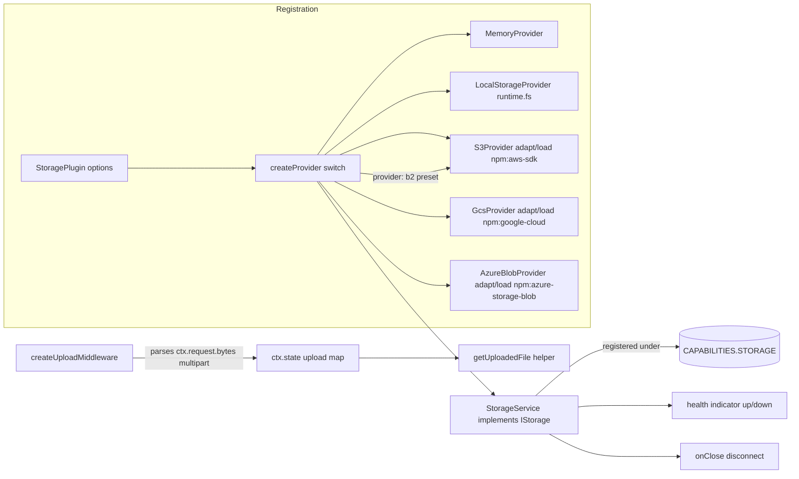

# Milestone 28 — Storage Plugin (`@hono-enterprise/storage-plugin`)

> **Status:** Planning. Branch: `feat/28-storage-plugin`. `main` is protected — all work
> (implementation + fixes) stays on this one branch until it merges via a single PR.

## 0. Objective & scope

Provide the file/object storage capability: a `StoragePlugin` that registers the committed
[`IStorage`](packages/common/src/services/storage.ts:29) contract under
[`CAPABILITIES.STORAGE`](packages/common/src/tokens.ts:79), backed by five pluggable
`StorageProvider` adapters (memory, local-FS, S3, GCS, Azure Blob) — plus `b2` (Backblaze B2) as a
first-class provider type over the S3 adapter — plus a multipart upload middleware. The package
mirrors the proven M25 secrets-plugin shape (internal provider port + inject-or-lazy cloud SDK
seam + structural client facades). **One deliberate, flagged `@hono-enterprise/common` change** —
the `IStorage` interface, `SignedUrlOptions`, and the `STORAGE` token were committed in M1 and are
implemented here; this milestone additionally adds a single **optional** method
`IStorage.getStream?(path): Promise<ReadableStream<Uint8Array>>` (optional ⇒ non-breaking; M27
precedent for shipping a `common` contract change in the plugin's own PR) so large downloads stream
via M42's `IResponse.stream()` instead of buffering the whole object — see §2 C4 and §3.5.

- **In scope:** `StoragePlugin` factory; `StorageService` implementing `IStorage`; `MemoryProvider`
  (zero-dep default), `LocalStorageProvider` (over `runtime.fs`), `S3Provider`, `GcsProvider`, and
  `AzureBlobProvider` (inject-or-lazy cloud SDKs); a first-class `'b2'` (Backblaze B2) provider type
  reusing `S3Provider` over B2's S3-compatible endpoint (no separate class/SDK); structural client
  facades `IAwsS3Client`/`IGcsClient`/`IAzureBlobClient`; a zero-dep multipart parser and an upload
  middleware that exposes parsed files via the per-request `ctx.state` bag plus a typed
  `getUploadedFile()` helper; a `storage` health indicator; full per-file 90% coverage;
  PUBLIC_API.md/ROADMAP.md/ARCHITECTURE.md doc updates (including the conflict corrections in §2).
- **NOT this milestone:**
  - **Resilience** (circuit breaker/retry/timeout around `get`/`put`) → owned by **M27**
    (`packages/resilience-plugin`); a storage provider can be wrapped by a resilience-decorated
    provider later, but M28 ships no wrapping.
  - **Streaming _download_ `getStream()`** → **now IN scope** as a single optional `common` addition
    (`IStorage.getStream?`, §2 C4 / §3.5): S3/GCS/Azure stream natively (zero-copy); Memory/Local
    fall back to a buffered single-chunk stream through the service. Handlers pipe it to
    `IResponse.stream()`. Still out of scope: a streaming _upload_/write accessor and a `runtime.fs`
    read-stream seam (Local downloads therefore buffer).
  - **Cloudflare R2 as a first-class provider** → R2 speaks the S3 API; it is reached by configuring
    `S3Provider` with R2's endpoint/credentials. No separate `R2Provider`.
  - **Signed-URL revocation, bucket lifecycle, multipart _upload_ (S3 MPU) protocol, presigned POST
    policies** → out of scope; only presigned GET URLs per the committed `getSignedUrl`.

## 1. Contracts verified from SOURCE (not names)

| Reference                             | Source (file:line)                                                                                | Verified surface / fact                                                                                                                                                                                                                                                                                                                                                                                                                                                                                                             |
| ------------------------------------- | ------------------------------------------------------------------------------------------------- | ----------------------------------------------------------------------------------------------------------------------------------------------------------------------------------------------------------------------------------------------------------------------------------------------------------------------------------------------------------------------------------------------------------------------------------------------------------------------------------------------------------------------------------- |
| `IStorage`                            | `packages/common/src/services/storage.ts:29`                                                      | Exactly 5 methods: `put(path, data: Uint8Array): Promise<void>`, `get(path): Promise<Uint8Array>` (**throws** if absent), `delete(path): Promise<boolean>`, `exists(path): Promise<boolean>`, `getSignedUrl(path, options: SignedUrlOptions): Promise<string>`. No `upload`/`middleware` method exists on it. Verified today it has **exactly these 5** and **no `getStream`** — so M28's optional `getStream?` (§2 C4) is a genuine new addition, not a redefinition.                                                              |
| `SignedUrlOptions`                    | `packages/common/src/services/storage.ts:13`                                                      | `{ readonly expiresIn: number }` — single required field.                                                                                                                                                                                                                                                                                                                                                                                                                                                                           |
| `STORAGE` token                       | `packages/common/src/tokens.ts:79`                                                                | `STORAGE: 'storage'`. Lowercase kebab, no colon — passes `createCapabilityToken` grammar.                                                                                                                                                                                                                                                                                                                                                                                                                                           |
| common re-export                      | `packages/common/src/index.ts:162`                                                                | `export type { IStorage, SignedUrlOptions } from './services/storage.ts';` — import the contract from `@hono-enterprise/common`, not redefined.                                                                                                                                                                                                                                                                                                                                                                                     |
| `IRequest`                            | `packages/common/src/http.ts:32`                                                                  | Has `json<T>()`, `text()`, `bytes(): Promise<Uint8Array>` (line 78), `headers`, `method`, `url`. **No `file()` method** — multipart access is not a committed request capability.                                                                                                                                                                                                                                                                                                                                                   |
| `IResponse`                           | `packages/common/src/http.ts:94`                                                                  | `send(body?: Uint8Array)` (line 143) takes **only** a body — no `{ type }` option. `header(name, value)` chains (line 109). `stream(body: ReadableStream<Uint8Array>)` exists (line 169, M42).                                                                                                                                                                                                                                                                                                                                      |
| `IRequestContext.state`               | `packages/common/src/http.ts:207`                                                                 | `readonly state: Map<string, unknown>` — "Request-scoped state for passing data between middleware and handlers." The committed home for parsed upload files (no `IRequest` extension needed).                                                                                                                                                                                                                                                                                                                                      |
| `MiddlewareFunction` / `NextFunction` | `packages/common/src/http.ts:230`                                                                 | `(ctx: IRequestContext, next: NextFunction) => Promise<void>`, `NextFunction = () => Promise<void>`. A middleware may short-circuit by responding without calling `next()`.                                                                                                                                                                                                                                                                                                                                                         |
| `IFileSystem` (for Local)             | `packages/runtime` via `IRuntimeServices.fs?`                                                     | Provides `readFile`/`writeFile`/`stat`/`rm` (ROADMAP M3). `fs` is optional — absent on Cloudflare Workers. `LocalStorageProvider` throws at `connect()` when `ctx.runtime.fs` is undefined.                                                                                                                                                                                                                                                                                                                                         |
| Provider-port precedent               | `packages/secrets-plugin/src/interfaces/index.ts:159`                                             | M25's internal `SecretProvider` port: `connect()`/`disconnect()`/`isReady()` + data methods, **NOT** exported from `src/index.ts`. M28 mirrors this as `StorageProvider`.                                                                                                                                                                                                                                                                                                                                                           |
| `hasMethods` helper                   | `packages/secrets-plugin/src/providers/shape.ts:16`                                               | Reusable structural-shape validator; copied into `storage-plugin/src/providers/shape.ts`.                                                                                                                                                                                                                                                                                                                                                                                                                                           |
| inject-or-lazy seam precedent         | `packages/secrets-plugin/src/providers/aws-kms.ts:61` (`adaptAwsModule`), `:92` (`loadAwsModule`) | Pure `adapt(mod)` + `load()` returning the lazy `import('npm:…')`; the real-import path is guarded in a unit test. M28's S3/GCS/Azure providers follow this exactly. Azure mirrors `packages/secrets-plugin/src/providers/azure-key-vault.ts` (`adaptAzureModule`/`loadAzureModule` at `:67`/`:100`, `validateAzureClient`, `isAzureNotFound`) — verified it lazily imports `npm:@azure/keyvault-secrets@^4` + `npm:@azure/identity@^4`; the storage analogue needs only the single `npm:@azure/storage-blob@^12` (key-based auth). |
| Service precedent                     | `packages/secrets-plugin/src/services/secrets-service.ts:46`                                      | `SecretsService implements ISecretManager` wraps a provider and centralizes the absence→throw conversion in ONE place. `StorageService` mirrors this for `get` (provider returns `Uint8Array \| null`-ish → service throws on absent).                                                                                                                                                                                                                                                                                              |
| Existing stub                         | `packages/storage-plugin/src/index.ts:1`                                                          | Currently `export {};` — a Milestone-0 stub. `packages/storage-plugin/deno.json:1` is the package stub (`name`, `version`, `exports`).                                                                                                                                                                                                                                                                                                                                                                                              |

## 2. Committed-doc conflicts — resolved here, shipped as named doc deliverables

| #  | Conflict                                                                                                                                                                                                                                                                                                                                                                                                                                                | Resolution (picked side)                                                                                                                                                                                                                                                                                                                                                                                                                                                                                                                                                                                                                                                                                                     | Doc deliverable (same PR)                                                                                                                                                                                                                                                                                              |
| -- | ------------------------------------------------------------------------------------------------------------------------------------------------------------------------------------------------------------------------------------------------------------------------------------------------------------------------------------------------------------------------------------------------------------------------------------------------------- | ---------------------------------------------------------------------------------------------------------------------------------------------------------------------------------------------------------------------------------------------------------------------------------------------------------------------------------------------------------------------------------------------------------------------------------------------------------------------------------------------------------------------------------------------------------------------------------------------------------------------------------------------------------------------------------------------------------------------------- | ---------------------------------------------------------------------------------------------------------------------------------------------------------------------------------------------------------------------------------------------------------------------------------------------------------------------- |
| C1 | PUBLIC_API.md (`PUBLIC_API.md:2569-2572`) and ROADMAP.md (`ROADMAP.md:2930-2932`) show the upload surface as `storage.upload({ ... })` (a method on the resolved `IStorage`) and read the file back as `ctx.request.file('file')`. Neither exists on a committed contract: `IStorage` has no `upload`/`middleware` method (`packages/common/src/services/storage.ts:29`), and `IRequest` has no `file()` method (`packages/common/src/http.ts:32`).     | `upload` is a **free exported middleware factory** `createUploadMiddleware(options): MiddlewareFunction` (NOT a method on `IStorage`, which we do not change). Parsed files are exposed through the committed per-request **`ctx.state`** bag (`packages/common/src/http.ts:207`) plus a typed helper **`getUploadedFile(ctx, fieldname)`** returning `UploadedFile \| undefined` — **not** via an `IRequest.file()` extension (extending `IRequest` would be a cross-cutting common+kernel+runtime change that violates one-package-per-milestone and couples a low-level HTTP contract to one plugin's convenience; `ctx.state` is the committed mechanism for middleware→handler data, satisfying interface segregation). | Edit `PUBLIC_API.md` §Storage and `ROADMAP.md` §M28 examples to `middleware: [createUploadMiddleware({ fieldname: 'file', maxSize: … })]` and `const file = getUploadedFile(ctx, 'file');` (after `import { getUploadedFile } from '@hono-enterprise/storage-plugin'`).                                                |
| C2 | PUBLIC_API.md (`PUBLIC_API.md:2583-2586`) download example calls `ctx.response.send(file, { type: 'application/octet-stream' })`. The committed [`IResponse.send`](packages/common/src/http.ts:143) is `send(body?: Uint8Array)` — it takes **only** a body, no options object.                                                                                                                                                                         | The committed `send(body)` signature is authoritative. Set the content type via the chaining `.header(name, value)` (`packages/common/src/http.ts:109`): `ctx.response.header('content-type', 'application/octet-stream').send(file)`. (The kernel already defaults to `application/octet-stream` when a body is sent and no content-type is set — `packages/kernel/src/context/response.ts:52-56` — so the `.header()` call is shown explicitly for clarity.)                                                                                                                                                                                                                                                               | Edit `PUBLIC_API.md` §Storage download example to the `.header('content-type', …).send(file)` form.                                                                                                                                                                                                                    |
| C3 | `IStorage.getSignedUrl` (`packages/common/src/services/storage.ts:66`) must be honored by every provider, but `MemoryProvider` and `LocalStorageProvider` have no real signing capability. An interface method an implementation cannot support must get an explicit, documented, tested behavior — not silence.                                                                                                                                        | `MemoryProvider.getSignedUrl()` returns a deterministic synthetic URL `memory://<encoded-key>?expires=<epoch-seconds>` computed from `runtime.now()` — a documented **test/process affordance** (non-functional off-process, never grants real access). `LocalStorageProvider.getSignedUrl()` **throws** `Error('LocalStorageProvider does not support signed URLs; use the s3, gcs, or azure provider')`. S3/GCS/Azure produce real presigned (SAS for Azure) URLs.                                                                                                                                                                                                                                                         | Document per-provider `getSignedUrl` semantics in `PUBLIC_API.md` §Storage provider table and in the provider JSDoc.                                                                                                                                                                                                   |
| C4 | ROADMAP.md M28 note (`ROADMAP.md:2887-2892`) says large `get()` downloads _should_ stream via `IResponse.stream()` **instead of buffering a whole `Uint8Array`**, but the committed [`IStorage.get`](packages/common/src/services/storage.ts:44) returns a buffered `Uint8Array` and the interface has **no** streaming accessor (verified §1). M42 (`IResponse.stream()`, PR #53) is now shipped, so the note's _should_ is actionable this milestone. | Add ONE **optional** method to the committed contract: `IStorage.getStream?(path): Promise<ReadableStream<Uint8Array>>` (optional ⇒ non-breaking; the only implementer today is this milestone's `StorageService`). Native zero-copy on S3 (`GetObjectCommand` body `transformToWebStream()`) and GCS (`file.createReadStream()` async-iterated into a `ReadableStream`); Memory/Local have no native stream seam, so `StorageService.getStream` **falls back** to wrapping `await this.get(path)` in a one-chunk `ReadableStream` — the accessor always works, buffered where it must be. Absent object rejects, mirroring `get`.                                                                                           | Add the method + JSDoc to `packages/common/src/services/storage.ts`; document it in `PUBLIC_API.md` §Storage (surface table + a streaming-download example `return ctx.response.stream(await storage.getStream(key))`); edit the ROADMAP M28 note to drop the stale "once M42 lands" phrasing (M42 shipped in PR #53). |
| C5 | ROADMAP §M28 "Providers:" list (`ROADMAP.md:2919-2924`) names only `S3Provider`/`GcsProvider`/`LocalStorageProvider`/`MemoryProvider` — no Azure. But M25 (secrets) shipped `AzureKeyVaultProvider`, and Azure Blob does **not** speak the S3 API (unlike R2), so it cannot be reached via `S3Provider` + `endpoint`; omitting it would make storage the only cloud plugin without Azure.                                                               | Add a fifth provider `AzureBlobProvider` behind the same `StorageProvider` seam, mirroring M25's `AzureKeyVaultProvider`. Single lazy package `npm:@azure/storage-blob@^12` (key-based auth ⇒ **no** `@azure/identity`); native `getStream` via `download().readableStreamBody` (Node `Readable`, async-iterated like GCS); real signed URL via `generateBlobSASQueryParameters` + `StorageSharedKeyCredential`. No new capability token (still `CAPABILITIES.STORAGE`), no extra `common` change.                                                                                                                                                                                                                           | Edit `ROADMAP.md` §M28 "Providers:" to add `AzureBlobProvider` (a flagged deviation from the committed four-item list); add the Azure row to the `PUBLIC_API.md` §Storage provider table.                                                                                                                              |
| C6 | ROADMAP §M28 "Providers:" list (`ROADMAP.md:2919-2924`) also omits Backblaze B2; the plan previously treated B2 as reachable only ad-hoc via `S3Provider` + `endpoint` (like R2). The user promoted B2 to first-class. B2 exposes an **S3-compatible** API (no first-party SDK worth adding), so a native `B2Provider` would duplicate `S3Provider` for zero capability gain.                                                                           | Add `'b2'` to `StorageProviderType` as a first-class provider type that **reuses `S3Provider`**: `createProvider('b2', opts)` constructs an `S3Provider` with B2 defaults — endpoint derived as `https://s3.<region>.backblazeb2.com` when `options.endpoint` is omitted; `accessKeyId`/`secretAccessKey` = the B2 keyID/applicationKey. No new class, facade, SDK, or option type; presigned GET + `getStream` come free from the S3 path. R2/MinIO remain endpoint-only presets (not named types) unless promoted later.                                                                                                                                                                                                   | Add `'b2'` to `ROADMAP.md` §M28 "Providers:" and the `PUBLIC_API.md` §Storage provider table (a flagged deviation, same as C5).                                                                                                                                                                                        |

## 3. Design decisions



### 3.1 Internal `StorageProvider` port (not exported)

- **Decision:** A single internal port `StorageProvider` in `src/interfaces/index.ts`, mirroring
  M25's `SecretProvider` (`packages/secrets-plugin/src/interfaces/index.ts:159`). It adds
  `connect(): Promise<void>` / `disconnect(): Promise<void>` / `isReady(): boolean` lifecycle plus
  the five `IStorage` data methods and an **optional**
  `getStream?(path): Promise<ReadableStream<Uint8Array> | null>` (native-stream seam; `null` =
  absent), with `get` returning `Uint8Array | null` (`null` = absent) so the absence→throw
  conversion lives in ONE place (`StorageService`). `StorageProvider` is **NOT** exported from
  `src/index.ts` — the committed public contract is `IStorage`.
- **Why:** Keeps cloud-SDK lifecycle (lazy `connect`) behind the service; the service stays the only
  thing resolved under the token; matches the audited M25 seam exactly.
- **Test home:** `test/unit/storage-service.test.ts` asserts the service converts provider
  `null`→throw on `get` and delegates `put`/`delete`/`exists`/`getSignedUrl`.

### 3.2 Cloud-provider inject-or-lazy seam (S3, GCS, Azure)

- **Decision:** Each cloud provider exposes a **structural client facade** (`IAwsS3Client`,
  `IGcsClient`, `IAzureBlobClient`) in `src/interfaces/index.ts`, a pure
  `adapt<Sdk>Module(mod, options): IFacade` function, and a `load<Sdk>Module(): Promise<SdkModule>`
  that does the real `import('npm:<pkg>@<major>)`. The provider constructor accepts an injected
  facade via `options.client` (validated with `hasMethods`, copied from
  `packages/secrets-plugin/src/providers/shape.ts:16`); if absent it
  `await adapt(await load(), options)` in `connect()`. Real npm specifiers:
  - S3 — `npm:@aws-sdk/client-s3@^3` (`PutObjectCommand`/`GetObjectCommand`/`DeleteObjectCommand`/
    `HeadObjectCommand`) **and** `npm:@aws-sdk/s3-request-presigner@^3` (`getSignedUrl` for
    `GetObjectCommand`). `loadAwsS3Module()` returns
    `{ s3: S3Client-ctor module, presigner:
    presigner module }`.
  - GCS — `npm:@google-cloud/storage@^7` (`Storage` → `bucket().file()`; `file.getSignedUrl` for
    reads).
  - Azure — `npm:@azure/storage-blob@^12` (`BlobServiceClient.fromConnectionString` or
    `new BlobServiceClient(url, StorageSharedKeyCredential)` →
    `getContainerClient().getBlockBlobClient()`; `uploadData`/`download`/`deleteIfExists`/`exists`).
    Key-based auth ⇒ single package, no `@azure/identity`. `loadAzureModule()` returns the one
    `@azure/storage-blob` module.
- **Azure not-found detection (structural, no SDK import):** copy M25's `isAzureNotFound(error)`
  verbatim (`packages/secrets-plugin/src/providers/azure-key-vault.ts:53` — duck-typed
  `(error as { statusCode? }).statusCode === 404`, **not** `instanceof RestError`, so it also works
  on the injected-fake path). `adaptAzureModule` catches it around `download()` for
  `get`/`getStream` (404 → `null` → `StorageService` throws), and a non-404 error **re-throws**.
  `exists` uses the SDK's native `blockBlobClient.exists()` (returns a boolean — off the error path
  entirely), not a 404 catch. Each provider owns its own detector: S3's `NoSuchKey`/`NotFound`,
  GCS's gRPC/ApiError code, and Azure's `statusCode === 404` are **different shapes** — there is no
  shared cross-provider helper.
- **Azure SAS signing precondition (mirrors C3):** a pure helper
  `resolveSharedKeyCredential(options): StorageSharedKeyCredential | null` resolves a signing
  credential from `accountName` + `accountKey` **or** an `AccountKey=`-bearing connection string,
  and returns `null` for account-name-only / bare-SAS-token / managed-identity configs. The provider
  stores `#canSign = credential !== null`; `put`/`get`/`getStream`/`delete`/`exists` never need it,
  so registration does **not** fail — only `getSignedUrl` is gated (see §3.4). User-delegation SAS
  (which would need `@azure/identity`) stays out of scope.
- **Why:** Honors AI_GUIDELINES §12.2 (heavy deps never hard); `adapt` is a pure function
  unit-tested with a fake SDK module (100% of branching logic covered offline); the real `import()`
  is exercised by one guarded test per provider (precedent:
  `packages/secrets-plugin/test/unit/aws-kms.test.ts:137`).
- **Test home:** `test/unit/s3-provider.test.ts` + `test/unit/gcs-provider.test.ts` drive `adapt*`
  with fakes (put→get read-back, delete returns boolean, exists, absent→get semantics, signed URL)
  and each ends with a guarded `it('load<Sdk>Module enters the real import path', …)` that catches a
  resolution failure as `Error` (no network, no side effects).

### 3.3 Upload surface: `ctx.state` + helper, not `IRequest.file()` / `IStorage.upload()`

- **Decision:** `createUploadMiddleware(options): MiddlewareFunction` reads the **already-buffered**
  `ctx.request.bytes()` (`packages/common/src/http.ts:78`) and parses `multipart/form-data` with an
  internal **zero-dependency** parser (`src/multipart/multipart-parser.ts`) that splits on the
  boundary extracted from `ctx.request.headers.get('content-type')`. It enforces `maxSize` (per
  file) and optional `allowedMimeTypes`, then stores `Map<fieldname, UploadedFile>` under the
  constant key `'storage-plugin:uploads'` in **`ctx.state`**. A typed exported helper
  `getUploadedFile(ctx, fieldname): UploadedFile | undefined` reads it back.
  `UploadedFile =
  { readonly name: string; readonly data: Uint8Array; readonly mimeType: string; readonly size: number }`.
  On missing field / oversize / wrong type / malformed body it short-circuits with a **400**
  response (no `next()`) — a mandatory short-circuit test asserts the handler never runs.
- **Why:** Avoids any `IRequest`/`IStorage` contract change (conflict C1); uses the committed
  per-request state bag; multipart parsing is purely a plugin convenience, so it belongs in plugin
  code, not the low-level request contract (interface segregation). The buffered-body assumption is
  exactly what the M28 ROADMAP note calls out (`ROADMAP.md:2887-2892` — the fetch model pre-reads
  the body).
- **Test home:** `test/unit/upload-middleware.test.ts` (parse → stash → read-back; oversize 400;
  missing field 400; short-circuit) and `test/unit/multipart-parser.test.ts` (pure transform with
  literal boundary bytes, HTML-entity-free raw byte assertions).

### 3.4 `getSignedUrl` per provider (honors contract surface honestly)

- **Decision:** S3 → real presigned GET URL via the presigner (`expiresIn` seconds); GCS →
  `file.getSignedUrl({ action: 'read', expires })`; Azure → SAS URL via
  `generateBlobSASQueryParameters({ containerName, blobName, permissions: 'r', expiresOn }, sharedKeyCredential)`
  appended to the blob URL — **gated on `#canSign`** (§3.2): when no shared-key credential is
  resolvable (account-name-only / bare-SAS-token / managed-identity), it throws a specific error
  `Error('AzureBlobProvider.getSignedUrl requires an account key (accountName + accountKey, or a
  connection string containing AccountKey); managed-identity user-delegation SAS is not supported')`
  — the same "unsupported-in-this-config → documented, tested throw" discipline as C3's Local case,
  and the common connection-string path (which embeds `AccountKey`) signs fine. Memory → synthetic
  `memory://…?expires=…` URL (`runtime.now()`-based); Local → documented throw (conflict C3). Every
  provider's `getSignedUrl` returns `Promise<string>` per the contract (Local and unsigned-Azure
  reject the promise — still `Promise<string>`).
- **Why:** A method an implementation cannot support gets an explicit, documented, tested behavior
  rather than silence.
- **Test home:** per-provider tests assert the S3/GCS/Azure facade receives the right presign/SAS
  call; Memory asserts the synthetic-URL shape; Local asserts the throw.

### 3.5 Downloads & streaming (`getStream` + M42)

- **Decision:** Add the optional `IStorage.getStream?(path): Promise<ReadableStream<Uint8Array>>`
  (§2 C4) and implement it on `StorageService` — the type consumers resolve under the token.
  `StorageService.getStream` **delegates** to the internal provider's optional `getStream` when the
  provider implements it (S3/GCS/Azure — native zero-copy; provider `null` → service throws,
  mirroring `get`), and otherwise **falls back** to `new ReadableStream` wrapping
  `await this.get(path)` (Memory/Local — buffered single chunk; `get` already throws on absent). In
  both cases the accessor returns a live stream a handler pipes straight to
  [`IResponse.stream()`](packages/common/src/http.ts:169):
  `return ctx.response.header('content-type', …).stream(await storage.getStream(key))`. The buffered
  `get()`/`send()` path stays for small objects.
- **Native provider streams:** S3 → `GetObjectCommand` response body via the SDK's
  `transformToWebStream()` (already a web `ReadableStream<Uint8Array>`, no `node:` import). GCS →
  `file.createReadStream()` (a Node `Readable`) adapted into a web `ReadableStream` by
  async-iterating the readable inside the source (`for await (const chunk of readable)`) — Node
  readables are async-iterable, so **no `node:stream` import** is needed and the plugin stays
  outside `packages/runtime`. Azure → `download().readableStreamBody` (also a Node `Readable`) via
  the identical async-iteration adapter.
- **Why:** M42 (`IResponse.stream()`, PR #53) is shipped, so the ROADMAP's "stream instead of
  buffering" is real for S3/GCS/Azure now; the optional method is non-breaking; the service-level
  fallback keeps every provider working with no per-provider throw.
- **Test home:** `test/unit/storage-service.test.ts` covers BOTH `getStream` branches —
  provider-delegate (fake provider returns a stream; absent → throw) and buffered-fallback (fake
  provider omits `getStream` → service wraps `get`). Per-provider tests assert S3/GCS/Azure `adapt*`
  build a reading stream over the fake SDK. `test/integration/storage-integration.test.ts`
  round-trips put→getStream→ `IResponse.stream()` through `app.inject()` and asserts the streamed
  body bytes equal input (in addition to the buffered put→get→send round-trip).

### 3.6 Default provider + plugin options

- **Decision:** `provider` defaults to `'memory'` (zero-dep, every runtime incl. Cloudflare Workers
  — mirrors M25's `'env'` default and M26's `'memory'` default). Options shape mirrors
  `SecretsPluginOptions`:
  `StoragePluginOptions { provider?: StorageProviderType; options?:
  StorageProviderOptions }`.
  `StorageProviderOptions` is a union-consumed bag: `bucket`/`region`/
  `accessKeyId`/`secretAccessKey`/`endpoint?` (S3; `endpoint` enables R2/MinIO/B2), `projectId`
  (GCS), `rootDir` (local), `connectionString`/`accountName`/`accountKey`/`containerName` (Azure
  Blob), `client?: IAwsS3Client | IGcsClient | IAzureBlobClient` (injected facade union, each
  provider probes the shape it needs — precedent
  `packages/secrets-plugin/src/plugin/secrets-plugin.ts:177`).
  `StorageProviderType = 'memory' | 'local' | 's3' | 'gcs' | 'azure' | 'b2'`;
  `createProvider('b2', opts)` is a first-class preset that constructs `S3Provider` with B2 defaults
  (endpoint `https://s3.<region>.backblazeb2.com` when `options.endpoint` is omitted; creds are the
  B2 keyID/applicationKey) — no separate class or SDK (§2 C6).
- **Why:** Consistent with committed sibling plugins; `endpoint` makes R2/MinIO reachable via the S3
  API without a separate provider (closes the "R2 out of scope" gap cheaply); B2 is promoted one
  step further to a named `'b2'` type over the same adapter (§2 C6), while R2/MinIO stay
  endpoint-only presets.
- **Test home:** `test/unit/storage-plugin.test.ts` (default→memory; unknown provider throws; each
  provider wired; health `up`/`down`; `onClose` disconnect invoked).

## 4. Exported surface — every symbol names its consumer

| Exported symbol                                         | Kind                                     | Consumer / real code path that READS it                                                                                                                                                                                                      |
| ------------------------------------------------------- | ---------------------------------------- | -------------------------------------------------------------------------------------------------------------------------------------------------------------------------------------------------------------------------------------------- |
| `StoragePlugin`                                         | factory (`IPlugin`)                      | `app.register(StoragePlugin({…}))` → registers `StorageService` under `CAPABILITIES.STORAGE`; health indicator; `onClose`.                                                                                                                   |
| `StorageService`                                        | class (`implements IStorage`)            | Constructed by `StoragePlugin`; resolved by `ctx.services.get<IStorage>(CAPABILITIES.STORAGE)`.                                                                                                                                              |
| `MemoryProvider`                                        | class (`StorageProvider`)                | `createProvider('memory', …)` default path; direct construction in tests/docs.                                                                                                                                                               |
| `LocalStorageProvider`                                  | class (`StorageProvider`)                | `createProvider('local', …)`; uses `runtime.fs`.                                                                                                                                                                                             |
| `S3Provider`                                            | class (`StorageProvider`)                | `createProvider('s3', …)`.                                                                                                                                                                                                                   |
| `GcsProvider`                                           | class (`StorageProvider`)                | `createProvider('gcs', …)`.                                                                                                                                                                                                                  |
| `AzureBlobProvider`                                     | class (`StorageProvider`)                | `createProvider('azure', …)`.                                                                                                                                                                                                                |
| `createUploadMiddleware`                                | factory (`MiddlewareFunction`)           | Route `middleware: [createUploadMiddleware({…})]`; writes `ctx.state` upload map.                                                                                                                                                            |
| `getUploadedFile`                                       | fn (`UploadedFile \| undefined`)         | Route handler reads `const file = getUploadedFile(ctx, 'file')`.                                                                                                                                                                             |
| `UploadedFile`                                          | type                                     | Return type of `getUploadedFile`; handler reads `.name`/`.data`/`.mimeType`/`.size`.                                                                                                                                                         |
| `IAwsS3Client`                                          | interface (structural facade)            | Injected via `options.client`; validated by `hasMethods`; alternative to the lazy `@aws-sdk/client-s3` import.                                                                                                                               |
| `IGcsClient`                                            | interface (structural facade)            | Injected via `options.client`; alternative to the lazy `@google-cloud/storage` import.                                                                                                                                                       |
| `IAzureBlobClient`                                      | interface (structural facade)            | Injected via `options.client`; validated by `hasMethods`; alternative to the lazy `@azure/storage-blob` import.                                                                                                                              |
| `StoragePluginOptions`                                  | type                                     | Argument of `StoragePlugin(options)`.                                                                                                                                                                                                        |
| `StorageProviderType`                                   | type union                               | Discriminant in `createProvider`; narrows the options bag. Includes `'b2'` (Backblaze), which reuses `S3Provider` — no separate class (§2 C6).                                                                                               |
| `StorageProviderOptions`                                | type                                     | `StoragePluginOptions.options`.                                                                                                                                                                                                              |
| `{Memory,LocalStorage,S3,Gcs,AzureBlob}ProviderOptions` | types                                    | Constructor args of each provider (direct construction).                                                                                                                                                                                     |
| `UploadMiddlewareOptions`                               | type                                     | Argument of `createUploadMiddleware`.                                                                                                                                                                                                        |
| `IStorage`, `SignedUrlOptions`                          | re-export from `@hono-enterprise/common` | Consumers import the contract from the plugin barrel or from common. `IStorage` now carries the optional `getStream?` added in §2 C4 (implemented by `StorageService`; handlers call `storage.getStream(key)` → `ctx.response.stream(...)`). |

> **Not exported** (internal seams, like M25's `SecretProvider`): `StorageProvider` port,
> `adaptAwsS3Module`/`loadAwsS3Module`/`adaptGcsModule`/`loadGcsModule`/`adaptAzureModule`/`loadAzureModule`,
> the `*SdkModule` shapes, `hasMethods`, and the multipart parser. The pure `adapt`/`load` functions
> and the parser are still unit-tested directly via relative import (precedent: `aws-kms.test.ts`
> imports them).

### 4.1 Options — every option names its consumer

| Option                                                    | Consumer                                       | Behavior (per implementation)                                                                                                                                                          |
| --------------------------------------------------------- | ---------------------------------------------- | -------------------------------------------------------------------------------------------------------------------------------------------------------------------------------------- |
| `provider` (default `'memory'`)                           | `createProvider` switch                        | Selects the backend; unknown value throws at registration.                                                                                                                             |
| `options.bucket`                                          | `S3Provider`                                   | S3 bucket name for put/get/delete/head/presign.                                                                                                                                        |
| `options.region`                                          | `S3Provider` (lazy client config)              | AWS region.                                                                                                                                                                            |
| `options.accessKeyId` / `secretAccessKey`                 | `S3Provider`                                   | Static creds for the lazy client; omitted → SDK default credential chain.                                                                                                              |
| `options.endpoint`                                        | `S3Provider`                                   | Custom S3 endpoint (R2/MinIO); omitted → AWS default.                                                                                                                                  |
| `provider: 'b2'` (Backblaze)                              | `createProvider` → `S3Provider`                | First-class S3-compatible preset; derives endpoint `https://s3.<region>.backblazeb2.com` when `options.endpoint` is omitted; reuses `bucket`/`region`/`accessKeyId`/`secretAccessKey`. |
| `options.projectId`                                       | `GcsProvider`                                  | GCP project for bucket/file paths.                                                                                                                                                     |
| `options.connectionString` / `accountName` / `accountKey` | `AzureBlobProvider`                            | Azure auth: connection string, or account name + key (`StorageSharedKeyCredential`); the key is required for SAS `getSignedUrl`.                                                       |
| `options.containerName`                                   | `AzureBlobProvider`                            | Azure Blob container for put/get/delete/exists/stream/SAS.                                                                                                                             |
| `options.rootDir`                                         | `LocalStorageProvider`                         | Filesystem root; paths are contained (no `..` escape) via join+normalize.                                                                                                              |
| `options.client` (union facade)                           | `S3Provider`/`GcsProvider`/`AzureBlobProvider` | Injected facade bypasses the lazy import; validated by `hasMethods`.                                                                                                                   |
| `options.cacheTtl`                                        | NOT added                                      | Storage has no read-cache contract on `IStorage`; cut (dead option) — unlike secrets, `IStorage.get` has no cache affordance.                                                          |
| `upload.fieldname` (default `'file'`)                     | `createUploadMiddleware`                       | multipart part name to extract.                                                                                                                                                        |
| `upload.maxSize` (default `10 * 1024 * 1024`)             | `createUploadMiddleware`                       | Per-file byte cap; oversize → 400 short-circuit.                                                                                                                                       |
| `upload.allowedMimeTypes?`                                | `createUploadMiddleware`                       | Optional allow-list; mismatch → 400 short-circuit.                                                                                                                                     |
| `upload.maxFiles?`                                        | `createUploadMiddleware`                       | Optional cap on parsed parts; excess → 400 short-circuit.                                                                                                                              |

## 5. Implementation files

| File                                      | Purpose                                                                                                                                                                                                                                                                 |
| ----------------------------------------- | ----------------------------------------------------------------------------------------------------------------------------------------------------------------------------------------------------------------------------------------------------------------------- |
| `packages/common/src/services/storage.ts` | **The one committed-contract edit (§2 C4):** add the optional `getStream?(path): Promise<ReadableStream<Uint8Array>>` method + JSDoc to `IStorage`. Interface-only (no executable lines → no coverage); the re-export is asserted by `barrel-exports.test.ts`.          |
| `src/index.ts`                            | Barrel: factory, service, providers, middleware/helper, option + facade types, re-export `IStorage`/`SignedUrlOptions`. Replaces the M0 stub.                                                                                                                           |
| `src/interfaces/index.ts`                 | `StorageProviderType`, `StorageProviderOptions`, `StoragePluginOptions`, per-provider option types, `IAwsS3Client`/`IGcsClient` facades, `UploadedFile`/`UploadMiddlewareOptions`, internal `StorageProvider` port.                                                     |
| `src/providers/shape.ts`                  | `hasMethods` structural validator (copied from M25).                                                                                                                                                                                                                    |
| `src/services/storage-service.ts`         | `StorageService implements IStorage`; delegates to `StorageProvider`; centralizes absent→throw on `get`; implements `getStream` (delegate to provider `getStream`, else buffered-fallback via `get`); passes `expiresIn` to `getSignedUrl`.                             |
| `src/providers/memory-provider.ts`        | In-memory `Map<string, Uint8Array>`; zero-dep; synthetic `memory://` signed URL; no native `getStream` (service buffered-fallback).                                                                                                                                     |
| `src/providers/local-provider.ts`         | Over `runtime.fs` (readFile/writeFile/stat/rm); path containment; signed-URL throw; no native `getStream` (no `runtime.fs` read-stream seam → service buffered-fallback).                                                                                               |
| `src/providers/s3-provider.ts`            | `adaptAwsS3Module`/`loadAwsS3Module`/`S3Provider`; presigned GET via `@aws-sdk/s3-request-presigner`; native `getStream` via `GetObjectCommand` body `transformToWebStream()`.                                                                                          |
| `src/providers/gcs-provider.ts`           | `adaptGcsModule`/`loadGcsModule`/`GcsProvider`; `file.getSignedUrl`; native `getStream` via `file.createReadStream()` async-iterated into a `ReadableStream`.                                                                                                           |
| `src/providers/azure-provider.ts`         | `adaptAzureModule`/`loadAzureModule`/`AzureBlobProvider`; `@azure/storage-blob` block-blob ops (uploadData/download/deleteIfExists/exists); native `getStream` via `download().readableStreamBody` async-iterated; SAS signed URL via `generateBlobSASQueryParameters`. |
| `src/multipart/multipart-parser.ts`       | Zero-dep `parseMultipart(body: Uint8Array, contentType: string): ParsedPart[]` (boundary extraction + part/name/mime split).                                                                                                                                            |
| `src/middleware/upload-middleware.ts`     | `createUploadMiddleware(options)`, `getUploadedFile(ctx, fieldname)`, `UploadedFile`, `ctx.state` key constant.                                                                                                                                                         |
| `src/plugin/storage-plugin.ts`            | `StoragePlugin(options)` factory; `createProvider` switch (incl. `'b2'`→`S3Provider` preset with derived B2 endpoint, §2 C6); async `register` (connect provider, register `StorageService`, health indicator, `onClose` disconnect).                                   |
| `packages/storage-plugin/deno.json`       | (Existing stub) keep `exports: { ".": "./src/index.ts" }`; version `0.1.0`. No new hard deps — cloud SDKs are lazy `npm:` imports only.                                                                                                                                 |

## 6. Test plan (every `src/` file mapped; per-file 90% bar)

| Test file                                      | src covered                           | Key assertions (and the signature each call type-checks against)                                                                                                                                                                                                                                                                                                                                                                                                                                                                                                                                                                                                                                                      |
| ---------------------------------------------- | ------------------------------------- | --------------------------------------------------------------------------------------------------------------------------------------------------------------------------------------------------------------------------------------------------------------------------------------------------------------------------------------------------------------------------------------------------------------------------------------------------------------------------------------------------------------------------------------------------------------------------------------------------------------------------------------------------------------------------------------------------------------------- |
| `test/unit/barrel-exports.test.ts`             | `src/index.ts`                        | Every public symbol is exported; `IStorage`/`SignedUrlOptions` re-export present.                                                                                                                                                                                                                                                                                                                                                                                                                                                                                                                                                                                                                                     |
| `test/unit/shape.test.ts`                      | `src/providers/shape.ts`              | `hasMethods` accepts valid shape, rejects null/missing/partial.                                                                                                                                                                                                                                                                                                                                                                                                                                                                                                                                                                                                                                                       |
| `test/unit/storage-service.test.ts`            | `src/services/storage-service.ts`     | Delegates put/get/delete/exists/getSignedUrl to a fake provider; **absent get → throws** (`Promise<Uint8Array>`); passes `expiresIn` through; **`getStream` both branches** — provider-delegate (fake provider returns a stream; provider `null` → throws) AND buffered-fallback (fake provider omits `getStream` → service wraps `get`, absent → throws).                                                                                                                                                                                                                                                                                                                                                            |
| `test/unit/memory-provider.test.ts`            | `src/providers/memory-provider.ts`    | put→get read-back; delete returns `true`/`false`; exists; getSignedUrl returns `memory://…?expires=…`; not-connected rejects.                                                                                                                                                                                                                                                                                                                                                                                                                                                                                                                                                                                         |
| `test/unit/local-provider.test.ts`             | `src/providers/local-provider.ts`     | Round-trip over a fake `IFileSystem`; path-containment (no `..` escape); signed URL **throws**; missing-file get throws; `connect` throws when `runtime.fs` absent.                                                                                                                                                                                                                                                                                                                                                                                                                                                                                                                                                   |
| `test/unit/s3-provider.test.ts`                | `src/providers/s3-provider.ts`        | `validateAwsS3Client` shape; `adaptAwsS3Module` over a fake SDK module (put→get read-back, delete bool, exists, absent, presign call args, `ResourceNotFoundException`→absent, **`getStream` reads via `transformToWebStream()`, missing→`null`**); not-connected rejects; **guarded real-import** `loadAwsS3Module()` resolves or rejects as `Error`.                                                                                                                                                                                                                                                                                                                                                                |
| `test/unit/gcs-provider.test.ts`               | `src/providers/gcs-provider.ts`       | `validateGcsClient`; `adaptGcsModule` over a fake Storage (save/download/delete/exists/getSignedUrl, **`getStream` async-iterates a fake `createReadStream()`, missing→`null`**); gRPC NOT_FOUND→absent; not-connected rejects; **guarded real-import** `loadGcsModule()`.                                                                                                                                                                                                                                                                                                                                                                                                                                            |
| `test/unit/azure-provider.test.ts`             | `src/providers/azure-provider.ts`     | `validateAzureBlobClient`; `resolveSharedKeyCredential` — signs for `{accountName, accountKey}` AND for an `AccountKey=` connection string, returns `null` for account-name-only; `isAzureNotFound` (structural `statusCode === 404`); `adaptAzureModule` over a fake `@azure/storage-blob` where `download()` **rejects with `{ statusCode: 404 }`** → `get`/`getStream` return `null` (→ service throws), a **non-404 error propagates** (not swallowed), `exists` uses native `blockBlobClient.exists()` boolean, `getStream` async-iterates a fake `readableStreamBody`; **`getSignedUrl` throws when `#canSign` is false**, signs when true; not-connected rejects; **guarded real-import** `loadAzureModule()`. |
| `test/unit/multipart-parser.test.ts`           | `src/multipart/multipart-parser.ts`   | Pure transform: known boundary → `ParsedPart[]` with correct name/mime/bytes (raw byte assertions); missing-boundary throws; empty body.                                                                                                                                                                                                                                                                                                                                                                                                                                                                                                                                                                              |
| `test/unit/upload-middleware.test.ts`          | `src/middleware/upload-middleware.ts` | Parses bytes → `ctx.state` → `getUploadedFile` read-back; oversize → **400 short-circuit, `next()` NOT called, handler cannot overwrite**; missing field → 400; allowedMime mismatch → 400.                                                                                                                                                                                                                                                                                                                                                                                                                                                                                                                           |
| `test/unit/storage-plugin.test.ts`             | `src/plugin/storage-plugin.ts`        | Default `provider` = `'memory'`; unknown provider throws; each backend wired via `createProvider`; **`'b2'` builds an `S3Provider` with endpoint `https://s3.<region>.backblazeb2.com`, and honors an explicit `options.endpoint` override**; registers `IStorage` under `CAPABILITIES.STORAGE`; health `up` after connect / `down` before; `onClose` disconnect invoked (drives the fake context fixture).                                                                                                                                                                                                                                                                                                           |
| `test/integration/storage-integration.test.ts` | cross-file                            | Real kernel `app.inject()` round-trips: (a) POST `/upload` (multipart via middleware) → `storage.put` → GET `/files/:key` → `storage.get` → `ctx.response.header('content-type', …).send(bytes)`; (b) GET `/stream/:key` → `ctx.response.stream(await storage.getStream(key))` (memory buffered-fallback path); both assert response bytes equal input.                                                                                                                                                                                                                                                                                                                                                               |
| `test/fixtures/fake-context.ts`                | —                                     | Fake `IPluginContext` (services/health/lifecycle/middleware) + fake `IRuntimeServices` (`env`, `hrtime`, optional `fs`), mirroring `packages/secrets-plugin/test/fixtures/fake-context.ts`. Excluded from coverage.                                                                                                                                                                                                                                                                                                                                                                                                                                                                                                   |

> External-dep coverage rule honored: S3/GCS/Azure branching logic is fully exercised through the
> pure `adapt*` functions + fake SDK modules; each adds one guarded REAL-import test
> (`it('load…Module enters the real import path')`, precedent `aws-kms.test.ts:137`). No test
> contacts a real cloud bucket.

## 7. Verification gates

```bash
git branch --show-current   # MUST be feat/28-storage-plugin, never main
deno task check:plan        # this plan lints clean
deno task fmt:check
deno task lint
deno task check
deno task test
deno task test:coverage     # read ANSI-stripped per-file table; ≥90% branch/function/line every src file
```

Grep gate (must be empty) before reporting done:
`grep -rn "new Function\|eval(\| require(\|as any\|@ts-ignore\|Date.now()\|globalThis.__" packages/storage-plugin/src`

## 8. Risks & mitigations

- **Risk:** Zero-dep multipart parser is subtle (CRLF boundaries, preamble, last-boundary). →
  **Mitigation:** implement against RFC 7578 with explicit unit tests for boundary extraction,
  trailing CRLF, empty body, and a part whose value contains the boundary substring; assert raw
  bytes.
- **Risk:** S3 presigning needs a **second** lazy package (`s3-request-presigner`), doubling the
  lazy-load surface. → **Mitigation:** `loadAwsS3Module()` returns both modules in one dynamic
  import pair; one guarded real-import test asserts both constructors resolve; `adapt` is pure and
  fully fake-tested.
- **Risk:** `exactOptionalPropertyTypes` — assigning `undefined` to optional option fields. →
  **Mitigation:** mirror M25's `buildAwsConfig` pattern (only set fields when defined) in each
  provider.
- **Risk:** Reviewers expect `ctx.request.file()` / `storage.upload()` from PUBLIC_API. →
  **Mitigation:** conflict C1 is resolved and the PUBLIC_API/ROADMAP edits are a named PR
  deliverable; the plan spells out the `ctx.state` + `getUploadedFile` replacement.
- **Risk:** `IStorage.get` buffers large objects (memory blowup on big downloads). → **Mitigation:**
  `getStream` (§2 C4 / §3.5) gives S3/GCS/Azure a true zero-copy download piped to
  `IResponse.stream()`; Memory/Local still buffer (documented — Local has no `runtime.fs`
  read-stream seam yet).
- **Risk:** GCS `createReadStream()` and Azure `download().readableStreamBody` return a Node
  `Readable`, and `packages/storage-plugin` must not import `node:stream` (a runtime-only concern).
  → **Mitigation:** adapt via async iteration (`for await (const chunk of readable)`) inside a web
  `ReadableStream` source — Node readables are async-iterable, so no `node:` import; unit-tested
  with a fake async-iterable stand-in.
- **Risk:** Azure SAS needs a shared-key credential; an `accountName`-only / managed-identity config
  cannot sign. → **Mitigation:** a pure `resolveSharedKeyCredential` sets `#canSign`; `getSignedUrl`
  throws a specific error only in that config (mirrors C3), while put/get/delete/exists/stream still
  work — registration never fails. Both branches unit-tested offline; user-delegation SAS
  (`@azure/identity`) stays out of scope.
- **Risk:** Azure signals missing blobs with a `RestError` (`statusCode: 404`) — a **different**
  shape from S3 (`NoSuchKey`/`NotFound`) and GCS (gRPC/ApiError code); a fake that rejects with a
  generic `Error` would hide a broken detector. → **Mitigation:** copy M25's structural
  `isAzureNotFound`; the fake module's `download()` rejects with `{ statusCode: 404 }` (test-double
  honors the real shape), with an explicit assertion that a non-404 error propagates; `exists` uses
  the SDK's native boolean `exists()`.
- **Risk:** Adding `getStream?` to the M1-committed `IStorage` is a `common` contract edit. →
  **Mitigation:** it is **optional** (non-breaking — no existing consumer or implementer relies on
  it; the sole implementer is this milestone's `StorageService`), shipped in this PR with the
  PUBLIC_API.md + ROADMAP note edits (M27 precedent for a plugin milestone that also touches
  `common`).

## 9. Out of scope

- Resilience wrapping of storage calls → **M27** (`packages/resilience-plugin`).
- Streaming _download_ `IStorage.getStream()` is **now IN scope** (§2 C4 / §3.5): optional method,
  native zero-copy on S3/GCS/Azure, buffered-fallback on Memory/Local. Still deferred: a streaming
  _upload_/write accessor and a `runtime.fs` read-stream seam for zero-copy Local downloads.
- Cloudflare R2 / MinIO as distinct **named** provider types → reached via `S3Provider` +
  `options.endpoint` (endpoint-only presets; not promoted to named types this milestone).
- S3 multipart-upload (MPU) protocol, presigned POST policies, bucket lifecycle/replication config,
  signed-URL revocation → out of scope; only presigned GET URLs per `getSignedUrl`.
- **Azure Blob** (§2 C5 / `AzureBlobProvider`) **and Backblaze B2** (§2 C6, first-class `'b2'` type
  over `S3Provider`) are both IN scope. Still deferred behind the same seam: a native (non-S3) B2
  API provider (no capability gain over the S3-compatible path), and other S3-compatible targets as
  named types.
