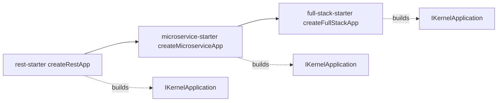

# Milestone 36 — Starters (`@hono-enterprise/{rest,microservice,full-stack}-starter`)

> **Status:** Planning. Branch: `feat/m36-starters`. `main` is protected — all work
> (implementation + fixes) stays on this one branch until it merges via a single PR.

## 0. Objective & scope

Turn the three Milestone-0 starter stubs (`rest-starter`, `microservice-starter`,
`full-stack-starter`, each a bare `export {}`) into **opinionated composition libraries**: each
exports a single `createXxxApp(options?)` factory that pre-registers a curated plugin set with
sensible defaults and returns a fully wired `IKernelApplication` the caller extends with routes and
then starts. The starters are thin application-composition packages — they own no capability, add no
npm dependency, and define no new `common` contract; they exist so an author can write one line
instead of importing and ordering twenty plugins. The canonical plugin composition is borrowed from
the M34b CLI templates (`packages/cli/src/templates/rest.ts`, `microservice.ts`), which already
encode the curated REST and microservice sets as inline wiring — the starters are the reusable
library form of that same wiring.

- **In scope:**
  - `createRestApp(options?)` / `RestStarterOptions` in `@hono-enterprise/rest-starter`.
  - `createMicroserviceApp(options?)` / `MicroserviceStarterOptions` in
    `@hono-enterprise/microservice-starter`, composed from the REST set.
  - `createFullStackApp(options?)` / `FullStackStarterOptions` in
    `@hono-enterprise/full-stack-starter`, composed from the microservice set.
  - A shared per-tier `buildXxxPlugins(options)` builder exported so the next tier composes from it
    (no duplicated plugin lists, mirroring how the CLI templates compose `REST_PLUGINS`).
  - A typed options object per starter: per-plugin optional sub-objects threaded straight through to
    each plugin factory in its real, source-verified option shape.
  - The `errorHandler()` middleware from `@hono-enterprise/exceptions` added by every starter at
    `{ priority: 0, name: 'error-handler' }` (the kernel ships zero error formatting; `exceptions`
    ships a `MiddlewareFunction`, not a plugin; the explicit priority is required for it to be
    outermost — C7/§3.5).
  - Moving all three starters from `UNPUBLISHED_PACKAGES` to `PUBLISHED_PACKAGES` (new ordered
    Tier 6) in `scripts/release-packages.ts`, and the public-API / README / ROADMAP / CLAUDE.md
    status flips shipped in the same PR.
  - A per-starter README and the public-API reference for the three factories + option types.
- **NOT this milestone:**
  - The **full-stack standard React Router app structure** (the `feature → service → lib → model`
    layering, `flatRoutes` `_app`/`_auth` groups, `~/*` alias, per-feature Zod schemas) that
    `ROADMAP.md:3786-3788` attaches to M36. That skeleton adapts the external `B2BAdmin` project
    (outside this workspace) and is a distinct, large app-shape concern from the starter library. It
    is scoped to **M36b** (C6), the same phasing the repo uses for M14→M14b, M15→M15b, M34→M34b.
    `createFullStackApp` still bundles `ReactRouterPlugin` as an optional arm.
  - **Config-key indirection** — the `urlFromConfig` / `secretFromConfig` / `endpointFromConfig`
    shorthand in the committed PUBLIC_API examples. No plugin option type carries those fields (§2
    C2); implementing a register-time config resolver is a real feature needing its own design,
    deferred here. Starters pass resolved values directly.
  - **Example applications** (`apps/*`) — Milestone 37.
  - **A `honoe new --starter` CLI path** backed by these libraries. The CLI keeps emitting inline
    wiring (M34b); a future flag may consume the starters, but that integration is out of scope.
  - **Docker / Kubernetes / Workers deploy manifests** — Milestone 39. The starters are libraries,
    not deployments.

## 1. Contracts verified from SOURCE (not names)

| Reference                                                           | Source (file:line)                                                                                                                                                                                                                                                                                                                                                                                                                     | Verified surface / fact                                                                                                                                                                                                                                                                                                                                                                                                                                                                                                                                                                                                                                                                                                                                                                                    |
| ------------------------------------------------------------------- | -------------------------------------------------------------------------------------------------------------------------------------------------------------------------------------------------------------------------------------------------------------------------------------------------------------------------------------------------------------------------------------------------------------------------------------- | ---------------------------------------------------------------------------------------------------------------------------------------------------------------------------------------------------------------------------------------------------------------------------------------------------------------------------------------------------------------------------------------------------------------------------------------------------------------------------------------------------------------------------------------------------------------------------------------------------------------------------------------------------------------------------------------------------------------------------------------------------------------------------------------------------------- |
| Starter stubs (current surface)                                     | `packages/starters/rest-starter/src/index.ts:1-10`; `packages/starters/microservice-starter/src/index.ts:1-10`; `packages/starters/full-stack-starter/src/index.ts:1-10`                                                                                                                                                                                                                                                               | Each is an M0 stub containing only `export {}`; nothing to preserve.                                                                                                                                                                                                                                                                                                                                                                                                                                                                                                                                                                                                                                                                                                                                       |
| Starter manifests                                                   | `packages/starters/rest-starter/deno.json:1-6`; (microservice/full-stack identical)                                                                                                                                                                                                                                                                                                                                                    | Named `@hono-enterprise/<name>-starter`, versioned `0.1.0-alpha.3`, export `./src/index.ts`, NO `imports` map yet.                                                                                                                                                                                                                                                                                                                                                                                                                                                                                                                                                                                                                                                                                         |
| Application factory                                                 | `packages/kernel/src/application/application.ts:737`                                                                                                                                                                                                                                                                                                                                                                                   | `createApplication(options?: ApplicationOptions): IKernelApplication` — synchronous, returns the kernel application.                                                                                                                                                                                                                                                                                                                                                                                                                                                                                                                                                                                                                                                                                       |
| Application options                                                 | `packages/kernel/src/application/application.ts:42-45`                                                                                                                                                                                                                                                                                                                                                                                 | `ApplicationOptions = { plugins?: IPlugin[] }` — exactly one field; the starter populates `plugins`.                                                                                                                                                                                                                                                                                                                                                                                                                                                                                                                                                                                                                                                                                                       |
| Kernel application surface                                          | `packages/kernel/src/application/application.ts:88-97` (`inject`), `:140` (`start`), `:338` (`stop`), `:387` (`fetch`), `:398` (`inject` body); barrel `packages/kernel/src/index.ts:11-18`                                                                                                                                                                                                                                            | `IKernelApplication extends IApplication` exposes `services`, `middleware`, `router`, `register`, `start`, `stop`, `fetch`, `inject`. The starter returns this type so callers get routing + inject + Workers `fetch`.                                                                                                                                                                                                                                                                                                                                                                                                                                                                                                                                                                                     |
| Committed `StartOptions` / `IApplication`                           | `packages/common/src/plugin.ts:373-409`                                                                                                                                                                                                                                                                                                                                                                                                | `StartOptions` carries `port?` / `hostname?`; `start(options?)` is the listen entry. The starter does NOT call `start`; the caller does, so `port` belongs to `app.start`, not to the starter options.                                                                                                                                                                                                                                                                                                                                                                                                                                                                                                                                                                                                     |
| CLI REST plugin set (canonical composition)                         | `packages/cli/src/templates/rest.ts:16-39`                                                                                                                                                                                                                                                                                                                                                                                             | `REST_PLUGINS` = Runtime, Config, Logger, Validation, HttpSecurity, Health, Metrics, OpenApi, Decorator; `REST_MIDDLEWARE` = `errorHandler`. The template's comment (`:45-48`) states `database-plugin` and `auth-plugin` are deliberately omitted because both need credentials to be useful — every listed plugin constructs with no configuration.                                                                                                                                                                                                                                                                                                                                                                                                                                                      |
| CLI microservice set                                                | `packages/cli/src/templates/microservice.ts:21-36`                                                                                                                                                                                                                                                                                                                                                                                     | `microservice` = `REST_PLUGINS` spread + Messaging, Queue, Resilience, Telemetry; refused on `cloudflare-workers` because messaging/queue need raw sockets.                                                                                                                                                                                                                                                                                                                                                                                                                                                                                                                                                                                                                                                |
| `DatabasePluginOptions` (memory default)                            | `packages/database-plugin/src/interfaces/index.ts:188-214`                                                                                                                                                                                                                                                                                                                                                                             | `type?: 'prisma' \| 'drizzle' \| 'memory'` **defaults to `'memory'`**; connection URL lives at `options.url` (`:213,221-227`). No `urlFromConfig` field exists. `DatabasePlugin()` with no args constructs against the memory adapter.                                                                                                                                                                                                                                                                                                                                                                                                                                                                                                                                                                     |
| `AuthPluginOptions` (config REQUIRED)                               | `packages/auth-plugin/src/interfaces/index.ts:66-75`; `JwtOptions :14-31`                                                                                                                                                                                                                                                                                                                                                              | `jwt: JwtOptions` and `rbac: RbacConfig` are REQUIRED (no `?`). `AuthPlugin()` with no args does NOT construct. `JwtOptions` carries `secret?`/`privateKey?`/`publicKey?`/`algorithm?` — no `secretFromConfig` or `expiresIn` field exists.                                                                                                                                                                                                                                                                                                                                                                                                                                                                                                                                                                |
| `MessagingPluginOptions`                                            | `packages/messaging-plugin/src/index.ts:71-79`; interfaces `:94-95`                                                                                                                                                                                                                                                                                                                                                                    | `broker?` selects memory/redis-streams/rabbitmq/nats/kafka; memory is the default backend. Constructible with no args.                                                                                                                                                                                                                                                                                                                                                                                                                                                                                                                                                                                                                                                                                     |
| `QueuePluginOptions` (memory default)                               | `packages/queue-plugin/src/index.ts:21-26`; interfaces `:137-138`                                                                                                                                                                                                                                                                                                                                                                      | `adapter?` defaults to `'memory'`. Constructible with no args.                                                                                                                                                                                                                                                                                                                                                                                                                                                                                                                                                                                                                                                                                                                                             |
| Full-stack plugin defaults (zero-dependency)                        | `packages/cache-plugin/src/interfaces/index.ts:45-46` (`'memory'`); `packages/storage-plugin/src/interfaces/index.ts:29-30` (`'memory'`); `packages/mail-plugin/src/interfaces/index.ts:143-144` (`'log'`); `packages/secrets-plugin/src/interfaces/index.ts:146-147` (`'env'`); `packages/audit-plugin/src/interfaces/index.ts:107-108` (`'memory'`); `packages/telemetry-plugin/src/interfaces/index.ts:98-99` (no exporter → no-op) | Cache, Storage, Mail, Secrets, Audit, and Telemetry all construct against a zero-dependency default with no options. Events, CQRS, Scheduler likewise default-construct (behaviors/async/cron optional).                                                                                                                                                                                                                                                                                                                                                                                                                                                                                                                                                                                                   |
| Full-stack plugins that REQUIRE config                              | `packages/multi-tenancy-plugin/src/interfaces/index.ts:90-91` (resolvers required); `packages/react-router-plugin/src/index.ts:23,37` + interfaces `:107` (`serverBuildPath`); `packages/feature-flags-plugin/src/interfaces/index.ts:185` (provider union, needs a provider); `packages/notification-plugin/src/interfaces/index.ts:259-260` (channels required)                                                                      | MultiTenancy, ReactRouter, FeatureFlags, and Notifications cannot construct meaningfully without caller config → they are optional arms, not always-on.                                                                                                                                                                                                                                                                                                                                                                                                                                                                                                                                                                                                                                                    |
| Option-type naming convention                                       | `packages/{config,logger,validation,http-security,health,metrics,openapi,decorator,messaging,queue,resilience,telemetry,cache,events,cqrs,scheduler,storage,mail,notification,feature-flags,multi-tenancy,secrets,audit}-plugin/src/index.ts`                                                                                                                                                                                          | Every bundled plugin exports a `<Name>PluginOptions` type from its barrel, type-only importable by the starters.                                                                                                                                                                                                                                                                                                                                                                                                                                                                                                                                                                                                                                                                                           |
| Release allow-list                                                  | `scripts/release-packages.ts:17-65` (PUBLISHED), `:76-80` (UNPUBLISHED)                                                                                                                                                                                                                                                                                                                                                                | The three starters are the ENTIRE `UNPUBLISHED_PACKAGES` list, with JSDoc asserting they are `export {}` stubs — false once M36 lands.                                                                                                                                                                                                                                                                                                                                                                                                                                                                                                                                                                                                                                                                     |
| Release verifier blind spot                                         | `scripts/verify-release.ts` (check 4)                                                                                                                                                                                                                                                                                                                                                                                                  | Proves no PUBLISHED package is a stub, but has NO reverse check, so a real package left in `UNPUBLISHED_PACKAGES` stays green. Hand-fix required (the gap M35's C5 documented for `sdk`).                                                                                                                                                                                                                                                                                                                                                                                                                                                                                                                                                                                                                  |
| Committed starter API sketch (conflicted)                           | `PUBLIC_API.md:4391-4407` (`createRestApp`), `:4486-4507` (`createMicroserviceApp`)                                                                                                                                                                                                                                                                                                                                                    | The committed examples use `urlFromConfig` / `secretFromConfig` / `endpointFromConfig` and `await createXxxApp(...)` followed by `await app.start()` — none of which match the source contracts above.                                                                                                                                                                                                                                                                                                                                                                                                                                                                                                                                                                                                     |
| Starter dependency claim                                            | `ARCHITECTURE.md:2425-2427`; `:1927-1929`                                                                                                                                                                                                                                                                                                                                                                                              | Starters are versioned bundles that pin compatible plugin versions, and a starter registers `errorHandler()` (the kernel ships no error formatting).                                                                                                                                                                                                                                                                                                                                                                                                                                                                                                                                                                                                                                                       |
| Prerelease import-range convention                                  | `packages/starters/rest-starter/deno.json:3`; M35 precedent (`plans/archive/milestone-35-sdk.md` C1)                                                                                                                                                                                                                                                                                                                                   | In-repo JSR imports must be pinned `jsr:@hono-enterprise/<pkg>@^0.1.0-alpha.3`. A bare `^0.1.0` range does NOT match a prerelease, and `deno publish` does not warn.                                                                                                                                                                                                                                                                                                                                                                                                                                                                                                                                                                                                                                       |
| Public-API / JSDoc requirement                                      | `AI_GUIDELINES.md:596-600` (§10.5); `:414-448` (§7.2–7.3)                                                                                                                                                                                                                                                                                                                                                                              | Every barrel export needs JSDoc and a PUBLIC_API.md entry; §1.6 (`:85-90`) requires public factories to expose interfaces rather than concrete classes.                                                                                                                                                                                                                                                                                                                                                                                                                                                                                                                                                                                                                                                    |
| **`errorHandler` registration contract**                            | `packages/exceptions/src/middleware/error-handler.ts:7-18`                                                                                                                                                                                                                                                                                                                                                                             | The JSDoc REQUIRES it be registered as the **outermost** middleware (lowest priority number) so it wraps the entire pipeline, and its own `@example` passes a second argument: `app.middleware.add(errorHandler({…}), { priority: 0, name: 'error-handler' })`. A bare `add(errorHandler())` does NOT satisfy the contract.                                                                                                                                                                                                                                                                                                                                                                                                                                                                                |
| **Middleware default priority**                                     | `packages/kernel/src/pipeline/middleware-pipeline.ts:23,41`                                                                                                                                                                                                                                                                                                                                                                            | `const DEFAULT_PRIORITY = 500` and `priority: options?.priority ?? DEFAULT_PRIORITY`. So an omitted priority lands at **500** — INSIDE metrics (20), telemetry (30), and tenant (40), i.e. the inverse of the `errorHandler` requirement above. `middleware.add` takes `(fn, options?: { priority?, name? })`.                                                                                                                                                                                                                                                                                                                                                                                                                                                                                             |
| **Default-constructibility of every always-on plugin (enumerated)** | `packages/{config,logger,validation,health,metrics,decorator,resilience,events,cqrs,scheduler,cache,audit,secrets,storage,mail,messaging,queue,database}-plugin/src/plugin/*.ts`; `runtime/src/plugin/*.ts`                                                                                                                                                                                                                            | Every always-on factory is `(options?: XPluginOptions)`; `HttpSecurityPlugin`, `MessagingPlugin`, `OpenApiPlugin`, and `TelemetryPlugin` are `(options: XPluginOptions = {})`. **Both forms accept zero arguments**, so every always-on arm is genuinely default-constructible. Note `OpenApiPlugin`/`TelemetryPlugin` read as required at a glance — the `= {}` default is what makes them safe.                                                                                                                                                                                                                                                                                                                                                                                                          |
| **Plugins whose options are genuinely REQUIRED**                    | `auth-plugin`, `feature-flags-plugin`, `notification-plugin`, `react-router-plugin`, `multi-tenancy-plugin` — `src/plugin/*.ts`, each `(options: XPluginOptions)` with no `?` and no `= {}`                                                                                                                                                                                                                                            | Exactly five factories reject a zero-argument call. All five are gated arms in §3.2, so the always-on set contains no factory that can throw or fail `deno check` when its arm is omitted. This closes §8 risk A by enumeration rather than by assumption.                                                                                                                                                                                                                                                                                                                                                                                                                                                                                                                                                 |
| **No capability collision across the full-stack set**               | `resolvePluginOrder` / `buildProviderIndex` in `packages/kernel/src/registry/plugin-resolver.ts:107-139`; `provides` arrays enumerated across all 27 candidate plugins                                                                                                                                                                                                                                                                 | `buildProviderIndex` indexes `[plugin.name, ...provides]` into ONE map and throws on any duplicate; `assertUniqueNames` throws on a duplicate `name`. Enumerated declared `provides` for the full-stack set: `runtime,http-adapter,config,logger,validation,health,metrics,openapi,metadata-store,resilience,telemetry,events,cqrs,command-bus,query-bus,scheduler,audit,secrets,storage,mail,jwt,auth,authorization,feature-flags,notification,multi-tenancy,ssr` — **all distinct**, and no plugin `name` equals another plugin's token (`runtime` is both, but resolver allows `existing === plugin`). `http-security`, `messaging`, `queue`, `cache`, `database` declare `provides: []` and register imperatively, so the resolver cannot see them — the §3.3 integration test is the guard for those. |
| **Multi-instance plugins derive their name AND their token**        | `cache-plugin/src/plugin/*.ts:61,69-70`; `database-plugin:75-81`; `queue-plugin:47,52,56`; `messaging-plugin:30,78,84,87`                                                                                                                                                                                                                                                                                                              | Cache/Database/Queue/Messaging accept `options.name`: default → plugin name `<pkg>-plugin` claiming the BARE token; named → `<pkg>-plugin.<name>` claiming a DERIVED token (`createNamedToken`). So passing `{ name: 'x' }` through a starter arm moves the plugin off the bare token and anything resolving `CAPABILITIES.CACHE`/`DATABASE` then fails. Drives the §3.2 single-instance decision.                                                                                                                                                                                                                                                                                                                                                                                                         |
| Release verifier check 3 accounting                                 | `scripts/verify-release.ts:109-126` (`accounted = new Set([...PUBLISHED_PACKAGES, ...UNPUBLISHED_PACKAGES])`), `:205-206`                                                                                                                                                                                                                                                                                                              | Check 3 is a **union** over both lists against `deno.json` `workspace`. An EMPTY `UNPUBLISHED_PACKAGES` is therefore valid with no code change: every member is accounted for via `PUBLISHED_PACKAGES`, and the summary prints `0 deliberately excluded`. Settles C4.                                                                                                                                                                                                                                                                                                                                                                                                                                                                                                                                      |
| Cross-package pin count in the runbook                              | `docs/releasing.md:84`                                                                                                                                                                                                                                                                                                                                                                                                                 | States "12 packages pin" the `{common,kernel,runtime}` specifiers. The three starters add `imports` maps, taking it to **15**; the runbook line is stale the moment M36 lands.                                                                                                                                                                                                                                                                                                                                                                                                                                                                                                                                                                                                                             |

## 2. Committed-doc conflicts — resolved here, shipped as named doc deliverables

| #  | Conflict                                                                                                                                                                                                                                                                                                                                                                                                         | Resolution (picked side)                                                                                                                                                                                                                                                                                                                                                                                                                                                                                                                                                                                                                                                                                                                         | Doc deliverable (same PR)                                                                                                                                                                                                                                                                                                                      |
| -- | ---------------------------------------------------------------------------------------------------------------------------------------------------------------------------------------------------------------------------------------------------------------------------------------------------------------------------------------------------------------------------------------------------------------- | ------------------------------------------------------------------------------------------------------------------------------------------------------------------------------------------------------------------------------------------------------------------------------------------------------------------------------------------------------------------------------------------------------------------------------------------------------------------------------------------------------------------------------------------------------------------------------------------------------------------------------------------------------------------------------------------------------------------------------------------------ | ---------------------------------------------------------------------------------------------------------------------------------------------------------------------------------------------------------------------------------------------------------------------------------------------------------------------------------------------- |
| C1 | `ROADMAP.md:3750-3751` lists Database and Auth in the REST starter set, while the CLI `rest` template (`packages/cli/src/templates/rest.ts:45-48`) deliberately omits them because both need credentials to be useful at scaffold time.                                                                                                                                                                          | The starter library reconciles both: Database and Auth are **optional option-arms** — present in the REST surface but registered only when the caller supplies `database` / `auth`. Omitting them yields a lean starter that starts with no credentials (matching the CLI's philosophy); supplying them registers the plugin (honoring ROADMAP's surface).                                                                                                                                                                                                                                                                                                                                                                                       | Add a one-line note in `ROADMAP.md` M36 and `PUBLIC_API.md` that database/auth are opt-in arms; keep both in the documented REST plugin set.                                                                                                                                                                                                   |
| C2 | `PUBLIC_API.md:4391-4407,4486-4507` sketches `createRestApp` / `createMicroserviceApp` using `urlFromConfig`, `secretFromConfig`, and `endpointFromConfig`. No real plugin option type carries those fields (`DatabasePluginOptions.options.url`, `JwtOptions.secret`, `TelemetryPluginOptions` — verified §1).                                                                                                  | Starters pass plugin options in their **real, source-verified shapes** (direct values). A caller wanting a config-backed value reads `IConfig` and passes the resolved string; the starter performs no register-time config-key resolution. Config-key indirection is deferred (§9).                                                                                                                                                                                                                                                                                                                                                                                                                                                             | Rewrite the two PUBLIC_API starter examples to the real shapes (`database: { type: 'prisma', options: { url } }`, `auth: { jwt: { secret }, rbac }`, etc.) and drop the `*FromConfig` fields.                                                                                                                                                  |
| C3 | `PUBLIC_API.md:4394,4474` shows `await createRestApp({ port, ... })` and then `await app.start()`, and threads `port` into the factory.                                                                                                                                                                                                                                                                          | `createXxxApp` is **synchronous**, takes no `port`, and does NOT call `start` — it builds the plugin list and returns an un-started `IKernelApplication`, exactly like `createApplication`. The caller calls `await app.start({ port })`. (All plugin factories and `createApplication` are synchronous, so there is nothing to await.)                                                                                                                                                                                                                                                                                                                                                                                                          | Correct the PUBLIC_API examples to `const app = createRestApp({...}); await app.start({ port: 3000 });` and remove `port` from the starter option objects.                                                                                                                                                                                     |
| C4 | `scripts/release-packages.ts:76-80` lists the three starters under `UNPUBLISHED_PACKAGES` with JSDoc asserting those entries are `export {}` stubs. Once M36 lands the assertion is false, and the verifier's lack of a reverse check keeps it green.                                                                                                                                                            | Move all three starters into `PUBLISHED_PACKAGES` as a new **Tier 6** (composition libraries) ordered `rest-starter` → `microservice-starter` → `full-stack-starter`, after `packages/cli`. Microservice depends on rest-starter and full-stack on microservice-starter, so the publish order is load-bearing. **`UNPUBLISHED_PACKAGES` becomes an empty array — the constant is KEPT, not removed.** Verified from source (§1): `verify-release.ts:113` builds check 3 as a union `new Set([...PUBLISHED, ...UNPUBLISHED])`, so an empty list needs no accounting change and the summary prints `0 deliberately excluded`. Removing the export would break the `import` at `:31`. Fix the JSDoc that asserts the entries are `export {}` stubs. | Edit `scripts/release-packages.ts` (both lists + the JSDoc). Update `docs/releasing.md:84` from "12 packages pin" to 15 (§1). Note in the PR body that the next release must run `release:create-packages` and `release:link-repos` before the first starter publish — tokenless OIDC needs the repo link (same constraint M35 hit for `sdk`). |
| C5 | `README.md:322-323` calls `starters/` stubs owned by M36; `ROADMAP.md` M36 deliverables are unchecked; `CLAUDE.md` "Current status" / "Next milestone" still point at M36.                                                                                                                                                                                                                                       | These are milestone-completion obligations shipped in this PR.                                                                                                                                                                                                                                                                                                                                                                                                                                                                                                                                                                                                                                                                                   | Flip the ROADMAP M36 progress row, the CLAUDE.md status entry (mark M36 complete, point "Next milestone" at M36b then M37), the `README.md` starters row, and `git mv plans/milestone-36-starters.md plans/archive/` on completion.                                                                                                            |
| C7 | The M34b CLI emits `app.middleware.add(errorHandler());` with no options (`packages/cli/src/commands/new.ts:83`), and this plan originally mirrored that call. But `packages/exceptions/src/middleware/error-handler.ts:7-18` REQUIRES `{ priority: 0, name: 'error-handler' }` to be outermost, and the kernel defaults an omitted priority to 500 (§1) — inside metrics (20), telemetry (30), and tenant (40). | The starters register **`app.middleware.add(errorHandler(), { priority: 0, name: 'error-handler' })`** (§3.5). The plan follows the `exceptions` contract, NOT the CLI's call. The CLI's omission is a defect in already-merged `main` and is therefore **out of scope for this `feat/…` branch** — it needs its own `fix/…` branch per CLAUDE.md §branches (see §9).                                                                                                                                                                                                                                                                                                                                                                            | None in this PR beyond §3.5. Record the CLI defect in the PR body as a follow-up `fix/cli-error-handler-priority`, so it is not silently inherited.                                                                                                                                                                                            |
| C6 | `ROADMAP.md:3786-3788` attaches the full-stack "standard React Router app structure" (B2BAdmin skeleton) to M36.                                                                                                                                                                                                                                                                                                 | Scope-split: M36 ships the starter **library** (`createFullStackApp`, with `ReactRouterPlugin` as an optional arm). The B2BAdmin-derived RR app skeleton is a distinct deliverable moved to **M36b**; it depends on the external B2BAdmin reference, which is outside this workspace.                                                                                                                                                                                                                                                                                                                                                                                                                                                            | Split the ROADMAP M36 deliverable into the library (M36) and the app skeleton (M36b); add an M36b stub section pointing at `plans/archive/milestone-44-react-router-plugin.md` §9 for the B2BAdmin adaptation rules.                                                                                                                           |

## 3. Design decisions



### 3.1 Factory shape — synchronous, returns `IKernelApplication`, never starts

- **Decision:** Each starter exports `createXxxApp(options?): IKernelApplication` that builds the
  plugin array and calls `createApplication({ plugins })`, then
  `app.middleware.add(errorHandler(), { priority: 0, name: 'error-handler' })` (the priority is
  load-bearing — see §3.5 and C7), and returns `app`. It does NOT call `start`, does NOT accept
  `port`, and returns synchronously. The caller adds routes and calls `await app.start({ port })`
  (or `app.fetch(request)` on Workers).
- **Why:** This matches `createApplication` exactly and keeps the starter a pure composition step.
  Starting inside the factory was rejected: it would force the caller to pass `port`, would bind a
  socket before routes are registered, and would make `createXxxApp` async for no real reason (every
  plugin factory and `createApplication` are synchronous). Returning `IKernelApplication` (not a
  narrower type) gives callers `.router`, `.inject`, `.fetch`, `.stop`, and `.services`.
- **Test home:** `test/integration/<tier>-app-integration.test.ts` registers one route and asserts a
  real `app.inject(...)` returns `200` with the expected body — the started composition, read back
  through the public surface (the evidence CLAUDE.md's "report evidence" rule requires).

### 3.2 Options — per-plugin passthrough arms; always-on vs gated

- **Decision:** Each `<Tier>StarterOptions` is a flat object of optional per-plugin sub-objects,
  each typed as the plugin's own `<Name>PluginOptions` (type-only import). Two categories:
  - **Always-on plugins** are registered with their default when the arm is omitted and configured
    when provided: Config, Logger, Validation, HttpSecurity, Health, Metrics, OpenApi, Decorator
    (REST); Messaging, Queue, Resilience, Telemetry (microservice add — memory / no-op defaults);
    Cache, Events, CQRS, Scheduler, Audit, Secrets, Storage, Mail (full-stack add — memory / log /
    env defaults, all verified §1).
  - **Gated plugins** are registered ONLY when their arm is provided, because they need caller
    config to be useful: `database` (DatabasePlugin, defaults to memory but kept opt-in so the
    default starter carries no surprise persistence), `auth` (AuthPlugin — `jwt`/`rbac` required by
    the type), `featureFlags` (needs a provider), `notifications` (needs channels), `multiTenancy`
    (needs resolvers), `reactRouter` (needs `serverBuildPath`). Options are threaded straight
    through: `ConfigPlugin(options?.config)`, etc. The starter performs no transformation and no
    config-key resolution.
- **Why:** A flat per-plugin map is the smallest surface that still lets a caller override any one
  plugin's options without re-listing the others, and it stays honest about each plugin's real
  option shape (the source of truth, §1) instead of inventing `*FromConfig` fields. Gating
  config-requiring plugins guarantees `createRestApp()` / `createMicroserviceApp()` /
  `createFullStackApp()` with no options always start cleanly against in-memory defaults — the same
  property that lets the test suite exercise the full composition with no real database or broker.
- **Test home:** `test/unit/<tier>-app.test.ts` asserts, per option arm, that providing it registers
  the capability (`app.services.has(CAPABILITIES.X)`) and that omitting a gated arm leaves it
  unregistered; always-on arms are present with no options. Each capability token used in an
  assertion is one the design names here, so no test asserts behavior the design did not specify.

### 3.2.1 Multi-instance plugins — one instance per arm, bare token only

- **Decision:** Cache, Database, Queue, and Messaging each accept an `options.name` that changes
  both the derived plugin name (`<pkg>-plugin` → `<pkg>-plugin.<name>`) and the capability token the
  instance claims (bare token → `createNamedToken(name)`), verified from source in §1. The starters
  expose **exactly one instance per arm** and **document that `name` must not be set through a
  starter arm**: passing it moves the plugin off the bare token, so any consumer resolving
  `CAPABILITIES.CACHE` / `DATABASE` / etc. — including the starter's own health indicator
  expectations and every code sample in the READMEs — breaks with a "capability not registered"
  throw at request time rather than at startup.
- **Why:** A starter's job is one curated composition, and the bare token is what every plugin and
  every doc example resolves. Accepting `CachePluginOptions[]` was rejected for M36: multi-instance
  composition needs a design for which instance claims the bare token, how the arm names the others,
  and how the tier tables document them — that is a feature, not a passthrough, and it is deferred
  (§9). A caller who genuinely needs a second cache or a second database registers it themselves
  with `app.register(CachePlugin({ name: 'session' }))` after `createXxxApp()` returns, which is
  exactly what returning an un-started `IKernelApplication` (§3.1) makes possible.
- **Test home:** `test/unit/<tier>-app.test.ts` asserts the default composition claims the BARE
  token for each of the four (`services.has(CAPABILITIES.CACHE)` etc.), and that a caller can still
  `app.register(CachePlugin({ name: 'session' }))` on the returned app without a duplicate-name or
  duplicate-provider throw from `resolvePluginOrder` — proving the documented escape hatch works
  rather than only asserting the restriction.

### 3.3 Layering — microservice composes REST, full-stack composes microservice

- **Decision:** Each starter exports a `buildXxxPlugins(options?): IPlugin[]` builder in addition to
  `createXxxApp`. `microservice-starter` imports `buildRestPlugins` from `rest-starter` and appends
  its four plugins; `full-stack-starter` imports `buildMicroservicePlugins` from
  `microservice-starter` and appends the full-stack set. The three plugin lists exist in exactly one
  place each, so the tiers cannot drift (the same property the CLI's `REST_PLUGINS` spread gives the
  templates).
- **Why:** Duplicating the plugin list across three packages would let them drift the way a shared
  array prevents. Starters are application-composition libraries, not plugins, so the "no plugin
  imports another plugin" rule (`AI_GUIDELINES.md` §3.3) does not constrain them; a starter may
  depend on another starter. The cross-tier dependency is reflected in the publish order (C4).
- **Test home:** `test/unit/microservice-app.test.ts` asserts the microservice plugin set is a
  superset of the REST set (capabilities present for both tiers); `test/unit/full-stack-app.test.ts`
  asserts the full-stack set is a superset of the microservice set. The barrel test confirms each
  tier exports its builder.

### 3.4 Runtime portability — a per-starter matrix, documented not enforced

- **Decision:** Each starter documents which bundled plugins are portable to Cloudflare Workers and
  which require a socket/filesystem runtime. The REST starter is fully Workers-portable (all its
  plugins are edge-safe). The microservice and full-stack starters include socket-dependent plugins
  (Messaging, Queue) and are Node / Deno / Bun only — matching the CLI's refusal of
  `--template microservice --runtime cloudflare-workers`. The full-stack starter additionally pulls
  Node-oriented pieces (local Storage, SMTP Mail, timer-based Scheduler) that degrade on Workers;
  the README states which optional arms are Workers-incompatible. No code enforces the matrix — it
  is a documented property, the same posture the CLI takes.
- **Why:** M23's fetch entry lets any app deploy to Workers via
  `export default { fetch: app.fetch }`, but a starter that bundles a raw-socket plugin would deploy
  cleanly and fail at first use. Documenting the matrix is the honest call; refusing at construction
  was rejected because a caller may legitimately run the full-stack starter on Deno/Node.
- **Test home:** **None — this is documentation, and it gets no `src` symbol and no test file.** An
  earlier draft put a `plugin → 'workers' | 'socket'` constant in `src` and asserted it matched the
  bundled set. That was cut at plan time for two reasons: (1) the barrel exports only the three
  symbols in §4, so the constant would be a `src` symbol read ONLY by its own test — the
  dead-surface defect CLAUDE.md names explicitly ("an exported helper only its own test calls"); and
  (2) the assertion is tautological — a hand-written matrix compared against a hand-written plugin
  list in the same package, maintained by the same author, duplicates the list rather than verifying
  it, so it cannot detect the drift it claims to prevent. The matrix lives in each starter's README
  prose only. If it later needs to be machine-readable, that is a public export with JSDoc and a
  PUBLIC_API.md entry, not a test-only constant.

### 3.5 Middleware — `errorHandler()` at priority 0, plugin order left to the kernel

- **Decision:** Every starter calls
  **`app.middleware.add(errorHandler(), { priority: 0, name: 'error-handler' })`** so RFC 7807 error
  formatting is present by default (the kernel ships none; `exceptions` ships a
  `MiddlewareFunction`, not a plugin, so it cannot be an element of `plugins`). **The explicit
  `priority: 0` is mandatory, not cosmetic**: `error-handler.ts:7-18` requires the handler be the
  outermost middleware, and the kernel defaults an omitted priority to `DEFAULT_PRIORITY = 500`
  (`middleware-pipeline.ts:23,41`) — which would place it INSIDE metrics (20), telemetry (30), and
  tenant (40), so anything those middleware throw would escape unformatted. The starter does NOT
  reorder the plugin array beyond the natural registration order — the kernel's resolver already
  forces the runtime provider first and sorts the rest, so the starter passes plugins in the curated
  order and lets the resolver do its job.
- **Why:** Registering `errorHandler` keeps the starter opinionated about errors without inventing a
  fake `ExceptionsPlugin`. Re-implementing the kernel's dependency sort in the starter would
  duplicate `resolvePluginOrder` and could drift. The priority is spelled out because the CLI's own
  emission omits it (C7) and copying that call would ship a handler that only catches handler-level
  throws.
- **Test home:** `test/integration/<tier>-app-integration.test.ts` asserts BOTH throw sites, because
  only the second one can fail:
  1. a **route handler** that throws → RFC 7807 body (`status`, `detail`, and **no `message`
     field**). This passes at ANY priority, so it is necessary but proves nothing about ordering.
  2. a **middleware registered at `{ priority: 100 }`** that throws → the SAME RFC 7807 body. This
     fails when `errorHandler` sits at the default 500 and passes only at priority 0, so it is the
     real regression guard for this decision. A test that omits it cannot detect the C7 defect.

## 4. Exported surface — every symbol names its consumer

| Exported symbol              | Kind     | Consumer / real code path that READS it                                                                                      |
| ---------------------------- | -------- | ---------------------------------------------------------------------------------------------------------------------------- |
| `createRestApp`              | function | Application author: `const app = createRestApp({...}); await app.start({port})`.                                             |
| `RestStarterOptions`         | type     | The `options?` parameter of `createRestApp`; also re-used as the base of `MicroserviceStarterOptions`.                       |
| `buildRestPlugins`           | function | `microservice-starter`'s `buildMicroservicePlugins` (composition); advanced users appending custom plugins to the REST base. |
| `createMicroserviceApp`      | function | Application author starting a microservice.                                                                                  |
| `MicroserviceStarterOptions` | type     | The `options?` parameter of `createMicroserviceApp`; base of `FullStackStarterOptions`.                                      |
| `buildMicroservicePlugins`   | function | `full-stack-starter`'s `buildFullStackPlugins` (composition); advanced users.                                                |
| `createFullStackApp`         | function | Application author starting a full-stack service.                                                                            |
| `FullStackStarterOptions`    | type     | The `options?` parameter of `createFullStackApp`.                                                                            |
| `buildFullStackPlugins`      | function | Advanced users composing a custom superset.                                                                                  |

No plugin factory, plugin class, or plugin option type is re-exported from a starter barrel:
consumers import those from each plugin's own package. This keeps each starter's identity a
composition library and avoids a barrel that names ~25 symbols it does not own.

### 4.1 Options — every option names its consumer

The REST option object (base for the other two; microservice and full-stack extend it with their own
arms):

| Option          | Consumer plugin    | Behavior (per implementation)                                                                                                   |
| --------------- | ------------------ | ------------------------------------------------------------------------------------------------------------------------------- |
| `config?`       | ConfigPlugin       | Threaded to `ConfigPlugin(options.config)`; omitted → `ConfigPlugin()`.                                                         |
| `logger?`       | LoggerPlugin       | Threaded to `LoggerPlugin(options.logger)`; omitted → default level/transport.                                                  |
| `validation?`   | ValidationPlugin   | Threaded to `ValidationPlugin(options.validation)`; omitted → default error format.                                             |
| `httpSecurity?` | HttpSecurityPlugin | Threaded through; omitted → secure defaults.                                                                                    |
| `health?`       | HealthPlugin       | Threaded through; omitted → default.                                                                                            |
| `metrics?`      | MetricsPlugin      | Threaded through; omitted → default collectors.                                                                                 |
| `openapi?`      | OpenApiPlugin      | Threaded through; omitted → default title/version.                                                                              |
| `decorators?`   | DecoratorPlugin    | Threaded through; omitted → default auto-discovery.                                                                             |
| `database?`     | DatabasePlugin     | **Gated.** Omitted → DatabasePlugin NOT registered. Provided → `DatabasePlugin(options.database)` (`type` defaults `'memory'`). |
| `auth?`         | AuthPlugin         | **Gated.** Omitted → AuthPlugin NOT registered. Provided → `AuthPlugin(options.auth)` (`jwt` + `rbac` required by the type).    |

Microservice-only arms (all always-on overrides):

| Option        | Consumer plugin  | Behavior                                                               |
| ------------- | ---------------- | ---------------------------------------------------------------------- |
| `messaging?`  | MessagingPlugin  | `MessagingPlugin(options.messaging)`; omitted → memory broker default. |
| `queue?`      | QueuePlugin      | `QueuePlugin(options.queue)`; omitted → memory adapter default.        |
| `resilience?` | ResiliencePlugin | Threaded through; omitted → default policies.                          |
| `telemetry?`  | TelemetryPlugin  | Threaded through; omitted → no exporter (no-op).                       |

Full-stack-only arms:

| Option           | Consumer plugin    | Behavior                                                                                |
| ---------------- | ------------------ | --------------------------------------------------------------------------------------- |
| `cache?`         | CachePlugin        | Threaded through; omitted → memory store.                                               |
| `events?`        | EventsPlugin       | Threaded through; omitted → in-memory bus.                                              |
| `cqrs?`          | CqrsPlugin         | Threaded through; omitted → no built-in behaviors.                                      |
| `scheduler?`     | SchedulerPlugin    | Threaded through; omitted → default.                                                    |
| `audit?`         | AuditPlugin        | Threaded through; omitted → memory storage.                                             |
| `secrets?`       | SecretsPlugin      | Threaded through; omitted → env provider.                                               |
| `storage?`       | StoragePlugin      | Threaded through; omitted → memory provider.                                            |
| `mail?`          | MailPlugin         | Threaded through; omitted → log provider.                                               |
| `featureFlags?`  | FeatureFlagsPlugin | **Gated.** Omitted → not registered. Provided → registered with the chosen provider.    |
| `notifications?` | NotificationPlugin | **Gated.** Omitted → not registered. Provided → registered with the caller's channels.  |
| `multiTenancy?`  | MultiTenancyPlugin | **Gated.** Omitted → not registered. Provided → registered with the caller's resolvers. |
| `reactRouter?`   | ReactRouterPlugin  | **Gated.** Omitted → not registered. Provided → registered with `serverBuildPath`.      |

## 5. Implementation files

Each starter follows the same three-file layout plus manifest, README, and the shared release/doc
edits. The microservice and full-stack packages add a cross-starter import to their `imports` map.

`@hono-enterprise/rest-starter`

| File                                             | Purpose                                                                                                                                              |
| ------------------------------------------------ | ---------------------------------------------------------------------------------------------------------------------------------------------------- |
| `packages/starters/rest-starter/src/index.ts`    | Barrel: `createRestApp`, `RestStarterOptions`, `buildRestPlugins`. JSDoc on every export.                                                            |
| `packages/starters/rest-starter/src/options.ts`  | `RestStarterOptions` type (per-plugin optional arms, type-only imports of each `<Name>PluginOptions`).                                               |
| `packages/starters/rest-starter/src/rest-app.ts` | `buildRestPlugins(options)` + `createRestApp(options)`: assemble the curated plugins, add `errorHandler()`, return `createApplication({ plugins })`. |
| `packages/starters/rest-starter/deno.json`       | Add `imports` pinning `jsr:@hono-enterprise/{common,kernel,runtime,config-plugin,...,exceptions}@^0.1.0-alpha.3`.                                    |
| `packages/starters/rest-starter/README.md`       | Purpose, install, usage, options reference, Workers-portability note.                                                                                |

`@hono-enterprise/microservice-starter`

| File                                                             | Purpose                                                                                                                      |
| ---------------------------------------------------------------- | ---------------------------------------------------------------------------------------------------------------------------- |
| `packages/starters/microservice-starter/src/index.ts`            | Barrel: `createMicroserviceApp`, `MicroserviceStarterOptions`, `buildMicroservicePlugins`.                                   |
| `packages/starters/microservice-starter/src/options.ts`          | `MicroserviceStarterOptions` extending `RestStarterOptions` with the four microservice arms.                                 |
| `packages/starters/microservice-starter/src/microservice-app.ts` | `buildMicroservicePlugins` = `...buildRestPlugins(options)` + Messaging/Queue/Resilience/Telemetry; `createMicroserviceApp`. |
| `packages/starters/microservice-starter/deno.json`               | `imports` adds `rest-starter` plus the four microservice plugins.                                                            |
| `packages/starters/microservice-starter/README.md`               | Usage, options, Node/Deno/Bun-only note.                                                                                     |

`@hono-enterprise/full-stack-starter`

| File                                                         | Purpose                                                                                                        |
| ------------------------------------------------------------ | -------------------------------------------------------------------------------------------------------------- |
| `packages/starters/full-stack-starter/src/index.ts`          | Barrel: `createFullStackApp`, `FullStackStarterOptions`, `buildFullStackPlugins`.                              |
| `packages/starters/full-stack-starter/src/options.ts`        | `FullStackStarterOptions` extending `MicroserviceStarterOptions` with the full-stack arms (always-on + gated). |
| `packages/starters/full-stack-starter/src/full-stack-app.ts` | `buildFullStackPlugins` = `...buildMicroservicePlugins(options)` + the full-stack set; `createFullStackApp`.   |
| `packages/starters/full-stack-starter/deno.json`             | `imports` adds `microservice-starter` plus the full-stack plugins.                                             |
| `packages/starters/full-stack-starter/README.md`             | Usage, options, React Router arm, Workers-incompatible arm list.                                               |

Cross-cutting edits (shipped in this PR):

| File                          | Purpose                                                                                                                                                                                                                |
| ----------------------------- | ---------------------------------------------------------------------------------------------------------------------------------------------------------------------------------------------------------------------- |
| `scripts/release-packages.ts` | Move the three starters to a new Tier 6 in `PUBLISHED_PACKAGES`; set `UNPUBLISHED_PACKAGES` to an empty array (constant KEPT — `verify-release.ts:31` imports it) + fix the stub JSDoc (C4).                           |
| `docs/releasing.md`           | Correct the cross-package pin count at `:84` from 12 to 15 manifests — the three starters add `imports` maps pinning `{common,kernel,runtime}` (§1). This is the exact version-bump trap the alpha.3 release recorded. |
| `PUBLIC_API.md`               | Rewrite the `createRestApp` / `createMicroserviceApp` examples to the real option shapes; add a `createFullStackApp` example; document the factories + option types (C2, C3).                                          |
| `ROADMAP.md`                  | Note database/auth as opt-in arms (C1); split the RR skeleton to M36b (C6); flip the M36 progress row (C5).                                                                                                            |
| `README.md`                   | Update the `starters/` row from stub to implemented (C5).                                                                                                                                                              |
| `CLAUDE.md`                   | Flip "Current status" / "Next milestone" for M36 on completion (C5).                                                                                                                                                   |

## 6. Test plan (every `src/` file mapped; per-file 90% bar)

Every `src/` file below gets a named test file. Each factory / builder file is driven through the
public surface with in-memory defaults so no real database, broker, or socket is needed. Tests use
`describe`/`it` from `@std/testing/bdd` and `expect` from `@std/expect` — never `Deno.test`.

Two test-plan corrections made at plan time:

- **The type-only `options.ts` files are NOT "covered" — they are NOT MEASURED.** An earlier draft
  claimed they "clear the bar trivially." A type-only module emits no JavaScript, so it does not
  appear in `deno coverage` output at all; that is absence from the report, not a passing score. The
  outcome is fine, the reasoning was wrong, and the distinction matters when reading the per-file
  table at completion: confirm `options.ts` is ABSENT rather than hunting for a 90% row. (Precedent:
  `packages/resilience-plugin/src/interfaces/index.ts` is a shipped type-only `src` file.)
- **The three `*-options.test.ts` files are cut.** Their stated assertions were all "compile-time",
  which means a test file containing no runtime `expect` — a test that asserts nothing, one of the
  named green-but-wrong failures in CLAUDE.md. Type-shape conformance is already enforced by
  `deno task check` over `test/`, so the option arms are exercised as **typed fixtures inside the
  app tests** (a `const opts: RestStarterOptions = {…}` passed to `createRestApp`), where a wrong
  shape is a `deno check` failure and the runtime assertion is the resulting capability
  registration.

`@hono-enterprise/rest-starter`

| Test file                                       | src covered   | Key assertions (signatures type-checked against §1/§4)                                                                                                                                                                                                                                                                                                                                                                                                                                                                                    |
| ----------------------------------------------- | ------------- | ----------------------------------------------------------------------------------------------------------------------------------------------------------------------------------------------------------------------------------------------------------------------------------------------------------------------------------------------------------------------------------------------------------------------------------------------------------------------------------------------------------------------------------------- |
| `test/unit/rest-app.test.ts`                    | `rest-app.ts` | `buildRestPlugins()` returns exactly the REST plugin names; `createRestApp()` with no options starts via `inject()` returning `200`; providing `database` registers `CAPABILITIES.DATABASE`, omitting does not; providing `auth` registers `CAPABILITIES.AUTH`, omitting does not; the default composition claims the BARE `CAPABILITIES.DATABASE` token (§3.2.1); typed-fixture option arms (`const opts: RestStarterOptions = {…}`) exercise every always-on arm under a non-default value.                                             |
| `test/unit/barrel-exports.test.ts`              | `index.ts`    | Exports exactly `createRestApp`, `RestStarterOptions`, `buildRestPlugins`; no internal symbol leaks.                                                                                                                                                                                                                                                                                                                                                                                                                                      |
| `test/integration/rest-app-integration.test.ts` | `rest-app.ts` | A route + `app.inject()` round-trip proves the started composition returns the handler's body end-to-end. **Both `errorHandler` throw sites per §3.5**: a throwing route handler AND a throwing middleware registered at `{ priority: 100 }` each yield an RFC 7807 body (`status`, `detail`, **no `message`**) — the second is the only assertion that fails if `priority: 0` is dropped. Also asserts a caller may `app.register(CachePlugin({ name: 'session' }))` on the returned app without a resolver throw (§3.2.1 escape hatch). |

`@hono-enterprise/microservice-starter`

| Test file                                               | src covered           | Key assertions                                                                                                                                                                                                                                                                                                                                                               |
| ------------------------------------------------------- | --------------------- | ---------------------------------------------------------------------------------------------------------------------------------------------------------------------------------------------------------------------------------------------------------------------------------------------------------------------------------------------------------------------------- |
| `test/unit/microservice-app.test.ts`                    | `microservice-app.ts` | `buildMicroservicePlugins()` is a superset of the REST set (Messaging/Queue/Resilience/Telemetry capabilities present); `createMicroserviceApp()` starts via `inject()`; messaging+queue default to in-memory so it starts with no options; the default composition claims the BARE messaging/queue tokens (§3.2.1); typed-fixture arms cover all four microservice options. |
| `test/unit/barrel-exports.test.ts`                      | `index.ts`            | Exports exactly the three documented symbols.                                                                                                                                                                                                                                                                                                                                |
| `test/integration/microservice-app-integration.test.ts` | `microservice-app.ts` | Route + inject round-trip through the larger composition; both `errorHandler` throw sites per §3.5.                                                                                                                                                                                                                                                                          |

`@hono-enterprise/full-stack-starter`

| Test file                                             | src covered         | Key assertions                                                                                                                                                                                                                                                                                                                                                                                                                                                                                                                                                                                               |
| ----------------------------------------------------- | ------------------- | ------------------------------------------------------------------------------------------------------------------------------------------------------------------------------------------------------------------------------------------------------------------------------------------------------------------------------------------------------------------------------------------------------------------------------------------------------------------------------------------------------------------------------------------------------------------------------------------------------------ |
| `test/unit/full-stack-app.test.ts`                    | `full-stack-app.ts` | `buildFullStackPlugins()` is a superset of the microservice set (cache/events/cqrs/scheduler/audit/secrets/storage/mail capabilities present with no options); gated arms (`featureFlags`/`notifications`/`multiTenancy`/`reactRouter`) register only when provided; `createFullStackApp()` with no options starts via `inject()`; typed-fixture arms cover every full-stack option.                                                                                                                                                                                                                         |
| `test/unit/barrel-exports.test.ts`                    | `index.ts`          | Exports exactly the three documented symbols.                                                                                                                                                                                                                                                                                                                                                                                                                                                                                                                                                                |
| `test/integration/full-stack-app-integration.test.ts` | `full-stack-app.ts` | **The load-bearing test for §1's collision row**: `createFullStackApp()` boots all ~22 plugins in one kernel and `inject()` returns `200`, which is the only thing that can catch a duplicate name or duplicate provider among the five plugins that register imperatively (`http-security`/`messaging`/`queue`/`cache`/`database`) and are therefore invisible to `buildProviderIndex`. Plus: route + inject round-trip; both `errorHandler` throw sites per §3.5; the React Router arm asserted gated (omitted by default) rather than exercised, since a real `serverBuildPath` is an app concern (M36b). |

Coverage evidence at completion: paste the ANSI-stripped per-file table
(`sed 's/\x1b\[[0-9;]*m//g'`) showing every `src/*.ts` in the three packages at no less than 90%
branch, function, and line.

## 7. Verification gates

```bash
git branch --show-current   # MUST be feat/m36-starters, never main
deno task check:plan        # this plan lints clean
deno task fmt:check
deno task lint
deno task check
deno task test
deno task test:coverage     # read ANSI-stripped per-file table; >=90% branch/function/line every src file
```

## 8. Risks & mitigations

- **A default that throws** → **CLOSED at plan time by enumeration, not deferred to
  implementation.** §1 now lists every always-on factory signature: all are `(options?: X)` or
  `(options: X = {})`, so all accept zero arguments. Exactly five factories genuinely require an
  argument (`Auth`/`FeatureFlags`/`Notification`/`ReactRouter`/`MultiTenancy`) and all five are
  already gated arms. Watch out for `OpenApiPlugin` and `TelemetryPlugin`: they read as required at
  a glance and are safe only because of a `= {}` default — do not "fix" them into gated arms on a
  misread. The integration test (`createXxxApp()` + `inject`) remains the regression guard.
- **A capability or plugin-name collision across ~22 plugins** → `buildProviderIndex` indexes
  `[plugin.name, ...provides]` into ONE map and throws on any duplicate, and the full-stack tier is
  the first composition in this repo to boot this many plugins together. Mitigation: §1 enumerates
  all declared `provides` tokens across the candidate set and confirms they are distinct with no
  name/token clash. Residual risk is the five plugins that register imperatively
  (`http-security`/`messaging`/`queue`/`cache`/`database`) and are invisible to the resolver — the
  full-stack integration test booting the whole set is the guard (§6).
- **A caller setting `name` on a multi-instance arm** → moves Cache/Database/Queue/Messaging off the
  bare capability token, breaking every consumer and doc example that resolves it, with the failure
  surfacing at request time rather than startup. Mitigation: §3.2.1 documents `name` as unsupported
  through a starter arm and the READMEs state the `app.register(...)`-after-return escape hatch,
  which is itself tested.
- **Cross-tier publish order** → `microservice-starter` imports `rest-starter` and
  `full-stack-starter` imports `microservice-starter`, so a JSR publish in the wrong order fails.
  Mitigation: Tier 6 in `release-packages.ts` is ordered `rest-starter` → `microservice-starter` →
  `full-stack-starter` (C4), and each `deno.json` pins its cross-starter dependency at
  `@^0.1.0-alpha.3`.
- **Imports-map drift** → a starter's `imports` map must list every package its barrel references,
  or `deno check` fails with an unresolvable specifier. Mitigation: the per-starter barrel is the
  single source of the plugin list; the unit test asserting the exact plugin set doubles as a check
  that every referenced package is imported.
- **Public-API example churn** → rewriting the `createRestApp` / `createMicroserviceApp` examples
  (C2/C3) touches committed docs. Mitigation: the corrected examples are type-checked against the
  real option shapes (§1), so the new PUBLIC_API text cannot drift from the implementation.
- **Full-stack scope creep** → bundling ~22 plugins invites pulling in the B2BAdmin skeleton.
  Mitigation: C6 splits the library (M36) from the app skeleton (M36b); `reactRouter` is a gated
  arm, not a scaffolded app.

## 9. Out of scope

- **Config-key indirection** (`urlFromConfig` / `secretFromConfig` / `endpointFromConfig`) — a
  register-time resolver that reads `IConfig` and supplies values to the gated plugins. Real feature
  needing its own design; M36 passes resolved values directly (C2).
- **The full-stack standard React Router app structure** (B2BAdmin `feature → service → lib → model`
  skeleton) — **M36b** (C6). Requires the external B2BAdmin reference.
- **Example applications** under `apps/*` — Milestone 37.
- **A `honoe new --starter` CLI path** consuming these libraries — future integration; the CLI keeps
  emitting inline wiring (M34b).
- **Docker / Kubernetes / Workers deploy manifests** — Milestone 39.
- **Database schema / migration tooling** seeded by the `database` arm — the starter only registers
  `DatabasePlugin` with the caller's options.
- **Multi-instance arms** (`cache: CachePluginOptions[]`, a second database, a named queue) —
  §3.2.1. Needs a design for which instance claims the bare token and how the tier tables document
  the rest; the documented workaround is `app.register(...)` on the returned app.
- **Five shipped plugins are deliberately NOT bundled in any tier**, stated explicitly rather than
  omitted silently: `sse-plugin` (M43), `websocket-plugin` (M46), and `realtime-backplane-plugin`
  (M47) all require caller-supplied routes, channels, or a transport before they do anything, so
  bundling them would register surface that cannot serve a request; `di-plugin` is an opt-in
  alternative to the kernel's ServiceRegistry, not an addition to it; and `worker-pool-plugin` (M45)
  needs task modules addressed by specifier. A "full-stack" starter that silently shipped the entire
  real-time story would imply a working WebSocket/SSE endpoint that does not exist. A caller adds
  any of them with `app.register(...)` on the returned app.
- **The M34b CLI's `errorHandler` priority defect** (`packages/cli/src/commands/new.ts:83`) — C7. It
  is a defect in already-merged `main`, so it belongs on its own `fix/cli-error-handler-priority`
  branch per CLAUDE.md's branch rule, NOT on `feat/m36-starters`. Every project scaffolded by
  `honoe new` to date has an error handler at priority 500 that misses middleware-level throws.
