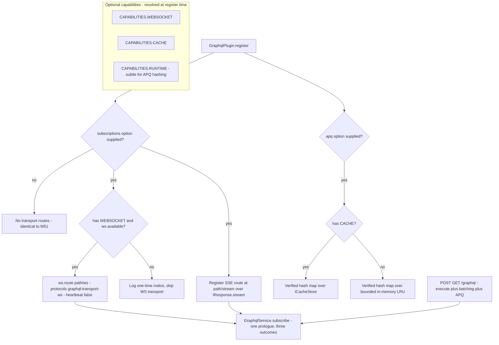

# Milestone 51b — GraphQL Subscriptions, Batching, and Persisted Queries (`@hono-enterprise/graphql-plugin`)

> **Status:** Planning. Branch: `feat/51b-graphql-subscriptions`. `main` is protected — all work
> (implementation + fixes) stays on this one branch until it merges via a single PR.

## 0. Objective & scope

Milestone 51 shipped a complete GraphQL-over-HTTP capability (schema-first + code-first, media-type
negotiation, the status watershed, a bounded document cache, error masking, depth limiting, the
introspection switch, GraphiQL, the `graphql` health indicator, and the `npm:graphql@^16`
inject-or-lazy seam). It deliberately DEFERRED everything that is not a request/response exchange:
subscriptions, request batching, Automatic Persisted Queries, custom scalar resolvers in the
schema-first arm, and the starter arm. M51b closes exactly those gaps. It EXTENDS
`packages/graphql-plugin` — no new package, no new capability token (the `GRAPHQL` token from M1
stays the only one).

- **In scope:**
  - `graphql-transport-ws` (the `graphql-ws` sub-protocol) over the OPTIONAL
    `CAPABILITIES.WEBSOCKET` capability, implemented in-package over `IWebSocketService.route()` —
    no new npm dependency. Includes the protocol's authentication channel
    (`connection_init.payload`) and the resolver-context seam a socket needs, since a WebSocket has
    no `IRequestContext`.
  - GraphQL-over-SSE in **distinct-connections mode**, built directly on M42's `IResponse.stream()`
    — needs no other plugin at all.
  - Request batching (an array request body) and Automatic Persisted Queries (APQ) with
    **server-side hash verification**, reusing `CAPABILITIES.CACHE` for the hash→document map with a
    bounded in-process fallback when the cache capability is absent.
  - Custom scalar resolvers in the schema-first arm, replacing M51's `attach-resolvers` throw.
  - A `graphql` arm on all three starter tiers (M36 starters).
  - **Three** flagged `@hono-enterprise/common` widenings: `GraphqlRequestParams.extensions` (APQ);
    `IGraphqlService.subscribe()` plus `GraphqlSubscriptionOutcome` / `GraphqlOperationContext` /
    `GraphqlConnectionInfo` (subscriptions as a first-class operation kind); and
    `WebSocketRouteOptions.heartbeat` (§3.2a — without it, M46's shared heartbeat corrupts every
    `graphql-transport-ws` connection).
- **Every new behavior is opt-in.** `subscriptions`, `apq`, and `maxBatchSize` all default to OFF,
  so an application that upgrades and changes nothing registers exactly the routes M51 registered
  and answers byte-identically — including the existing `400` on an array body. This follows M36b
  (arms that make new compositions expressible without moving any default) and M52b (opt-in,
  instance-named registration).
- **NOT this milestone:**
  - A migration to `graphql@17` — deferred to its own milestone (see §3.1). M51b stays on
    `npm:graphql@^16`.
  - Incremental delivery (`@defer`/`@stream`) — experimental in graphql 17, owned by the graphql-17
    migration milestone.
  - Federation, schema stitching, a gateway — a separate milestone; nothing here forecloses it.
  - Client-side GraphQL — `packages/sdk` (M35) owns HTTP clients.
  - The HTTP path at `POST/GET /graphql` still refuses subscriptions (the tested
    `400 SUBSCRIPTIONS_NOT_SUPPORTED_OVER_HTTP` stays); subscriptions ride the dedicated transports
    only.

## 1. Contracts verified from SOURCE (not names)

| Reference                                                                        | Source (file:line)                                                                                                                                                                                                | Verified surface / fact                                                                                                                                                                                                                                                                                                                                                                                                                                                                                                                                                                                                                                                                                                                                                                               |
| -------------------------------------------------------------------------------- | ----------------------------------------------------------------------------------------------------------------------------------------------------------------------------------------------------------------- | ----------------------------------------------------------------------------------------------------------------------------------------------------------------------------------------------------------------------------------------------------------------------------------------------------------------------------------------------------------------------------------------------------------------------------------------------------------------------------------------------------------------------------------------------------------------------------------------------------------------------------------------------------------------------------------------------------------------------------------------------------------------------------------------------------- |
| `IWebSocketService.route()` + `WebSocketRouteOptions.protocols`                  | `packages/common/src/services/websocket.ts:361` (:318-326 `protocols?: readonly string[]`)                                                                                                                        | `route(path, handlers, options?)` is synchronous and accepts a sub-protocol allow-list; the first client-requested protocol in the list is echoed back. **No `common` widening needed for protocols** — confirmed.                                                                                                                                                                                                                                                                                                                                                                                                                                                                                                                                                                                    |
| `WebSocketHandlers` / `IWebSocketConnection`                                     | `packages/common/src/services/websocket.ts:281-311`, :157-194                                                                                                                                                     | `onOpen(conn, ctx)`, `onMessage(conn, data)`, `onClose(conn, event)`, `onError(conn, error)`; `conn.sendJson<T>(payload)`, `conn.send(string\|Uint8Array)`, `conn.close(code?, reason?)` accepts arbitrary close codes, `conn.data: Map`, `conn.isOpen`.                                                                                                                                                                                                                                                                                                                                                                                                                                                                                                                                              |
| `WebSocketConnectionContext` — everything a socket knows about its upgrade       | `packages/common/src/services/websocket.ts:259-270`                                                                                                                                                               | `url`, `path`, `query: Readonly<Record<string,string>>`, `headers: Headers`, `protocol?`. It carries NO `IRequestContext` and no service registry — which is why §3.4 introduces `GraphqlOperationContext` rather than reusing `execute`'s second parameter.                                                                                                                                                                                                                                                                                                                                                                                                                                                                                                                                          |
| `WebSocketService.route()` throws when unavailable; `available` getter           | `packages/websocket-plugin/src/services/websocket-service.ts:217-224` (:218-220 throws `WebSocketUnavailableError`), :200-202 (`available`)                                                                       | The graphql plugin MUST gate `route()` on `ws.available` (false under `app.inject()` on Node/Bun and wherever the adapter has no upgrade seam).                                                                                                                                                                                                                                                                                                                                                                                                                                                                                                                                                                                                                                                       |
| **`HeartbeatSweeper` is global across every route**                              | `packages/websocket-plugin/src/heartbeat/heartbeat.ts:94-116`; payload default `'ping'` at `services/websocket-service.ts:83`; `heartbeatMs` default `0` at :70; wired with `() => this.#connections` at :183-197 | One shared interval sends the RAW TEXT payload to every open connection on every route, and evicts on inbound silence with `1001`. It is not a protocol frame and cannot be scoped to a route today. This is the §3.2a conflict.                                                                                                                                                                                                                                                                                                                                                                                                                                                                                                                                                                      |
| Inbound frames reset the idle clock                                              | `packages/websocket-plugin/src/services/websocket-service.ts:468-473` (`target.touch(hrtime())`)                                                                                                                  | Every inbound frame touches `lastSeenAt`, so a protocol-level `pong` from the client satisfies `idleTimeoutMs` — but a listen-only subscriber that never replies does not.                                                                                                                                                                                                                                                                                                                                                                                                                                                                                                                                                                                                                            |
| Optional-capability resolution pattern                                           | `packages/common/src/registry.ts:96` (`get<T>: T`, throws if absent), :113 (`has(token): boolean`); precedent `packages/websocket-plugin/src/plugin/websocket-plugin.ts:73-75`                                    | Optional resolution is `ctx.services.has(token) ? ctx.services.get<T>(token) : undefined`, plus `optionalDependencies: [token]` so the provider orders first.                                                                                                                                                                                                                                                                                                                                                                                                                                                                                                                                                                                                                                         |
| `IResponse.stream()` — the SSE primitive                                         | `packages/common/src/http.ts:159-175`                                                                                                                                                                             | `stream(body: ReadableStream<Uint8Array>): HandlerResult`. Free on every runtime (Node/Deno/Bun/Workers).                                                                                                                                                                                                                                                                                                                                                                                                                                                                                                                                                                                                                                                                                             |
| `IRequestContext.signal` — client-disconnect detection                           | `packages/common/src/http.ts:205-234` (:233)                                                                                                                                                                      | A live `AbortSignal`; SSE pumps stop on abort so producers do not leak.                                                                                                                                                                                                                                                                                                                                                                                                                                                                                                                                                                                                                                                                                                                               |
| `ICacheStore` under `CAPABILITIES.CACHE`                                         | `packages/common/src/services/cache.ts:19-55`                                                                                                                                                                     | `get<T>(key): Promise<T\|null>`, `set<T>(key, value, ttlSeconds?)`, `delete`, `has`, `clear`. APQ maps `apq:<sha256Hash>` → query string.                                                                                                                                                                                                                                                                                                                                                                                                                                                                                                                                                                                                                                                             |
| `IRuntimeServices.subtle` under `CAPABILITIES.RUNTIME`                           | `packages/common/src/runtime.ts` (`subtle: SubtleCrypto`); precedent `packages/auth-plugin` `JwtService`, `packages/notification-plugin` `ServiceAccountTokenSource`                                              | The ONLY sanctioned hash source outside `packages/runtime`. APQ's hash verification (§3.6) needs it; `graphql-plugin` resolves no runtime today (`grep -rn "CAPABILITIES.RUNTIME" packages/graphql-plugin/src` is empty), so this is new wiring, not an assumption.                                                                                                                                                                                                                                                                                                                                                                                                                                                                                                                                   |
| `GraphqlRequestParams` — `extensions` omitted                                    | `packages/common/src/services/graphql.ts:22-31` (:29-30 commented-out)                                                                                                                                            | M51 left `extensions` out ("nothing reads it"). M51b adds it (flagged widening).                                                                                                                                                                                                                                                                                                                                                                                                                                                                                                                                                                                                                                                                                                                      |
| `IGraphqlService` — no `subscribe` yet; `GraphqlService` is the only implementor | `packages/common/src/services/graphql.ts:94-118`; `grep -rn "IGraphqlService" packages --include='*.ts'` → `services/graphql-service.ts:25` plus type-only consumers                                              | Has `execute(params, requestContext?, method?)`, `endpoint`, `cachedDocumentCount`. Adding a REQUIRED member is source-compatible for callers and **breaking for implementors** (M47 `ResilientCall` precedent). In-repo there is exactly one implementor, so the break is contained — see C6.                                                                                                                                                                                                                                                                                                                                                                                                                                                                                                        |
| `GraphqlService.execute` derives context from `requestContext`                   | `packages/graphql-plugin/src/services/graphql-service.ts:92-107`                                                                                                                                                  | Absent a `requestContext`, `services` falls back to `{}` and `user`/`tenant` to `undefined`. A WebSocket has no `IRequestContext`, so passing `undefined` would hand every subscription resolver an empty context — the exact defect M51's verification found and fixed. §3.4 closes it.                                                                                                                                                                                                                                                                                                                                                                                                                                                                                                              |
| `checkOperation` refuses subscriptions unconditionally                           | `packages/graphql-plugin/src/execution/executor.ts:94-144` (:118-131)                                                                                                                                             | The signature is `(runtime, document, operationName?, method?)`. There is **no** transport parameter and no "HTTP branch" to bypass. The transports therefore require a widening, specified in §3.4.                                                                                                                                                                                                                                                                                                                                                                                                                                                                                                                                                                                                  |
| The executor owns the only parse                                                 | `packages/graphql-plugin/src/execution/executor.ts:163-192`                                                                                                                                                       | Parse, guard, and validate all read the `DocumentCache`. M51's verification removed a second parse that sat outside it; the subscribe pipeline must reuse this prologue rather than re-deriving the operation kind.                                                                                                                                                                                                                                                                                                                                                                                                                                                                                                                                                                                   |
| `GraphqlRuntime.subscribe` already adapted + `GraphqlSubscribeResultLike`        | `packages/graphql-plugin/src/interfaces/graphql-runtime.ts:106-134`, loader `packages/graphql-plugin/src/runtime/graphql-loader.ts:20,42`                                                                         | `subscribe(args): Promise<GraphqlExecutionResultLike \| AsyncIterable<GraphqlExecutionResultLike>>` is already wired through `adaptGraphqlModule` AND the lazy importer. **No loader change needed for subscriptions.**                                                                                                                                                                                                                                                                                                                                                                                                                                                                                                                                                                               |
| `GraphqlSchemaLike.getSubscriptionType()`                                        | `packages/graphql-plugin/src/interfaces/graphql-runtime.ts:9-18` (:12)                                                                                                                                            | The facade already exposes the subscription root type, so an operation-kind guard for subscriptions is expressible.                                                                                                                                                                                                                                                                                                                                                                                                                                                                                                                                                                                                                                                                                   |
| `attach-resolvers` scalar throw (the M51b entry point)                           | `packages/graphql-plugin/src/schema/attach-resolvers.ts:49-54`                                                                                                                                                    | A resolver-map type with no `getFields` throws "Cannot attach resolvers to scalar type". Reached only when the entry has a key other than `__resolveType` (:31-37), so a scalar entry does reach it. M51b replaces the throw with scalar method attachment.                                                                                                                                                                                                                                                                                                                                                                                                                                                                                                                                           |
| `npm:graphql@^16` pin + resolved version                                         | `packages/graphql-plugin/src/runtime/graphql-loader.ts:37,72`; `deno.lock:45-46,1248`                                                                                                                             | Pin is `npm:graphql@^16`; both `npm:graphql@*` and `npm:graphql@16` resolve to **16.14.2**.                                                                                                                                                                                                                                                                                                                                                                                                                                                                                                                                                                                                                                                                                                           |
| **graphql 17 exists and is `latest`**                                            | npm registry (`registry.npmjs.org/graphql`, queried this session)                                                                                                                                                 | `dist-tags.latest` = **17.0.2**; `dist-tags.latest-16` = 16.14.2; `time['17.0.0']` = **2026-06-15T17:11Z**. The §3.1 decision to stay on `^16` is therefore a decision against a real, current major, not against a rumour.                                                                                                                                                                                                                                                                                                                                                                                                                                                                                                                                                                           |
| **The real-import test's specifier is unpinned**                                 | `packages/graphql-plugin/test/unit/graphql-real-import.test.ts:14,49` (`typeof import('npm:graphql')`)                                                                                                            | This is what produces the `npm:graphql@*` lock entry. With `latest` now 17.0.2, a lockfile refresh types the `^16` runtime against 17's `.d.ts`. §3.1 fixes it in the same edit.                                                                                                                                                                                                                                                                                                                                                                                                                                                                                                                                                                                                                      |
| `parsePostBody` rejects arrays (batching entry point)                            | `packages/graphql-plugin/src/http/request-parser.ts:36-41`                                                                                                                                                        | A non-object or array body → `BAD_REQUEST`. Batching is detected at the handler boundary BEFORE `parsePostBody`, so single-element parsing is untouched.                                                                                                                                                                                                                                                                                                                                                                                                                                                                                                                                                                                                                                              |
| The status watershed already renders a request error correctly per media type    | `packages/graphql-plugin/src/http/graphql-handler.ts:193-210`                                                                                                                                                     | Under `application/json` every outcome answers `200` except `405`; under `application/graphql-response+json` the outcome status is used verbatim. APQ's `400` therefore reaches an Apollo-style client as a `200` carrying the retry signal, with no special case (§3.6).                                                                                                                                                                                                                                                                                                                                                                                                                                                                                                                             |
| CAPABILITIES token values                                                        | `packages/common/src/tokens.ts:51` (`CACHE`), :103-105 (`SSE`, `WEBSOCKET`), :138 (`GRAPHQL`)                                                                                                                     | All lowercase-kebab values; `WEBSOCKET = 'websocket'`, `CACHE = 'cache'`, `GRAPHQL = 'graphql'`.                                                                                                                                                                                                                                                                                                                                                                                                                                                                                                                                                                                                                                                                                                      |
| Starter arm pattern + per-plugin manifest imports                                | `packages/starters/rest-starter/src/options.ts:74-160`, `app.ts:33-64`, **`packages/starters/rest-starter/deno.json`**                                                                                            | Optional arms are `…?: <Plugin>Options`; `buildRestPlugins` spreads `...(options.x ? [XPlugin(options.x)] : [])`. The manifest carries ONE explicit `jsr:@hono-enterprise/<pkg>@^<version>` import per plugin it imports — so the arm is a manifest change too (§5).                                                                                                                                                                                                                                                                                                                                                                                                                                                                                                                                  |
| `packages/graphql-plugin` is in a release list; entrypoint is `@module`-first    | `scripts/release-packages.ts:45`; `packages/graphql-plugin/src/index.ts:1-8`; checks at `scripts/verify-release.ts:11-27`                                                                                         | Both M51 publish defects are already fixed. Check 2 (specifier resolvability) inspects `PUBLISHED_PACKAGES` only, so the starters' manifests are NOT covered by it — they still have to resolve for `deno check` and `deno task test`.                                                                                                                                                                                                                                                                                                                                                                                                                                                                                                                                                                |
| `graphql-transport-ws` protocol                                                  | `enisdenjo/graphql-ws` PROTOCOL.md (fetched this session)                                                                                                                                                         | `connection_init` carries `payload?: Record<string, unknown> \| null` — **the authentication channel**; the server rejects with `4403: Forbidden` "for example during authentication". `subscribe` carries `id` + `payload:{operationName?, query, variables?, extensions?}`. `error` carries `GraphQLError[]` and **terminates the operation — no `complete` follows it**. `complete` is bidirectional. Close codes: `4400: <error-message>` invalid message, `4401` subscribe-before-ack, `4403` forbidden, `4408` init timeout, `4409: Subscriber for <id> already exists`, `4429` too many inits. A message with an unknown//completed `id` (other than `subscribe`) MUST be ignored, not closed. A client `complete` for a single-result operation that has not resolved suppresses that result. |
| **GraphQL-over-SSE, distinct-connections mode**                                  | `enisdenjo/graphql-sse` PROTOCOL.md (fetched this session), §"Distinct connections mode"                                                                                                                          | `Content-Type` MUST always be `text/event-stream`. **Validation errors MUST be reported through the accepted SSE connection as `next` events carrying the errors in `data`** — explicitly NOT as a `400`, because a `400` makes the user agent fail the connection and native `EventSource` surfaces no usable detail. `next.data` is an `ExecutionResult`; `complete` MUST include an empty `data:` field or native `EventSource` never fires the listener. A streaming operation is terminated by the client closing the connection.                                                                                                                                                                                                                                                                |

## 2. Committed-doc conflicts — resolved here, shipped as named doc deliverables

| #  | Conflict                                                                                                                                                                                                                                                                                                                                                                                                                                   | Resolution (picked side)                                                                                                                                                                                                                                                                                                                         | Doc deliverable (same PR)                                                                                                   |
| -- | ------------------------------------------------------------------------------------------------------------------------------------------------------------------------------------------------------------------------------------------------------------------------------------------------------------------------------------------------------------------------------------------------------------------------------------------ | ------------------------------------------------------------------------------------------------------------------------------------------------------------------------------------------------------------------------------------------------------------------------------------------------------------------------------------------------ | --------------------------------------------------------------------------------------------------------------------------- |
| C1 | `GraphqlRequestParams.extensions` is documented in `common` source as "reserved for M51b" but is commented out (`services/graphql.ts:29-30`), so it is not actually importable.                                                                                                                                                                                                                                                            | Uncomment and add `extensions?: Record<string, unknown>;` (APQ reads it).                                                                                                                                                                                                                                                                        | `PUBLIC_API.md` common GraphQL row + the new `extensions` JSDoc.                                                            |
| C2 | ROADMAP M51b (:5111-5113) asserts "no further `common` widening is expected" for WebSocket protocols. True for protocols. But APQ needs `extensions` (ROADMAP :5116-5118 acknowledges it), subscriptions need `IGraphqlService.subscribe`, and §3.2a needs `WebSocketRouteOptions.heartbeat`.                                                                                                                                              | Ship all THREE as flagged `common` widenings. The ROADMAP's claim was scoped to the WS protocol allow-list and stays true as scoped; the ROADMAP text is corrected to name the three.                                                                                                                                                            | `ROADMAP.md` M51b scope bullet; `PUBLIC_API.md` common GraphQL + WebSocket sections; `ARCHITECTURE.md` GraphQL note.        |
| C3 | ROADMAP :5082-5084 says subscriptions over HTTP answer a tested `400`. M51b adds transports but MUST NOT change that HTTP behavior.                                                                                                                                                                                                                                                                                                        | The `checkOperation` subscription refusal stays for `POST/GET /graphql` — expressed as the `'http'` transport arm in §3.4, so the refusal is a decision the guard makes rather than a property it cannot express.                                                                                                                                | `PUBLIC_API.md` + `packages/graphql-plugin/README.md` state the HTTP path still refuses subscriptions.                      |
| C4 | The original M51b plan specified that an SSE pre-stream error is answered as a buffered GraphQL JSON error before the stream opens. The graphql-sse PROTOCOL.md (§1) requires the OPPOSITE for distinct-connections mode: validation errors are reported inside the accepted stream as a `next` event, because a `400` makes native `EventSource` fail the connection with no usable detail.                                               | Follow the protocol. A **transport** failure (unsupported content type, unparseable body — no GraphQL request exists yet) stays a buffered HTTP error. A **GraphQL request error** (parse, validate, operation resolution) opens the stream and emits `next` + `complete`. §3.3 states the split.                                                | `PUBLIC_API.md` GraphQL SSE section + README: the two error classes and where each surfaces.                                |
| C5 | `WebSocketPluginOptions.heartbeatMs` is documented as a supported option (its own JSDoc example is `WebSocketPlugin({ heartbeatMs: 30_000, idleTimeoutMs: 90_000 })`), but `HeartbeatSweeper` sends a raw text payload to EVERY connection on EVERY route. A conformant `graphql-transport-ws` client that receives it must close with `4400`. Enabling two separately-documented options would silently break every GraphQL subscription. | Make the conflict impossible rather than documented: add the optional `WebSocketRouteOptions.heartbeat` opt-out (§3.2a) and have the GraphQL WS route claim it. The GraphQL transport owns its own liveness through protocol `ping`/`pong`.                                                                                                      | `PUBLIC_API.md` WebSocket route-options row; `packages/websocket-plugin/README.md`; `CHANGELOG.md` under Added.             |
| C6 | Adding a REQUIRED `subscribe()` to the committed `IGraphqlService` is source-compatible for callers and breaking for implementors — the same shape M47 analyzed for `ResilientCall`, and `IGraphqlService` is documented public API (`PUBLIC_API.md:7452`).                                                                                                                                                                                | Ship it as a REQUIRED member, not optional: an optional method pushes a `?.` and a "what if it is absent" branch into both transports for a capability the only registered provider always has. Verified there is exactly one in-repo implementor. Declared as a breaking change for implementors in the CHANGELOG, with the one-line migration. | `CHANGELOG.md` "Changed — breaking for implementors of `IGraphqlService`"; `PUBLIC_API.md` `subscribe` entry with `@since`. |
| C7 | The transports need endpoints, and fixed defaults (`/graphql/ws`, `/graphql/stream`) ignore a configured `path`, so `path: '/api/graphql'` scatters the endpoints across two prefixes.                                                                                                                                                                                                                                                     | Both defaults derive from the configured endpoint: `` `${path}/ws` `` and `` `${path}/stream` ``. An explicit `subscriptions.websocket.path` / `subscriptions.sse.path` still overrides.                                                                                                                                                         | `PUBLIC_API.md` options table; README endpoint list.                                                                        |

## 3. Design decisions

### 3.1 graphql version — stay on `npm:graphql@^16`, and pin the test's specifier

- **Decision:** Keep the `npm:graphql@^16` pin in `runtime/graphql-loader.ts` (resolved 16.14.2). Do
  NOT migrate to graphql 17 in this milestone. In the same change, pin the real-import test's
  type-only specifier: `typeof import('npm:graphql')` becomes `typeof import('npm:graphql@^16')` at
  `graphql-real-import.test.ts:14` and :49.
- **Why (version):** graphql 17.0.0 shipped 2026-06-15 and `latest` is now 17.0.2 (npm registry,
  verified §1). It is a major that separates stable single-result execution from experimental
  incremental delivery and splits input coercion from diagnostic validation. The in-package
  `GraphqlModuleLike`/`GraphqlRuntime` facade casts every graphql export
  (`graphql-loader.ts:36-53`), so a migration re-verifies the entire facade, every
  depth-limit/introspection rule shape, and the schema builders — a scope larger than this
  milestone. Crucially, graphql 16's `subscribe()` ALREADY returns the
  `Promise<ExecutionResult | AsyncIterable<ExecutionResult>>` shape M51b needs
  (`GraphqlSubscribeResultLike`, `graphql-runtime.ts:106-134`), and incremental delivery is not in
  M51b's transport scope. The version stays controlled by the single specifier in the loader, so the
  migration is a later, self-contained milestone.
- **Why (the pin):** the unpinned type-only import is what created the `"npm:graphql@*": "16.14.2"`
  lock entry. That entry is now stale against `latest`, so the next lockfile refresh silently
  type-checks the `^16` runtime against 17's `.d.ts` — a green suite that proves the wrong thing, in
  the very file this decision rests on. One character of range fixes it permanently.
- **Test home:** `test/unit/graphql-real-import.test.ts` (existing) continues to guard the real
  import path; new assertions pin that `runtime.subscribe` is a function after the real load and
  that the loaded `version` export starts with `16.`, so a future drift onto 17 fails loudly here
  rather than somewhere downstream.

### 3.2 WebSocket transport — `graphql-transport-ws` in-package, with a real context and auth seam

- **Decision:** Implement the protocol directly over
  `IWebSocketService.route(path, handlers, { protocols: ['graphql-transport-ws'], heartbeat: false })`.
  Do NOT depend on the `graphql-ws` npm package.
- **Why:** §12.2 keeps heavy deps inject-or-lazy, and the protocol is small and fully specified.
  `IWebSocketService.route()` already exposes the exact primitives the state machine needs. Adding
  `graphql-ws` would put a runtime dependency into a JSR-published package's graph for a protocol
  implementable in one module, and it would fight the framework's normalized connection abstraction.
- **State machine:** `connection_init` → `connection_ack` (one-shot; a second init closes `4429`); a
  `connectionInitWaitMs` timer closes `4408` when no init arrives; `ping`→`pong` bidirectional;
  `subscribe` (id + payload) → per-connection `Map<id, AsyncIterator>`; a duplicate id closes
  `4409`; a `subscribe` before ack closes `4401`; a message whose type or shape is not in the
  protocol closes `4400` with a descriptive reason. A message carrying an id that is
  unknown-or-already-completed and is NOT a `subscribe` is IGNORED, never fatal — the protocol
  requires this, and it is the case a naive registry lookup gets wrong. A client `complete`, an
  `onClose`, and an `onError` all release the iterator for that id; a client `complete` that arrives
  before a single-result operation resolves suppresses that result.
- **Result mapping (from the protocol, not from symmetry):** a request error emits `error` carrying
  `GraphQLError[]` and **no** `complete`; a query/mutation emits one `next` then `complete`; a
  subscription emits `next`* then `complete`. This asymmetry is why §3.4's outcome carries three
  arms rather than a boolean.
- **Authentication and resolver context — the seam that makes subscriptions useful.**
  `GraphqlService.execute` derives `services`/`user`/`tenant` from an `IRequestContext`
  (`graphql-service.ts:92-107`) and a socket has none, so passing `undefined` would hand every
  subscription resolver an empty context and no capability at all. The transport therefore builds a
  `GraphqlConnectionInfo` (§3.4) from `WebSocketConnectionContext` plus the `connection_init`
  payload, snapshotted in `onOpen` (M46's own e2e found that the native request is dead by the time
  a later callback runs), and the service is constructed with the plugin-level `IServiceRegistry` so
  the default context's `services` is the real registry rather than `{}`.
  - A new `subscriptions.websocket.onConnect(info)` hook runs on `connection_init`, BEFORE the ack.
    Returning `false` closes the socket with `4403: Forbidden` — which is what the protocol reserves
    that code for, and what gives `4403` a producer instead of leaving it a close code the design
    lists and no path emits. Returning nothing accepts. The hook receives the
    `GraphqlConnectionInfo` and may write to `conn.data`; the default context reads `user`/`tenant`
    back out of it, so an application authenticates once per socket rather than once per operation.
  - With no `onConnect` configured the socket is accepted and resolvers get `services` plus an
    undefined `user` — documented plainly, because a subscription endpoint that is open by default
    is a decision an operator has to see.
- **Optional-capability behavior:** resolve `CAPABILITIES.WEBSOCKET` via `has` + `get`. When the
  capability is absent, or `ws.available === false` (`app.inject()` on Node/Bun, or an adapter with
  no upgrade seam), the WS transport is not registered and the plugin logs a one-time notice; HTTP,
  SSE, batching, and APQ are unaffected. `optionalDependencies` gains `CAPABILITIES.WEBSOCKET`.
- **Test home:** `test/unit/ws-protocol.test.ts` (pure frame codec + close-code decisions),
  `test/unit/graphql-ws-handler.test.ts` (state machine against a fake `IWebSocketConnection`,
  including the auth hook and the ignore-unknown-id rule), and a real-socket e2e on Deno.

### 3.2a `WebSocketRouteOptions.heartbeat` — the third `common` widening, and why it is not a doc note

- **Decision:** Add `readonly heartbeat?: boolean` (default `true`) to `WebSocketRouteOptions` in
  `common`. When `false`, `HeartbeatSweeper` skips that route's connections for BOTH the payload
  send and the idle sweep. The GraphQL WS route passes `heartbeat: false`.
- **Why:** `HeartbeatSweeper.tick()` (`heartbeat.ts:94-116`) walks every open connection from one
  shared interval and sends the raw text `heartbeatPayload` (default `'ping'`). That is not a
  `graphql-transport-ws` frame, and the protocol requires a client receiving an unknown message to
  close the socket with `4400`. So `WebSocketPlugin({ heartbeatMs: 30_000 })` — the call in that
  plugin's own JSDoc — would break every GraphQL subscription in the application, and neither
  package can detect it. The idle sweep is the second half: it evicts on INBOUND silence (`touch()`
  at `websocket-service.ts:473`), and a listen-only subscriber is inbound-silent by design.
  Documenting "do not combine these two options" is not a fix for a framework that ships both;
  excluding the route is, and it is a small, well-scoped change to a package this milestone already
  has to reason about (the M52c precedent for a milestone spanning packages).
- **Liveness is not lost, it moves:** `subscriptions.websocket.heartbeatMs` sends protocol `ping`
  frames on the GraphQL route; the client's `pong` is an inbound frame, so `lastSeenAt` advances and
  a dead peer is still detected — by the transport that speaks its protocol.
- **Scope discipline:** the sweeper's behavior for every other route is unchanged, and the default
  (`true`) means no existing application observes any difference. `WebSocketPlugin` options are
  untouched.
- **Test home:** `packages/websocket-plugin/test/unit/heartbeat.test.ts` (edit) asserts an opted-out
  connection receives no payload and is not evicted while an ordinary connection beside it receives
  both — one test that fails without the change.

### 3.3 SSE transport — distinct-connections mode over `IResponse.stream()`, per the protocol

- **Decision:** Build the SSE transport in-package on M42's `IResponse.stream()`. Do NOT depend on
  `CAPABILITIES.SSE` (the SSE plugin).
- **Why:** the ROADMAP (:5114-5115) says the SSE transport "needs no other plugin at all".
  Distinct-connections mode is one subscription per HTTP connection (no multiplexing protocol),
  which maps directly onto a `ReadableStream<Uint8Array>` flushed through `ctx.response.stream(rs)`.
  Depending on the SSE plugin would add a capability coupling and a broadcast-channel abstraction a
  per-subscription stream does not need.
- **Wire grammar (from graphql-sse PROTOCOL.md, §1):** `Content-Type: text/event-stream`; each
  result is `event: next\ndata: <JSON ExecutionResult>\n\n`; the terminator is
  `event: complete\ndata: \n\n` — the empty `data:` field is mandatory, because native `EventSource`
  never fires the listener without it. An in-band `:keep-alive\n\n` comment goes out every
  `sse.heartbeatMs`.
- **Two error classes, two destinations — this is the correction in C4:**
  - A **transport** failure, where no GraphQL request exists yet (unsupported content type,
    unparseable body, a disabled transport), is answered as an ordinary buffered HTTP error before
    any stream opens.
  - A **GraphQL request error** (parse, validation, operation resolution) opens the stream and emits
    `next` carrying `{ errors: [...] }`, then `complete`. The protocol requires this explicitly: a
    `400` makes the user agent fail the connection, and native `EventSource` surfaces no usable
    detail. The original plan had this backwards.
- **Cleanup:** on `ctx.signal` abort (client disconnect) the pump stops and the controller closes,
  and the iterator's `return()` is invoked so a generator-based source runs its `finally`. The same
  path runs when the source completes normally.
- **Operation kinds:** `query`/`mutation` (one `next`, then `complete`) and `subscription` (many
  `next`, then `complete`), from the same three-arm outcome the WS transport narrows on.
- **Test home:** `test/unit/sse-frame.test.ts` (pure encoder, including the mandatory empty
  `data:`), `test/unit/graphql-sse-handler.test.ts` (request error INSIDE the stream; transport
  failure outside it; abort stops the iterator; heartbeat comments), and an e2e over `app.fetch`
  reading the streamed body incrementally.

### 3.4 Subscriptions execution seam — one guard, one prologue, three outcomes

- **Decision — the contract.** Add to `common`:
  ```
  interface GraphqlConnectionInfo {
    readonly id: string;
    readonly connectionParams?: Record<string, unknown>;
    readonly headers: Headers;
    readonly query: Readonly<Record<string, string>>;
    readonly protocol?: string;
    readonly data: Map<string, unknown>;
  }
  interface GraphqlOperationContext {
    readonly requestContext?: IRequestContext;   // the SSE path supplies this
    readonly connection?: GraphqlConnectionInfo; // the WS path supplies this
  }
  type GraphqlSubscriptionOutcome =
    | { kind: 'error';  status: number; result: GraphqlExecutionResult }
    | { kind: 'single'; status: number; result: GraphqlExecutionResult }
    | { kind: 'stream'; status: number; stream: AsyncIterable<GraphqlExecutionResult> };

  subscribe(params: GraphqlRequestParams, context?: GraphqlOperationContext):
    Promise<GraphqlSubscriptionOutcome>;
  ```
  The second parameter is `GraphqlOperationContext`, NOT `IRequestContext`: a WebSocket has none
  (verified, `WebSocketConnectionContext` §1), and reusing `execute`'s parameter is what would
  silently hand resolvers `services: {}`. `method` is dropped — neither transport has an HTTP method
  to guard on.
- **Why three arms, not a `streaming` boolean.** The wire needs the distinction.
  `graphql-transport-ws` answers a request error with `error` and sends NO `complete` after it,
  while an executed single result is `next` + `complete` — so a transport that can only ask "is this
  an async iterable?" cannot emit a conformant frame sequence. `'error'` also carries the status the
  SSE path needs. The transports still narrow on one discriminant field, with no
  `Symbol.asyncIterator` sniffing.
- **Decision — `subscribe()` dispatches every operation kind; the transports never do.** A transport
  must not decide between `execute` and `subscribe` itself: to learn the operation kind it would
  have to parse and walk the AST outside the `DocumentCache`, which is precisely the defect M51's
  verification removed (measured: 5 parses for 5 cached repeats). So `subscribe()` accepts query,
  mutation, and subscription documents, resolves the kind from the document the cache already holds,
  and returns `'single'` or `'stream'` accordingly.
- **Decision — one prologue, shared by both pipelines.** Extract the parse → guard → validate
  prologue from `executeGraphql` into an internal `prepareDocument(query, options)` that returns a
  refusal outcome or `{ document, operation }`. `executeGraphql` and the new `subscribeGraphql` both
  call it, so the document cache, the pre-built validation rules, the depth limit, and the
  introspection rule apply identically on every transport, and there is exactly one place that
  parses.
- **Decision — `checkOperation` gains a transport arm and returns the resolved kind.** Its signature
  becomes `(runtime, document, options: { operationName?; method?; transport: 'http' | 'stream' })`
  returning a refusal or `{ operation }`. Under `'http'` the behavior is byte-identical to today
  (subscription → `400 SUBSCRIPTIONS_NOT_SUPPORTED_OVER_HTTP`, mutation over `GET` → `405`), which
  is what keeps C3 true. Under `'stream'` both refusals are skipped and the kind is handed back for
  dispatch. `checkOperation` is internal (`src/index.ts` does not export it), so widening it costs
  no public surface. This also removes the original plan's phantom claim that the transports "bypass
  `checkOperation`'s HTTP branch" — there was no such branch to bypass.
- **Decision — context construction is shared with `execute`.** One private
  `#buildContextValue(context?: GraphqlOperationContext)` on `GraphqlService` serves both entry
  points: a custom `buildContext` receives the widened `GraphqlContextInput` (now carrying an
  optional `connection`), and the default context resolves `services` from the request context when
  present and from the plugin-level registry otherwise, with `user`/`tenant` read from `conn.data`
  on the socket path. This is the "one capability, one implementation" rule applied to the thing M51
  already got wrong once.
- **Test home:** `test/unit/subscribe.test.ts` (all three arms; masking under a non-default
  `maskInternalErrors`; the WS-shaped context resolving a real capability),
  `test/unit/executor.test.ts` (edit — `'http'` arm unchanged, `'stream'` arm returns the kind), and
  the transport handler tests assert the same masking on the wire.

### 3.5 Request batching — array body → array of results, opt-in

- **Decision:** `maxBatchSize` defaults to `0`, which keeps M51's behavior exactly: an array body is
  refused by `parsePostBody` with `400`. Set above `0` to enable. When enabled, `handleGraphqlPost`
  detects `Array.isArray(body)` after the JSON parse and before `parsePostBody`, parses and executes
  each element through the existing single-request path, and answers a JSON array
  `[{ data?, errors? }, …]` with status `200`; a non-array body takes the existing path unchanged.
  `GET` never batches.
- **Concurrency:** elements execute CONCURRENTLY via `Promise.all` over independent executions, with
  results emitted in request order. (The original plan said "pure sequential `Promise.all`", which
  is self-contradictory — `Promise.all` is concurrent, and concurrency is the point of batching.) No
  state is shared across elements.
- **Media type:** a batch response is always `application/json`. The GraphQL-over-HTTP spec's
  `application/graphql-response+json` describes a single result and cannot express an array, so an
  array body from a client that negotiated the strict media type is refused with `400` and the code
  `BATCHING_NOT_SUPPORTED`, rather than answered in a media type whose contract it violates.
- **Bounds:** an array longer than `maxBatchSize` is refused with `400 BATCH_TOO_LARGE`; an empty
  array is refused with `400 BAD_REQUEST`; each element is checked to be an object before parsing.
  Every element still passes the depth limit and the full validation rule list, so batching widens
  no DoS surface that a loop of single requests does not already have.
- **APQ interaction:** APQ resolution (§3.6) runs per element, before that element executes, so a
  batch may mix hash-only and full-document entries.
- **Test home:** `test/unit/batch-handler.test.ts` (array → array; mixed successes and errors; order
  preserved; over-limit → `400`; empty → `400`; strict media type → `400 BATCHING_NOT_SUPPORTED`;
  `maxBatchSize: 0` still refuses an array; non-array still single).

### 3.6 Automatic Persisted Queries — verified hashes over `CAPABILITIES.CACHE`, opt-in

- **Decision:** add `GraphqlRequestParams.extensions?: Record<string, unknown>` (C1). A pure
  `extractPersistedQuery(extensions)` reads `{ version, sha256Hash }` from
  `extensions.persistedQuery`; only `version === 1` is honored and anything else is ignored, so APQ
  is opt-in per request as well as per application (`apq` is absent by default). An `ApqResolver`
  runs before execution:
  - request carries a `query` AND a hash → **verify** `sha256Hash === persistedQueryHash(query)`; on
    a match, persist `apq:<hash>` → query and execute; on a mismatch, refuse with
    `PersistedQueryHashMismatch` / `PERSISTED_QUERY_HASH_MISMATCH` at status `400`;
  - request carries a `query` and no hash → execute normally, persist nothing;
  - request carries a hash and no `query` → look it up; a hit injects the cached document and
    executes; a miss short-circuits with `PersistedQueryNotFound` / `PERSISTED_QUERY_NOT_FOUND` at
    status `400`.
- **Why verification is mandatory, not defensive.** Without it, any client can store an arbitrary
  document under any hash, and the next client that requests that hash executes an attacker's
  document. The blast radius is worst under exactly the configuration this section recommends — a
  shared Redis `ICacheStore`, where the poisoned entry is cluster-wide and outlives the request.
  Every production APQ implementation verifies; an unverified one is a cache-poisoning primitive
  wearing a performance feature's clothes.
- **`persistedQueryHash` and its crypto source.**
  `persistedQueryHash(query, subtle): Promise<string>` is a pure SHA-256-to-lowercase-hex over the
  UTF-8 query, taking a `SubtleCrypto`. It gets one from `IRuntimeServices.subtle` resolved through
  `CAPABILITIES.RUNTIME` — the same route M16's `JwtService` and M30b's token source take, and the
  only sanctioned one outside `packages/runtime` (`Date.now()`/`globalThis.crypto` are both banned
  here). `graphql-plugin` resolves no runtime today, so `CAPABILITIES.RUNTIME` joins
  `optionalDependencies` for ordering; when it is absent AND `apq` is configured, `register()`
  throws naming the requirement rather than silently disabling a security-relevant feature. The hash
  being async is why `ApqResolver.resolve` returns a promise.
- **Status codes.** Both APQ refusals carry `400`, which the existing watershed
  (`graphql-handler.ts:193-210`) renders as `200` under `application/json` — the shape an
  Apollo-style client expects for the retry handshake — and as `400` under
  `application/graphql-response+json`, where a request that did not execute is a request error. No
  special case is needed. The messages match the de-facto client convention
  (`PersistedQueryNotFound`) so existing APQ links interoperate.
- **Storage.** With `CAPABILITIES.CACHE` present, entries live under the `apq:` namespace with
  `ttlSeconds` (default `300`) so a shared store is neither polluted nor unbounded. Absent it, a
  bounded in-process LRU (`Map` + insertion-order eviction, `maxEntries` default `1000`) keeps APQ
  working — graceful, not a hard dependency.
- **Every transport.** APQ applies to HTTP POST/GET, the WS `subscribe` payload, and SSE, because
  all four now thread `GraphqlRequestParams` (with `extensions`) through one resolution point.
- **Test home:** `test/unit/persisted-query.test.ts` (extraction, version gating, and hash vectors
  computed against a real `SubtleCrypto`), `test/unit/apq-resolver.test.ts` (persist / hit / miss /
  **hash mismatch** / in-memory fallback / TTL / `maxEntries` eviction), and an integration test
  driving the full HTTP retry handshake.

### 3.7 Custom scalar resolvers — attach `serialize`/`parseValue`/`parseLiteral` instead of throwing

- **Decision:** in the schema-first arm, when `attach-resolvers` meets a resolver-map type whose
  schema type has no `getFields` (a scalar), narrow it to a new `GraphqlScalarTypeLike` facade and
  assign `serialize`/`parseValue`/`parseLiteral` from the entry — only the members the entry
  supplies. The M51 throw (`attach-resolvers.ts:49-54`) is replaced.
- **Why:** graphql 16's `GraphQLScalarType` exposes those three as settable properties, and
  `buildSchema` creates custom scalars with identity defaults, so overriding them is the documented
  way to wire custom scalar behavior. The discriminator is the SCHEMA TYPE (scalar against object),
  not the entry shape — robust against a scalar entry that omits a method.
- **New types:** `GraphqlScalarResolver { serialize?, parseValue?, parseLiteral? }` (exported, for
  the resolver map) and the internal `GraphqlScalarTypeLike`. `ResolverMap`'s value widens to a
  union of the field-resolver map and `GraphqlScalarResolver`.
- **Test home:** `test/unit/scalar-resolvers.test.ts` (all three attached; a subset attached with
  the untouched member left at graphql's default; an object type still field-resolves; an unknown
  type name still throws; `__resolveType` on an interface unaffected), plus the existing
  `attach-resolvers` tests extended.

### 3.8 Starter arm — `graphql?: GraphqlPluginOptions` on all three tiers

- **Decision:** add a gated `graphql?: GraphqlPluginOptions` arm to `RestStarterOptions`, threaded
  through `buildRestPlugins` (`...(options.graphql ? [GraphqlPlugin(options.graphql)] : [])`),
  inherited by the microservice and full-stack tiers through their existing `extends` chain. Gated
  because the plugin cannot boot without an application-supplied schema — the rule that made
  `session` gated.
- **Manifest consequence, not an afterthought:** `packages/starters/rest-starter/deno.json` carries
  one explicit `jsr:@hono-enterprise/<pkg>@^<version>` import per plugin it imports, so the arm
  requires a manifest entry for `graphql-plugin` at the current workspace version, and the same for
  any starter tier that names the type directly. `verify-release.ts` check 2 inspects
  `PUBLISHED_PACKAGES` only, and the starters are unpublished, so nothing catches a missing or
  mis-versioned entry except `deno check` — which is exactly why it is a named file in §5.
- **Test home:** `packages/starters/rest-starter/test/unit/app.test.ts` (edit) — the arm registers
  `GraphqlPlugin` when present, omits it when absent, and a starter app with a trivial schema serves
  a query. The microservice/full-stack tests assert the arm is inherited.



## 4. Exported surface — every symbol names its consumer

| Exported symbol                                                                                                                                                                                          | Kind                                                | Consumer / real code path that READS it                                                                                                                                     |
| -------------------------------------------------------------------------------------------------------------------------------------------------------------------------------------------------------- | --------------------------------------------------- | --------------------------------------------------------------------------------------------------------------------------------------------------------------------------- |
| `GraphqlPlugin`                                                                                                                                                                                          | factory (existing)                                  | Application / starter arm (`buildRestPlugins`); unchanged entry point.                                                                                                      |
| `GraphqlService`                                                                                                                                                                                         | class (existing)                                    | Plugin `register`; now also exposes `subscribe()` consumed by the WS + SSE handlers.                                                                                        |
| `GraphqlSubscriptionsOptions`, `GraphqlWsTransportOptions`, `GraphqlSseTransportOptions`                                                                                                                 | types (new)                                         | `GraphqlPluginOptions.subscriptions`; read by the transport wiring in `register`.                                                                                           |
| `GraphqlApqOptions`                                                                                                                                                                                      | type (new)                                          | `GraphqlPluginOptions.apq`; read by `ApqResolver` construction.                                                                                                             |
| `GraphqlScalarResolver`                                                                                                                                                                                  | type (new)                                          | `ResolverMap` entries for scalar types; read by `attach-resolvers`.                                                                                                         |
| `GraphqlSubscriptionOutcome`, `GraphqlOperationContext`, `GraphqlConnectionInfo`                                                                                                                         | types (new, declared in `common`, re-exported here) | Return type and parameter of `IGraphqlService.subscribe`; narrowed/constructed by both transports. Re-exported so a consumer wiring a custom transport imports one package. |
| `extractPersistedQuery`                                                                                                                                                                                  | function (new)                                      | `ApqResolver`; unit-tested directly.                                                                                                                                        |
| `persistedQueryHash`                                                                                                                                                                                     | function (new)                                      | `ApqResolver`'s verification and persist paths (§3.6); unit-tested against real `SubtleCrypto` vectors.                                                                     |
| `encodeSseEvent`, `encodeSseComment`                                                                                                                                                                     | functions (new)                                     | The SSE handler; pure, unit-tested.                                                                                                                                         |
| `GRAPHQL_TRANSPORT_WS` protocol constant + frame codec                                                                                                                                                   | const/functions (new)                               | `protocols: [GRAPHQL_TRANSPORT_WS]` passed to `route()`; the WS handler decodes every inbound frame through the codec.                                                      |
| `GraphqlRuntimeLoadError`, `GraphqlSchemaError`, `createDepthLimitRule`, `adaptGraphqlModule`, `loadGraphqlModule`, `graphiqlHtml`, `GraphqlModuleLike`, `GraphqlSchemaLike`, `DefaultGraphqlContext`, … | (existing)                                          | Unchanged M51 surface; no symbol removed.                                                                                                                                   |

> No existing export is removed or renamed (§9.1). Every new exported function carries a written-out
> return type — the M51 `createDepthLimitRule` slow-type defect that only `publish:check` sees. The
> starter barrels gain no new export of their own; the arm is an option.

### 4.1 Options — every option names its consumer

| Option                                                           | Consumer                           | Behavior (per implementation)                                                                                                                                                        |
| ---------------------------------------------------------------- | ---------------------------------- | ------------------------------------------------------------------------------------------------------------------------------------------------------------------------------------ |
| `subscriptions` (`GraphqlSubscriptionsOptions`)                  | `register` transport wiring        | **Absent → no transport route is registered at all** (M51 behavior preserved byte-for-byte).                                                                                         |
| `subscriptions.websocket` (`GraphqlWsTransportOptions \| false`) | `register` WS wiring               | `false` disables; default enabled within `subscriptions` when WEBSOCKET is available.                                                                                                |
| `subscriptions.websocket.path`                                   | `ws.route(...)`                    | WS endpoint; defaults to `` `${path}/ws` `` (C7).                                                                                                                                    |
| `subscriptions.websocket.connectionInitWaitMs`                   | WS init-timeout timer              | Closes `4408` when no `connection_init` arrives; default `3000`.                                                                                                                     |
| `subscriptions.websocket.heartbeatMs`                            | WS protocol `ping` scheduler       | `0` (default) disables; above `0` sends protocol `ping` frames, whose `pong` replies also satisfy M46's idle clock.                                                                  |
| `subscriptions.websocket.onConnect`                              | `connection_init` handling         | Receives `GraphqlConnectionInfo`; returning `false` closes `4403: Forbidden`; may write authenticated identity into `conn.data`, which the default context reads.                    |
| `subscriptions.sse` (`GraphqlSseTransportOptions \| false`)      | `register` SSE wiring              | `false` disables; default enabled within `subscriptions` (no capability needed).                                                                                                     |
| `subscriptions.sse.path`                                         | `ctx.router.post`/`ctx.router.get` | SSE endpoint; defaults to `` `${path}/stream` `` (C7).                                                                                                                               |
| `subscriptions.sse.heartbeatMs`                                  | SSE comment emitter                | `0` disables; above `0` emits `:keep-alive` comments while streaming.                                                                                                                |
| `apq` (`GraphqlApqOptions`)                                      | `ApqResolver`                      | **Absent → APQ disabled** and `extensions.persistedQuery` is ignored. Present → enabled; requires `CAPABILITIES.RUNTIME` for hashing, and `register()` throws naming it when absent. |
| `apq.ttlSeconds`                                                 | `cacheStore.set(..., ttl)`         | TTL on the cache-store path; default `300`.                                                                                                                                          |
| `apq.maxEntries`                                                 | in-memory LRU bound                | Bound on the no-cache-capability path; default `1000`.                                                                                                                               |
| `maxBatchSize`                                                   | `handleGraphqlPost` batch branch   | **Default `0` → batching disabled**, array body still `400` (M51 behavior). Above `0` caps the array; over-limit → `400 BATCH_TOO_LARGE`.                                            |
| `GraphqlScalarResolver.{serialize,parseValue,parseLiteral}`      | `attach-resolvers` scalar branch   | Attached to the scalar type; an omitted member leaves graphql's identity default in place.                                                                                           |
| `WebSocketRouteOptions.heartbeat` (`common`, new)                | `HeartbeatSweeper.tick()`          | `false` excludes the route's connections from the shared payload send AND the idle sweep; default `true` leaves every existing route unchanged.                                      |
| (all existing M51 options)                                       | unchanged                          | Unchanged behavior; every new option is additive and defaults to the M51 behavior.                                                                                                   |

## 5. Implementation files

| File                                                                              | Purpose                                                                                                                                                                                                                                                    |
| --------------------------------------------------------------------------------- | ---------------------------------------------------------------------------------------------------------------------------------------------------------------------------------------------------------------------------------------------------------- |
| `packages/common/src/services/graphql.ts` (edit)                                  | Uncomment + add `GraphqlRequestParams.extensions`; add `IGraphqlService.subscribe(...)`, `GraphqlSubscriptionOutcome`, `GraphqlOperationContext`, `GraphqlConnectionInfo`.                                                                                 |
| `packages/common/src/services/websocket.ts` (edit)                                | Add `WebSocketRouteOptions.heartbeat?: boolean` (§3.2a).                                                                                                                                                                                                   |
| `packages/common/src/index.ts` (edit)                                             | Barrel the new GraphQL types.                                                                                                                                                                                                                              |
| `packages/websocket-plugin/src/heartbeat/heartbeat.ts` (edit)                     | Skip connections whose route opted out of the sweep.                                                                                                                                                                                                       |
| `packages/websocket-plugin/src/services/websocket-service.ts` (edit)              | Carry the per-route `heartbeat` flag onto the connection the sweeper reads.                                                                                                                                                                                |
| `packages/graphql-plugin/src/interfaces/graphql-runtime.ts` (edit)                | Add the `GraphqlScalarTypeLike` facade.                                                                                                                                                                                                                    |
| `packages/graphql-plugin/src/interfaces/options.ts` (edit)                        | Add `GraphqlSubscriptionsOptions`/`GraphqlWsTransportOptions`/`GraphqlSseTransportOptions`, `GraphqlApqOptions`, `GraphqlScalarResolver`; widen `ResolverMap` and `GraphqlContextInput` (optional `connection`); add `subscriptions`/`apq`/`maxBatchSize`. |
| `packages/graphql-plugin/src/execution/executor.ts` (edit)                        | Extract the shared `prepareDocument` prologue; widen `checkOperation` with the `'http' \| 'stream'` arm and the resolved-kind return (§3.4).                                                                                                               |
| `packages/graphql-plugin/src/execution/subscribe.ts` (new)                        | `subscribeGraphql`: shared prologue → dispatch to `runtime.execute` or `runtime.subscribe` → the three-arm outcome.                                                                                                                                        |
| `packages/graphql-plugin/src/services/graphql-service.ts` (edit)                  | Add `subscribe(params, context?)`; extract `#buildContextValue` so both entry points build context identically; accept the plugin-level `IServiceRegistry` so the socket path's default context has real services.                                         |
| `packages/graphql-plugin/src/apq/persisted-query.ts` (new)                        | Pure `extractPersistedQuery` + version gate + `persistedQueryHash(query, subtle)`.                                                                                                                                                                         |
| `packages/graphql-plugin/src/apq/apq-resolver.ts` (new)                           | Verified hash→query resolution over `ICacheStore` with a bounded in-memory LRU fallback; the not-found and hash-mismatch short-circuits.                                                                                                                   |
| `packages/graphql-plugin/src/http/request-parser.ts` (edit)                       | Parse `extensions` (object-or-absent) in both `parsePostBody` and `parseGetQuery`.                                                                                                                                                                         |
| `packages/graphql-plugin/src/http/graphql-handler.ts` (edit)                      | Batch branch with the `maxBatchSize` cap and the strict-media-type refusal; APQ resolution before `service.execute`.                                                                                                                                       |
| `packages/graphql-plugin/src/transports/sse/sse-frame.ts` (new)                   | Pure SSE encoder (`next`, `complete` with its mandatory empty `data:`, comment).                                                                                                                                                                           |
| `packages/graphql-plugin/src/transports/sse/graphql-sse-handler.ts` (new)         | SSE route handler: `ReadableStream`, `service.subscribe`, request errors emitted INSIDE the stream (C4), `ctx.signal` cleanup, `ctx.response.stream(rs)`.                                                                                                  |
| `packages/graphql-plugin/src/transports/ws/ws-protocol.ts` (new)                  | Message-type constants, frame encode/decode, close-code and state decisions (pure).                                                                                                                                                                        |
| `packages/graphql-plugin/src/transports/ws/graphql-ws-handler.ts` (new)           | The state machine over `IWebSocketService.route()`: init/ack/`onConnect`/`4403`, ping/pong, the `Map<id, AsyncIterator>` registry, `next`/`error`/`complete` per §3.2's result mapping, ignore-unknown-id, init timeout.                                   |
| `packages/graphql-plugin/src/schema/attach-resolvers.ts` (edit)                   | Replace the scalar throw with scalar method attachment.                                                                                                                                                                                                    |
| `packages/graphql-plugin/src/plugin/graphql-plugin.ts` (edit)                     | Resolve WEBSOCKET/CACHE/RUNTIME optionally; construct `ApqResolver`; wire the transports behind the option gates and `ws.available`; extend `optionalDependencies`; extend the health data with transport status.                                          |
| `packages/graphql-plugin/src/index.ts` (edit)                                     | Export the new public types, options, and functions.                                                                                                                                                                                                       |
| `packages/starters/rest-starter/src/options.ts` (edit)                            | Add `graphql?: GraphqlPluginOptions`.                                                                                                                                                                                                                      |
| `packages/starters/rest-starter/src/app.ts` (edit)                                | Spread `GraphqlPlugin(options.graphql)` in `buildRestPlugins`.                                                                                                                                                                                             |
| **`packages/starters/{rest,microservice,full-stack}-starter/deno.json` (edit)**   | Add the `@hono-enterprise/graphql-plugin` import at the current workspace version (§3.8). Nothing but `deno check` catches a missing entry.                                                                                                                |
| `packages/starters/{microservice,full-stack}-starter/src/*` (edit)                | Inherit `graphql` through the existing `extends`; verify and document.                                                                                                                                                                                     |
| `packages/graphql-plugin/README.md`, `packages/websocket-plugin/README.md` (edit) | Transports, APQ, batching, scalars, the `heartbeat: false` route option.                                                                                                                                                                                   |
| `PUBLIC_API.md` (edit)                                                            | `extensions`, `subscribe`, the three new GraphQL types, `WebSocketRouteOptions.heartbeat`, the options tables, and the two SSE error classes.                                                                                                              |
| `ARCHITECTURE.md` (edit)                                                          | GraphQL transports wired to the WEBSOCKET capability and the M42 streaming seam.                                                                                                                                                                           |
| **`CHANGELOG.md` (edit)**                                                         | Added (transports, batching, APQ, scalars, starter arm, `heartbeat`); Changed — breaking for implementors of `IGraphqlService` (C6).                                                                                                                       |
| **`ROADMAP.md` (edit)**                                                           | Flip the `51b` Progress row (:5615) to ✅, tick the five M51b deliverables, and correct the scope bullet per C2.                                                                                                                                           |
| **`CLAUDE.md` (edit)**                                                            | Move M51b into "Current status" and repoint "Next milestone".                                                                                                                                                                                              |

## 6. Test plan (every `src/` file mapped; per-file 90% bar)

| Test file                                                                                | src covered                                               | Key assertions (and the signature each call type-checks against)                                                                                                                                                                                                                                                                                                                                                                                                                                                                                                                                                     |
| ---------------------------------------------------------------------------------------- | --------------------------------------------------------- | -------------------------------------------------------------------------------------------------------------------------------------------------------------------------------------------------------------------------------------------------------------------------------------------------------------------------------------------------------------------------------------------------------------------------------------------------------------------------------------------------------------------------------------------------------------------------------------------------------------------- |
| `test/unit/subscribe.test.ts` (new)                                                      | `execution/subscribe.ts`                                  | All three outcome arms: a parse/validation failure returns `kind:'error'` with its status; a query returns `kind:'single'`; a subscription returns `kind:'stream'` over an `AsyncIterable`. Masking honored under a non-default `maskInternalErrors`. Calls `service.subscribe(params, context)` against `IGraphqlService.subscribe`.                                                                                                                                                                                                                                                                                |
| `test/unit/executor.test.ts` (edit)                                                      | `execution/executor.ts`                                   | `checkOperation` under `transport:'http'` is byte-identical to today (subscription → `400`, mutation over `GET` → `405`); under `'stream'` both refusals are skipped and the resolved kind is returned. `prepareDocument` parses once across repeated calls (asserted by counting `runtime.parse` calls — the M51 regression).                                                                                                                                                                                                                                                                                       |
| `test/unit/persisted-query.test.ts` (new)                                                | `apq/persisted-query.ts`                                  | `extractPersistedQuery` returns `{version,sha256Hash}` for v1 and `null` for missing/malformed/wrong-version input (no throw); `persistedQueryHash` matches known SHA-256 vectors computed with a real `SubtleCrypto`.                                                                                                                                                                                                                                                                                                                                                                                               |
| `test/unit/apq-resolver.test.ts` (new)                                                   | `apq/apq-resolver.ts`                                     | Persist on verified query+hash; **refuse `PERSISTED_QUERY_HASH_MISMATCH` when the hash does not match the query**; hit on hash-only; `PERSISTED_QUERY_NOT_FOUND` on miss; in-memory fallback when no `ICacheStore`; `maxEntries` eviction; `ttlSeconds` passed to `set`. Drives a fake `ICacheStore` recording calls.                                                                                                                                                                                                                                                                                                |
| `test/unit/batch-handler.test.ts` (new)                                                  | `http/graphql-handler.ts` batch branch                    | Array → array, order preserved, mixed successes and errors; over-limit → `400 BATCH_TOO_LARGE`; empty array → `400`; strict media type → `400 BATCHING_NOT_SUPPORTED`; `maxBatchSize:0` still refuses an array; non-array still single.                                                                                                                                                                                                                                                                                                                                                                              |
| `test/unit/sse-frame.test.ts` (new)                                                      | `transports/sse/sse-frame.ts`                             | `next`/`complete`/comment encode to exact bytes; the `complete` frame carries the mandatory empty `data:` field; multi-line JSON never breaks the frame.                                                                                                                                                                                                                                                                                                                                                                                                                                                             |
| `test/unit/graphql-sse-handler.test.ts` (new)                                            | `transports/sse/graphql-sse-handler.ts`                   | **A GraphQL request error is delivered as a `next` event inside the stream followed by `complete`, not as a buffered `400`** (C4); a transport failure is a buffered error with no stream; a live stream emits `next`* then `complete`; `ctx.signal` abort stops the pump and calls the iterator's `return()`; heartbeat emits comments. Uses a fake `IResponse` capturing `stream(rs)` and a controllable `AsyncIterable`.                                                                                                                                                                                          |
| `test/unit/ws-protocol.test.ts` (new)                                                    | `transports/ws/ws-protocol.ts`                            | Frame encode/decode round-trip; a malformed frame decodes to a `4400` decision with a descriptive reason; the close-code decision for each protocol condition (4400/4401/4403/4408/4409/4429).                                                                                                                                                                                                                                                                                                                                                                                                                       |
| `test/unit/graphql-ws-handler.test.ts` (new)                                             | `transports/ws/graphql-ws-handler.ts`                     | init→ack; duplicate init→`4429`; subscribe-before-ack→`4401`; **`onConnect` returning `false`→`4403`**; duplicate id→`4409`; invalid frame→`4400`; **a request error emits `error` and NO `complete`**; a subscription emits `next`* then `complete`; a query emits one `next` then `complete`; a client `complete` releases the iterator and suppresses an unresolved single result; a frame with an unknown id is ignored without closing; **resolvers reach a real capability and the `onConnect`-set user through the socket context** (the M51 empty-context regression). Drives a fake `IWebSocketConnection`. |
| `test/unit/scalar-resolvers.test.ts` (new) + `test/unit/attach-resolvers.test.ts` (edit) | `schema/attach-resolvers.ts`                              | All three scalar members attached; a subset attached with the omitted member left at graphql's default; object types still field-resolve; an unknown type name still throws; interface `__resolveType` unaffected.                                                                                                                                                                                                                                                                                                                                                                                                   |
| `test/unit/request-parser.test.ts` (edit)                                                | `http/request-parser.ts`                                  | `extensions` parsed as an object; a non-object `extensions` refused; GET `extensions` JSON parsed; absent `extensions` omitted rather than set to `undefined` (`exactOptionalPropertyTypes`).                                                                                                                                                                                                                                                                                                                                                                                                                        |
| `test/unit/graphql-plugin.test.ts` (edit)                                                | `plugin/graphql-plugin.ts`                                | No `subscriptions` option → neither transport route registered (the byte-identical-to-M51 guarantee); WS registered when available and skipped with a notice when absent or `available:false`; the WS route is registered with `heartbeat:false` and the negotiated protocol; SSE registered unless `sse:false`; `apq` without `CAPABILITIES.RUNTIME` throws naming it; `optionalDependencies` includes WEBSOCKET, CACHE, RUNTIME; health data reports transport status; default transport paths derive from a non-default `path` (C7).                                                                              |
| `test/unit/graphql-service.test.ts` (edit)                                               | `services/graphql-service.ts`                             | `subscribe` reuses the validation rules, document cache, and masking — asserts identical masking to `execute` under a non-default config (the two-entry-points-one-implementation check); `#buildContextValue` produces the documented default context from an `IRequestContext` AND from a `GraphqlConnectionInfo`, with `services` resolvable in both.                                                                                                                                                                                                                                                             |
| `test/unit/graphql-real-import.test.ts` (edit)                                           | `runtime/graphql-loader.ts`                               | Existing guarded real-import test, with the specifier pinned to `^16`; new assertions that `runtime.subscribe` is a function and the loaded `version` starts with `16.` (§3.1).                                                                                                                                                                                                                                                                                                                                                                                                                                      |
| `packages/websocket-plugin/test/unit/heartbeat.test.ts` (edit)                           | `heartbeat/heartbeat.ts`                                  | An opted-out connection receives no payload and is never idle-evicted, while an ordinary connection in the same sweep receives both — fails without §3.2a.                                                                                                                                                                                                                                                                                                                                                                                                                                                           |
| `packages/websocket-plugin/test/unit/websocket-service.test.ts` (edit)                   | `services/websocket-service.ts`                           | The per-route `heartbeat` flag reaches the connection the sweeper reads; omitting it defaults to participating.                                                                                                                                                                                                                                                                                                                                                                                                                                                                                                      |
| `test/integration/graphql-subscriptions-http.test.ts` (new)                              | APQ + batching end-to-end over a real `createApplication` | The full APQ retry handshake read back through the same API; a poisoning attempt with a mismatched hash refused; a batch array in → array out.                                                                                                                                                                                                                                                                                                                                                                                                                                                                       |
| `test/e2e/graphql-ws-e2e.test.ts` (new)                                                  | WS transport on a real Deno socket                        | A `graphql-transport-ws` client handshake → ack → subscribe → `next` frames → `complete`; client `complete` tear-down; the subprotocol echoed on the 101. Mirrors M46's real-socket e2e.                                                                                                                                                                                                                                                                                                                                                                                                                             |
| `test/e2e/graphql-sse-e2e.test.ts` (new)                                                 | SSE transport over `app.fetch`                            | Streamed `text/event-stream` body read incrementally; `next`/`complete` events; a validation error observed as a `next` event on a `200` stream; disconnect closes the producer. Uses `app.fetch`, not `inject()`, because `inject()` exposes no response headers (the M51 `Allow` lesson).                                                                                                                                                                                                                                                                                                                          |
| `packages/starters/rest-starter/test/unit/app.test.ts` (edit)                            | starter arm                                               | `graphql` arm present → `GraphqlPlugin` in the plugin list and a query serves `200`; absent → not registered. Microservice/full-stack tests assert inheritance.                                                                                                                                                                                                                                                                                                                                                                                                                                                      |

Every new `src/` file has exactly one named unit test file above; the e2e files exercise the
transports against real runtime primitives. External-dep code (`npm:graphql@^16`) keeps its guarded
real-import test, and the branching around the lazy import stays unit-tested through the
`adaptGraphqlModule` injection seam.

## 7. Verification gates

```bash
git branch --show-current   # MUST be feat/51b-graphql-subscriptions, never main
deno task check:plan        # this plan lints clean
deno task fmt:check
deno task lint
deno task check
deno task test
deno task test:coverage     # read ANSI-stripped per-file table; >=90% branch/function/line every src file
deno task publish:check     # committed tree; covers graphql-plugin, common, websocket-plugin
deno task release:verify <version>   # version agreement, specifier resolvability, @module-first
```

The two publish gates are mandatory: M51 shipped three publish-blocking defects every other gate
passed (a slow inferred return type, a package in neither release list, a README suppressed on
jsr.io). Every newly exported function carries a written-out return type. `packages/graphql-plugin`
is already in `PUBLISHED_PACKAGES` (`release-packages.ts:45`) and `src/index.ts` already opens
`@module`-first; both are re-confirmed rather than assumed. Note that `verify-release.ts` check 2
inspects `PUBLISHED_PACKAGES` only, so the starters' new manifest entries are proven by
`deno task check` instead.

## 8. Risks & mitigations

- **A subscription source that never ends leaks the iterator/connection.** → Every transport invokes
  the iterator's `return()` on client `complete`, on `onClose`, and on `ctx.signal` abort; those are
  unconditional cleanup paths, not happy-path ones. The WS and SSE e2e tests assert a closed
  producer after disconnect.
- **`ws.available` is false under `app.inject()` on Node/Bun.** → The WS transport is gated on it
  and skipped with a one-time notice; the SSE transport needs no capability, so a subscription path
  exists in every runtime without a listening socket.
- **A subscription resolver silently receives no services.** → The exact M51 defect, and the reason
  §3.4 introduces `GraphqlOperationContext` instead of reusing `execute`'s `IRequestContext`
  parameter. Pinned by a test that resolves a real capability through the socket path, not by a fake
  that returns an object.
- **M46's shared heartbeat corrupting the protocol.** → Made impossible by §3.2a rather than
  documented; the route opts out and the transport owns its own `ping`/`pong`.
- **APQ cache poisoning.** → Hash verification is mandatory (§3.6), with a mismatch test; the `apq:`
  namespace and `ttlSeconds` bound a shared store; APQ is off by default.
- **`exactOptionalPropertyTypes`.** → Every optional transport/APQ option is assembled with the
  conditional-spread idiom already used in `graphql-plugin.ts:91-98`.
- **Batch parsing cost / DoS.** → Batching is off by default; `maxBatchSize` caps the array; every
  element still passes the depth limit and full validation.
- **graphql 16 to 17 drift in `subscribe`'s return.** → `GraphqlSubscribeResultLike` is the internal
  facade; the graphql-17 migration milestone re-verifies it. The pinned real-import test now fails
  loudly if the resolved major moves (§3.1).
- **A required `subscribe()` breaking an external implementor.** → C6: declared in the CHANGELOG as
  breaking for implementors, with exactly one in-repo implementor verified by grep.

## 9. Out of scope

- **graphql 17 migration and incremental delivery (`@defer`/`@stream`).** A separate milestone: a
  full `GraphqlModuleLike`/`GraphqlRuntime` facade re-verification and
  `experimentalExecuteIncrementally` wiring. M51b stays on `npm:graphql@^16` (§3.1).
- **A new capability token or a new package.** None. The three `common` widenings are flagged
  additions.
- **Federation, schema stitching, a gateway.** A separate milestone; nothing here forecloses it.
- **Client-side GraphQL.** `packages/sdk` (M35) owns HTTP clients; a `graphql-ws` client is not in
  scope.
- **SSE single-connection (multiplexed) mode.** Distinct-connections mode is in scope; the
  reservation-token single-connection protocol is deferred to keep the SSE transport
  dependency-free.
- **Per-route heartbeat _payloads_ in `websocket-plugin`.** §3.2a adds an opt-out, not a per-route
  heartbeat configuration; a route that wants its own liveness protocol implements it, as the
  GraphQL transport does.
- **Pushing the branch and opening the PR.** Handled outside the plan.
