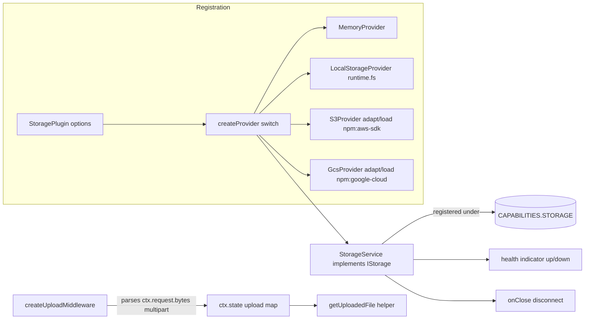

# Milestone 28 — Storage Plugin (`@hono-enterprise/storage-plugin`)

> **Status:** Planning. Branch: `feat/28-storage-plugin`. `main` is protected — all work
> (implementation + fixes) stays on this one branch until it merges via a single PR.

## 0. Objective & scope

Provide the file/object storage capability: a `StoragePlugin` that registers the committed
[`IStorage`](packages/common/src/services/storage.ts:29) contract under
[`CAPABILITIES.STORAGE`](packages/common/src/tokens.ts:79), backed by four pluggable
`StorageProvider` adapters (memory, local-FS, S3, GCS) plus a multipart upload middleware. The
package mirrors the proven M25 secrets-plugin shape (internal provider port + inject-or-lazy cloud
SDK seam + structural client facades). **No `@hono-enterprise/common` change** — the `IStorage`
interface, `SignedUrlOptions`, and the `STORAGE` token were all committed in M1; this milestone only
implements them.

- **In scope:** `StoragePlugin` factory; `StorageService` implementing `IStorage`; `MemoryProvider`
  (zero-dep default), `LocalStorageProvider` (over `runtime.fs`), `S3Provider` and `GcsProvider`
  (inject-or-lazy cloud SDKs); structural client facades `IAwsS3Client`/`IGcsClient`; a zero-dep
  multipart parser and an upload middleware that exposes parsed files via the per-request
  `ctx.state` bag plus a typed `getUploadedFile()` helper; a `storage` health indicator; full per-file
  90% coverage; PUBLIC_API.md/ROADMAP.md/ARCHITECTURE.md doc updates (including the conflict
  corrections in §2).
- **NOT this milestone:**
  - **Resilience** (circuit breaker/retry/timeout around `get`/`put`) → owned by **M27**
    (`packages/resilience-plugin`); a storage provider can be wrapped by a resilience-decorated
    provider later, but M28 ships no wrapping.
  - **Streaming `getStream()`** → the committed [`IStorage.get`](packages/common/src/services/storage.ts:44)
    returns a buffered `Uint8Array`; a `ReadableStream`-returning accessor would be a `common`
    contract change and is out of scope. Downloads use `IResponse.send`/`IResponse.stream` at the
    handler level on the buffered bytes (see §3.5).
  - **Cloudflare R2 as a first-class provider** → R2 speaks the S3 API; it is reached by configuring
    `S3Provider` with R2's endpoint/credentials. No separate `R2Provider`.
  - **Signed-URL revocation, bucket lifecycle, multipart *upload* (S3 MPU) protocol, presigned POST
    policies** → out of scope; only presigned GET URLs per the committed `getSignedUrl`.

## 1. Contracts verified from SOURCE (not names)

| Reference | Source (file:line) | Verified surface / fact |
| --------- | ------------------ | ----------------------- |
| `IStorage` | `packages/common/src/services/storage.ts:29` | Exactly 5 methods: `put(path, data: Uint8Array): Promise<void>`, `get(path): Promise<Uint8Array>` (**throws** if absent), `delete(path): Promise<boolean>`, `exists(path): Promise<boolean>`, `getSignedUrl(path, options: SignedUrlOptions): Promise<string>`. No `upload`/`middleware` method exists on it. |
| `SignedUrlOptions` | `packages/common/src/services/storage.ts:13` | `{ readonly expiresIn: number }` — single required field. |
| `STORAGE` token | `packages/common/src/tokens.ts:79` | `STORAGE: 'storage'`. Lowercase kebab, no colon — passes `createCapabilityToken` grammar. |
| common re-export | `packages/common/src/index.ts:153` | `export type { IStorage, SignedUrlOptions } from './services/storage.ts';` — import the contract from `@hono-enterprise/common`, not redefined. |
| `IRequest` | `packages/common/src/http.ts:32` | Has `json<T>()`, `text()`, `bytes(): Promise<Uint8Array>` (line 78), `headers`, `method`, `url`. **No `file()` method** — multipart access is not a committed request capability. |
| `IResponse` | `packages/common/src/http.ts:94` | `send(body?: Uint8Array)` (line 143) takes **only** a body — no `{ type }` option. `header(name, value)` chains (line 109). `stream(body: ReadableStream<Uint8Array>)` exists (line 169, M42). |
| `IRequestContext.state` | `packages/common/src/http.ts:207` | `readonly state: Map<string, unknown>` — "Request-scoped state for passing data between middleware and handlers." The committed home for parsed upload files (no `IRequest` extension needed). |
| `MiddlewareFunction` / `NextFunction` | `packages/common/src/http.ts:230` | `(ctx: IRequestContext, next: NextFunction) => Promise<void>`, `NextFunction = () => Promise<void>`. A middleware may short-circuit by responding without calling `next()`. |
| `IFileSystem` (for Local) | `packages/runtime` via `IRuntimeServices.fs?` | Provides `readFile`/`writeFile`/`stat`/`rm` (ROADMAP M3). `fs` is optional — absent on Cloudflare Workers. `LocalStorageProvider` throws at `connect()` when `ctx.runtime.fs` is undefined. |
| Provider-port precedent | `packages/secrets-plugin/src/interfaces/index.ts:159` | M25's internal `SecretProvider` port: `connect()`/`disconnect()`/`isReady()` + data methods, **NOT** exported from `src/index.ts`. M28 mirrors this as `StorageProvider`. |
| `hasMethods` helper | `packages/secrets-plugin/src/providers/shape.ts:16` | Reusable structural-shape validator; copied into `storage-plugin/src/providers/shape.ts`. |
| inject-or-lazy seam precedent | `packages/secrets-plugin/src/providers/aws-kms.ts:61` (`adaptAwsModule`), `:92` (`loadAwsModule`) | Pure `adapt(mod)` + `load()` returning the lazy `import('npm:…')`; the real-import path is guarded in a unit test. M28's S3/GCS providers follow this exactly. |
| Service precedent | `packages/secrets-plugin/src/services/secrets-service.ts:46` | `SecretsService implements ISecretManager` wraps a provider and centralizes the absence→throw conversion in ONE place. `StorageService` mirrors this for `get` (provider returns `Uint8Array \| null`-ish → service throws on absent). |
| Existing stub | `packages/storage-plugin/src/index.ts:1` | Currently `export {};` — a Milestone-0 stub. `packages/storage-plugin/deno.json:1` is the package stub (`name`, `version`, `exports`). |

## 2. Committed-doc conflicts — resolved here, shipped as named doc deliverables

| #  | Conflict | Resolution (picked side) | Doc deliverable (same PR) |
| -- | -------- | ------------------------ | ------------------------- |
| C1 | PUBLIC_API.md (`PUBLIC_API.md:2473-2492`) and ROADMAP.md (`ROADMAP.md:2918-2928`) show the upload surface as `storage.upload({ ... })` (a method on the resolved `IStorage`) and read the file back as `ctx.request.file('file')`. Neither exists on a committed contract: `IStorage` has no `upload`/`middleware` method (`packages/common/src/services/storage.ts:29`), and `IRequest` has no `file()` method (`packages/common/src/http.ts:32`). | `upload` is a **free exported middleware factory** `createUploadMiddleware(options): MiddlewareFunction` (NOT a method on `IStorage`, which we do not change). Parsed files are exposed through the committed per-request **`ctx.state`** bag (`packages/common/src/http.ts:207`) plus a typed helper **`getUploadedFile(ctx, fieldname)`** returning `UploadedFile \| undefined` — **not** via an `IRequest.file()` extension (extending `IRequest` would be a cross-cutting common+kernel+runtime change that violates one-package-per-milestone and couples a low-level HTTP contract to one plugin's convenience; `ctx.state` is the committed mechanism for middleware→handler data, satisfying interface segregation). | Edit `PUBLIC_API.md` §Storage and `ROADMAP.md` §M28 examples to `middleware: [createUploadMiddleware({ fieldname: 'file', maxSize: … })]` and `const file = getUploadedFile(ctx, 'file');` (after `import { getUploadedFile } from '@hono-enterprise/storage-plugin'`). |
| C2 | PUBLIC_API.md (`PUBLIC_API.md:2488-2492`) download example calls `ctx.response.send(file, { type: 'application/octet-stream' })`. The committed [`IResponse.send`](packages/common/src/http.ts:143) is `send(body?: Uint8Array)` — it takes **only** a body, no options object. | The committed `send(body)` signature is authoritative. Set the content type via the chaining `.header(name, value)` (`packages/common/src/http.ts:109`): `ctx.response.header('content-type', 'application/octet-stream').send(file)`. (The kernel already defaults to `application/octet-stream` when a body is sent and no content-type is set — `packages/kernel/src/context/response.ts:53-55` — so the `.header()` call is shown explicitly for clarity.) | Edit `PUBLIC_API.md` §Storage download example to the `.header('content-type', …).send(file)` form. |
| C3 | `IStorage.getSignedUrl` (`packages/common/src/services/storage.ts:66`) must be honored by every provider, but `MemoryProvider` and `LocalStorageProvider` have no real signing capability. An interface method an implementation cannot support must get an explicit, documented, tested behavior — not silence. | `MemoryProvider.getSignedUrl()` returns a deterministic synthetic URL `memory://<encoded-key>?expires=<epoch-seconds>` computed from `runtime.now()` — a documented **test/process affordance** (non-functional off-process, never grants real access). `LocalStorageProvider.getSignedUrl()` **throws** `Error('LocalStorageProvider does not support signed URLs; use the s3 or gcs provider')`. S3/GCS produce real presigned URLs. | Document per-provider `getSignedUrl` semantics in `PUBLIC_API.md` §Storage provider table and in the provider JSDoc. |

## 3. Design decisions



### 3.1 Internal `StorageProvider` port (not exported)

- **Decision:** A single internal port `StorageProvider` in `src/interfaces/index.ts`, mirroring M25's
  `SecretProvider` (`packages/secrets-plugin/src/interfaces/index.ts:159`). It adds
  `connect(): Promise<void>` / `disconnect(): Promise<void>` / `isReady(): boolean` lifecycle plus the
  five `IStorage` data methods, with `get` returning `Uint8Array | null` (`null` = absent) so the
  absence→throw conversion lives in ONE place (`StorageService`). `StorageProvider` is **NOT** exported
  from `src/index.ts` — the committed public contract is `IStorage`.
- **Why:** Keeps cloud-SDK lifecycle (lazy `connect`) behind the service; the service stays the only
  thing resolved under the token; matches the audited M25 seam exactly.
- **Test home:** `test/unit/storage-service.test.ts` asserts the service converts provider `null`→throw
  on `get` and delegates `put`/`delete`/`exists`/`getSignedUrl`.

### 3.2 Cloud-provider inject-or-lazy seam (S3, GCS)

- **Decision:** Each cloud provider exposes a **structural client facade** (`IAwsS3Client`,
  `IGcsClient`) in `src/interfaces/index.ts`, a pure `adapt<Sdk>Module(mod, options): IFacade`
  function, and a `load<Sdk>Module(): Promise<SdkModule>` that does the real
  `import('npm:<pkg>@<major>)`. The provider constructor accepts an injected facade via `options.client`
  (validated with `hasMethods`, copied from `packages/secrets-plugin/src/providers/shape.ts:16`); if
  absent it `await adapt(await load(), options)` in `connect()`. Real npm specifiers:
  - S3 — `npm:@aws-sdk/client-s3@^3` (`PutObjectCommand`/`GetObjectCommand`/`DeleteObjectCommand`/
    `HeadObjectCommand`) **and** `npm:@aws-sdk/s3-request-presigner@^3` (`getSignedUrl` for
    `GetObjectCommand`). `loadAwsS3Module()` returns `{ s3: S3Client-ctor module, presigner:
    presigner module }`.
  - GCS — `npm:@google-cloud/storage@^7` (`Storage` → `bucket().file()`; `file.getSignedUrl` for
    reads).
- **Why:** Honors AI_GUIDELINES §12.2 (heavy deps never hard); `adapt` is a pure function unit-tested
  with a fake SDK module (100% of branching logic covered offline); the real `import()` is exercised
  by one guarded test per provider (precedent: `packages/secrets-plugin/test/unit/aws-kms.test.ts:137`).
- **Test home:** `test/unit/s3-provider.test.ts` + `test/unit/gcs-provider.test.ts` drive `adapt*` with
  fakes (put→get read-back, delete returns boolean, exists, absent→get semantics, signed URL) and each
  ends with a guarded `it('load<Sdk>Module enters the real import path', …)` that catches a resolution
  failure as `Error` (no network, no side effects).

### 3.3 Upload surface: `ctx.state` + helper, not `IRequest.file()` / `IStorage.upload()`

- **Decision:** `createUploadMiddleware(options): MiddlewareFunction` reads the **already-buffered**
  `ctx.request.bytes()` (`packages/common/src/http.ts:78`) and parses `multipart/form-data` with an
  internal **zero-dependency** parser (`src/multipart/multipart-parser.ts`) that splits on the boundary
  extracted from `ctx.request.headers.get('content-type')`. It enforces `maxSize` (per file) and
  optional `allowedMimeTypes`, then stores `Map<fieldname, UploadedFile>` under the constant key
  `'storage-plugin:uploads'` in **`ctx.state`**. A typed exported helper
  `getUploadedFile(ctx, fieldname): UploadedFile | undefined` reads it back. `UploadedFile =
  { readonly name: string; readonly data: Uint8Array; readonly mimeType: string; readonly size: number }`.
  On missing field / oversize / wrong type / malformed body it short-circuits with a **400** response
  (no `next()`) — a mandatory short-circuit test asserts the handler never runs.
- **Why:** Avoids any `IRequest`/`IStorage` contract change (conflict C1); uses the committed
  per-request state bag; multipart parsing is purely a plugin convenience, so it belongs in plugin code,
  not the low-level request contract (interface segregation). The buffered-body assumption is exactly
  what the M28 ROADMAP note calls out (`ROADMAP.md:2879-2884` — the fetch model pre-reads the body).
- **Test home:** `test/unit/upload-middleware.test.ts` (parse → stash → read-back; oversize 400;
  missing field 400; short-circuit) and `test/unit/multipart-parser.test.ts` (pure transform with
  literal boundary bytes, HTML-entity-free raw byte assertions).

### 3.4 `getSignedUrl` per provider (honors contract surface honestly)

- **Decision:** S3 → real presigned GET URL via the presigner (`expiresIn` seconds); GCS →
  `file.getSignedUrl({ action: 'read', expires })`; Memory → synthetic `memory://…?expires=…` URL
  (`runtime.now()`-based); Local → documented throw (conflict C3). Every provider's `getSignedUrl`
  returns `Promise<string>` per the contract (Local rejects the promise — still `Promise<string>`).
- **Why:** A method an implementation cannot support gets an explicit, documented, tested behavior
  rather than silence.
- **Test home:** per-provider tests assert the S3/GCS facade receives the right presign call; Memory
  asserts the synthetic-URL shape; Local asserts the throw.

### 3.5 Downloads & streaming (M42)

- **Decision:** `get()` stays buffered per the committed contract (no `getStream()`). Handler-level
  downloads use `ctx.response.header('content-type', …).send(bytes)`; a handler MAY wrap bytes in a
  `ReadableStream` and call [`IResponse.stream()`](packages/common/src/http.ts:169) to be a named
  consumer of the M42 primitive, but since `get()` buffers first this is handler ergonomics, not a
  zero-copy path. True streaming is deferred (would need a new `IStorage` accessor — out of scope).
- **Why:** No `common` change; honors the M28 ROADMAP note about being an M42 consumer without
  over-promising zero-copy.
- **Test home:** `test/integration/storage-integration.test.ts` round-trips put→get→send through a real
  kernel `app.inject()` and asserts the response body bytes match.

### 3.6 Default provider + plugin options

- **Decision:** `provider` defaults to `'memory'` (zero-dep, every runtime incl. Cloudflare Workers —
  mirrors M25's `'env'` default and M26's `'memory'` default). Options shape mirrors
  `SecretsPluginOptions`: `StoragePluginOptions { provider?: StorageProviderType; options?:
  StorageProviderOptions }`. `StorageProviderOptions` is a union-consumed bag: `bucket`/`region`/
  `accessKeyId`/`secretAccessKey`/`endpoint?` (S3; `endpoint` enables R2/MinIO), `projectId` (GCS),
  `rootDir` (local), `client?: IAwsS3Client | IGcsClient` (injected facade union, each provider probes
  the shape it needs — precedent `packages/secrets-plugin/src/plugin/secrets-plugin.ts:177`).
- **Why:** Consistent with committed sibling plugins; `endpoint` makes R2/MinIO reachable via the S3
  API without a separate provider (closes the "R2 out of scope" gap cheaply).
- **Test home:** `test/unit/storage-plugin.test.ts` (default→memory; unknown provider throws; each
  provider wired; health `up`/`down`; `onClose` disconnect invoked).

## 4. Exported surface — every symbol names its consumer

| Exported symbol | Kind | Consumer / real code path that READS it |
| --------------- | ---- | --------------------------------------- |
| `StoragePlugin` | factory (`IPlugin`) | `app.register(StoragePlugin({…}))` → registers `StorageService` under `CAPABILITIES.STORAGE`; health indicator; `onClose`. |
| `StorageService` | class (`implements IStorage`) | Constructed by `StoragePlugin`; resolved by `ctx.services.get<IStorage>(CAPABILITIES.STORAGE)`. |
| `MemoryProvider` | class (`StorageProvider`) | `createProvider('memory', …)` default path; direct construction in tests/docs. |
| `LocalStorageProvider` | class (`StorageProvider`) | `createProvider('local', …)`; uses `runtime.fs`. |
| `S3Provider` | class (`StorageProvider`) | `createProvider('s3', …)`. |
| `GcsProvider` | class (`StorageProvider`) | `createProvider('gcs', …)`. |
| `createUploadMiddleware` | factory (`MiddlewareFunction`) | Route `middleware: [createUploadMiddleware({…})]`; writes `ctx.state` upload map. |
| `getUploadedFile` | fn (`UploadedFile \| undefined`) | Route handler reads `const file = getUploadedFile(ctx, 'file')`. |
| `UploadedFile` | type | Return type of `getUploadedFile`; handler reads `.name`/`.data`/`.mimeType`/`.size`. |
| `IAwsS3Client` | interface (structural facade) | Injected via `options.client`; validated by `hasMethods`; alternative to the lazy `@aws-sdk/client-s3` import. |
| `IGcsClient` | interface (structural facade) | Injected via `options.client`; alternative to the lazy `@google-cloud/storage` import. |
| `StoragePluginOptions` | type | Argument of `StoragePlugin(options)`. |
| `StorageProviderType` | type union | Discriminant in `createProvider`; narrows the options bag. |
| `StorageProviderOptions` | type | `StoragePluginOptions.options`. |
| `{Memory,LocalStorage,S3,Gcs}ProviderOptions` | types | Constructor args of each provider (direct construction). |
| `UploadMiddlewareOptions` | type | Argument of `createUploadMiddleware`. |
| `IStorage`, `SignedUrlOptions` | re-export from `@hono-enterprise/common` | Consumers import the contract from the plugin barrel or from common. |

> **Not exported** (internal seams, like M25's `SecretProvider`): `StorageProvider` port,
> `adaptAwsS3Module`/`loadAwsS3Module`/`adaptGcsModule`/`loadGcsModule`, the `*SdkModule` shapes,
> `hasMethods`, and the multipart parser. The pure `adapt`/`load` functions and the parser are still
> unit-tested directly via relative import (precedent: `aws-kms.test.ts` imports them).

### 4.1 Options — every option names its consumer

| Option | Consumer | Behavior (per implementation) |
| ------ | -------- | ----------------------------- |
| `provider` (default `'memory'`) | `createProvider` switch | Selects the backend; unknown value throws at registration. |
| `options.bucket` | `S3Provider` | S3 bucket name for put/get/delete/head/presign. |
| `options.region` | `S3Provider` (lazy client config) | AWS region. |
| `options.accessKeyId` / `secretAccessKey` | `S3Provider` | Static creds for the lazy client; omitted → SDK default credential chain. |
| `options.endpoint` | `S3Provider` | Custom S3 endpoint (R2/MinIO); omitted → AWS default. |
| `options.projectId` | `GcsProvider` | GCP project for bucket/file paths. |
| `options.rootDir` | `LocalStorageProvider` | Filesystem root; paths are contained (no `..` escape) via join+normalize. |
| `options.client` (union facade) | `S3Provider`/`GcsProvider` | Injected facade bypasses the lazy import; validated by `hasMethods`. |
| `options.cacheTtl` | NOT added | Storage has no read-cache contract on `IStorage`; cut (dead option) — unlike secrets, `IStorage.get` has no cache affordance. |
| `upload.fieldname` (default `'file'`) | `createUploadMiddleware` | multipart part name to extract. |
| `upload.maxSize` (default `10 * 1024 * 1024`) | `createUploadMiddleware` | Per-file byte cap; oversize → 400 short-circuit. |
| `upload.allowedMimeTypes?` | `createUploadMiddleware` | Optional allow-list; mismatch → 400 short-circuit. |
| `upload.maxFiles?` | `createUploadMiddleware` | Optional cap on parsed parts; excess → 400 short-circuit. |

## 5. Implementation files

| File | Purpose |
| ---- | ------- |
| `src/index.ts` | Barrel: factory, service, providers, middleware/helper, option + facade types, re-export `IStorage`/`SignedUrlOptions`. Replaces the M0 stub. |
| `src/interfaces/index.ts` | `StorageProviderType`, `StorageProviderOptions`, `StoragePluginOptions`, per-provider option types, `IAwsS3Client`/`IGcsClient` facades, `UploadedFile`/`UploadMiddlewareOptions`, internal `StorageProvider` port. |
| `src/providers/shape.ts` | `hasMethods` structural validator (copied from M25). |
| `src/services/storage-service.ts` | `StorageService implements IStorage`; delegates to `StorageProvider`; centralizes absent→throw on `get`; passes `expiresIn` to `getSignedUrl`. |
| `src/providers/memory-provider.ts` | In-memory `Map<string, Uint8Array>`; zero-dep; synthetic `memory://` signed URL. |
| `src/providers/local-provider.ts` | Over `runtime.fs` (readFile/writeFile/stat/rm); path containment; signed-URL throw. |
| `src/providers/s3-provider.ts` | `adaptAwsS3Module`/`loadAwsS3Module`/`S3Provider`; presigned GET via `@aws-sdk/s3-request-presigner`. |
| `src/providers/gcs-provider.ts` | `adaptGcsModule`/`loadGcsModule`/`GcsProvider`; `file.getSignedUrl`. |
| `src/multipart/multipart-parser.ts` | Zero-dep `parseMultipart(body: Uint8Array, contentType: string): ParsedPart[]` (boundary extraction + part/name/mime split). |
| `src/middleware/upload-middleware.ts` | `createUploadMiddleware(options)`, `getUploadedFile(ctx, fieldname)`, `UploadedFile`, `ctx.state` key constant. |
| `src/plugin/storage-plugin.ts` | `StoragePlugin(options)` factory; `createProvider` switch; async `register` (connect provider, register `StorageService`, health indicator, `onClose` disconnect). |
| `packages/storage-plugin/deno.json` | (Existing stub) keep `exports: { ".": "./src/index.ts" }`; version `0.1.0`. No new hard deps — cloud SDKs are lazy `npm:` imports only. |

## 6. Test plan (every `src/` file mapped; per-file 90% bar)

| Test file | src covered | Key assertions (and the signature each call type-checks against) |
| --------- | ----------- | ---------------------------------------------------------------- |
| `test/unit/barrel-exports.test.ts` | `src/index.ts` | Every public symbol is exported; `IStorage`/`SignedUrlOptions` re-export present. |
| `test/unit/shape.test.ts` | `src/providers/shape.ts` | `hasMethods` accepts valid shape, rejects null/missing/partial. |
| `test/unit/storage-service.test.ts` | `src/services/storage-service.ts` | Delegates put/get/delete/exists/getSignedUrl to a fake provider; **absent get → throws** (`Promise<Uint8Array>`); passes `expiresIn` through. |
| `test/unit/memory-provider.test.ts` | `src/providers/memory-provider.ts` | put→get read-back; delete returns `true`/`false`; exists; getSignedUrl returns `memory://…?expires=…`; not-connected rejects. |
| `test/unit/local-provider.test.ts` | `src/providers/local-provider.ts` | Round-trip over a fake `IFileSystem`; path-containment (no `..` escape); signed URL **throws**; missing-file get throws; `connect` throws when `runtime.fs` absent. |
| `test/unit/s3-provider.test.ts` | `src/providers/s3-provider.ts` | `validateAwsS3Client` shape; `adaptAwsS3Module` over a fake SDK module (put→get read-back, delete bool, exists, absent, presign call args, `ResourceNotFoundException`→absent); not-connected rejects; **guarded real-import** `loadAwsS3Module()` resolves or rejects as `Error`. |
| `test/unit/gcs-provider.test.ts` | `src/providers/gcs-provider.ts` | `validateGcsClient`; `adaptGcsModule` over a fake Storage (save/download/delete/exists/getSignedUrl); gRPC NOT_FOUND→absent; not-connected rejects; **guarded real-import** `loadGcsModule()`. |
| `test/unit/multipart-parser.test.ts` | `src/multipart/multipart-parser.ts` | Pure transform: known boundary → `ParsedPart[]` with correct name/mime/bytes (raw byte assertions); missing-boundary throws; empty body. |
| `test/unit/upload-middleware.test.ts` | `src/middleware/upload-middleware.ts` | Parses bytes → `ctx.state` → `getUploadedFile` read-back; oversize → **400 short-circuit, `next()` NOT called, handler cannot overwrite**; missing field → 400; allowedMime mismatch → 400. |
| `test/unit/storage-plugin.test.ts` | `src/plugin/storage-plugin.ts` | Default `provider` = `'memory'`; unknown provider throws; each backend wired via `createProvider`; registers `IStorage` under `CAPABILITIES.STORAGE`; health `up` after connect / `down` before; `onClose` disconnect invoked (drives the fake context fixture). |
| `test/integration/storage-integration.test.ts` | cross-file | Real kernel `app.inject()` round-trip: POST `/upload` (multipart via middleware) → `storage.put` → GET `/files/:key` → `storage.get` → `ctx.response.header('content-type', …).send(bytes)`; response bytes equal input. |
| `test/fixtures/fake-context.ts` | — | Fake `IPluginContext` (services/health/lifecycle/middleware) + fake `IRuntimeServices` (`env`, `hrtime`, optional `fs`), mirroring `packages/secrets-plugin/test/fixtures/fake-context.ts`. Excluded from coverage. |

> External-dep coverage rule honored: S3/GCS branching logic is fully exercised through the pure
> `adapt*` functions + fake SDK modules; each adds one guarded REAL-import test
> (`it('load…Module enters the real import path')`, precedent `aws-kms.test.ts:137`). No test contacts
> a real cloud bucket.

## 7. Verification gates

```bash
git branch --show-current   # MUST be feat/28-storage-plugin, never main
deno task check:plan        # this plan lints clean
deno task fmt:check
deno task lint
deno task check
deno task test
deno task test:coverage     # read ANSI-stripped per-file table; ≥90% branch/function/line every src file
```

Grep gate (must be empty) before reporting done:
`grep -rn "new Function\|eval(\| require(\|as any\|@ts-ignore\|Date.now()\|globalThis.__" packages/storage-plugin/src`

## 8. Risks & mitigations

- **Risk:** Zero-dep multipart parser is subtle (CRLF boundaries, preamble, last-boundary). →
  **Mitigation:** implement against RFC 7578 with explicit unit tests for boundary extraction, trailing
  CRLF, empty body, and a part whose value contains the boundary substring; assert raw bytes.
- **Risk:** S3 presigning needs a **second** lazy package (`s3-request-presigner`), doubling the
  lazy-load surface. → **Mitigation:** `loadAwsS3Module()` returns both modules in one dynamic import
  pair; one guarded real-import test asserts both constructors resolve; `adapt` is pure and fully fake-tested.
- **Risk:** `exactOptionalPropertyTypes` — assigning `undefined` to optional option fields. →
  **Mitigation:** mirror M25's `buildAwsConfig` pattern (only set fields when defined) in each provider.
- **Risk:** Reviewers expect `ctx.request.file()` / `storage.upload()` from PUBLIC_API. →
  **Mitigation:** conflict C1 is resolved and the PUBLIC_API/ROADMAP edits are a named PR deliverable;
  the plan spells out the `ctx.state` + `getUploadedFile` replacement.
- **Risk:** `IStorage.get` buffers large objects (memory blowup on big downloads). → **Mitigation:**
  documented limitation (§3.5); streaming `getStream()` is explicitly out of scope (would change
  `common`); handlers can chunk via `IResponse.stream()`.

## 9. Out of scope

- Resilience wrapping of storage calls → **M27** (`packages/resilience-plugin`).
- Streaming `IStorage.getStream()` / zero-copy downloads → future `common` contract extension
  (deferred; not this milestone).
- Cloudflare R2 as a distinct provider → reached via `S3Provider` + `options.endpoint`.
- S3 multipart-upload (MPU) protocol, presigned POST policies, bucket lifecycle/replication config,
  signed-URL revocation → out of scope; only presigned GET URLs per `getSignedUrl`.
- Azure Blob / Backblaze B2 providers → not in the M28 provider list (ROADMAP §M28 lists S3/GCS/
  local/memory only); addable later behind the same `StorageProvider` seam.
