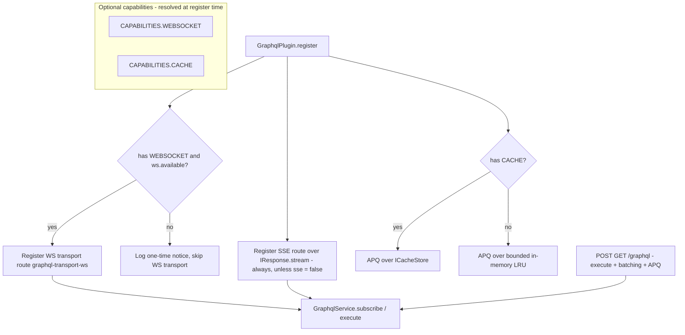

# Milestone 51b — GraphQL Subscriptions, Batching, and Persisted Queries (`@hono-enterprise/graphql-plugin`)

> **Status:** Planning. Branch: `feat/51b-graphql-subscriptions`. `main` is protected — all work (implementation + fixes) stays on this one branch until it merges via a single PR.

## 0. Objective & scope

Milestone 51 shipped a complete GraphQL-over-HTTP capability (schema-first + code-first, media-type negotiation, the status watershed, a bounded document cache, error masking, depth limiting, the introspection switch, GraphiQL, the `graphql` health indicator, and the `npm:graphql@^16` inject-or-lazy seam). It deliberately DEFERRED everything that is not a request/response exchange: subscriptions, request batching, Automatic Persisted Queries, custom scalar resolvers in the schema-first arm, and the starter arm. M51b closes exactly those gaps. It EXTENDS `packages/graphql-plugin` — no new package, no new capability token (the `GRAPHQL` token from M1 stays the only one).

- **In scope:**
  - `graphql-transport-ws` (the `graphql-ws` sub-protocol) over the OPTIONAL `CAPABILITIES.WEBSOCKET` capability, implemented in-package over `IWebSocketService.route()` — no new npm dependency.
  - GraphQL-over-SSE in **distinct-connections mode**, built directly on M42's `IResponse.stream()` — needs no other plugin at all.
  - Request batching (an array request body) and Automatic Persisted Queries (APQ), reusing `CAPABILITIES.CACHE` for the hash→document map with a bounded in-process fallback when the cache capability is absent.
  - Custom scalar resolvers in the schema-first arm, replacing M51's `attach-resolvers` throw.
  - A `graphql` arm on all three starter tiers (M36 starters).
  - Two flagged `@hono-enterprise/common` widenings: `GraphqlRequestParams.extensions` (APQ) and `IGraphqlService.subscribe()` + a `GraphqlSubscriptionOutcome` type (subscriptions as a first-class operation kind).
- **NOT this milestone:**
  - A migration to `graphql@17` — deferred to its own milestone (see §3.1). M51b stays on `npm:graphql@^16`.
  - Incremental delivery (`@defer`/`@stream`) — experimental in graphql 17, owned by the graphql-17 migration milestone.
  - Federation, schema stitching, a gateway — a separate milestone; nothing here forecloses it.
  - Client-side GraphQL — `packages/sdk` (M35) owns HTTP clients.
  - The HTTP path at `POST/GET /graphql` still refuses subscriptions (the tested `400 SUBSCRIPTIONS_NOT_SUPPORTED_OVER_HTTP` throw in `executor.ts` stays); subscriptions ride the dedicated transports only.

## 1. Contracts verified from SOURCE (not names)

| Reference | Source (file:line) | Verified surface / fact |
| --------- | ------------------ | ----------------------- |
| `IWebSocketService.route()` + `WebSocketRouteOptions.protocols` | `packages/common/src/services/websocket.ts:361` (:318-326 `protocols?: readonly string[]`) | `route(path, handlers, options?)` is synchronous and accepts a sub-protocol allow-list; the first client-requested protocol in the list is echoed back. **No `common` widening needed for protocols** — confirmed. |
| `WebSocketHandlers` / `IWebSocketConnection` | `packages/common/src/services/websocket.ts:281-311`, :157-194 | `onOpen(conn, ctx)`, `onMessage(conn, data)`, `onClose(conn, event)`, `onError(conn, error)`; `conn.sendJson<T>(payload)`, `conn.send(string\|Uint8Array)`, `conn.close(code?, reason?)` accepts arbitrary close codes, `conn.data: Map`, `conn.isOpen`, `WebSocketConnectionContext.{query, headers, protocol}`. |
| `WebSocketService.route()` throws when unavailable; `available` getter | `packages/websocket-plugin/src/services/websocket-service.ts:217-224` (:218-220 throws `WebSocketUnavailableError`), :200-202 (`available`) | The graphql plugin MUST gate `route()` on `ws.available` (false under `app.inject()` on Node/Bun and wherever the adapter has no upgrade seam). |
| Optional-capability resolution pattern | `packages/common/src/registry.ts:96` (`get<T>: T`, throws if absent), :113 (`has(token): boolean`); precedent `packages/websocket-plugin/src/plugin/websocket-plugin.ts:73-75` | Optional resolution is `ctx.services.has(token) ? ctx.services.get<T>(token) : undefined`, plus `optionalDependencies: [token]` so the provider orders first. |
| `IResponse.stream()` — the SSE primitive | `packages/common/src/http.ts:159-175` | `stream(body: ReadableStream<Uint8Array>): HandlerResult`. Free on every runtime (Node/Deno/Bun/Workers). |
| `IRequestContext.signal` — client-disconnect detection | `packages/common/src/http.ts:205-234` (:233) | A live `AbortSignal`; SSE pumps stop on abort so producers do not leak. |
| `ICacheStore` under `CAPABILITIES.CACHE` | `packages/common/src/services/cache.ts:19-55` | `get<T>(key): Promise<T\|null>`, `set<T>(key, value, ttlSeconds?)`, `delete`, `has`, `clear`. APQ maps `apq:<sha256Hash>` → query string. |
| `GraphqlRequestParams` — `extensions` omitted | `packages/common/src/services/graphql.ts:22-31` (:29-30 commented-out) | M51 left `extensions` out ("nothing reads it"). M51b adds it (flagged widening). |
| `IGraphqlService` — no `subscribe` yet | `packages/common/src/services/graphql.ts:94-118` | Has `execute(params, requestContext?, method?): Promise<GraphqlExecutionOutcome>`, `endpoint`, `cachedDocumentCount`. M51b adds `subscribe()` (flagged widening). |
| `GraphqlRuntime.subscribe` already adapted + `GraphqlSubscribeResultLike` | `packages/graphql-plugin/src/interfaces/graphql-runtime.ts:107-134` (:127-134), loader `packages/graphql-plugin/src/runtime/graphql-loader.ts:20` | `subscribe(args): Promise<GraphqlExecutionResultLike \| AsyncIterable<GraphqlExecutionResultLike>>` is already wired through `adaptGraphqlModule` and the lazy importer. **No loader change needed for subscriptions.** |
| `GraphqlSchemaLike.getSubscriptionType()` | `packages/graphql-plugin/src/interfaces/graphql-runtime.ts:9-18` (:12) | The facade already exposes the subscription root type, so an operation-kind guard for subscriptions is expressible. |
| Executor subscription throw (the M51b entry point) | `packages/graphql-plugin/src/execution/executor.ts:118-131` | `checkOperation` returns the tested `400 SUBSCRIPTIONS_NOT_SUPPORTED_OVER_HTTP` for the HTTP path. This throw STAYS for HTTP; the transports bypass `checkOperation`'s HTTP branch. |
| `attach-resolvers` scalar throw (the M51b entry point) | `packages/graphql-plugin/src/schema/attach-resolvers.ts:49-54` | A resolver-map type with no `getFields` throws "Cannot attach resolvers to scalar type". M51b replaces the throw with scalar method attachment. |
| `npm:graphql@^16` pin + resolved version | `packages/graphql-plugin/src/runtime/graphql-loader.ts:37,72`; `deno.lock:45-46,1248` | Pin is `npm:graphql@^16`; both `npm:graphql@*` and `npm:graphql@16` resolve to **16.14.2**. |
| `parsePostBody` rejects arrays (batching entry point) | `packages/graphql-plugin/src/http/request-parser.ts:37` | `Array.isArray(body)` → `BAD_REQUEST`. Batching is detected at the handler boundary BEFORE `parsePostBody`, so single-element parsing is untouched. |
| CAPABILITIES token values | `packages/common/src/tokens.ts:51` (`CACHE`), :103-105 (`SSE`, `WEBSOCKET`), :138 (`GRAPHQL`) | All lowercase-kebab values; `WEBSOCKET = 'websocket'`, `CACHE = 'cache'`, `GRAPHQL = 'graphql'`, `SSE = 'sse'`. |
| Starter arm pattern | `packages/starters/rest-starter/src/options.ts:74-160`, `app.ts:33-64` | Optional arms are `…?: <Plugin>Options`; `buildRestPlugins` spreads `...(options.x ? [XPlugin(options.x)] : [])`; gated because the plugin needs app-supplied config. |
| `graphql-transport-ws` protocol message frames | PROTOCOL.md (enisdenjo/graphql-ws) | Frames: `connection_init`/`connection_ack`/`ping`/`pong` (bidir), `subscribe` (client→server, carries `id` + `payload:{operationName?, query, variables?, extensions?}`), `next`/`error`/`complete` (server→client, carry `id`). Close codes: `4400` invalid, `4401` unauthorized (subscribe-before-ack), `4403` forbidden, `4408` init-timeout, `4409` duplicate id, `4429` too many inits. Single-result operations send at most one `next` then `complete`. |

## 2. Committed-doc conflicts — resolved here, shipped as named doc deliverables

| #  | Conflict | Resolution (picked side) | Doc deliverable (same PR) |
| -- | -------- | ------------------------ | ------------------------- |
| C1 | `GraphqlRequestParams.extensions` is documented in `common` source as "reserved for M51b" but is commented out (`services/graphql.ts:29-30`), so it is not actually importable. | Uncomment and add `extensions?: Record<string, unknown>;` (APQ reads it). | `PUBLIC_API.md` common GraphQL row + the new `extensions` JSDoc. |
| C2 | ROADMAP M51b (:5111-5113) asserts "no further `common` widening is expected" for WebSocket protocols. Verified TRUE for protocols (`WebSocketRouteOptions.protocols` already exists). But APQ needs `GraphqlRequestParams.extensions` (ROADMAP :5116-5118 acknowledges it) and subscriptions need `IGraphqlService.subscribe` (not named in the ROADMAP). | Add BOTH as flagged `common` widenings; the ROADMAP's "no widening" claim was scoped to the WS protocol surface and is not contradicted. | `PUBLIC_API.md` common GraphQL section (new `extensions`, `subscribe`, `GraphqlSubscriptionOutcome`); `ARCHITECTURE.md` GraphQL note. |
| C3 | ROADMAP :5082-5084 says subscriptions over HTTP answer a tested `400`. M51b adds transports but MUST NOT change that HTTP behavior. | The `checkOperation` subscription throw (`executor.ts:118-131`) STAYS for `POST/GET /graphql`. Subscriptions are reachable ONLY via the dedicated WS/SSE routes. | `PUBLIC_API.md` + `packages/graphql-plugin/README.md` state the HTTP path still refuses subscriptions. |

## 3. Design decisions

### 3.1 graphql version — stay on `npm:graphql@^16`

- **Decision:** Keep the `npm:graphql@^16` pin in `runtime/graphql-loader.ts` (resolved 16.14.2). Do NOT migrate to graphql 17 in this milestone.
- **Why:** graphql 17 (released 2026-06-15) is a 46-breaking-change, 41-new-feature major that separates stable single-result execution (`execute`) from experimental incremental delivery (`experimentalExecuteIncrementally`) and splits input coercion from diagnostic validation. The in-package `GraphqlModuleLike`/`GraphqlRuntime` facade casts every graphql export (`graphql-loader.ts:36-53`), so a migration re-verifies the entire facade, every depth-limit/introspection rule shape, and the schema builders — a scope larger than this milestone. Crucially, graphql 16's `subscribe()` ALREADY returns the `Promise<ExecutionResult | AsyncIterable<ExecutionResult>>` shape M51b needs (verified in `GraphqlSubscribeResultLike`, `graphql-runtime.ts:107-134`), and incremental delivery (`@defer`/`@stream`) is experimental in 17 and is NOT in M51b's transport scope. The version stays controlled by the single `npm:graphql@^16` specifier in the loader, so the migration is a later, self-contained milestone.
- **Test home:** `test/unit/graphql-real-import.test.ts` (existing) continues to guard the real import path against `npm:graphql@^16`; a new assertion pins that `runtime.subscribe` is a function after load.

### 3.2 WebSocket transport — implement `graphql-transport-ws` in-package, no npm dependency

- **Decision:** Implement the `graphql-transport-ws` protocol directly over `IWebSocketService.route(path, handlers, { protocols: ['graphql-transport-ws'] })`. Do NOT depend on the `graphql-ws` npm package.
- **Why:** §12.2 keeps heavy deps inject-or-lazy, and the protocol is small and fully specified (PROTOCOL.md — 8 message types, a handful of close codes). `IWebSocketService.route()` already exposes the exact primitives the state machine needs (`onOpen`/`onMessage`/`onClose`/`onError`, `conn.sendJson`, `conn.close(code, reason)`, `conn.data`, sub-protocol negotiation). Adding `graphql-ws` would introduce a runtime dependency into a JSR-published package's graph for a protocol we can implement in ~one module, and it would fight the framework's normalized connection abstraction. Registering with `protocols: ['graphql-transport-ws']` makes M46 negotiate and echo the sub-protocol (verified `WebSocketRouteOptions.protocols`, `websocket.ts:318-326`).
- **State machine:** `connection_init` → server replies `connection_ack` (one-shot; a second init → close `4429`); a `connectionInitWaitMs` timer closes `4408` if no init arrives; `ping`→`pong` (bidirectional; may be used as heartbeat when `websocket.heartbeatMs > 0`); `subscribe` (id + payload) → per-connection `Map<id, AsyncIterator>` registry; a duplicate id → close `4409`; a `subscribe` before `connection_ack` → close `4401`; an invalid frame → close `4400`; `next`/`error`/`complete` are server→client. A client `complete` (or `onClose`) stops and releases the iterator for that id. Supports ALL operation kinds: a `subscription` operation uses `service.subscribe`; a `query`/`mutation` uses `service.execute` and emits at most one `next` then `complete`.
- **Optional-capability behavior:** resolve `CAPABILITIES.WEBSOCKET` via `ctx.services.has` + `get`. If the capability is absent, or `ws.available === false` (e.g. `app.inject()` on Node/Bun, or no upgrade-capable adapter), the WS transport is NOT registered and the plugin logs a one-time notice; the rest of the plugin (HTTP, SSE, APQ) is unaffected. `optionalDependencies: [CAPABILITIES.WEBSOCKET]`.
- **Test home:** `test/unit/transport-ws-protocol.test.ts` (pure frame codec + close-code/state decisions), `test/unit/graphql-ws-handler.test.ts` (state machine against a fake `IWebSocketConnection`), and a real-socket e2e on Deno driving a `graphql-ws`-shaped client.

### 3.3 SSE transport — distinct-connections mode over `IResponse.stream()`, no SSE-plugin dependency

- **Decision:** Build the SSE transport in-package on M42's `IResponse.stream()`. Do NOT depend on `CAPABILITIES.SSE` (the SSE plugin).
- **Why:** The ROADMAP (:5114-5115) says the SSE transport "needs no other plugin at all." Distinct-connections mode is one subscription per HTTP connection (no multiplexing protocol), which maps directly onto a `ReadableStream<Uint8Array>` flushed through `ctx.response.stream(rs)` (`http.ts:159-175`). Depending on the SSE plugin would add a capability coupling and a broadcast-channel abstraction the per-subscription stream does not need.
- **Wire grammar:** `Content-Type: text/event-stream`; each GraphQL result is an SSE event `event: next\ndata: <JSON ExecutionResult>\n\n`; stream end is `event: complete\ndata:\n\n`; an in-band `:keep-alive\n\n` comment every `sse.heartbeatMs`. An immediate pre-stream error (validation failure, non-subscription-but-not-requested, etc.) is answered as a normal buffered GraphQL JSON error (the watershed status) BEFORE the stream opens, so the client receives a standard error envelope, not a half-open event stream. On `ctx.signal` abort (client disconnect) the producer stops iterating and the controller closes; the iterator's `return()` is invoked so a generator-based `subscribe` source cleans up.
- **Operation kinds:** supports `query`/`mutation` (one `next` then `complete`) and `subscription` (many `next` then `complete`), matching the WS transport.
- **Test home:** `test/unit/sse-frame.test.ts` (pure SSE encoder), `test/unit/graphql-sse-handler.test.ts` (stream lifecycle against a fake response + a controllable `AsyncIterable`), and an e2e over `app.fetch` reading the streamed body incrementally.

### 3.4 Subscriptions execution seam — `IGraphqlService.subscribe()` on the committed contract

- **Decision:** Add `subscribe(params, requestContext?, method?): Promise<GraphqlSubscriptionOutcome>` to `IGraphqlService` in `common` (flagged widening), and a discriminated `GraphqlSubscriptionOutcome`:
  ```
  GraphqlSubscriptionOutcome =
    | { status: number; streaming: false; result: GraphqlExecutionResult }   // immediate request error (parse/validate/guard)
    | { status: number; streaming: true;  result: AsyncIterable<GraphqlExecutionResult> } // live subscription
  ```
  `GraphqlService.subscribe` reuses the SAME parse → operation-guard → validate → maskErrors pipeline as `execute` (the new `src/execution/subscribe.ts`), then hands the validated document to `runtime.subscribe`. The transports narrow on `streaming` (no `Symbol.asyncIterator` sniffing).
- **Why:** Subscriptions are a first-class GraphQL operation kind; the committed service contract should express the full capability (`execute` for query/mutation, `subscribe` for subscriptions), mirroring how M14c exposed `request`/`respond` on `IMessageBroker`. Keeping `subscribe` concrete-only would hide the capability from any consumer that resolves `CAPABILITIES.GRAPHQL` (e.g. a future custom transport). The `streaming` discriminator mirrors `ResponseSnapshot` (`http.ts:338-350`) so the transports narrow with a single boolean, identically to how cache middleware already does.
- **Test home:** `test/unit/subscribe.test.ts` (immediate-error and live-stream branches, both under a non-default `maskInternalErrors` config), and the transport handler tests assert the same masking on the wire.

### 3.5 Request batching — array body → array of outcomes at the handler boundary

- **Decision:** Detect `Array.isArray(body)` in `handleGraphqlPost` AFTER the JSON parse and BEFORE `parsePostBody`; when it is an array, parse+execute each element via the existing `parsePostBody`/`service.execute` and answer a JSON array `[{ data?, errors? }, …]`. A non-array body takes the existing single-request path unchanged.
- **Why:** The GraphQL batch convention (one request, N independent operations, one array response). The existing single-element parser (`request-parser.ts:37`) rejects arrays, so batching is handled at the handler boundary and the parser stays single-purpose. The batch response is `200` (each element carries its own errors), matching every batch implementation. `GET` never batches (no body).
- **Bounds:** `maxBatchSize` (default 25, `0` disables batching and an array body then answers a tested `400`). Each element is validated as an object before parsing. A batch is a pure sequential `Promise.all` over independent executions — no cross-element sharing.
- **Test home:** `test/unit/batch-handler.test.ts` (array → array; mixed successes/errors; oversized batch → 400; non-array still single).

### 3.6 Automatic Persisted Queries — `extensions` over `CAPABILITIES.CACHE` with an in-memory fallback

- **Decision:** Add `GraphqlRequestParams.extensions?: Record<string, unknown>` to `common` (C1). A pure `extractPersistedQuery(extensions)` reads `{ version, sha256Hash }` from `extensions.persistedQuery` (only `version === 1` is honored; anything else is ignored — APQ is opt-in per request). An `ApqResolver` runs BEFORE execution:
  - if the request carries a `query`, persist `apq:<sha256Hash>` → query (when a hash is also present), then execute normally;
  - if the request carries a hash but NO `query`, look it up; on a hit, inject the cached query and execute; on a miss, short-circuit with `{ errors: [{ message: 'Persisted query not found', extensions: { code: 'PERSISTED_QUERY_NOT_FOUND' } }] }` under the negotiated media type — the standard APQ retry signal.
- **Why:** ROADMAP :5116-5118 names APQ + `extensions` + `CAPABILITIES.CACHE`. Reusing the cache capability keeps the hash→document map durable/cluster-shared when a cache store (Redis) is registered. When `CAPABILITIES.CACHE` is absent (no cache-plugin), APQ falls back to a bounded in-process LRU (`Map` + insertion-order eviction, `maxEntries` default 1000) so APQ still works — the optional-capability story is graceful, not a hard dependency. APQ applies to EVERY transport (HTTP POST, WS `subscribe` payload, SSE), because all three now thread `GraphqlRequestParams` (which gains `extensions`) through one execution entry point.
- **Config:** `apq?: GraphqlApqOptions | false` — `false` disables; default enabled with `ttlSeconds: 300` (cache-store path) and `maxEntries: 1000` (in-memory fallback). The cache key is always namespaced `apq:` so a shared store is not polluted.
- **Test home:** `test/unit/persisted-query.test.ts` (pure extraction + version gating), `test/unit/apq-resolver.test.ts` (hit/miss/persist/fallback-to-in-memory/disable), and an integration test driving the full HTTP path through the APQ retry handshake.

### 3.7 Custom scalar resolvers — attach `serialize`/`parseValue`/`parseLiteral` instead of throwing

- **Decision:** In the schema-first arm, when `attach-resolvers` meets a resolver-map type whose schema type has no `getFields` (a scalar), narrow it to a new `GraphqlScalarTypeLike` facade and assign `serialize`/`parseValue`/`parseLiteral` from the entry (only the members the entry supplies). The M51 throw (`attach-resolvers.ts:49-54`) is replaced.
- **Why:** graphql 16's `GraphQLScalarType` exposes `serialize`/`parseValue`/`parseLiteral` as settable properties; `buildSchema` creates custom scalars with identity defaults, so overriding the three methods is the documented way to wire custom scalar behavior. The discriminator is the SCHEMA TYPE (scalar vs object), not the entry shape — robust against a scalar whose entry happens to omit one method.
- **New types:** `GraphqlScalarResolver { serialize?, parseValue?, parseLiteral? }` (exported for the resolver map) and internal `GraphqlScalarTypeLike` added to `interfaces/graphql-runtime.ts`. `ResolverMap`'s value is widened to a union of the field-resolver map and `GraphqlScalarResolver`.
- **Test home:** `test/unit/scalar-resolvers.test.ts` (attach all three; attach a subset; object type still attaches field resolvers; unknown scalar type still throws), and the existing `build-schema`/`attach-resolvers` tests extended to cover the scalar path.

### 3.8 Starter arm — `graphql?: GraphqlPluginOptions` on all three tiers

- **Decision:** Add a gated `graphql?: GraphqlPluginOptions` arm to `RestStarterOptions`, threaded through `buildRestPlugins` (`…(options.graphql ? [GraphqlPlugin(options.graphql)] : [])`). Inherited by the microservice and full-stack tiers through their existing `extends RestStarterOptions` chain — no new gate logic per tier, identical to how `database`/`auth`/`session` are gated.
- **Why:** M51's out-of-scope note (:5092-5093) deferred the starter arm until "the option shape has settled." With subscriptions/APQ/scalars settled above, the arm is now expressible. It is gated because the plugin cannot boot without an application-supplied schema (`typeDefs`+`resolvers` or `schema`), exactly the rule that made `session` gated.
- **Test home:** `packages/starters/rest-starter/test/unit/app.test.ts` extended — asserts the arm registers `GraphqlPlugin` when present and omits it when absent, and that a starter app with a trivial schema serves a query. The microservice/full-stack barrels assert the arm is inherited.



## 4. Exported surface — every symbol names its consumer

| Exported symbol | Kind | Consumer / real code path that READS it |
| --------------- | ---- | --------------------------------------- |
| `GraphqlPlugin` | factory (existing) | Application / starter arm (`buildRestPlugins`); unchanged entry point. |
| `GraphqlService` | class (existing) | Plugin `register`; now also exposes `subscribe()` consumed by the WS + SSE handlers. |
| `GraphqlSubscriptionsOptions`, `GraphqlWsTransportOptions`, `GraphqlSseTransportOptions` | types (new) | `GraphqlPluginOptions.subscriptions`; read by the transport wiring in `register`. |
| `GraphqlApqOptions` | type (new) | `GraphqlPluginOptions.apq`; read by `ApqResolver` construction. |
| `GraphqlScalarResolver` | type (new) | `ResolverMap` entries for scalar types; read by `attach-resolvers`. |
| `GraphqlSubscriptionOutcome` | type (new, also in `common`) | Return type of `IGraphqlService.subscribe`; narrowed by both transports. |
| `extractPersistedQuery`, `persistedQueryHash` | functions (new) | `ApqResolver` + WS/SSE/HTTP param resolution; unit-tested directly. |
| `encodeSseEvent` / SSE frame helpers | functions (new) | The SSE handler; pure, unit-tested. |
| `GRAPHQL_TRANSPORT_WS` protocol constants + frame codec | consts/functions (new) | The WS handler; `protocols: [GRAPHQL_TRANSPORT_WS]` passed to `route()`. |
| `GraphqlRuntimeLoadError`, `GraphqlSchemaError`, `createDepthLimitRule`, `adaptGraphqlModule`, `loadGraphqlModule`, `graphiqlHtml`, `GraphqlModuleLike`, `GraphqlSchemaLike`, `DefaultGraphqlContext`, … | (existing) | Unchanged M51 surface; no symbol removed. |

> No existing export is removed or renamed (§9.1 backward compatibility). The starter barrel (`@hono-enterprise/rest-starter`) gains no new export of its own — the arm is an option, and `createRestApp` already exists.

### 4.1 Options — every option names its consumer

| Option | Consumer | Behavior (per implementation) |
| ------ | -------- | ----------------------------- |
| `subscriptions.websocket` (`GraphqlWsTransportOptions \| false`) | `register` WS wiring | `false` disables; default enables when WEBSOCKET available. |
| `subscriptions.websocket.path` | `ws.route(...)` | WS endpoint; default `/graphql/ws`. |
| `subscriptions.websocket.connectionInitWaitMs` | WS init-timeout timer | Close `4408` if no `connection_init`; default `3000`. |
| `subscriptions.websocket.heartbeatMs` | WS `ping` scheduler | `0` = off; `>0` sends `ping` frames and expects `pong`. |
| `subscriptions.sse` (`GraphqlSseTransportOptions \| false`) | `register` SSE wiring | `false` disables; default enabled (no capability needed). |
| `subscriptions.sse.path` | `ctx.router.get/post` | SSE endpoint; default `/graphql/stream`. |
| `subscriptions.sse.heartbeatMs` | SSE comment heartbeat | `0` = off; emits `:keep-alive` comment while streaming. |
| `apq` (`GraphqlApqOptions \| false`) | `ApqResolver` | `false` disables APQ everywhere; default enabled. |
| `apq.ttlSeconds` | `cacheStore.set(..., ttl)` | TTL for the cache-store path; default `300`. |
| `apq.maxEntries` | in-memory LRU bound | Bound when no cache capability; default `1000`. |
| `maxBatchSize` | `handleGraphqlPost` batch branch | Array-body cap; `0` disables batching; default `25`. |
| `GraphqlScalarResolver.{serialize,parseValue,parseLiteral}` | `attach-resolvers` scalar branch | Attached to the scalar type; omitted members leave graphql's identity default. |
| (all existing M51 options) | unchanged | Unchanged behavior; the new options are all additive. |

## 5. Implementation files

| File | Purpose |
| ---- | ------- |
| `packages/common/src/services/graphql.ts` (edit) | Uncomment + add `GraphqlRequestParams.extensions`; add `IGraphqlService.subscribe(...)` + `GraphqlSubscriptionOutcome`. |
| `packages/graphql-plugin/src/interfaces/graphql-runtime.ts` (edit) | Add `GraphqlScalarTypeLike` facade. |
| `packages/graphql-plugin/src/interfaces/options.ts` (edit) | Add `GraphqlSubscriptionsOptions`/`GraphqlWsTransportOptions`/`GraphqlSseTransportOptions`, `GraphqlApqOptions`, `GraphqlScalarResolver`; widen `ResolverMap`; add `subscriptions`/`apq`/`maxBatchSize` to `GraphqlPluginOptions`. |
| `packages/graphql-plugin/src/execution/subscribe.ts` (new) | Parse → operation-guard (subscription allowed) → validate → `runtime.subscribe` → maskErrors; returns `GraphqlSubscriptionOutcome`. Mirrors `executor.ts`'s pipeline + document-cache reuse. |
| `packages/graphql-plugin/src/services/graphql-service.ts` (edit) | Add `subscribe(params, requestContext?, method?)` delegating to `execution/subscribe.ts` (reuses `#documentCache`, `#validationRules`, `#buildContext`, `#maskInternalErrors`, `#logger`). |
| `packages/graphql-plugin/src/apq/persisted-query.ts` (new) | Pure `extractPersistedQuery(extensions)` + `persistedQueryHash` + version gate. |
| `packages/graphql-plugin/src/apq/apq-resolver.ts` (new) | Hash→query resolution over `ICacheStore` (optional) with a bounded in-memory LRU fallback; produces the `PERSISTED_QUERY_NOT_FOUND` short-circuit. |
| `packages/graphql-plugin/src/http/request-parser.ts` (edit) | Parse `extensions` (object-or-null) into `GraphqlRequestParams` in both `parsePostBody` and `parseGetQuery`. |
| `packages/graphql-plugin/src/http/graphql-handler.ts` (edit) | Batch branch (`Array.isArray(body)` → array of outcomes, `maxBatchSize` cap); thread `extensions`/APQ resolution before `service.execute`; SSE handler delegation for the SSE route. |
| `packages/graphql-plugin/src/transports/sse/sse-frame.ts` (new) | Pure SSE frame encoder (`event: next`/`event: complete`/comment). |
| `packages/graphql-plugin/src/transports/sse/graphql-sse-handler.ts` (new) | SSE route handler: builds a `ReadableStream`, calls `service.subscribe`/`execute`, pumps events, honors `ctx.signal`, returns `ctx.response.stream(rs)`. |
| `packages/graphql-plugin/src/transports/ws/ws-protocol.ts` (new) | `graphql-transport-ws` message-type constants, frame encode/decode, close-code + state-decision helpers (pure). |
| `packages/graphql-plugin/src/transports/ws/graphql-ws-handler.ts` (new) | Wires the protocol into `IWebSocketService.route()` handlers: per-connection init/ack, ping/pong, the `Map<id, AsyncIterator>` registry, `next`/`error`/`complete`, connection-init timeout. |
| `packages/graphql-plugin/src/schema/attach-resolvers.ts` (edit) | Replace the scalar throw with scalar method attachment (serialize/parseValue/parseLiteral). |
| `packages/graphql-plugin/src/plugin/graphql-plugin.ts` (edit) | Resolve WEBSOCKET/CACHE optionally; construct `ApqResolver`; wire WS + SSE transport registration behind the option gates + `ws.available`; extend `optionalDependencies`; extend health data (transports status). |
| `packages/graphql-plugin/src/index.ts` (edit) | Export the new public types/options/functions (subscriptions, APQ, scalar resolver, outcome). |
| `packages/starters/rest-starter/src/options.ts` (edit) | Add `graphql?: GraphqlPluginOptions`. |
| `packages/starters/rest-starter/src/app.ts` (edit) | Spread `GraphqlPlugin(options.graphql)` in `buildRestPlugins`. |
| `packages/starters/microservice-starter/src/*` + `full-stack-starter/src/*` (edit) | Inherit `graphql` via the existing `extends` (verify + doc). |
| `packages/graphql-plugin/README.md` (edit) | Document transports, APQ, batching, scalars, the graphql@^16 + nodejs_compat notes. |
| `PUBLIC_API.md` (edit) | `extensions`, `subscribe`, `GraphqlSubscriptionOutcome`; GraphQL transport/APQ/scalar notes. |
| `ARCHITECTURE.md` (edit) | GraphQL transports wired to WEBSOCKET/SSE/streaming seam. |

## 6. Test plan (every `src/` file mapped; per-file 90% bar)

| Test file | src covered | Key assertions (and the signature each call type-checks against) |
| --------- | ----------- | ---------------------------------------------------------------- |
| `test/unit/subscribe.test.ts` (new) | `execution/subscribe.ts`, `services/graphql-service.ts` `subscribe` | Immediate-error branch returns `{streaming:false, status, result}`; live-stream branch returns `{streaming:true, result: AsyncIterable}`; both honor non-default `maskInternalErrors`; a subscription over the wrong method (n/a — subscriptions have no method restriction) is not asserted. Calls `service.subscribe(params, ctx)` against `IGraphqlService.subscribe`. |
| `test/unit/persisted-query.test.ts` (new) | `apq/persisted-query.ts` | `extractPersistedQuery` returns `{version,sha256Hash}` for v1; returns `null` for missing/malformed/wrong-version extensions (no throw). |
| `test/unit/apq-resolver.test.ts` (new) | `apq/apq-resolver.ts` | Persist on query+hash; hit on hash-only; `PERSISTED_QUERY_NOT_FOUND` on miss; in-memory fallback when no `ICacheStore` injected; disabled returns the request unchanged; TTL/maxEntries honored. Drives a fake `ICacheStore` recording calls. |
| `test/unit/batch-handler.test.ts` (new) | `http/graphql-handler.ts` batch branch | Array → array of outcomes (mixed errors/success); `maxBatchSize:0` → `400`; oversized → `400`; non-array body still single. |
| `test/unit/sse-frame.test.ts` (new) | `transports/sse/sse-frame.ts` | `next`/`complete`/comment frames encode to exact SSE bytes (multi-line data, CRLF-free). |
| `test/unit/graphql-sse-handler.test.ts` (new) | `transports/sse/graphql-sse-handler.ts` | Immediate error → buffered JSON error (no stream); live stream → `next` then `complete`; `ctx.signal` abort stops the iterator and closes the controller; heartbeat emits comments. Uses a fake `IResponse` capturing `stream(rs)` and a controllable `AsyncIterable`. |
| `test/unit/ws-protocol.test.ts` (new) | `transports/ws/ws-protocol.ts` | Frame encode/decode round-trip; close-code decisions for each protocol condition (4400/4401/4408/4409/4429). |
| `test/unit/graphql-ws-handler.test.ts` (new) | `transports/ws/graphql-ws-handler.ts` | init→ack; duplicate init→4429; subscribe-before-ack→4401; duplicate id→4409; invalid frame→4400; `subscribe`→`next`…→`complete`; client `complete` releases the iterator; single-result (query) over WS. Drives a fake `IWebSocketConnection`. |
| `test/unit/scalar-resolvers.test.ts` (new) + `test/unit/attach-resolvers.test.ts` (edit) | `schema/attach-resolvers.ts` | All-three scalar attach; subset attach; object type still field-resolves; unknown scalar type still throws; interface `__resolveType` unaffected. |
| `test/unit/request-parser.test.ts` (edit) | `http/request-parser.ts` | `extensions` parsed as object; `null`/array/non-object refused; GET `extensions` JSON parsed. |
| `test/unit/graphql-plugin.test.ts` (edit) | `plugin/graphql-plugin.ts` | WS transport registered when WEBSOCKET available, skipped with a notice when absent/`available:false`; SSE route registered unless `sse:false`; APQ resolver constructed; `optionalDependencies` includes WEBSOCKET + CACHE; health data reports transport availability. |
| `test/unit/graphql-service.test.ts` (edit) | `services/graphql-service.ts` | `subscribe` reuses validation rules + document cache + masking (asserts identical masking to `execute` under a non-default config — the "two entry points, one implementation" check). |
| `test/unit/graphql-real-import.test.ts` (edit) | `runtime/graphql-loader.ts` | Existing real-import guard; new assertion that `runtime.subscribe` is a function after the real `npm:graphql@^16` load (the version-decision evidence). |
| `test/integration/graphql-subscriptions-http.test.ts` (new) | end-to-end APQ + batching over a real `createApplication` | APQ retry handshake read back through the same API; batch array in → array out. |
| `test/e2e/graphql-ws-e2e.test.ts` (new) | WS transport on a real Deno socket | A graphql-transport-ws client handshake → ack → subscribe → `next` frames → `complete`; client `complete` tear-down. (Real socket; mirrors M46's real-socket e2e.) |
| `test/e2e/graphql-sse-e2e.test.ts` (new) | SSE transport over `app.fetch` | Streamed `text/event-stream` body read incrementally; `next`/`complete` events; disconnect closes the producer. |
| `packages/starters/rest-starter/test/unit/app.test.ts` (edit) | starter arm | `graphql` arm present → `GraphqlPlugin` in the plugin list + a query serves 200; absent → not registered. |

Every new `src/` file has exactly one named unit test file above; the e2e files exercise the transports against real runtime primitives. External-dep code (`npm:graphql@^16`) keeps its existing guarded real-import test, and the branching around the lazy import stays unit-tested via the `adaptGraphqlModule` injection seam.

## 7. Verification gates

```bash
git branch --show-current   # MUST be feat/51b-graphql-subscriptions, never main
deno task check:plan        # this plan lints clean
deno task fmt:check
deno task lint
deno task check
deno task test
deno task test:coverage     # read ANSI-stripped per-file table; ≥90% branch/function/line every src file
deno task publish:check     # graphql-plugin + rest-starter publish dry-run on the committed tree
deno task release:verify <version>   # graphql-plugin in a release list; @module-first entrypoint
```

The two publish gates are mandatory: M51 shipped three publish-blocking defects every other gate passed (a slow inferred return type, a package in neither release list, a README suppressed on jsr.io). Every newly exported function gets a written-out return type; `packages/graphql-plugin` is already in a release list (verified post-M51) and `src/index.ts` already opens `@module`-first; both are re-confirmed.

## 8. Risks & mitigations

- **A subscription source that never ends leaks the iterator/connection.** → Every transport invokes the iterator's `return()` on client `complete`/`onClose`/`ctx.signal` abort; `onClose` and the abort listener are the unconditional cleanup paths. The WS e2e and SSE e2e assert a closed producer after disconnect.
- **`ws.available` is false under `app.inject()` on Node/Bun.** → The WS transport is gated on `ws.available` and skipped with a one-time notice; the SSE transport (no capability needed) is the always-available subscription path, so subscriptions are reachable in every test/runtime without a listening server.
- **`exactOptionalPropertyTypes`: passing `undefined` to optional fields.** → Every optional transport/APQ option is assembled with the conditional-spread idiom (`...(x && { x })`) already used throughout M51 (`graphql-plugin.ts:91-98`).
- **A shared `ICacheStore` (Redis) makes APQ cluster-wide, which a caller may not expect.** → The `apq:` key namespace + a documented `ttlSeconds` keep APQ isolated and bounded; the in-memory fallback is the documented default-when-no-cache behavior.
- **graphql 16 vs 17 drift in `subscribe`'s return.** → `GraphqlSubscribeResultLike` is the internal facade (`AsyncIterable | result`); the graphql-17 migration milestone will re-verify the facade, not this one. Stated in §3.1.
- **Batch parsing cost / DoS.** → `maxBatchSize` (default 25) caps the array; `0` disables. Each element still passes the depth-limit + validation rules.

## 9. Out of scope

- **graphql 17 migration + incremental delivery (`@defer`/`@stream`).** A separate milestone: 46 breaking changes, full `GraphqlModuleLike`/`GraphqlRuntime` facade re-verification, `experimentalExecuteIncrementally` wiring. M51b stays on `npm:graphql@^16` (§3.1).
- **A new capability token / a new package.** None — `CAPABILITIES.GRAPHQL` and `packages/graphql-plugin` are the only home. The two `common` widenings (`extensions`, `subscribe`) are flagged additions, not new tokens.
- **Federation, schema stitching, a gateway.** A separate milestone; nothing here forecloses it.
- **Client-side GraphQL.** `packages/sdk` (M35) owns HTTP clients; a graphql-ws client is not in scope.
- **SSE single-connection (multiplexed) mode.** Distinct-connections mode (one stream per subscription) is in scope; the multiplexed single-connection protocol is deferred to keep the SSE transport dependency-free and simple.
- **Pushing the branch / opening the PR.** Human-only steps; the assistant hands back the plan and stops.
